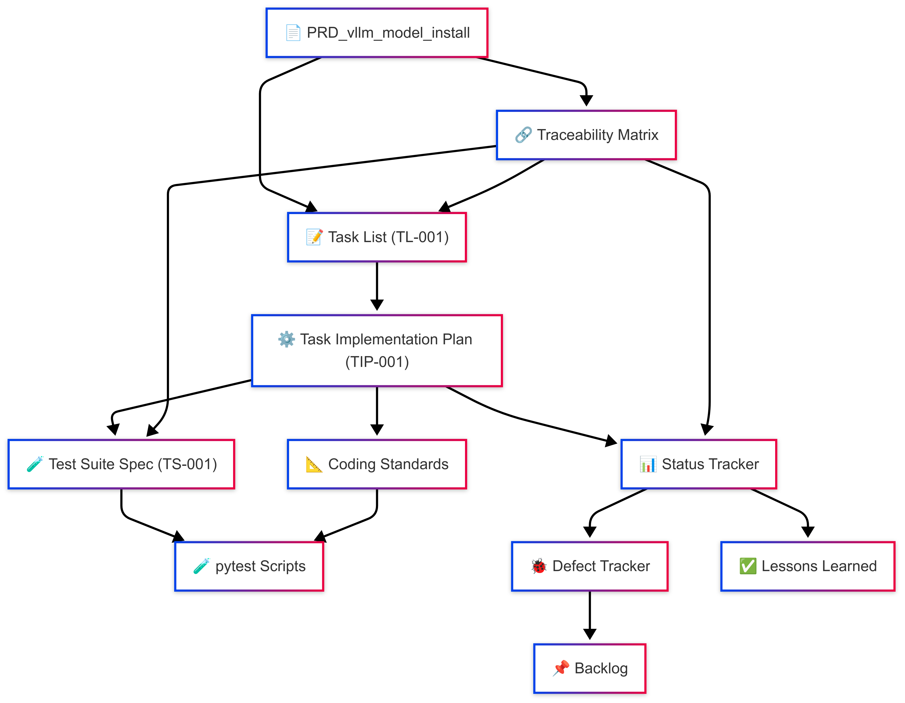

# HANA-X Governance Documentation

## Overview

This directory contains the comprehensive governance framework for HANA-X infrastructure setup and development operations. These documents establish the standards, processes, and procedures for systematic infrastructure deployment, starting with hx-llm-server-01 as the baseline.

## Document Workflow Visualization



*The above diagram illustrates the relationships and workflow between governance documents, from requirements through execution to validation.*

## Core Governance Documents

### 1. Standards and Guidelines

#### 🔧 **OOP_Coding_Standards_&_Rules.md**
- **Purpose**: Establishes mandatory coding standards and OOP principles
- **Key Content**: SOLID principles, naming conventions, testing requirements
- **Status**: Reviewed and ready for implementation
- **Scope**: All software development activities

#### 🧪 **vllm_test_guidelines.md**
- **Purpose**: Testing framework for vLLM infrastructure validation
- **Key Content**: FASTT principles, pytest structure, test categories
- **Status**: Reviewed and ready for implementation
- **Scope**: Infrastructure testing and validation

#### ✅ **task_creation_guidelines.txt**
- **Purpose**: SMART+ST framework for task creation and execution
- **Key Content**: Task structure, dependencies, configuration management
- **Status**: Enhanced with dependency mapping section
- **Scope**: All project task management

### 2. Project Requirements and Planning

#### 📄 **prd_vllm_model_install.txt**
- **Purpose**: Product Requirements Document for vLLM installation
- **Key Content**: Objectives, scope, deliverables, success criteria
- **Status**: Comprehensive and ready for execution
- **Scope**: vLLM and model installation on LLM servers

#### 📌 **Traceability Matrix – vLLM Installation Project.txt**
- **Purpose**: Maps requirements to tasks, tests, and artifacts
- **Key Content**: Scope-to-task mapping, dependency relationships, success criteria
- **Status**: Enhanced with dependency mapping and success criteria
- **Scope**: Complete project traceability

### 3. Project Tracking and Management

#### 📊 **vllm_installation_status.txt**
- **Purpose**: Real-time project status tracking
- **Key Content**: Scope status, task completion, deviations
- **Status**: Template ready for active use
- **Scope**: Project monitoring and reporting

#### 🐞 **vllm_defect_tracker.txt**
- **Purpose**: Systematic defect identification and resolution
- **Key Content**: Defect log, categorization, resolution tracking
- **Status**: Enhanced with defect categories
- **Scope**: Quality assurance and issue management

#### 📌 **vllm_project_backlog.txt**
- **Purpose**: Manages deferred and future work items
- **Key Content**: Backlog entries, prioritization, dependency tracking
- **Status**: Ready for active use
- **Scope**: Future planning and scope management

### 4. Documentation Framework

#### 📘 **vllm_project_doc_overview.txt**
- **Purpose**: Master guide to document relationships and workflows
- **Key Content**: Document flow, traceability map, navigation guide
- **Status**: Comprehensive and ready for reference
- **Scope**: Project documentation management

## Document Relationships

### Primary Flow
```
PRD → Task List → Implementation Plan → Test Suite → Status Tracking
```

### Supporting Framework
```
Standards ← → Task Guidelines ← → Defect Tracking
    ↓              ↓              ↓
Testing Guidelines → Backlog → Documentation Overview
```

## Usage Guidelines

### For Infrastructure Setup:
1. **Start with PRD** - Understand objectives and scope
2. **Review Standards** - Ensure compliance with coding and testing standards
3. **Follow Task Guidelines** - Use SMART+ST framework for task creation
4. **Track Progress** - Use status tracker and defect tracker actively
5. **Maintain Traceability** - Keep all documents cross-referenced

### For Development:
1. **Coding Standards** - Follow OOP principles and conventions
2. **Testing Guidelines** - Implement comprehensive test suites
3. **Documentation** - Maintain clear documentation per guidelines

## Key Principles

1. **Systematic Approach**: Task-by-task execution with approval gates
2. **Perfect Baseline**: hx-llm-server-01 setup must be flawless
3. **Comprehensive Testing**: All infrastructure changes must be validated
4. **Centralized Monitoring**: Metrics flow to hx-metric-server
5. **Minimal Security**: Security kept minimal during dev/test phase
6. **Different Models**: Each LLM server serves different models (no replication)

## Document Status

| Document | Status | Last Updated | Enhancements |
|----------|--------|--------------|-------------|
| OOP_Coding_Standards_&_Rules.md | ✅ Reviewed | 2025-07-09 | Ready for customization |
| vllm_test_guidelines.md | ✅ Reviewed | 2025-07-09 | Aligned with infrastructure |
| task_creation_guidelines.txt | ✅ Enhanced | 2025-07-09 | Added dependency mapping |
| prd_vllm_model_install.txt | ✅ Reviewed | 2025-07-09 | Ready for execution |
| Traceability Matrix.txt | ✅ Enhanced | 2025-07-09 | Added dependencies & success criteria |
| vllm_installation_status.txt | ✅ Reviewed | 2025-07-09 | Template ready |
| vllm_defect_tracker.txt | ✅ Enhanced | 2025-07-09 | Added defect categories |
| vllm_project_backlog.txt | ✅ Reviewed | 2025-07-09 | Ready for active use |
| vllm_project_doc_overview.txt | ✅ Reviewed | 2025-07-09 | Complete navigation guide |

## Next Steps

1. **Finalize Governance**: Complete review and commit all documents
2. **Begin Infrastructure Setup**: Start with hx-llm-server-01 baseline
3. **Active Tracking**: Use status and defect trackers throughout execution
4. **Continuous Improvement**: Update documents based on lessons learned

## Compliance

All activities must comply with:
- **AI_Operating_Rules_HanaX.md** (v1.5) in project root
- Task creation guidelines (SMART+ST framework)
- Testing standards (FASTT principles)
- Documentation requirements

---

*This governance framework ensures systematic, traceable, and quality-driven infrastructure deployment across the HANA-X server landscape.*
