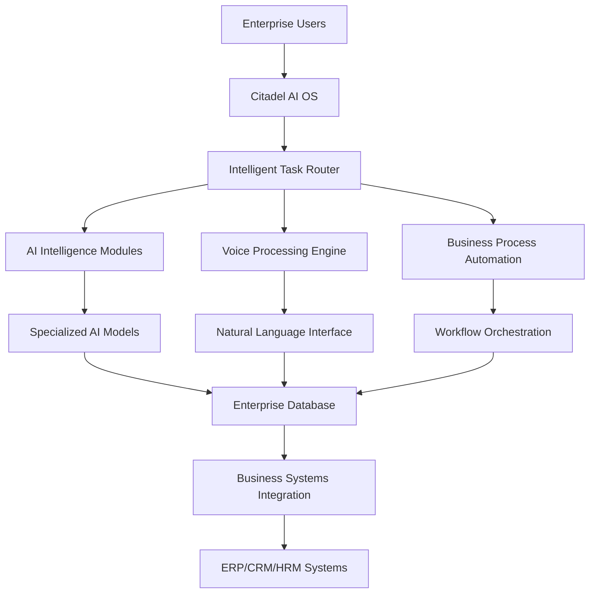

# Product Requirements Document: Citadel AI Infrastructure Program

| | |
|---|---|
| **Project:** | Citadel AI OS - Foundational Infrastructure |
| **Version:** | 1.6 |
| **Status:** | Draft |
| **Date:** | July 10, 2025 |
| **Author:** | Jarvis Richardson |

---

### 1. Executive Summary

The Citadel AI Operating System is not just another AI platform—it's a complete enterprise transformation engine that fundamentally changes how organizations operate. By providing a unified AI infrastructure with specialized intelligence modules, Citadel AI OS enables businesses to automate complex processes, make intelligent decisions, and scale operations with unprecedented efficiency. To realize this vision, a robust, scalable, and observable on-premise infrastructure is required. This document outlines the requirements for the foundational program to build this critical infrastructure.

The program will deliver the physical and software foundation for the entire Citadel AI OS. This is necessary to provide the dedicated compute, storage, and networking resources that meet the high-availability and performance demands of an enterprise-grade AI system. The program will be executed through a series of ten distinct but coordinated projects. The first nine projects will focus on the independent setup and validation of each server in the HANA-X landscape. A tenth project will then integrate these individual components into the cohesive, multi-layered target architecture, enabling the full functionality of the Citadel platform.

### 2. Program Goals

The successful completion of this program will achieve the following key objectives:

* **Establish a Production-Ready Environment:** Deploy a stable and secure hardware and network foundation for all subsequent AI software development and deployment.
* **Guarantee Performance & Scalability:** Provide low-latency processing for all AI tasks and ensure the architecture can scale to meet future demands.
* **Enable Comprehensive Observability:** Implement a centralized monitoring and logging solution across all infrastructure components to ensure system health, facilitate rapid troubleshooting, and provide a complete audit trail. **This includes addressing all previous logging deficiencies with a robust, centralized system.**

### 3. Scope

#### 3.1. In Scope

* **Project 1-9:** The complete provisioning, OS installation, hardening, and configuration of all nine (9) servers listed in the Appendix. This includes the installation and validation of their specific core software stacks.
* **Project 10 (Integration):** The configuration of all necessary networking, APIs, and services to connect the nine independent servers into the final, integrated Target Architecture.
* **Service Management:** The setup and validation of standardized service management commands and health checks for the `citadel-ai-os` service.

#### 3.2. Out of Scope

* **High-Availability Failover:** Automated failover logic and its validation are out of scope for this program. The second LLM server will be configured for redundancy and potential load balancing.
* **Application Development:** The development of the business-specific applications that will run on top of the AI Runtime Environment (e.g., Invoice Processing, Resume Screening).
* **AI Model Training:** The training or fine-tuning of the core AI models. This program is focused on serving the models, not creating them.

### 4. Target Architecture

The infrastructure program will deliver an integrated platform that supports the multi-layered Citadel AI OS. The architecture is designed to process requests from enterprise users, route them through various AI and business logic modules, and integrate with backend enterprise systems.

#### 4.1. Architectural Flow



#### 4.2. Core AI Intelligence Modules

The platform's intelligence is driven by a portfolio of nine specialized AI models:

| Module | Specialization | Business Impact |
| :--- | :--- | :--- |
| **Mixtral-8x7B** | Strategic Reasoning | Executive decision support, complex problem solving |
| **DeepSeek-R1** | Generalist Reasoning | High-performance general purpose reasoning and generation |
| **Nous Hermes 2** | Knowledge Processing | Document analysis, research automation, compliance |
| **OpenChat 3.5** | Communication | Customer service, internal communications, training |
| **Yi-34B** | Deep Analysis | Long-form analysis, strategic planning, research |
| **DeepCoder-14B** | Technical Intelligence | Code generation, system automation, technical support |
| **Phi-3 Mini** | Rapid Processing | Real-time decisions, instant responses, edge computing |
| **imp-v1-3b** | Ultra-Lightweight Agent | Simple, high-speed task execution and routing |
| **MiMo-VL-7B** | Multi-Modal Processing | Visual analysis, document processing, quality control |

#### 4.3. Key Technology Components

* **🧠 AI Engine:** vLLM with optimized inference for enterprise workloads, exposed via an OpenAI-compatible API.
* **🎙️ Communication:** Multi-modal interface supporting voice, text, and visual interaction.
* **🔄 Orchestration:** Intelligent task routing via a FastAPI service, embedding model services, and workflow automation.
* **🗄️ Data Layer:** Enterprise-grade database with real-time analytics.
* **🔐 Security:** Enterprise security framework with audit trails and compliance.
* **📊 Monitoring:** Comprehensive observability and performance analytics.
* **🔗 Integration:** Native connectors for major enterprise platforms.

### 5. Service Management

The `citadel-ai-os` service will be managed using standardized systemd commands and a custom health check script. The implementation and validation of these commands are in scope for this program.

```bash
# Start all services
sudo systemctl start citadel-ai-os

# Check system status
sudo systemctl status citadel-ai-os

# View system logs
journalctl -u citadel-ai-os -f

# Health monitoring
./scripts/management/health_check.sh
```

### 6. Program Execution & Projects

The program is structured as ten distinct projects:

* **Project 1: `hx-sql-database-server` Setup:** Provision and configure the PostgreSQL and Redis services.
* **Project 2: `hx-vector-database-server` Setup:** Provision and configure the Qdrant vector database.
* **Project 3: `hx-llm-server-01` Setup:** Provision and configure the primary vLLM inference engine, serving AI models via an OpenAI-compatible API.
* **Project 4: `hx-llm-server-02` Setup:** Provision and configure the secondary LLM inference engine for redundancy and load balancing.
* **Project 5: `hx-orchestration-server` Setup:** Provision and configure the Task Router (FastAPI), workflow engines (LangGraph, Celery), and embedding model services.
* **Project 6: `hx-dev-server` Setup:** Provision and configure the development environment and multimodal AI services.
* **Project 7: `hx-test-server` Setup:** Provision and configure the CI/CD and QA testing tools (Jenkins, Selenium).
* **Project 8: `hx-metric-server` Setup:** Provision and configure as the central host for all infrastructure support UIs, including Prometheus, Grafana, Loki, and OpenUI.
* **Project 9: `hx-dev-ops-server` Setup:** Provision and configure the operations management server, including automation tools like PowerShell.
* **Project 10: System Integration:** Connect all nine servers to function as a single, cohesive platform as defined in the Target Architecture.

### 7. Success Metrics

The infrastructure program will be considered successful when the following criteria are met:

* **Project Completion:** All 10 projects are completed, with each server and the final integrated system passing all functional validation tests.
* **Performance:** The integrated system meets the following latency benchmarks:
    * P95 latency for a standard LLM inference request is below 800ms.
    * P95 latency for a vector database query is below 100ms.
* **Observability:** The Grafana instance on the `hx-metric-server` correctly displays real-time metrics and logs from all nine servers.
* **Testability:** The OpenUI instance on the `hx-metric-server` can successfully connect to and interact with the models running on the LLM servers.

### 8. Appendix: Server Inventory

| IP Address | Hostname | Role | Project |
| :--- | :--- | :--- | :--- |
| `192.168.10.35` | `hx-sql-database-server` | SQL Database & Cache | Project 1 |
| `192.168.10.30` | `hx-vector-database-server` | Vector Database | Project 2 |
| `192.168.10.29` | `hx-llm-server-01` | Primary LLM Inference | Project 3 |
| `192.168.10.28` | `hx-llm-server-02` | Secondary LLM Inference | Project 4 |
| `192.168.10.31` | `hx-orchestration-server` | Orchestration & Routing | Project 5 |
| `192.168.10.33` | `hx-dev-server` | Development & Multimodal | Project 6 |
| `192.168.10.34` | `hx-test-server` | Quality Assurance | Project 7 |
| `192.168.10.37` | `hx-metric-server` | Centralized Monitoring Hub | Project 8 |
| `192.168.10.36` | `hx-dev-ops-server` | Operations Management | Project 9 |

### 9. Conclusion

This Program PRD serves as the master document for the entire Citadel AI Infrastructure initiative. It defines the overall vision, the target architecture, the core technology components, and the inter-dependencies between the ten constituent projects.

It is imperative that this document be used as the **primary input for the creation of detailed, project-level PRDs** for each of the ten projects outlined in Section 6. Adherence to the architecture and requirements defined herein will ensure that each server is built and configured in a consistent manner, and that all components can be integrated seamlessly into the final, cohesive platform. This alignment is critical to the success of the program and the ultimate goal of delivering a stable and performant foundation for the Citadel AI Operating System.
