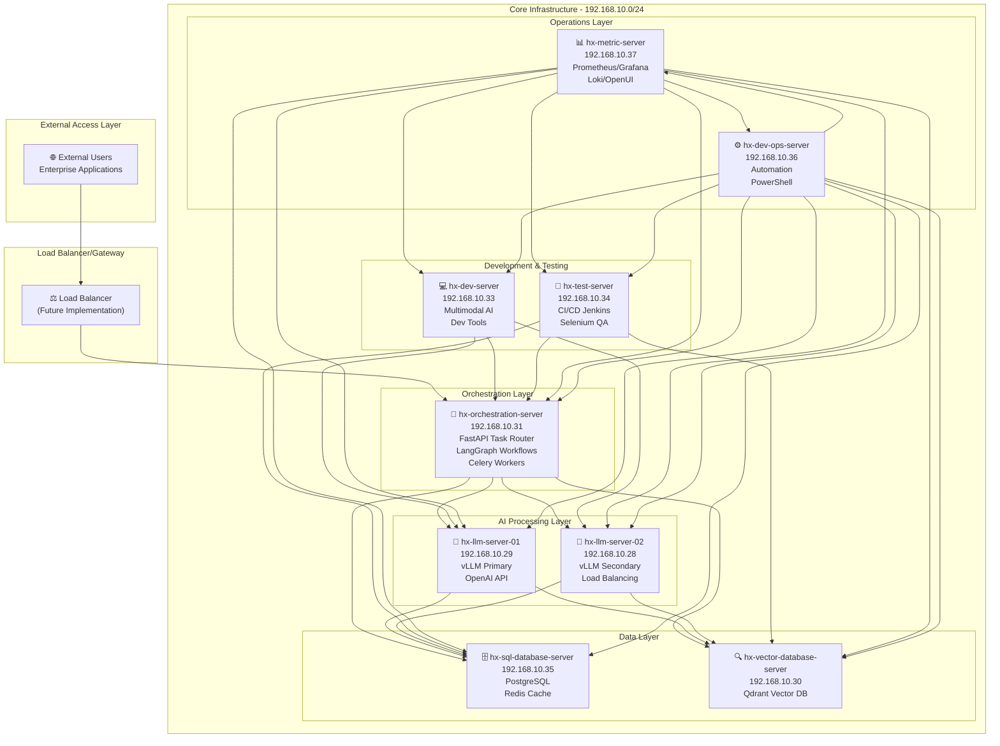
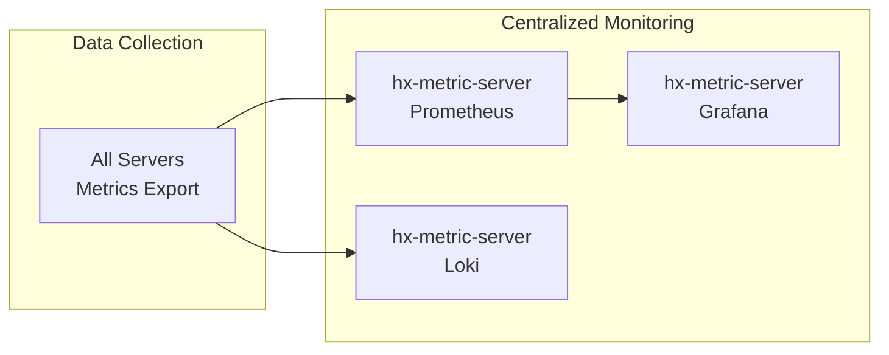
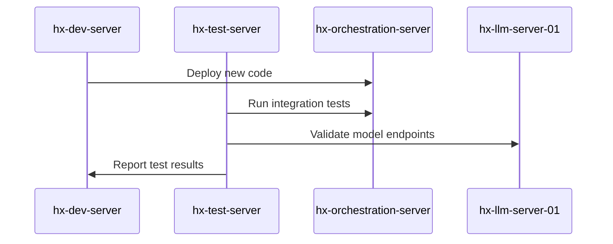

# 🌐 Network Architecture Diagram: HANA-X Program

**Document ID:** ARCH-NET-001  
**Version:** 1.0  
**Date:** July 11, 2025  
**Purpose:** Comprehensive network architecture diagram illustrating all inter-server communications for the HANA-X Program infrastructure.

---

## 🏗️ Network Architecture Overview

### High-Level Architecture



---

## 🔗 Detailed Inter-Server Communications

### 1. Primary Data Flow Paths

#### **Request Processing Pipeline**
```
External User → Load Balancer → hx-orchestration-server → hx-llm-server-01/02 → hx-sql-database-server/hx-vector-database-server
```

#### **AI Inference Chain**
```
hx-orchestration-server ←→ hx-llm-server-01/02 ←→ hx-vector-database-server
                        ↓
                   hx-sql-database-server
```

### 2. Communication Protocols & Ports

| Source Server | Target Server | Protocol | Port | Purpose |
|---|---|---|---|---|
| **hx-orchestration-server** | hx-llm-server-01 | HTTP/HTTPS | 8000 | OpenAI API calls |
| **hx-orchestration-server** | hx-llm-server-02 | HTTP/HTTPS | 8000 | Load balancing |
| **hx-orchestration-server** | hx-sql-database-server | TCP | 5432 | PostgreSQL queries |
| **hx-orchestration-server** | hx-sql-database-server | TCP | 6379 | Redis cache |
| **hx-orchestration-server** | hx-vector-database-server | HTTP | 6333 | Qdrant vector ops |
| **hx-llm-server-01/02** | hx-vector-database-server | HTTP | 6333 | Embedding retrieval |
| **hx-llm-server-01/02** | hx-sql-database-server | TCP | 5432 | Context data |
| **hx-dev-server** | hx-orchestration-server | HTTP | 8001 | Dev API testing |
| **hx-test-server** | All Servers | HTTP/TCP | Various | QA testing |
| **hx-metric-server** | All Servers | HTTP | 9090 | Prometheus metrics |
| **hx-devops-server** | All Servers | SSH/WinRM | 22/5985 | Management |

### 3. Network Security Zones

#### **DMZ (Future Implementation)**
- External-facing load balancer
- Web application firewall
- SSL termination

#### **Internal Network (192.168.10.0/24)**
- All HANA-X servers
- Private subnet with controlled access
- Internal DNS resolution

#### **Management Network (Future Enhancement)**
- Dedicated management interfaces
- Out-of-band management
- Secure admin access

### 4. Service Discovery & Load Balancing

#### **Internal Service Discovery**
```
hx-orchestration-server maintains service registry:
├── LLM Services: [hx-llm-server-01:8000, hx-llm-server-02:8000]
├── Database Services: [hx-sql-database-server:5432]
├── Vector DB: [hx-vector-database-server:6333]
└── Cache: [hx-sql-database-server:6379]
```

#### **Load Balancing Strategy**
- **LLM Servers**: Round-robin with health checks
- **Database**: Primary/standby (PostgreSQL)
- **Cache**: Redis with potential clustering

### 5. Monitoring & Observability Flow



### 6. Development & Testing Workflow



---

## 🔐 Security Considerations

### Network Segmentation
- **Internal network isolation**: All servers on private subnet
- **Firewall rules**: Only necessary ports exposed
- **VPN access**: Secure remote management

### Authentication & Authorization
- **Service-to-service**: mTLS certificates
- **Database access**: Role-based access control
- **API security**: JWT tokens and rate limiting

### Encryption
- **Data in transit**: TLS 1.3 for all HTTP communications
- **Database connections**: SSL/TLS enabled
- **Internal APIs**: HTTPS with internal CA

---

## 🚀 Future Enhancements

### Phase 2 Networking
- **External load balancer**: nginx/HAProxy
- **Service mesh**: Istio for advanced traffic management
- **CDN integration**: Static asset delivery

### High Availability
- **Multi-AZ deployment**: Geographic redundancy
- **Database clustering**: PostgreSQL HA setup
- **Cache replication**: Redis Cluster

### Enhanced Security
- **Zero-trust networking**: mTLS everywhere
- **Network monitoring**: Intrusion detection
- **Compliance**: SOC2/ISO27001 alignment

---

## 📋 Validation Checklist

- [ ] All servers can reach each other on specified ports
- [ ] DNS resolution works for all hostnames
- [ ] SSL certificates are valid and trusted
- [ ] Firewall rules allow necessary traffic
- [ ] Monitoring endpoints are accessible
- [ ] Load balancing distributes requests properly
- [ ] Health checks return expected responses
- [ ] Backup and recovery procedures tested

---

**Document Status:** Draft  
**Next Review:** Post-Project 10 Integration  
**Owner:** HANA-X Program Team
