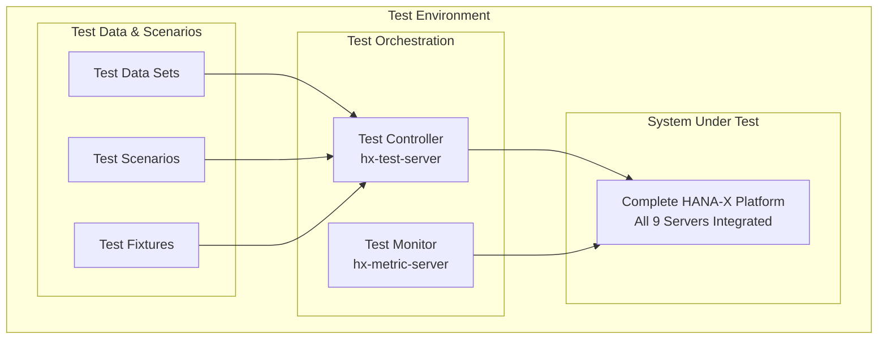

# 🧪 Integration Testing Framework: Project 10 - HANA-X Program

**Document ID:** QA-INTEG-001  
**Version:** 1.0  
**Date:** July 11, 2025  
**Purpose:** Comprehensive integration testing framework for Project 10 to validate the cohesive operation of all nine HANA-X servers as a unified platform.

---

## 📋 Executive Summary

This document defines the testing framework for Project 10 - System Integration, the final phase of the HANA-X Program. The framework ensures that all nine independent servers function seamlessly as a single, integrated Citadel AI OS platform.

### Key Objectives
- **Validate inter-server communication** across all 9 servers
- **Ensure end-to-end functionality** of the complete AI workflow
- **Verify performance benchmarks** meet PRD requirements
- **Confirm security controls** are properly implemented
- **Test operational procedures** and monitoring systems

---

## 🎯 Testing Scope & Strategy

### In-Scope Testing
- **Functional Integration Testing**: API endpoints, data flow, service interactions
- **Performance Testing**: Latency, throughput, scalability benchmarks
- **Security Testing**: Authentication, authorization, data encryption
- **Operational Testing**: Service management, monitoring, alerting
- **Disaster Recovery Testing**: Backup, recovery, failover procedures

### Out-of-Scope Testing
- **Unit Testing**: Individual server components (covered in Projects 1-9)
- **High-Availability Testing**: Automated failover logic (per PRD scope)
- **AI Model Training Testing**: Model creation and fine-tuning
- **Business Application Testing**: End-user applications built on platform

---

## 🏗️ Test Architecture

### Test Environment Setup


### Test Execution Layers
1. **Infrastructure Layer**: Network connectivity, DNS resolution, port accessibility
2. **Service Layer**: API availability, service discovery, load balancing
3. **Data Layer**: Database connectivity, data persistence, caching
4. **Application Layer**: End-to-end workflows, business logic validation
5. **Integration Layer**: Cross-server communication, data synchronization

---

## 🔧 Test Framework Components

### 1. Test Controller (hx-test-server)
**Location:** `192.168.10.34`  
**Role:** Central test orchestration and execution

#### Core Components:
- **Test Runner**: Pytest-based test execution engine
- **Test Reporter**: Comprehensive test result reporting
- **Test Scheduler**: Automated test execution scheduling
- **Data Manager**: Test data generation and cleanup

#### Configuration:
```python
# test_config.py
TEST_CONFIG = {
    'servers': {
        'orchestration': 'http://192.168.10.31:8001',
        'llm_primary': 'http://192.168.10.29:8000',
        'llm_secondary': 'http://192.168.10.28:8000',
        'sql_db': 'postgresql://192.168.10.35:5432',
        'vector_db': 'http://192.168.10.30:6333',
        'dev_server': 'http://192.168.10.33:8002',
        'metrics': 'http://192.168.10.37:3000',
        'devops': 'http://192.168.10.36:8080'
    },
    'timeouts': {
        'connection': 10,
        'response': 30,
        'long_running': 300
    },
    'performance_thresholds': {
        'llm_p95_latency': 800,  # ms
        'vector_p95_latency': 100,  # ms
        'api_availability': 99.9  # %
    }
}
```

### 2. Test Monitor (hx-metric-server)
**Location:** `192.168.10.37`  
**Role:** Real-time test monitoring and metrics collection

#### Monitoring Components:
- **Prometheus**: Metrics collection during test execution
- **Grafana**: Real-time test execution dashboards
- **Loki**: Centralized logging for test analysis
- **OpenUI**: Model interaction testing interface

---

## 🧪 Test Suites

### Suite 1: Infrastructure Connectivity Tests
**Priority:** Critical  
**Execution Time:** ~15 minutes  
**Frequency:** Every deployment

#### Test Cases:
```python
class TestInfrastructureConnectivity:
    def test_network_connectivity(self):
        """Verify all servers can reach each other on required ports"""
        
    def test_dns_resolution(self):
        """Verify hostname resolution for all servers"""
        
    def test_ssl_certificates(self):
        """Verify SSL certificate validity and trust"""
        
    def test_firewall_rules(self):
        """Verify firewall rules allow necessary traffic"""
```

### Suite 2: Service Discovery & Load Balancing Tests
**Priority:** Critical  
**Execution Time:** ~20 minutes  
**Frequency:** Every deployment

#### Test Cases:
```python
class TestServiceDiscovery:
    def test_orchestration_service_registry(self):
        """Verify service registry maintains accurate service list"""
        
    def test_llm_load_balancing(self):
        """Verify round-robin distribution between LLM servers"""
        
    def test_health_check_endpoints(self):
        """Verify all health check endpoints respond correctly"""
        
    def test_service_failover(self):
        """Verify service discovery updates when services go down"""
```

### Suite 3: End-to-End Workflow Tests
**Priority:** Critical  
**Execution Time:** ~45 minutes  
**Frequency:** Every deployment

#### Test Cases:
```python
class TestEndToEndWorkflows:
    def test_simple_llm_inference(self):
        """Test complete pipeline: Request -> Orchestration -> LLM -> Response"""
        
    def test_rag_workflow(self):
        """Test RAG: Request -> Vector Search -> LLM -> Response"""
        
    def test_multimodal_processing(self):
        """Test multimodal AI workflow with document processing"""
        
    def test_complex_reasoning_chain(self):
        """Test multi-step reasoning with multiple AI models"""
```

### Suite 4: Performance & Scalability Tests
**Priority:** High  
**Execution Time:** ~60 minutes  
**Frequency:** Weekly

#### Test Cases:
```python
class TestPerformanceScalability:
    def test_llm_latency_benchmarks(self):
        """Verify P95 latency < 800ms for LLM inference"""
        
    def test_vector_db_latency_benchmarks(self):
        """Verify P95 latency < 100ms for vector queries"""
        
    def test_concurrent_request_handling(self):
        """Test system behavior under concurrent load"""
        
    def test_throughput_benchmarks(self):
        """Measure maximum requests per second"""
```

### Suite 5: Security Integration Tests
**Priority:** High  
**Execution Time:** ~30 minutes  
**Frequency:** Every deployment

#### Test Cases:
```python
class TestSecurityIntegration:
    def test_authentication_flow(self):
        """Verify authentication across all services"""
        
    def test_authorization_controls(self):
        """Verify RBAC and access controls"""
        
    def test_data_encryption(self):
        """Verify data encryption in transit and at rest"""
        
    def test_security_headers(self):
        """Verify security headers on all API responses"""
```

### Suite 6: Operational Procedures Tests
**Priority:** Medium  
**Execution Time:** ~40 minutes  
**Frequency:** Weekly

#### Test Cases:
```python
class TestOperationalProcedures:
    def test_service_management_commands(self):
        """Verify citadel-ai-os service commands work correctly"""
        
    def test_monitoring_alerting(self):
        """Verify monitoring and alerting systems function"""
        
    def test_backup_procedures(self):
        """Verify backup procedures execute successfully"""
        
    def test_log_aggregation(self):
        """Verify centralized logging captures all services"""
```

---

## 📊 Test Execution Strategy

### Automated Test Pipeline
```yaml
# .github/workflows/integration-tests.yml
name: Integration Tests - Project 10

on:
  push:
    branches: [main, develop]
  pull_request:
    branches: [main]
  schedule:
    - cron: '0 2 * * *'  # Daily at 2 AM

jobs:
  integration-tests:
    runs-on: ubuntu-latest
    
    steps:
    - name: Checkout code
      uses: actions/checkout@v3
      
    - name: Setup Python
      uses: actions/setup-python@v4
      with:
        python-version: '3.11'
        
    - name: Install dependencies
      run: |
        pip install -r requirements-test.txt
        
    - name: Run Infrastructure Tests
      run: |
        pytest tests/integration/test_infrastructure.py -v
        
    - name: Run Service Discovery Tests
      run: |
        pytest tests/integration/test_service_discovery.py -v
        
    - name: Run End-to-End Tests
      run: |
        pytest tests/integration/test_e2e_workflows.py -v
        
    - name: Run Performance Tests
      run: |
        pytest tests/integration/test_performance.py -v
        
    - name: Generate Test Report
      run: |
        pytest --html=report.html --self-contained-html
        
    - name: Upload Test Results
      uses: actions/upload-artifact@v3
      with:
        name: integration-test-results
        path: report.html
```

### Test Data Management
```python
# test_data_manager.py
class TestDataManager:
    def __init__(self):
        self.test_datasets = {
            'small_text': 'Sample text for basic testing',
            'large_document': self.load_large_document(),
            'multimodal_content': self.load_multimodal_content(),
            'performance_dataset': self.generate_performance_dataset()
        }
    
    def setup_test_data(self):
        """Initialize test data across all servers"""
        
    def cleanup_test_data(self):
        """Clean up test data after execution"""
        
    def generate_synthetic_data(self, size: str):
        """Generate synthetic test data of specified size"""
```

---

## 📈 Success Criteria & Validation

### Critical Success Metrics
- **Infrastructure Tests**: 100% pass rate
- **Service Discovery Tests**: 100% pass rate  
- **End-to-End Workflow Tests**: 100% pass rate
- **Performance Tests**: Meet or exceed PRD benchmarks
- **Security Tests**: 100% pass rate with no critical vulnerabilities

### Performance Benchmarks
- **LLM Inference P95 Latency**: < 800ms
- **Vector DB Query P95 Latency**: < 100ms
- **API Availability**: > 99.9%
- **Concurrent User Capacity**: 100+ simultaneous users
- **System Recovery Time**: < 30 seconds for service restarts

### Operational Validation
- **Service Management**: All `citadel-ai-os` commands execute successfully
- **Monitoring Coverage**: 100% of services monitored with alerting
- **Log Aggregation**: All services logging to centralized system
- **Health Checks**: All health endpoints responding correctly

---

## 🚨 Test Failure Handling

### Failure Classification
- **Critical**: System-breaking failures that prevent deployment
- **High**: Feature failures that impact core functionality
- **Medium**: Performance degradation or minor functional issues
- **Low**: Documentation or non-critical operational issues

### Escalation Procedures
1. **Immediate**: Test failure notifications to development team
2. **30 minutes**: Incident response team activation for critical failures
3. **2 hours**: Program manager notification for unresolved issues
4. **4 hours**: Executive escalation for deployment-blocking issues

### Recovery Procedures
- **Automated Rollback**: Triggered for critical deployment failures
- **Manual Investigation**: Required for performance or security issues
- **Fix-Forward**: Preferred approach for minor issues
- **Environment Reset**: Available for test environment corruption

---

## 🔍 Test Reporting & Analytics

### Real-Time Dashboards
**Location:** `http://192.168.10.37:3000/dashboards/integration-tests`

#### Key Metrics:
- Test execution status and progress
- Performance metrics during test runs
- Error rates and failure patterns
- Resource utilization during tests
- Historical test trend analysis

### Test Reports
```python
# test_reporter.py
class IntegrationTestReporter:
    def generate_executive_summary(self):
        """High-level test results for stakeholders"""
        
    def generate_technical_report(self):
        """Detailed technical analysis for development team"""
        
    def generate_performance_analysis(self):
        """Performance benchmarking and trend analysis"""
        
    def generate_security_assessment(self):
        """Security testing results and recommendations"""
```

---

## 📋 Implementation Checklist

### Pre-Integration Testing
- [ ] All Projects 1-9 completed and validated
- [ ] Test environment provisioned and configured
- [ ] Test data sets prepared and loaded
- [ ] Monitoring and alerting systems operational
- [ ] Test team training completed

### During Integration Testing
- [ ] All test suites executed successfully
- [ ] Performance benchmarks met or exceeded
- [ ] Security controls validated
- [ ] Operational procedures tested
- [ ] Documentation updated with test results

### Post-Integration Testing
- [ ] Test results reviewed and approved
- [ ] Known issues documented and triaged
- [ ] Production deployment approved
- [ ] Monitoring baselines established
- [ ] Operational runbooks updated

---

## 🎯 Continuous Improvement

### Test Framework Evolution
- **Quarterly Review**: Test coverage and effectiveness analysis
- **Performance Optimization**: Test execution time improvements
- **Tool Upgrades**: Testing tool and framework updates
- **Process Refinement**: Based on lessons learned and feedback

### Metrics-Driven Improvements
- **Test Coverage**: Aim for >95% code coverage
- **Test Reliability**: <1% false positive rate
- **Execution Speed**: <2 hour total execution time
- **Defect Detection**: >90% of production issues caught in testing

---

**Document Status:** Draft  
**Next Review:** Pre-Project 10 Kickoff  
**Owner:** HANA-X QA Team  
**Approved By:** TBD
