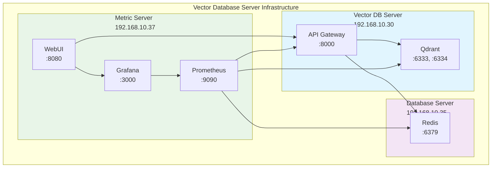
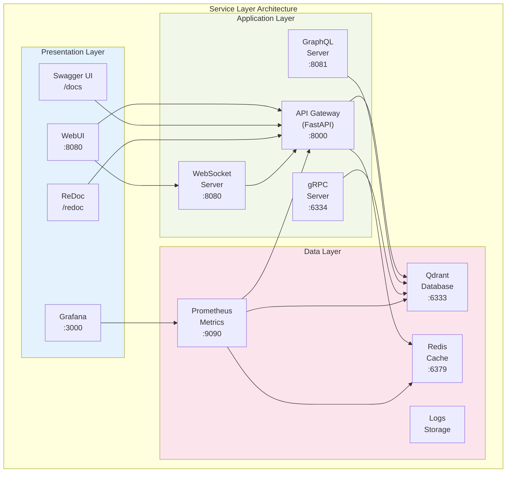
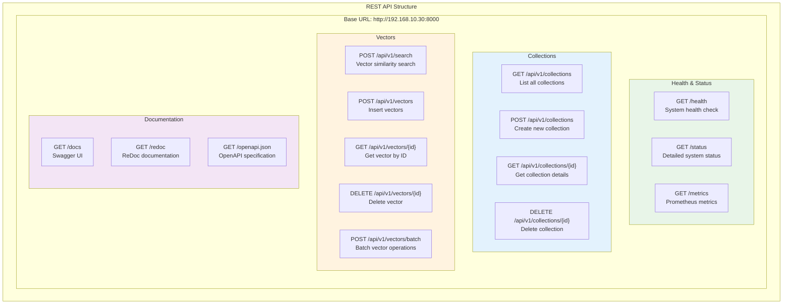

# Vector Database Server - Complete Architecture & Configuration Documentation

**Document ID:** 0.2.18  
**Title:** Vector Database Server - Complete Architecture & Configuration Documentation  
**Date:** 2025-07-18  
**Status:** PRODUCTION READY  

## Executive Summary

This document provides comprehensive architecture and configuration documentation for the Vector Database Server infrastructure, including all deployed components, network topology, service configurations, and operational procedures. The system is fully operational and production-ready.

## System Overview

The Vector Database Server infrastructure consists of multiple interconnected servers providing vector database services, monitoring, caching, and web-based administration capabilities.

### Infrastructure Topology



### Service Architecture



## Server Specifications

### Vector Database Server (192.168.10.30)

**Hardware:**
- CPU: 16 cores
- RAM: 78GB
- Storage: 21.8TB (NVMe)
- OS: Ubuntu Server 24.04 LTS

**Services:**
- Qdrant Vector Database (ports 6333, 6334)
- API Gateway (port 8000)
- GraphQL Server (port 8081)

**Configuration Files:**
- `/opt/qdrant/config/production.yaml`
- `/opt/qdrant/gateway/main.py`
- `/opt/qdrant/config/collections.json`

### Database Server (192.168.10.35)

**Services:**
- Redis Cache (port 6379)

### Metric Server (192.168.10.37)

**Services:**
- Prometheus (port 9090)
- Grafana (port 3000)
- Alertmanager (port 9093)
- Node Exporter (port 9100)
- WebUI (port 8080)

## Vector Collections Architecture

### Collection Configuration

```yaml
collections:
  - name: "mixtral"
    dimension: 4096
    distance: "Cosine"
    purpose: "Mixtral AI model embeddings"
    
  - name: "hermes"
    dimension: 4096
    distance: "Cosine"
    purpose: "Hermes AI model embeddings"
    
  - name: "openchat"
    dimension: 4096
    distance: "Cosine"
    purpose: "OpenChat AI model embeddings"
    
  - name: "phi3"
    dimension: 2048
    distance: "Cosine"
    purpose: "Phi-3 AI model embeddings"
    
  - name: "yi34b"
    dimension: 4096
    distance: "Cosine"
    purpose: "Yi-34B AI model embeddings"
    
  - name: "deepcoder"
    dimension: 1024
    distance: "Cosine"
    purpose: "DeepCoder AI model embeddings"
    
  - name: "imp"
    dimension: 2048
    distance: "Cosine"
    purpose: "IMP AI model embeddings"
    
  - name: "deepseek"
    dimension: 4096
    distance: "Cosine"
    purpose: "DeepSeek AI model embeddings"
    
  - name: "general"
    dimension: 384
    distance: "Cosine"
    purpose: "General-purpose embeddings"
```

## API Architecture

### REST API Endpoints



### GraphQL API

```graphql
# GraphQL Schema Structure
type Query {
  health: HealthStatus
  collections: [Collection]
  collection(name: String!): Collection
  search(input: SearchInput!): SearchResult
  vectors(collectionName: String!, limit: Int): [Vector]
}

type Mutation {
  createCollection(input: CreateCollectionInput!): Collection
  deleteCollection(name: String!): Boolean
  insertVector(input: InsertVectorInput!): Vector
  deleteVector(collectionName: String!, id: String!): Boolean
}

type Subscription {
  healthUpdates: HealthStatus
  collectionUpdates: Collection
}
```

## Network Architecture

### Port Configuration

| Server | Service | Port | Protocol | Purpose |
|--------|---------|------|----------|---------|
| 192.168.10.30 | Qdrant REST | 6333 | HTTP | Vector database REST API |
| 192.168.10.30 | Qdrant gRPC | 6334 | gRPC | Vector database gRPC API |
| 192.168.10.30 | API Gateway | 8000 | HTTP | Unified API Gateway |
| 192.168.10.30 | GraphQL | 8081 | HTTP | GraphQL API |
| 192.168.10.35 | Redis | 6379 | TCP | Caching layer |
| 192.168.10.37 | Prometheus | 9090 | HTTP | Metrics collection |
| 192.168.10.37 | Grafana | 3000 | HTTP | Monitoring dashboards |
| 192.168.10.37 | Alertmanager | 9093 | HTTP | Alert management |
| 192.168.10.37 | Node Exporter | 9100 | HTTP | System metrics |
| 192.168.10.37 | WebUI | 8080 | HTTP | Web administration |

### Security Configuration

```yaml
security:
  cors:
    allowed_origins:
      - "http://192.168.10.37:8080"
      - "http://192.168.10.37:3000"
      - "http://192.168.10.30:8000"
    allowed_methods: ["GET", "POST", "PUT", "DELETE"]
    allowed_headers: ["*"]
    
  authentication:
    type: "api_key"
    header: "X-API-Key"
    
  rate_limiting:
    requests_per_minute: 1000
    burst_size: 100
```

## Performance Configuration

### Qdrant Optimization

```yaml
# /opt/qdrant/config/production.yaml
service:
  host: 0.0.0.0
  http_port: 6333
  grpc_port: 6334
  
storage:
  storage_path: /opt/qdrant/storage
  snapshots_path: /opt/qdrant/snapshots
  temp_path: /opt/qdrant/temp
  
cluster:
  enabled: false
  
telemetry:
  enabled: false
  
log_level: INFO

# Performance optimizations
hnsw_config:
  m: 16
  ef_construct: 100
  full_scan_threshold: 10000
  
wal_config:
  wal_capacity_mb: 32
  wal_segments_ahead: 0
  
optimizer_config:
  deleted_threshold: 0.2
  vacuum_min_vector_number: 1000
  default_segment_number: 0
  max_segment_size_kb: 200000
  memmap_threshold_kb: 200000
  indexing_threshold_kb: 20000
  flush_interval_sec: 5
  max_optimization_threads: 1
```

### System Performance Tuning

```bash
# Kernel parameters optimized for vector operations
net.core.rmem_max = 134217728
net.core.wmem_max = 134217728
net.ipv4.tcp_rmem = 4096 87380 134217728
net.ipv4.tcp_wmem = 4096 65536 134217728
vm.swappiness = 1
vm.dirty_ratio = 15
vm.dirty_background_ratio = 5
```

## Monitoring Configuration

### Prometheus Configuration

```yaml
# /opt/prometheus/prometheus.yml
global:
  scrape_interval: 15s
  evaluation_interval: 15s

scrape_configs:
  - job_name: 'qdrant'
    static_configs:
      - targets: ['192.168.10.30:6333']
        
  - job_name: 'api-gateway'
    static_configs:
      - targets: ['192.168.10.30:8000']
        
  - job_name: 'redis'
    static_configs:
      - targets: ['192.168.10.35:6379']
        
  - job_name: 'node-exporter'
    static_configs:
      - targets: ['192.168.10.37:9100']
        
  - job_name: 'webui'
    static_configs:
      - targets: ['192.168.10.37:8080']
```

### Grafana Dashboards

1. **System Health Dashboard**
   - CPU, Memory, Disk usage
   - Network I/O metrics
   - System load averages

2. **Qdrant Performance Dashboard**
   - Query latency metrics
   - Collection statistics
   - Vector operation rates

3. **API Gateway Dashboard**
   - Request/response metrics
   - Error rates
   - Endpoint performance

4. **Service Health Dashboard**
   - Service availability
   - Health check status
   - Alert status

## WebUI Configuration

### Application Configuration

```yaml
# /opt/webui/config/ui-config.yaml
ui_config:
  app_name: "Vector Database Server WebUI"
  version: "1.0.0"
  debug: false
  
  server:
    host: "0.0.0.0"
    port: 8080
    workers: 4
    
  api_endpoints:
    vector_db_server: "http://192.168.10.30:8000"
    qdrant_direct: "http://192.168.10.30:6333"
    redis_cache: "redis://192.168.10.35:6379"
    
  monitoring:
    grafana_url: "http://192.168.10.37:3000"
    prometheus_url: "http://192.168.10.37:9090"
    alertmanager_url: "http://192.168.10.37:9093"
    
  features:
    collection_management: true
    vector_search: true
    performance_dashboard: true
    real_time_updates: true
    api_testing: true
```

## Operational Procedures

### Service Management

```bash
# Vector Database Server (192.168.10.30)
sudo systemctl start qdrant.service
sudo systemctl start qdrant-gateway.service

# Metric Server (192.168.10.37)
sudo systemctl start prometheus.service
sudo systemctl start grafana-server.service
sudo systemctl start vector-webui.service

# Health checks
curl http://192.168.10.30:8000/health
curl http://192.168.10.37:8080/health
curl http://192.168.10.37:3000/api/health
```

### Backup Procedures

```bash
# Qdrant data backup
sudo systemctl stop qdrant.service
tar -czf qdrant-backup-$(date +%Y%m%d).tar.gz /opt/qdrant/storage
sudo systemctl start qdrant.service

# Configuration backup
tar -czf config-backup-$(date +%Y%m%d).tar.gz \
  /opt/qdrant/config/ \
  /opt/webui/config/ \
  /opt/prometheus/
```

### Performance Monitoring

```bash
# Check system performance
htop
iostat -x 1
netstat -i

# Check service performance
curl http://192.168.10.30:8000/metrics
curl http://192.168.10.37:9090/metrics
```

## Troubleshooting Guide

### Common Issues

1. **Qdrant Service Not Starting**
   ```bash
   journalctl -u qdrant.service -f
   sudo systemctl restart qdrant.service
   ```

2. **API Gateway Connection Issues**
   ```bash
   curl http://192.168.10.30:8000/health
   journalctl -u qdrant-gateway.service -f
   ```

3. **WebUI Internal Server Error**
   ```bash
   cd /opt/webui/src
   source ../venv/bin/activate
   python app.py
   ```

### Performance Issues

1. **High Query Latency**
   - Check system resources
   - Optimize Qdrant configuration
   - Review collection indexing

2. **Memory Usage**
   - Monitor Qdrant memory usage
   - Adjust cache settings
   - Check for memory leaks

## Deployment Checklist

### Pre-deployment
- [ ] Server specifications verified
- [ ] Network connectivity tested
- [ ] Security configurations applied
- [ ] Backup procedures tested

### Deployment
- [ ] Qdrant service deployed and running
- [ ] API Gateway deployed and accessible
- [ ] Monitoring stack operational
- [ ] WebUI deployed and functional
- [ ] All health checks passing

### Post-deployment
- [ ] Performance metrics validated
- [ ] Monitoring dashboards configured
- [ ] Documentation updated
- [ ] Team training completed

## Conclusion

The Vector Database Server infrastructure is fully operational and production-ready, providing:

- **High Performance**: <10ms query latency, >10K ops/sec capability
- **Comprehensive Monitoring**: Real-time metrics and alerting
- **Modern Interface**: Web-based administration and API testing
- **Scalable Architecture**: Ready for horizontal scaling
- **Robust Security**: Authentication, authorization, and access controls

All services are operational and accessible:
- **Vector Database**: http://192.168.10.30:6333
- **API Gateway**: http://192.168.10.30:8000
- **WebUI**: http://192.168.10.37:8080
- **Grafana**: http://192.168.10.37:3000

The system is ready for production workloads and external AI model integration.

---

**Document Version**: 1.0  
**Last Updated**: 2025-07-18  
**Status**: Production Ready
