# Citadel AI Operating System Infrastructure

<div align="center">


**A Production-Grade AI Infrastructure Platform**

</div>

---

## 🏗️ **Architecture Overview**

Citadel is a comprehensive AI Operating System infrastructure that provides enterprise-grade AI inference capabilities through a distributed microservices architecture. The system integrates multiple specialized AI models with supporting services for database management, vector search, monitoring, and web interfaces.

```mermaid
graph TB
    subgraph "Citadel AI Operating System Infrastructure - 192.168.10.0/24"
        subgraph "Core AI Inference Layer"
            LLM01[🧠 LLM-01 Server<br/>192.168.10.34:8002<br/>Production AI Gateway<br/>6 Models • 8 Workers]
            LLM02[🚀 LLM-02 Server<br/>192.168.10.28:8000<br/>Business AI Gateway<br/>4 LoB Models]
        end
        
        subgraph "Data & Storage Layer"
            SQL[🗄️ SQL Database<br/>192.168.10.35:5432<br/>PostgreSQL 17.5<br/>Redis Cache]
            VDB[🔍 Vector Database<br/>192.168.10.30:6333<br/>Qdrant + API Gateway<br/>Semantic Search]
        end
        
        subgraph "Operations & Interface Layer"
            WEB[🌐 Web Server<br/>192.168.10.38:8080<br/>OpenUI Interface<br/>Business Applications]
            MET[📊 Metrics Server<br/>192.168.10.37:9090<br/>Prometheus + Grafana<br/>Monitoring Stack]
        end
    end
    
    %% Data Flow
    WEB --> LLM01
    WEB --> LLM02
    LLM01 --> SQL
    LLM02 --> SQL
    LLM01 --> VDB
    LLM02 --> VDB
    
    %% Monitoring
    MET --> LLM01
    MET --> LLM02
    MET --> SQL
    MET --> VDB
    MET --> WEB
    
    %% Styling
    classDef aiServer fill:#e1f5fe,stroke:#01579b,stroke-width:3px
    classDef dataServer fill:#f3e5f5,stroke:#4a148c,stroke-width:2px
    classDef opsServer fill:#e8f5e8,stroke:#1b5e20,stroke-width:2px
    
    class LLM01,LLM02 aiServer
    class SQL,VDB dataServer
    class WEB,MET opsServer
```



---

## 🚀 **Quick Start**

### **System Status Check**
```bash
# Check overall system health
/opt/citadel/bin/citadel-status

# Check specific services
/opt/citadel/bin/citadel-health

# View operational dashboard
/opt/citadel/bin/citadel-ops-center
```

### **Service Management**
```bash
# Start all services
/opt/citadel/bin/citadel-start

# Stop all services
/opt/citadel/bin/citadel-stop

# Restart services
/opt/citadel/bin/citadel-restart
```

---

## 📊 **System Architecture**

### **AI Inference Pipeline**


### **Service Dependencies**


---

## 🗂️ **Project Structure**


### **Key Directories**

| Directory | Purpose | Status |
|-----------|---------|--------|
| `📁 bin/` | **Service Management Scripts** | ✅ **17 operational scripts** |
| `📁 config/` | **Environment Configurations** | ✅ **Multi-environment setup** |
| `📁 documentation/` | **Technical Documentation** | ✅ **Comprehensive guides** |
| `📁 src/citadel_llm/` | **Core Application Code** | ✅ **Production code** |
| `📁 operations/` | **Deployment & Monitoring** | ✅ **DevOps automation** |
| `📁 architecture/` | **System Design Documents** | ✅ **Architecture specs** |
| `📁 infrastructure/` | **Hardware Specifications** | 🟡 **Template structure** |
| `📁 validation/` | **Health Check Framework** | 🟡 **Testing framework** |

---

## 💻 **Technology Stack**

### **AI & Machine Learning**

```mermaid
graph LR
    subgraph "AI Technology Stack"
        subgraph "Model Serving"
            OLLAMA[Ollama v0.9.6<br/>Model Management]
            MODELS[AI Models<br/>Phi3 • OpenChat<br/>Mixtral • Hermes2]
        end
        
        subgraph "API Gateway"
            FASTAPI[FastAPI<br/>Python Framework]
            UVICORN[Uvicorn<br/>ASGI Server]
        end
        
        subgraph "Vector Operations"
            QDRANT[Qdrant<br/>Vector Database]
            EMBEDDINGS[Text Embeddings<br/>Semantic Search]
        end
    end
    
    FASTAPI --> OLLAMA
    OLLAMA --> MODELS
    FASTAPI --> QDRANT
    QDRANT --> EMBEDDINGS
```


### **Infrastructure Stack**
- **🐍 Python 3.12** - Core runtime environment
- **⚡ FastAPI** - High-performance web framework
- **🧠 Ollama v0.9.6** - LLM model management
- **🗄️ PostgreSQL 17.5** - Relational database
- **🔍 Qdrant** - Vector database for semantic search
- **📊 Prometheus + Grafana** - Monitoring and observability
- **🌐 Redis** - Caching and session management
- **🐧 Ubuntu 22.04 LTS** - Operating system
- **🔒 systemd** - Service management

---

## 🚦 **Current Status**

### **LLM-01 Production Server** ✅
- **Status:** `OPERATIONAL` - 9+ hours continuous uptime
- **Models:** 6 active models (90GB total)
- **Performance:** 8 uvicorn workers, 1.6GB memory usage
- **Endpoint:** `http://192.168.10.34:8002`

### **LLM-02 Business Server** 🚧
- **Status:** `READY FOR DEPLOYMENT`
- **Models:** 4 Line of Business models planned
- **Configuration:** Complete architecture documentation
- **Endpoint:** `http://192.168.10.28:8000` (planned)

### **Infrastructure Services** ✅
- **SQL Database:** PostgreSQL 17.5 operational
- **Vector Database:** Qdrant with API gateway
- **Web Interface:** OpenUI with business apps
- **Monitoring:** Prometheus + Grafana stack ready

---

## 🛠️ **Available Operations**

### **Service Management**
```bash
# Status and Health
citadel-status          # Overall system status
citadel-health          # Detailed health checks
citadel-health-monitor  # Continuous monitoring

# Service Control
citadel-start          # Start all services
citadel-stop           # Stop all services
citadel-restart        # Restart services
citadel-service-manager # Interactive service management

# Deployment
citadel-deploy         # Deploy configurations
citadel-backup         # System backup
citadel-restore        # System restore
```

### **Monitoring & Logging**
```bash
# Monitoring
citadel-performance-monitor    # Performance metrics
citadel-ops-center            # Operations dashboard

# Log Management
citadel-log-manager           # Log aggregation
citadel-recovery-handler      # Automatic recovery
```

---

## 📚 **Documentation**

### **Architecture Documents**
- **[LLM-01 Architecture](/opt/citadel/documentation/LLM-01-Architecture-Configuration.md)** - Production server specs
- **[LLM-02 Architecture](/opt/citadel/documentation/architecture/03-HX-ES-Architecture.md)** - Business server design
- **[Database Configuration](/opt/citadel/documentation/sql-config.md)** - PostgreSQL setup
- **[Vector Database](/opt/citadel/documentation/vectordb-config.md)** - Qdrant configuration

### **Implementation Guides**
- **[Service Management](/opt/citadel/documentation/implementation/service-management-scripts.md)** - Operations procedures
- **[Project Organization](/opt/citadel/documentation/project-organization-report.md)** - Structure analysis
- **[Dependency Analysis](/opt/citadel/documentation/service-dependency-analysis.md)** - Service relationships

### **Operations Manual**
- **[External Monitoring](/opt/citadel/documentation/external-monitoring-integration.md)** - Monitoring setup
- **[Operational Dashboards](/opt/citadel/documentation/operational-dashboards-implementation.md)** - Dashboard config
- **[Automatic Recovery](/opt/citadel/documentation/automatic-service-recovery-implementation.md)** - Recovery procedures

---

## 🔧 **Configuration**

### **Environment Variables**
```bash
# Core Configuration
CITADEL_ENV=production
CITADEL_LOG_LEVEL=INFO
CITADEL_DATA_PATH=/opt/citadel/var

# Service Endpoints
LLM01_ENDPOINT=http://192.168.10.34:8002
LLM02_ENDPOINT=http://192.168.10.28:8000
SQL_ENDPOINT=postgresql://192.168.10.35:5432
VECTOR_ENDPOINT=http://192.168.10.30:6333
```

### **Service Ports**
| Service | Host | Port | Protocol | Status |
|---------|------|------|----------|--------|
| LLM-01 Gateway | 192.168.10.34 | 8002 | HTTP | ✅ Active |
| LLM-02 Gateway | 192.168.10.28 | 8000 | HTTP | 🚧 Planned |
| PostgreSQL | 192.168.10.35 | 5432 | TCP | ✅ Active |
| Qdrant Vector DB | 192.168.10.30 | 6333 | HTTP | ✅ Active |
| OpenUI Web | 192.168.10.38 | 8080 | HTTP | ✅ Active |
| Prometheus | 192.168.10.37 | 9090 | HTTP | ✅ Active |
| Ollama Backend | localhost | 11434 | HTTP | ✅ Active |

---

## 🔒 **Security & Compliance**

### **Security Features**
- **🔐 Non-root execution** - Services run as `agent0:citadel`
- **🛡️ Network isolation** - Internal service communication
- **📝 Audit logging** - Comprehensive request logging
- **⏱️ Timeout management** - DoS protection mechanisms
- **🚦 Rate limiting** - API throttling and quotas

### **Compliance Framework**
- **📊 Monitoring compliance** - Full observability stack
- **💾 Data retention** - Configurable log retention
- **🔄 Backup procedures** - Automated backup strategies
- **🚨 Incident response** - Automated recovery procedures

---

## 📈 **Performance & Scaling**

### **Current Performance**


### **Scaling Strategy**
- **Horizontal Scaling:** Multi-server AI inference (LLM-01 + LLM-02)
- **Vertical Scaling:** GPU acceleration support ready
- **Load Balancing:** FastAPI + multiple uvicorn workers
- **Caching Strategy:** Redis for frequently accessed data
- **Database Optimization:** Connection pooling and query optimization

---

## 🤝 **Contributing**

### **Development Workflow**
1. **Review Documentation** - Read architecture specs in `/documentation/`
2. **Follow Coding Standards** - Check `/documentation/README.md`
3. **Test Changes** - Use validation framework in `/validation/`
4. **Update Documentation** - Maintain comprehensive docs

### **Development Environment**
```bash
# Activate Python environment
source /opt/citadel/citadel_venv/bin/activate

# Install development dependencies
pip install -r requirements-dev.txt

# Run tests
cd /opt/citadel/src/tests
python -m pytest
```

---

## 📞 **Support & Contact**

### **Operational Support**
- **📊 System Monitoring:** Grafana dashboard at Metrics Server
- **📋 Health Checks:** `/opt/citadel/bin/citadel-health`
- **🔍 Log Analysis:** `/opt/citadel/bin/citadel-log-manager`
- **🚨 Incident Response:** `/opt/citadel/bin/citadel-recovery-handler`

### **Documentation Resources**
- **Architecture:** `/opt/citadel/documentation/`
- **API Documentation:** Available at service endpoints `/docs`
- **Troubleshooting:** Check service-specific logs in `/opt/citadel/logs/`

---

<div align="center">

**🎯 Citadel AI Operating System - Production Ready Enterprise AI Infrastructure**


</div>
