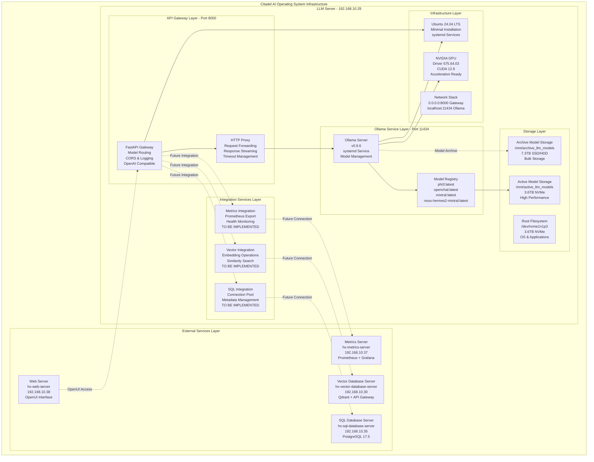
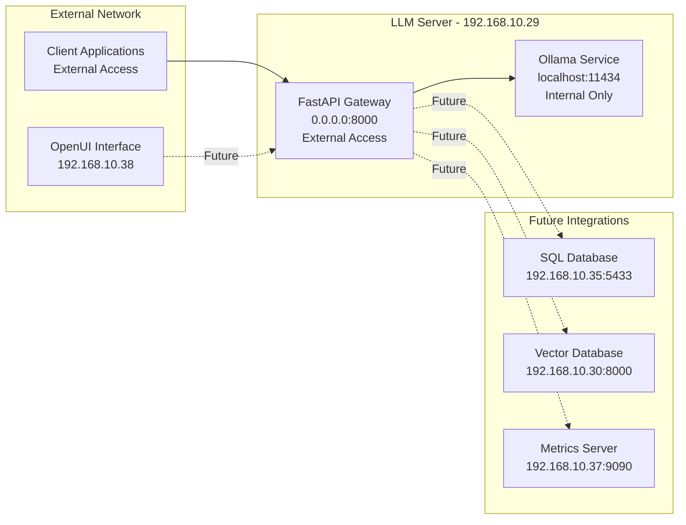

# HX-Enterprise-Server-Architecture Document (Updated for Ollama)

**Document Version:** 2.0  
**Date:** 2025-01-19  
**Author:** Citadel AI Infrastructure Team  
**Project:** HX-Enterprise-LLM-Server-01 Architecture (Ollama Implementation)  
**Server:** hx-llm-server-01 (192.168.10.29)  
**Purpose:** Updated technical architecture specification reflecting Ollama implementation  
**Update:** Transitioned from vLLM to Ollama for LLM serving framework  

---

## 1. Executive Summary

### 1.1 Architecture Overview
The HX-Enterprise-LLM-Server-01 architecture has been updated to reflect the strategic transition from vLLM to Ollama as the primary LLM serving framework. This transition was driven by performance optimization requirements and operational simplicity considerations for the R&D environment. The architecture now leverages Ollama's efficient quantized model handling and streamlined deployment capabilities while maintaining the sophisticated multi-layered system design for high-performance AI inference.

The updated architecture continues to provide seamless integration with the broader Citadel AI Operating System infrastructure, serving four specialized language models (Phi-3-Mini, OpenChat-3.5, Mixtral-8x7B, and Nous-Hermes2-Mixtral) through a unified FastAPI gateway. The system maintains proven patterns from successful Vector Database Server and PostgreSQL Database Server implementations while incorporating the operational advantages of Ollama's simplified model management and serving capabilities.

### 1.2 Ollama Integration Benefits
The transition to Ollama provides several key architectural advantages for the R&D environment. Ollama's native support for quantized models reduces memory requirements while maintaining inference quality, enabling efficient utilization of the available 128GB system memory. The framework's simplified model management eliminates complex VRAM allocation issues encountered with vLLM, providing more reliable and predictable resource utilization. Ollama's built-in OpenAI-compatible API reduces integration complexity while maintaining compatibility with existing client applications and tools.

### 1.3 Current Implementation Status
The architecture reflects the current implementation status where core LLM serving capabilities are operational with Ollama v0.9.6 serving four models through a FastAPI gateway on port 8000. The system utilizes dedicated NVMe storage for active models (/mnt/active_llm_models) and archive storage (/mnt/archive_llm_models) for optimal performance. NVIDIA drivers and CUDA toolkit are installed and operational, providing GPU acceleration capabilities for supported models.

---

## 2. Updated System Architecture

### 2.1 Ollama-Based Architecture Overview



### 2.2 Current Operational Components

#### 2.2.1 FastAPI Gateway (Port 8000)
The FastAPI gateway serves as the primary entry point for all LLM requests, providing OpenAI-compatible API endpoints while routing requests to the appropriate Ollama models. The gateway implements CORS middleware for cross-origin requests, structured logging for operational visibility, and robust timeout management for reliable communication with the Ollama service.

**Current Configuration:**
- **Listening Address:** 0.0.0.0:8000 (externally accessible)
- **Backend Connection:** localhost:11434 (Ollama service)
- **Timeout Configuration:** Connect 10s, Read 3600s, Write 300s, Pool 10s
- **Response Handling:** Streaming response support with proper error handling
- **Service Management:** systemd service (ollama-gateway)

#### 2.2.2 Ollama Service (Port 11434)
Ollama v0.9.6 provides the core LLM serving capabilities with efficient model management and inference optimization. The service manages four quantized models with automatic resource allocation and provides OpenAI-compatible API endpoints for seamless integration.

**Current Configuration:**
- **Service Version:** Ollama v0.9.6
- **Listening Address:** [::]:11434 (localhost access)
- **Model Storage:** /mnt/active_llm_models/.ollama (NVMe storage)
- **Service Management:** systemd service (ollama)
- **Models Available:** phi3:latest, openchat:latest, mixtral:latest, nous-hermes2-mixtral:latest

#### 2.2.3 Storage Architecture
The storage architecture utilizes three dedicated storage devices optimized for different use cases, ensuring optimal performance for active models while providing archive capacity for model management.

**Storage Configuration:**
- **Root Filesystem:** /dev/nvme1n1p3 (3.6TB NVMe) - OS and applications
- **Active Models:** /dev/nvme0n1p1 (3.6TB NVMe) - High-performance model storage
- **Archive Models:** /dev/sda1 (7.3TB SSD/HDD) - Bulk model storage and archives

---

## 3. Model Specifications and Resource Allocation

### 3.1 Deployed Models

#### 3.1.1 Phi-3-Mini (phi3:latest)
**Purpose:** Lightweight, efficient model for rapid inference and development testing
**Quantization:** Optimized quantized version for reduced memory footprint
**Resource Requirements:** Minimal memory usage, suitable for concurrent operations
**Use Cases:** Development testing, rapid prototyping, lightweight inference tasks

#### 3.1.2 OpenChat-3.5 (openchat:latest)
**Purpose:** Conversational AI with enhanced dialogue capabilities
**Quantization:** Balanced quantization for performance and quality
**Resource Requirements:** Moderate memory usage with good performance characteristics
**Use Cases:** Interactive conversations, customer service scenarios, dialogue systems

#### 3.1.3 Mixtral-8x7B (mixtral:latest)
**Purpose:** High-performance mixture of experts model for complex reasoning
**Model Size:** 26GB quantized version
**Resource Requirements:** Higher memory usage, optimized for complex tasks
**Use Cases:** Complex reasoning, code generation, advanced language understanding

#### 3.1.4 Nous-Hermes2-Mixtral (nous-hermes2-mixtral:latest)
**Purpose:** Enhanced Mixtral variant with improved instruction following
**Model Size:** 26GB quantized version
**Resource Requirements:** Similar to Mixtral with enhanced capabilities
**Use Cases:** Instruction following, task completion, advanced reasoning

### 3.2 Resource Utilization Strategy
Ollama's automatic resource management handles memory allocation and GPU utilization based on model requirements and available system resources. The quantized models enable efficient memory usage while maintaining inference quality, allowing multiple models to coexist on the available 128GB system memory.

---

## 4. Integration Architecture (To Be Implemented)

### 4.1 SQL Database Integration
**Target:** PostgreSQL Database Server (192.168.10.35:5433)
**Purpose:** Metadata storage, conversation history, user management
**Implementation Status:** Planned for next phase
**Integration Pattern:** Connection pooling with async database operations

### 4.2 Vector Database Integration
**Target:** Vector Database Server (192.168.10.30:8000)
**Purpose:** Embedding storage, similarity search, RAG operations
**Implementation Status:** Planned for next phase
**Integration Pattern:** Multi-protocol API integration with caching

### 4.3 Metrics Server Integration
**Target:** Metrics Server (192.168.10.37:9090)
**Purpose:** Performance monitoring, health checks, operational metrics
**Implementation Status:** Planned for next phase
**Integration Pattern:** Prometheus metrics export with custom dashboards

### 4.4 Web Server Integration
**Target:** Web Server (192.168.10.38)
**Purpose:** OpenUI interface for model interaction
**Implementation Status:** Planned for next phase
**Integration Pattern:** Direct API calls to FastAPI gateway

---

## 5. Network Architecture

### 5.1 Current Network Configuration


### 5.2 Port Allocation
- **8000:** FastAPI Gateway (external access)
- **11434:** Ollama Service (internal access only)
- **Future Ports:** To be allocated for additional services as needed

---

## 6. Performance and Scalability

### 6.1 Current Performance Characteristics
- **Response Time:** Sub-second for lightweight models (Phi-3-Mini)
- **Throughput:** Dependent on model complexity and available resources
- **Concurrent Requests:** Supported through Ollama's internal queuing
- **Memory Efficiency:** Optimized through quantized models

### 6.2 Scalability Considerations
- **Horizontal Scaling:** Additional LLM servers can be deployed with load balancing
- **Vertical Scaling:** GPU acceleration available for supported models
- **Model Scaling:** Additional models can be added through Ollama's model management
- **Storage Scaling:** Archive storage provides capacity for model expansion

---

## 7. Operational Procedures

### 7.1 Service Management
```bash
# Ollama Service Management
sudo systemctl start ollama
sudo systemctl stop ollama
sudo systemctl restart ollama
sudo systemctl status ollama

# FastAPI Gateway Management
sudo systemctl start ollama-gateway
sudo systemctl stop ollama-gateway
sudo systemctl restart ollama-gateway
sudo systemctl status ollama-gateway

# Model Management
ollama list                    # List available models
ollama pull <model_name>       # Download new models
ollama rm <model_name>         # Remove models
ollama show <model_name>       # Show model details
```

### 7.2 Health Monitoring
```bash
# Service Health Checks
curl http://localhost:8000/health          # Gateway health
curl http://localhost:11434/api/tags       # Ollama model list

# System Resource Monitoring
nvidia-smi                                 # GPU status
df -h                                      # Storage usage
free -h                                    # Memory usage
```

---

## 8. Future Implementation Phases

### 8.1 Phase 1: External Service Integration
**Objective:** Implement connections to SQL Database, Vector Database, and Metrics Server
**Timeline:** Next implementation phase
**Components:** Connection pooling, async operations, error handling

### 8.2 Phase 2: Enhanced Monitoring
**Objective:** Comprehensive monitoring and observability
**Timeline:** Following integration phase
**Components:** Prometheus metrics, Grafana dashboards, alerting

### 8.3 Phase 3: Advanced Features
**Objective:** Performance optimization and advanced capabilities
**Timeline:** Future enhancement phase
**Components:** Caching, load balancing, advanced routing

---

## 9. Technical Specifications

### 9.1 Hardware Configuration
- **CPU:** 16+ cores (exact specification to be documented)
- **Memory:** 128GB system memory
- **GPU:** NVIDIA GPU with CUDA 12.9 support
- **Storage:** 
  - 3.6TB NVMe (root filesystem)
  - 3.6TB NVMe (active model storage)
  - 7.3TB SSD/HDD (archive storage)

### 9.2 Software Stack
- **Operating System:** Ubuntu 24.04 LTS (minimal installation)
- **Python:** 3.12.3 with virtual environments
- **LLM Framework:** Ollama v0.9.6
- **API Framework:** FastAPI with Uvicorn
- **GPU Support:** NVIDIA Driver 575.64.03, CUDA 12.9
- **Service Management:** systemd

### 9.3 Security Considerations (R&D Environment)
- **Network Access:** External access on port 8000 for development purposes
- **Authentication:** Basic security appropriate for R&D environment
- **Data Protection:** Standard file system permissions
- **Service Isolation:** Services run with appropriate user permissions

---

## 10. Conclusion

The updated HX-Enterprise-LLM-Server-01 architecture successfully transitions to Ollama as the primary LLM serving framework, providing a robust foundation for AI inference capabilities in the R&D environment. The current implementation establishes core functionality with four operational models accessible through a unified FastAPI gateway, while maintaining the architectural flexibility for future enhancements and integrations.

The architecture positions the system for seamless integration with the broader Citadel AI Operating System infrastructure while providing the operational simplicity and performance characteristics required for effective R&D operations. Future implementation phases will build upon this foundation to deliver comprehensive monitoring, external service integration, and advanced capabilities while maintaining the system's reliability and performance characteristics.

**Document Status:** Updated to reflect current Ollama implementation  
**Next Review:** Following completion of external service integration phase  
**Approval:** Technical Leadership and Project Management

