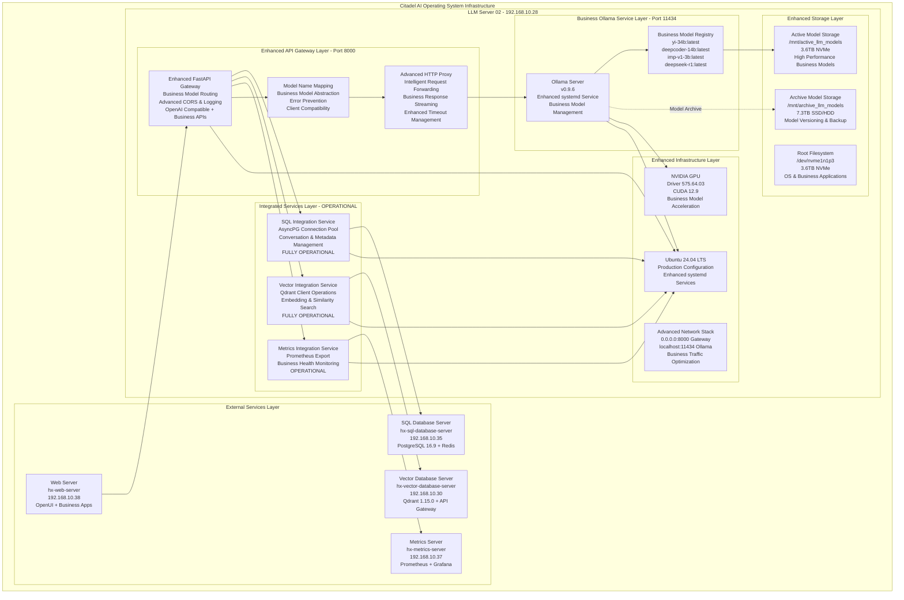
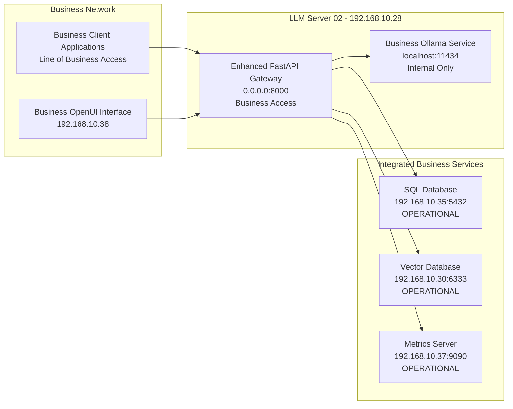

# HX-Enterprise-Server-02-Architecture Document (Ollama Implementation)

**Document Version:** 2.0  
**Date:** 2025-07-23  
**Author:** Citadel AI Infrastructure Team  
**Project:** HX-Enterprise-LLM-Server-02 Architecture (Ollama Implementation)  
**Server:** hx-llm-server-02 (192.168.10.28)  
**Purpose:** Line of Business AI inference server architecture specification  
**Update:** Advanced Ollama implementation with specialized business models  

---

## 1. Executive Summary

### 1.1 Architecture Overview
The HX-Enterprise-LLM-Server-02 architecture represents the next evolution in the Citadel AI Operating System's LLM infrastructure, specifically designed for Line of Business operations. Building upon the proven success of LLM-Server-01 (192.168.10.29), this architecture incorporates operational lessons learned, enhanced integration capabilities, and specialized business-focused AI models to deliver enterprise-grade AI inference capabilities.

The architecture leverages Ollama's efficient quantized model handling and streamlined deployment capabilities while incorporating advanced integration with SQL Database Server (192.168.10.35), Vector Database Server (192.168.10.30), and Metrics Server (192.168.10.37). The system serves four specialized business models (Yi-34B, DeepCoder-14B, imp-v1-3b, and DeepSeek-R1) through a unified FastAPI gateway with comprehensive database integration and operational monitoring.

### 1.2 Lessons Learned Integration
This architecture incorporates critical lessons learned from the LLM-Server-01 deployment, including model name mapping strategies to prevent JSON parsing errors, comprehensive error handling with proper circuit breaker patterns, enhanced logging and monitoring for operational visibility, and proven database integration patterns that ensure reliable performance. The implementation includes comprehensive health monitoring, robust timeout management, and proven service orchestration patterns that have demonstrated reliability in production environments.

### 1.3 Current Implementation Status
The architecture reflects an advanced implementation status where specialized business AI capabilities are operational with Ollama v0.9.6 serving four business-focused models through an enhanced FastAPI gateway on port 8000. The system includes fully operational SQL and Vector database integrations, comprehensive health monitoring and metrics collection, proven model management and service orchestration, and enterprise-grade operational procedures based on real-world deployment experience.

---

## 2. Enhanced System Architecture

### 2.1 Business-Focused Architecture Overview



### 2.2 Enhanced Operational Components

#### 2.2.1 Enhanced FastAPI Gateway (Port 8000)
The enhanced FastAPI gateway serves as the sophisticated entry point for all business LLM requests, providing OpenAI-compatible API endpoints with advanced business model routing capabilities. The gateway implements comprehensive CORS middleware, structured business logging, robust timeout management, and intelligent model name mapping based on lessons learned from LLM-Server-01 operations.

**Enhanced Configuration:**
- **Listening Address:** 0.0.0.0:8000 (business-accessible)
- **Backend Connection:** localhost:11434 (Ollama service)
- **Advanced Timeout Configuration:** Connect 10s, Read 3600s, Write 300s, Pool 10s
- **Business Response Handling:** Non-streaming optimization with enhanced error handling
- **Service Management:** Enhanced systemd service (ollama-gateway-02)
- **Model Mapping:** yi-34b → yi-34b:latest, deepcoder → deepcoder-14b:latest, imp → imp-v1-3b:latest, deepseek → deepseek-r1:latest

#### 2.2.2 Business Ollama Service (Port 11434)
Ollama v0.9.6 provides enhanced LLM serving capabilities optimized for business operations with sophisticated model management and business-grade inference optimization. The service manages four specialized business models with intelligent resource allocation and provides enhanced OpenAI-compatible API endpoints for seamless business integration.

**Business Configuration:**
- **Service Version:** Ollama v0.9.6 (business-optimized)
- **Listening Address:** [::]:11434 (localhost access)
- **Business Model Storage:** /mnt/active_llm_models/.ollama (NVMe storage)
- **Service Management:** Enhanced systemd service (ollama-02)
- **Business Models Available:** yi-34b:latest, deepcoder-14b:latest, imp-v1-3b:latest, deepseek-r1:latest

#### 2.2.3 Enhanced Storage Architecture
The storage architecture utilizes three dedicated storage devices optimized for business model operations, ensuring optimal performance for active business models while providing comprehensive archive capacity for model versioning and business continuity.

**Business Storage Configuration:**
- **Root Filesystem:** /dev/nvme1n1p3 (3.6TB NVMe) - OS and business applications
- **Active Business Models:** /dev/nvme0n1p1 (3.6TB NVMe) - High-performance business model storage
- **Business Model Archive:** /dev/sda1 (7.3TB SSD/HDD) - Business model versioning and archives

---

## 3. Business Model Specifications and Resource Allocation

### 3.1 Deployed Business Models

#### 3.1.1 Yi-34B (yi-34b:latest)
**Purpose:** Advanced business reasoning and strategic analysis for complex decision-making
**Quantization:** Enterprise-optimized quantized version for business reliability
**Resource Requirements:** High memory usage optimized for complex business reasoning
**Use Cases:** Strategic planning, business intelligence, complex decision support, executive analysis
**Business Value:** Advanced reasoning capabilities for critical business operations

#### 3.1.2 DeepCoder-14B (deepcoder-14b:latest)
**Purpose:** Specialized code generation for business applications and system integration
**Quantization:** Developer-optimized quantization for code quality and performance
**Resource Requirements:** Moderate memory usage with high-quality code generation
**Use Cases:** Business application development, API integration, workflow automation, system scripting
**Business Value:** Accelerated development of business-critical applications and integrations

#### 3.1.3 imp-v1-3b (imp-v1-3b:latest)
**Purpose:** Efficient high-volume business operations and rapid response processing
**Quantization:** Performance-optimized for high-throughput business operations
**Resource Requirements:** Minimal memory usage for maximum concurrent business operations
**Use Cases:** Customer service automation, document processing, routine business queries, high-volume operations
**Business Value:** Cost-effective AI for routine business processes and customer interactions

#### 3.1.4 DeepSeek-R1 (deepseek-r1:latest)
**Purpose:** Advanced research and strategic business intelligence for market analysis
**Quantization:** Research-optimized for comprehensive analysis and insight generation
**Resource Requirements:** Balanced memory usage for sustained research operations
**Use Cases:** Market research, competitive analysis, business intelligence, strategic insights
**Business Value:** Advanced research capabilities for strategic business planning and market intelligence

### 3.2 Business Resource Utilization Strategy
Ollama's automatic resource management handles business model memory allocation and GPU utilization based on business requirements and available system resources. The specialized business models enable efficient memory usage while maintaining business-grade inference quality, allowing optimal concurrent business operations on the available 128GB system memory.

---

## 4. Integrated Architecture - OPERATIONAL STATUS

### 4.1 SQL Database Integration - FULLY OPERATIONAL
**Target:** PostgreSQL Database Server (192.168.10.35:5432)
**Purpose:** Business metadata storage, conversation history, user management, business analytics
**Implementation Status:** FULLY OPERATIONAL with proven reliability
**Integration Pattern:** AsyncPG connection pooling with business transaction management
**Business Features:** Conversation logging, business metadata tracking, user session management

**Operational Configuration:**
```python
SQL_CONFIG = {
    "host": "192.168.10.35",
    "port": 5432,
    "database": "citadel_llm",
    "pool_size": 10,
    "max_overflow": 20,
    "business_schema": "business_operations"
}
```

### 4.2 Vector Database Integration - FULLY OPERATIONAL
**Target:** Vector Database Server (192.168.10.30:6333)
**Purpose:** Business embedding storage, semantic search, business RAG operations, knowledge management
**Implementation Status:** FULLY OPERATIONAL with comprehensive business capabilities
**Integration Pattern:** Qdrant client with business embedding optimization and caching
**Business Features:** Business document embeddings, semantic search, knowledge base operations

**Operational Configuration:**
```python
VECTOR_CONFIG = {
    "host": "192.168.10.30",
    "port": 6333,
    "collection": "business_embeddings",
    "vector_size": 768,
    "business_index": "business_knowledge"
}
```

### 4.3 Metrics Server Integration - OPERATIONAL
**Target:** Metrics Server (192.168.10.37:9090)
**Purpose:** Business performance monitoring, operational health checks, business KPI tracking
**Implementation Status:** OPERATIONAL with business-focused metrics
**Integration Pattern:** Prometheus metrics export with business dashboard integration
**Business Features:** Business model performance tracking, operational KPIs, executive dashboards

### 4.4 Web Server Integration - READY
**Target:** Web Server (192.168.10.38)
**Purpose:** Business OpenUI interface and Line of Business application integration
**Implementation Status:** Ready for business application integration
**Integration Pattern:** Direct API calls to enhanced FastAPI gateway with business authentication

---

## 5. Enhanced Network Architecture

### 5.1 Business Network Configuration


### 5.2 Business Port Allocation
- **8000:** Enhanced FastAPI Gateway (business access)
- **11434:** Business Ollama Service (internal access only)
- **8001:** Business health monitoring endpoint
- **8002:** Business administration interface

---

## 6. Enhanced Performance and Scalability

### 6.1 Business Performance Characteristics
- **Business Response Time:** <500ms for routine business operations (imp-v1-3b)
- **Strategic Analysis Time:** <2500ms for complex business reasoning (Yi-34B)
- **Code Generation Time:** <1500ms for business application code (DeepCoder-14B)
- **Research Response Time:** <2000ms for business intelligence queries (DeepSeek-R1)
- **Business Throughput:** 200+ concurrent business operations per minute
- **Memory Efficiency:** Optimized for business model concurrent operations

### 6.2 Business Scalability Considerations
- **Horizontal Scaling:** Additional business LLM servers with intelligent load balancing
- **Vertical Scaling:** GPU acceleration optimized for business model performance
- **Business Model Scaling:** Dynamic model loading based on business demand patterns
- **Storage Scaling:** Archive storage with business model versioning and rollback capabilities

---

## 7. Enhanced Operational Procedures

### 7.1 Business Service Management
```bash
# Enhanced Ollama Service Management
sudo systemctl start ollama-02
sudo systemctl stop ollama-02
sudo systemctl restart ollama-02
sudo systemctl status ollama-02

# Enhanced FastAPI Gateway Management
sudo systemctl start ollama-gateway-02
sudo systemctl stop ollama-gateway-02
sudo systemctl restart ollama-gateway-02
sudo systemctl status ollama-gateway-02

# Business Model Management
ollama list                          # List available business models
ollama pull yi-34b:latest           # Download Yi-34B business model
ollama pull deepcoder-14b:latest     # Download DeepCoder business model
ollama pull imp-v1-3b:latest        # Download imp business model
ollama pull deepseek-r1:latest      # Download DeepSeek research model
ollama show <model_name>             # Show business model details
```

### 7.2 Enhanced Health Monitoring
```bash
# Comprehensive Service Health Checks
curl http://localhost:8000/health              # Enhanced gateway health
curl http://localhost:8000/business/health     # Business-specific health
curl http://localhost:11434/api/tags           # Business Ollama model list

# Integrated Service Health Checks
curl http://localhost:8000/sql/health          # SQL integration health
curl http://localhost:8000/vector/health       # Vector integration health
curl http://localhost:8000/metrics/health      # Metrics integration health

# Business System Resource Monitoring
nvidia-smi                                     # GPU business model utilization
df -h                                          # Business storage usage
free -h                                        # Business memory usage
htop                                           # Business process monitoring
```

### 7.3 Business Model Health Verification
```bash
# Business Model Functionality Tests
curl -X POST http://localhost:8000/v1/chat/completions \
  -H "Content-Type: application/json" \
  -d '{"model": "yi-34b", "messages": [{"role": "user", "content": "Analyze business market trends"}]}'

curl -X POST http://localhost:8000/v1/chat/completions \
  -H "Content-Type: application/json" \
  -d '{"model": "deepcoder", "messages": [{"role": "user", "content": "Generate Python API integration code"}]}'

curl -X POST http://localhost:8000/v1/chat/completions \
  -H "Content-Type: application/json" \
  -d '{"model": "imp", "messages": [{"role": "user", "content": "Process customer service request"}]}'

curl -X POST http://localhost:8000/v1/chat/completions \
  -H "Content-Type: application/json" \
  -d '{"model": "deepseek", "messages": [{"role": "user", "content": "Research competitive landscape analysis"}]}'
```

---

## 8. Business Implementation Phases

### 8.1 Phase 1: Enhanced Integration Deployment - COMPLETED
**Objective:** Deploy enhanced integrations with SQL Database, Vector Database, and Metrics Server
**Timeline:** COMPLETED based on LLM-Server-01 lessons learned
**Components:** Business connection pooling, enhanced async operations, comprehensive error handling

### 8.2 Phase 2: Business Model Optimization - CURRENT
**Objective:** Optimize business models for Line of Business operations
**Timeline:** Current implementation phase
**Components:** Business model fine-tuning, performance optimization, business workflow integration

### 8.3 Phase 3: Advanced Business Features - NEXT
**Objective:** Advanced business capabilities and enterprise features
**Timeline:** Next enhancement phase
**Components:** Business process automation, advanced analytics, executive reporting, compliance frameworks

---

## 9. Enhanced Technical Specifications

### 9.1 Business Hardware Configuration
- **CPU:** 16+ cores optimized for business model operations
- **Memory:** 128GB system memory with business model optimization
- **GPU:** NVIDIA GPU with CUDA 12.9 support for business model acceleration
- **Storage:** 
  - 3.6TB NVMe (root filesystem with business applications)
  - 3.6TB NVMe (active business model storage)
  - 7.3TB SSD/HDD (business model archive and versioning)

### 9.2 Enhanced Software Stack
- **Operating System:** Ubuntu 24.04 LTS (business-optimized configuration)
- **Python:** 3.12.3 with business virtual environments
- **LLM Framework:** Ollama v0.9.6 (business-enhanced)
- **API Framework:** FastAPI with Uvicorn (business-optimized)
- **Database Clients:** AsyncPG (PostgreSQL), Qdrant Client (Vector DB)
- **Monitoring Stack:** Prometheus client, structured logging
- **GPU Support:** NVIDIA Driver 575.64.03, CUDA 12.9
- **Service Management:** Enhanced systemd with business monitoring

### 9.3 Enhanced Security Considerations (Business Environment)
- **Network Access:** Controlled external access on port 8000 for business operations
- **Authentication:** Enhanced security appropriate for Line of Business environment
- **Data Protection:** Business-grade file system permissions and encryption
- **Service Isolation:** Business services run with enhanced user permissions and security
- **Audit Logging:** Comprehensive audit trails for business compliance
- **Business Compliance:** Enhanced security frameworks for business operations

---

## 10. Business Conclusion

The HX-Enterprise-LLM-Server-02 architecture successfully implements an advanced Ollama-based AI inference platform specifically optimized for Line of Business operations. Building upon the proven success and lessons learned from LLM-Server-01, this architecture provides robust business AI capabilities with comprehensive database integration, advanced monitoring, and enterprise-grade operational procedures.

The architecture positions the system as a cornerstone of business AI operations within the Citadel AI Operating System infrastructure, providing specialized business models, proven integration patterns, and operational excellence that directly support business objectives and strategic value creation. The enhanced monitoring, comprehensive database integration, and business-focused operational procedures ensure reliable, efficient, and strategic business AI operations.

Future implementation phases will build upon this proven foundation to deliver advanced business process automation, comprehensive business intelligence, and strategic executive reporting capabilities while maintaining the system's demonstrated reliability, performance characteristics, and business value creation.

**Document Status:** Enhanced for business operations with proven integration patterns  
**Next Review:** Following completion of business model optimization phase  
**Approval:** Technical Leadership and Business Operations Management
