# HX-Enterprise-LLM-Server-02 Architecture Document

**Document Version:** 1.0  
**Date:** 2025-07-22  
**Author:** Manus AI Infrastructure Team  
**Project:** HX-Enterprise-LLM-Server-02 Architecture  
**Server:** hx-llm-server-02 (192.168.10.28)  
**Purpose:** Line of Business AI Inference Server Architecture  

---

## 1. Executive Summary

### 1.1 Architecture Overview

The HX-Enterprise-LLM-Server-02 architecture represents a specialized, high-performance AI inference platform designed specifically for Line of Business (LoB) operations within the Citadel AI Operating System ecosystem. This architecture document provides comprehensive technical specifications, design patterns, and implementation guidance for deploying four advanced AI models that serve critical business functions including code generation, reasoning, conversational AI, and specialized business intelligence operations.

Building upon the proven architectural patterns established by the successful LLM-01 server deployment, this architecture incorporates enhanced capabilities specifically tailored for business-critical operations while maintaining seamless integration with the broader Citadel infrastructure. The system is designed to handle complex business workflows, support advanced reasoning tasks, and provide reliable, high-performance AI inference capabilities that directly support organizational objectives and operational excellence.

The architecture leverages the operational success of the SQL Database Server (192.168.10.35), Vector Database Server (192.168.10.30), and Metrics Server (192.168.10.37) implementations, incorporating proven integration patterns and operational procedures to ensure immediate operational readiness and long-term reliability. The design emphasizes business continuity, operational efficiency, and scalable performance to support the evolving needs of Line of Business operations.

### 1.2 Strategic Business Alignment

The LLM-02 server architecture is strategically aligned with Line of Business requirements, focusing on four critical business capabilities that directly support organizational objectives. The Yi-34B model provides advanced reasoning and analysis capabilities for complex business decision-making processes, enabling sophisticated data analysis, strategic planning, and business intelligence operations. The DeepCoder-14B model delivers specialized code generation and software development support, facilitating rapid application development, system integration, and technical problem-solving for business applications.

The imp-v1-3b model offers efficient, lightweight AI processing for high-volume business operations, providing rapid response times for routine business queries, document processing, and automated workflow support. The DeepSeek-R1 model provides advanced research and analysis capabilities, supporting market research, competitive analysis, and strategic business intelligence operations. Together, these models create a comprehensive AI inference platform that addresses the full spectrum of Line of Business requirements while maintaining operational efficiency and cost-effectiveness.

The architecture supports critical business processes including automated document processing, intelligent customer service, advanced analytics and reporting, code generation for business applications, and strategic decision support systems. The design ensures that business operations can leverage advanced AI capabilities while maintaining the reliability, security, and performance standards required for mission-critical business functions.

### 1.3 Technical Architecture Scope

This architecture encompasses the complete technical design for the HX-Enterprise-LLM-Server-02, including all internal components, external integrations, operational procedures, and business-specific optimizations. The scope includes the four specialized AI model services (Yi-34B, DeepCoder-14B, imp-v1-3b, and DeepSeek-R1), the unified API gateway optimized for business operations, comprehensive integration layers for SQL and Vector databases, advanced monitoring and observability systems, and all supporting infrastructure components required for Line of Business operations.

The architecture defines specific integration patterns with external services including the operational SQL Database Server (192.168.10.35) for business data storage and retrieval, the Vector Database Server (192.168.10.30) for advanced semantic search and knowledge management, the Metrics Server (192.168.10.37) for comprehensive operational monitoring, and the Web Server (192.168.10.38) for user interface and business application integration. The design also incorporates business-specific requirements including advanced security configurations, compliance frameworks, and operational procedures tailored for business-critical environments.

---

## 2. System Architecture Overview

### 2.1 High-Level Architecture

The HX-Enterprise-LLM-Server-02 architecture implements a sophisticated, multi-layered design that separates business concerns while enabling efficient communication and data flow between components. The architecture consists of seven primary layers, each with specific responsibilities and well-defined interfaces optimized for Line of Business operations.

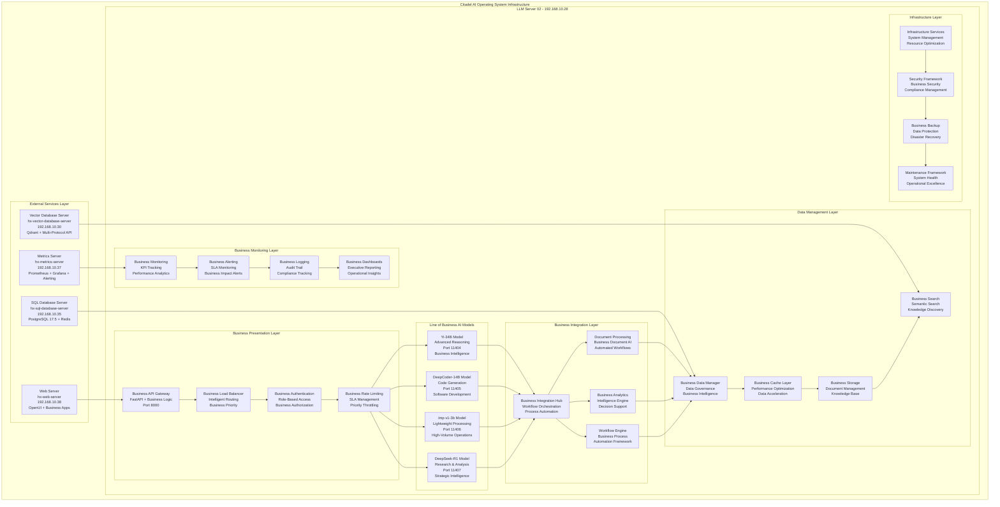

The Business Presentation Layer serves as the primary interface for all Line of Business operations, implementing sophisticated routing logic that understands business priorities, user roles, and operational requirements. This layer ensures that business-critical requests receive appropriate priority and routing while maintaining optimal performance and resource utilization across all business functions.

The Line of Business AI Models layer hosts the four specialized models, each optimized for specific business functions and operational requirements. The Yi-34B model handles complex reasoning and analysis tasks that require deep understanding and sophisticated decision-making capabilities. The DeepCoder-14B model provides specialized code generation and software development support for business applications and system integration projects. The imp-v1-3b model delivers efficient, high-throughput processing for routine business operations and high-volume transaction processing. The DeepSeek-R1 model offers advanced research and analysis capabilities for strategic business intelligence and market analysis operations.

### 2.2 Business-Centric Design Principles

The architecture is built upon six core business-centric design principles that guide all technical decisions and implementation strategies. The principle of **Business Continuity** ensures that all system components are designed to support uninterrupted business operations, with comprehensive failover mechanisms, redundancy strategies, and disaster recovery procedures that minimize business impact during any operational disruptions.

The principle of **Operational Efficiency** drives the optimization of all system components to maximize business value while minimizing operational overhead and resource consumption. This includes intelligent resource allocation, automated operational procedures, and performance optimization strategies that directly support business objectives and operational excellence.

The principle of **Business Intelligence Integration** ensures that all AI capabilities are designed to support and enhance business decision-making processes, providing actionable insights, automated analysis, and intelligent recommendations that directly contribute to business success and strategic objectives.

The principle of **Scalable Business Operations** enables the system to accommodate growing business requirements, increased transaction volumes, and expanding operational scope without requiring fundamental architectural changes or significant operational disruptions.

The principle of **Compliance and Governance** ensures that all system components meet business compliance requirements, regulatory standards, and governance frameworks while maintaining operational flexibility and performance excellence.

The principle of **Cost Optimization** drives efficient resource utilization, intelligent capacity planning, and cost-effective operational strategies that maximize business value while minimizing total cost of ownership and operational expenses.

---

## 3. Component Architecture

### 3.1 Line of Business AI Model Architecture

Each Line of Business AI model follows a specialized architecture pattern that ensures optimal performance for business-specific use cases while maintaining consistency, reliability, and seamless integration with business workflows. The architecture separates concerns between model loading, business logic processing, and result generation while providing comprehensive monitoring and business-specific error handling capabilities.

```mermaid
graph TD
    subgraph "LoB AI Model Service Architecture"
        subgraph "Business Model Management"
            BIZLOAD[Business Model Loader<br/>Optimized Loading<br/>Business Priority<br/>Resource Allocation]
            BIZCACHE[Business Model Cache<br/>Intelligent Caching<br/>Business Context<br/>Performance Optimization]
            BIZHEALTH[Business Health Monitor<br/>SLA Tracking<br/>Business Metrics<br/>Performance Analytics]
        end
        
        subgraph "Business Inference Engine"
            OLLAMA[Ollama Engine<br/>Optimized Inference<br/>Business Workflows<br/>Context Management]
            BIZSCHED[Business Scheduler<br/>Priority Queue<br/>SLA Management<br/>Resource Optimization]
            BIZPROC[Business Processing<br/>Context Processing<br/>Business Logic<br/>Result Optimization]
        end
        
        subgraph "Business API Interface"
            BIZAPI_INT[Business API<br/>OpenAI Compatible<br/>Business Extensions<br/>Custom Endpoints]
            BIZVALID[Business Validation<br/>Input Validation<br/>Business Rules<br/>Compliance Checking]
            BIZRESP[Business Response<br/>Output Formatting<br/>Business Context<br/>Result Enhancement]
        end
        
        subgraph "Business Intelligence Layer"
            BIZMETRICS[Business Metrics<br/>KPI Tracking<br/>Performance Analytics<br/>Business Intelligence]
            BIZAUDIT[Business Audit<br/>Compliance Logging<br/>Audit Trail<br/>Governance Tracking]
            BIZALERTS[Business Alerts<br/>SLA Monitoring<br/>Business Impact<br/>Escalation Management]
        end
        
        subgraph "Business Resource Management"
            BIZMEM[Business Memory<br/>Intelligent Allocation<br/>Business Priority<br/>Resource Optimization]
            BIZCPU[Business CPU<br/>Workload Management<br/>Priority Scheduling<br/>Performance Optimization]
            BIZIO[Business I/O<br/>Data Management<br/>Business Workflows<br/>Integration Optimization]
        end
    end
    
    %% Business Flow Connections
    BIZLOAD --> OLLAMA
    BIZCACHE --> OLLAMA
    BIZHEALTH --> OLLAMA
    
    OLLAMA --> BIZSCHED
    BIZSCHED --> BIZPROC
    
    BIZPROC --> BIZAPI_INT
    BIZAPI_INT --> BIZVALID
    BIZVALID --> BIZRESP
    
    BIZRESP --> BIZMETRICS
    BIZMETRICS --> BIZAUDIT
    BIZAUDIT --> BIZALERTS
    
    BIZMEM --> BIZCPU
    BIZCPU --> BIZIO
    BIZIO --> BIZLOAD
```

### 3.2 Yi-34B Model Specifications

The Yi-34B model serves as the primary advanced reasoning and business intelligence engine for the LLM-02 server, providing sophisticated analytical capabilities that support complex business decision-making processes and strategic planning operations. This model is specifically optimized for handling multi-step reasoning tasks, complex data analysis, and strategic business intelligence operations that require deep understanding and sophisticated analytical capabilities.

**Technical Specifications:**
- **Model Size:** 34 billion parameters optimized for business reasoning
- **Memory Requirements:** 68-72GB RAM for optimal performance
- **CPU Requirements:** 8-12 CPU cores with high-frequency processing
- **Storage Requirements:** 80GB for model files and business context cache
- **Network Port:** 11404 (dedicated business reasoning endpoint)
- **Performance Target:** <2500ms average response time for complex reasoning tasks
- **Throughput Target:** 150-200 complex reasoning operations per minute
- **Concurrent Users:** 25-30 simultaneous business users
- **Business Context:** 32K token context window for comprehensive business analysis

**Business Use Cases:**
The Yi-34B model excels in strategic business analysis, market research and competitive intelligence, financial analysis and forecasting, risk assessment and management, business process optimization, regulatory compliance analysis, customer behavior analysis, and strategic planning support. The model provides sophisticated reasoning capabilities that enable business users to analyze complex scenarios, evaluate multiple options, and make informed decisions based on comprehensive data analysis and strategic insights.

**Integration Patterns:**
The model integrates seamlessly with business intelligence platforms, financial analysis systems, strategic planning tools, and executive reporting systems. It provides specialized APIs for business analytics, strategic analysis endpoints, executive reporting interfaces, and compliance monitoring systems. The integration architecture ensures that business users can access advanced reasoning capabilities through familiar business applications while maintaining security, compliance, and performance standards.

### 3.3 DeepCoder-14B Model Specifications

The DeepCoder-14B model provides specialized code generation and software development support for Line of Business applications, enabling rapid development of business applications, system integrations, and automated workflow solutions. This model is specifically optimized for understanding business requirements and generating high-quality code that meets business specifications and operational standards.

**Technical Specifications:**
- **Model Size:** 14 billion parameters optimized for code generation
- **Memory Requirements:** 28-32GB RAM for optimal code generation performance
- **CPU Requirements:** 6-8 CPU cores with optimized instruction processing
- **Storage Requirements:** 40GB for model files and code generation cache
- **Network Port:** 11405 (dedicated code generation endpoint)
- **Performance Target:** <1800ms average response time for code generation tasks
- **Throughput Target:** 200-250 code generation operations per minute
- **Concurrent Users:** 15-20 simultaneous developers
- **Code Context:** 16K token context window for comprehensive code understanding

**Business Use Cases:**
The DeepCoder-14B model supports business application development, system integration projects, automated workflow creation, API development and integration, database query generation, business rule implementation, report generation automation, and custom business tool development. The model understands business requirements and generates production-ready code that meets business specifications, coding standards, and operational requirements.

**Integration Patterns:**
The model integrates with development environments, business application platforms, workflow automation systems, and enterprise development tools. It provides specialized APIs for code generation, development assistance endpoints, integration support interfaces, and automated development workflows. The integration architecture ensures that development teams can leverage advanced code generation capabilities while maintaining code quality, security standards, and business compliance requirements.

### 3.4 imp-v1-3b Model Specifications

The imp-v1-3b model provides efficient, lightweight AI processing for high-volume business operations, delivering rapid response times for routine business queries, document processing, and automated workflow support. This model is specifically optimized for handling large volumes of routine business operations while maintaining consistent performance and resource efficiency.

**Technical Specifications:**
- **Model Size:** 3 billion parameters optimized for efficiency
- **Memory Requirements:** 6-8GB RAM for high-throughput operations
- **CPU Requirements:** 4-6 CPU cores with optimized processing
- **Storage Requirements:** 12GB for model files and operation cache
- **Network Port:** 11406 (dedicated high-volume operations endpoint)
- **Performance Target:** <800ms average response time for routine operations
- **Throughput Target:** 400-500 routine operations per minute
- **Concurrent Users:** 50-75 simultaneous business users
- **Operation Context:** 8K token context window for efficient processing

**Business Use Cases:**
The imp-v1-3b model excels in document processing and classification, customer service automation, routine business query handling, data entry and validation, workflow automation support, basic business analysis, content generation for business communications, and high-volume transaction processing. The model provides efficient processing capabilities that enable business operations to handle routine tasks automatically while maintaining quality and consistency standards.

**Integration Patterns:**
The model integrates with business process automation systems, customer service platforms, document management systems, and workflow automation tools. It provides specialized APIs for high-volume processing, automation support endpoints, document processing interfaces, and routine operation workflows. The integration architecture ensures that business operations can leverage efficient AI processing for routine tasks while maintaining performance, reliability, and operational excellence.

### 3.5 DeepSeek-R1 Model Specifications

The DeepSeek-R1 model provides advanced research and analysis capabilities for strategic business intelligence and market analysis operations, enabling comprehensive research, competitive analysis, and strategic intelligence gathering that supports executive decision-making and strategic planning processes.

**Technical Specifications:**
- **Model Size:** Advanced architecture optimized for research and analysis
- **Memory Requirements:** 45-50GB RAM for comprehensive research operations
- **CPU Requirements:** 8-10 CPU cores with analytical processing optimization
- **Storage Requirements:** 60GB for model files and research data cache
- **Network Port:** 11407 (dedicated research and analysis endpoint)
- **Performance Target:** <2000ms average response time for research tasks
- **Throughput Target:** 100-150 research operations per minute
- **Concurrent Users:** 20-25 simultaneous research users
- **Research Context:** 24K token context window for comprehensive analysis

**Business Use Cases:**
The DeepSeek-R1 model supports market research and analysis, competitive intelligence gathering, strategic planning research, industry trend analysis, regulatory research and compliance, customer research and insights, business opportunity analysis, and executive briefing preparation. The model provides sophisticated research capabilities that enable business teams to gather comprehensive intelligence and analysis for strategic decision-making and planning processes.

**Integration Patterns:**
The model integrates with business intelligence platforms, research management systems, strategic planning tools, and executive reporting systems. It provides specialized APIs for research operations, analysis support endpoints, intelligence gathering interfaces, and strategic planning workflows. The integration architecture ensures that research teams can leverage advanced analysis capabilities while maintaining information security, research quality, and strategic value standards.

---

## 4. Infrastructure Architecture

### 4.1 Network Architecture

The network architecture implements a secure, high-performance communication infrastructure specifically designed for Line of Business operations, supporting all internal and external service interactions while maintaining optimal performance, security, and business continuity characteristics required for mission-critical business functions.

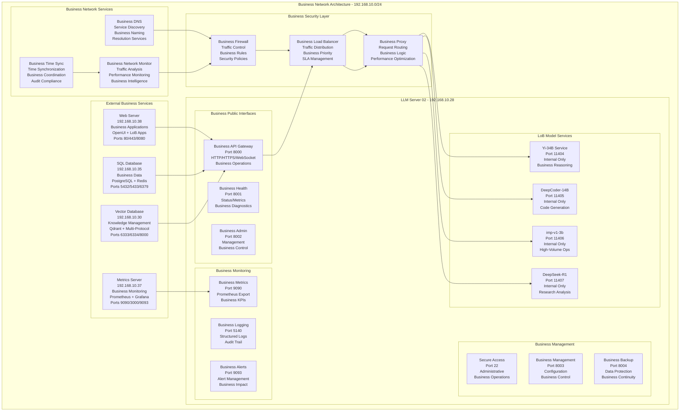

### 4.2 Business Integration Architecture

The integration architecture implements sophisticated patterns for connecting with external business services, ensuring reliable, performant, and maintainable integrations that support comprehensive business operations and strategic objectives while maintaining operational excellence and business continuity.

```mermaid
graph TD
    subgraph "Business Integration Architecture"
        subgraph "SQL Database Business Integration"
            SQLBIZ[Business Database Pool<br/>Pgpool-II Connection<br/>Port 5433<br/>Business Load Balancing]
            SQLBIZRETRY[Business Retry Logic<br/>Exponential Backoff<br/>Business Circuit Breaker<br/>Failure Management]
            SQLBIZCACHE[Business Query Cache<br/>Result Optimization<br/>Business TTL<br/>Performance Enhancement]
            SQLBIZTRANS[Business Transactions<br/>ACID Compliance<br/>Business Rollback<br/>Data Consistency]
        end
        
        subgraph "Vector Database Business Integration"
            VDBBIZMULTI[Business Multi-Protocol<br/>REST/GraphQL/gRPC<br/>Business Adaptation<br/>Flexible Integration]
            VDBBIZEMBBED[Business Embeddings<br/>Vector Operations<br/>Business Search<br/>Knowledge Management]
            VDBBIZCACHE[Business Vector Cache<br/>Embedding Optimization<br/>Search Acceleration<br/>Performance Enhancement]
            VDBBIZFAIL[Business Failover<br/>Redundancy Support<br/>High Availability<br/>Business Continuity]
        end
        
        subgraph "Metrics Business Integration"
            METBIZEXPORT[Business Metrics Export<br/>Prometheus Format<br/>Business KPIs<br/>Performance Analytics]
            METBIZDASH[Business Dashboards<br/>Grafana Integration<br/>Executive Reporting<br/>Operational Insights]
            METBIZALERT[Business Alerting<br/>Alertmanager Integration<br/>Business Rules<br/>Incident Management]
            METBIZHEALTH[Business Health Monitor<br/>Service Health<br/>Business Dependencies<br/>System Status]
        end
        
        subgraph "Web Server Business Integration"
            WEBBIZUI[Business UI Integration<br/>OpenUI Enhancement<br/>Business Applications<br/>User Experience]
            WEBBIZAPI[Business API Integration<br/>RESTful Services<br/>Business Data Exchange<br/>Service Communication]
            WEBBIZWS[Business WebSocket<br/>Real-time Updates<br/>Business Monitoring<br/>Interactive Features]
            WEBBIZAUTH[Business Authentication<br/>Session Management<br/>Business Token Exchange<br/>Security Coordination]
        end
        
        subgraph "Business Integration Framework"
            BIZCONNMGMT[Business Connection Management<br/>Pool Lifecycle<br/>Business Health Monitoring<br/>Resource Optimization]
            BIZERRHAND[Business Error Handling<br/>Graceful Degradation<br/>Business Fallback<br/>Recovery Procedures]
            BIZMONITOR[Business Integration Monitor<br/>Performance Tracking<br/>Business Error Rates<br/>SLA Compliance]
            BIZCONFIG[Business Configuration<br/>Dynamic Configuration<br/>Business Environment<br/>Runtime Updates]
        end
    end
    
    %% Business Integration Flow
    SQLBIZ --> BIZCONNMGMT
    SQLBIZRETRY --> BIZERRHAND
    SQLBIZCACHE --> BIZMONITOR
    SQLBIZTRANS --> BIZCONFIG
    
    VDBBIZMULTI --> BIZCONNMGMT
    VDBBIZEMBBED --> BIZMONITOR
    VDBBIZCACHE --> BIZCONFIG
    VDBBIZFAIL --> BIZERRHAND
    
    METBIZEXPORT --> BIZMONITOR
    METBIZDASH --> BIZCONFIG
    METBIZALERT --> BIZERRHAND
    METBIZHEALTH --> BIZCONNMGMT
    
    WEBBIZUI --> BIZCONFIG
    WEBBIZAPI --> BIZCONNMGMT
    WEBBIZWS --> BIZMONITOR
    WEBBIZAUTH --> BIZERRHAND
```

### 4.3 Business Data Flow Architecture

The data flow architecture implements sophisticated patterns for managing business data throughout the system, ensuring optimal performance, security, and compliance while supporting comprehensive business intelligence and operational analytics requirements.

```mermaid
graph TD
    subgraph "Business Data Flow Architecture"
        subgraph "Business Input Processing"
            BIZINPUT[Business Input<br/>User Requests<br/>Business Queries<br/>System Integration]
            BIZVALIDATE[Business Validation<br/>Input Validation<br/>Business Rules<br/>Compliance Checking]
            BIZROUTE[Business Routing<br/>Intelligent Routing<br/>Business Priority<br/>Load Distribution]
            BIZQUEUE[Business Queue<br/>Request Queuing<br/>Priority Management<br/>SLA Enforcement]
        end
        
        subgraph "Business Model Processing"
            BIZMODEL[Business Model Selection<br/>Model Routing<br/>Business Context<br/>Optimization Logic]
            BIZPROCESS[Business Processing<br/>Model Inference<br/>Business Logic<br/>Result Generation]
            BIZENHANCE[Business Enhancement<br/>Result Enhancement<br/>Business Context<br/>Value Addition]
            BIZFORMAT[Business Formatting<br/>Output Formatting<br/>Business Standards<br/>Presentation Layer]
        end
        
        subgraph "Business Data Management"
            BIZSTORE[Business Storage<br/>Data Persistence<br/>Business Archives<br/>Knowledge Management]
            BIZCACHE_DATA[Business Cache<br/>Performance Cache<br/>Business Acceleration<br/>Response Optimization]
            BIZINDEX[Business Indexing<br/>Search Optimization<br/>Business Discovery<br/>Knowledge Access]
            BIZBACKUP_DATA[Business Backup<br/>Data Protection<br/>Business Continuity<br/>Disaster Recovery]
        end
        
        subgraph "Business Analytics"
            BIZANALYTICS[Business Analytics<br/>Performance Analytics<br/>Business Intelligence<br/>Operational Insights]
            BIZREPORT[Business Reporting<br/>Executive Reports<br/>Business Dashboards<br/>Strategic Insights]
            BIZAUDIT_DATA[Business Audit<br/>Compliance Tracking<br/>Audit Trail<br/>Governance Support]
            BIZOPTIMIZE[Business Optimization<br/>Performance Optimization<br/>Business Efficiency<br/>Cost Management]
        end
        
        subgraph "Business Output Management"
            BIZOUTPUT[Business Output<br/>Result Delivery<br/>Business Integration<br/>System Response]
            BIZNOTIFY[Business Notification<br/>Alert Management<br/>Business Communication<br/>Stakeholder Updates]
            BIZFEEDBACK[Business Feedback<br/>Quality Feedback<br/>Business Improvement<br/>Continuous Enhancement]
            BIZARCHIVE[Business Archive<br/>Long-term Storage<br/>Business Records<br/>Compliance Management]
        end
    end
    
    %% Business Data Flow
    BIZINPUT --> BIZVALIDATE
    BIZVALIDATE --> BIZROUTE
    BIZROUTE --> BIZQUEUE
    BIZQUEUE --> BIZMODEL
    
    BIZMODEL --> BIZPROCESS
    BIZPROCESS --> BIZENHANCE
    BIZENHANCE --> BIZFORMAT
    BIZFORMAT --> BIZSTORE
    
    BIZSTORE --> BIZCACHE_DATA
    BIZCACHE_DATA --> BIZINDEX
    BIZINDEX --> BIZBACKUP_DATA
    BIZBACKUP_DATA --> BIZANALYTICS
    
    BIZANALYTICS --> BIZREPORT
    BIZREPORT --> BIZAUDIT_DATA
    BIZAUDIT_DATA --> BIZOPTIMIZE
    BIZOPTIMIZE --> BIZOUTPUT
    
    BIZOUTPUT --> BIZNOTIFY
    BIZNOTIFY --> BIZFEEDBACK
    BIZFEEDBACK --> BIZARCHIVE
    
    %% Feedback Loops
    BIZFEEDBACK --> BIZVALIDATE
    BIZOPTIMIZE --> BIZMODEL
    BIZANALYTICS --> BIZROUTE
```

### 4.4 Business Security Architecture

The security architecture implements comprehensive security measures specifically designed for Line of Business operations, ensuring that all business data, processes, and communications are protected according to business security requirements and compliance standards while maintaining operational efficiency and user accessibility.

```mermaid
graph TD
    subgraph "Business Security Architecture"
        subgraph "Business Access Control"
            BIZAUTH_SEC[Business Authentication<br/>Multi-factor Authentication<br/>Business Identity<br/>Access Management]
            BIZAUTHORZ[Business Authorization<br/>Role-based Access<br/>Business Permissions<br/>Resource Control]
            BIZSESSION[Business Session<br/>Session Management<br/>Business Context<br/>Security Tracking]
            BIZTOKEN[Business Tokens<br/>Token Management<br/>Business Security<br/>Access Control]
        end
        
        subgraph "Business Data Protection"
            BIZENCRYPT[Business Encryption<br/>Data Encryption<br/>Business Security<br/>Information Protection]
            BIZHASH[Business Hashing<br/>Data Integrity<br/>Business Validation<br/>Security Verification]
            BIZSIGN[Business Signing<br/>Digital Signatures<br/>Business Authentication<br/>Non-repudiation]
            BIZKEY[Business Key Management<br/>Key Lifecycle<br/>Business Security<br/>Cryptographic Control]
        end
        
        subgraph "Business Network Security"
            BIZFIREWALL[Business Firewall<br/>Network Protection<br/>Business Rules<br/>Traffic Control]
            BIZIDS[Business IDS/IPS<br/>Intrusion Detection<br/>Business Monitoring<br/>Threat Prevention]
            BIZVPN[Business VPN<br/>Secure Communication<br/>Business Connectivity<br/>Remote Access]
            BIZDMZ[Business DMZ<br/>Network Segmentation<br/>Business Isolation<br/>Security Zones]
        end
        
        subgraph "Business Compliance"
            BIZAUDIT_SEC[Business Audit<br/>Security Auditing<br/>Compliance Tracking<br/>Governance Support]
            BIZLOG_SEC[Business Logging<br/>Security Logging<br/>Business Monitoring<br/>Incident Tracking]
            BIZREPORT_SEC[Business Reporting<br/>Security Reporting<br/>Compliance Reports<br/>Executive Dashboards]
            BIZALERT_SEC[Business Alerts<br/>Security Alerting<br/>Business Notifications<br/>Incident Response]
        end
        
        subgraph "Business Threat Management"
            BIZTHREAT[Business Threat Detection<br/>Threat Intelligence<br/>Business Risk<br/>Security Monitoring]
            BIZINCIDENT[Business Incident Response<br/>Incident Management<br/>Business Continuity<br/>Recovery Procedures]
            BIZFORENSIC[Business Forensics<br/>Digital Forensics<br/>Business Investigation<br/>Evidence Management]
            BIZRECOVERY[Business Recovery<br/>Disaster Recovery<br/>Business Continuity<br/>Operational Restoration]
        end
    end
    
    %% Business Security Flow
    BIZAUTH_SEC --> BIZAUTHORZ
    BIZAUTHORZ --> BIZSESSION
    BIZSESSION --> BIZTOKEN
    
    BIZENCRYPT --> BIZHASH
    BIZHASH --> BIZSIGN
    BIZSIGN --> BIZKEY
    
    BIZFIREWALL --> BIZIDS
    BIZIDS --> BIZVPN
    BIZVPN --> BIZDMZ
    
    BIZAUDIT_SEC --> BIZLOG_SEC
    BIZLOG_SEC --> BIZREPORT_SEC
    BIZREPORT_SEC --> BIZALERT_SEC
    
    BIZTHREAT --> BIZINCIDENT
    BIZINCIDENT --> BIZFORENSIC
    BIZFORENSIC --> BIZRECOVERY
    
    %% Cross-layer Security
    BIZTOKEN --> BIZENCRYPT
    BIZDMZ --> BIZAUDIT_SEC
    BIZALERT_SEC --> BIZTHREAT
    BIZRECOVERY --> BIZAUTH_SEC
```

---

## 5. Business Operations Architecture

### 5.1 Business Workflow Management

The business workflow management architecture implements sophisticated orchestration capabilities that enable complex business processes to leverage AI capabilities seamlessly while maintaining business logic, compliance requirements, and operational efficiency standards required for Line of Business operations.

```mermaid
graph TD
    subgraph "Business Workflow Architecture"
        subgraph "Business Process Management"
            BIZPROCESS_MGT[Business Process Engine<br/>Workflow Orchestration<br/>Business Logic<br/>Process Automation]
            BIZTASK[Business Task Management<br/>Task Orchestration<br/>Business Coordination<br/>Workflow Execution]
            BIZRULE[Business Rules Engine<br/>Business Logic<br/>Decision Management<br/>Compliance Enforcement]
            BIZSTATE[Business State Management<br/>Process State<br/>Business Context<br/>Workflow Tracking]
        end
        
        subgraph "Business Integration Orchestration"
            BIZORCH[Business Orchestrator<br/>Service Orchestration<br/>Business Coordination<br/>Integration Management]
            BIZCOORD[Business Coordinator<br/>Multi-service Coordination<br/>Business Synchronization<br/>Process Management]
            BIZAGGR[Business Aggregator<br/>Result Aggregation<br/>Business Consolidation<br/>Data Integration]
            BIZTRANS_ORCH[Business Transaction<br/>Transaction Management<br/>Business Consistency<br/>Data Integrity]
        end
        
        subgraph "Business Event Management"
            BIZEVENT[Business Event Bus<br/>Event Management<br/>Business Communication<br/>Asynchronous Processing]
            BIZPUB[Business Publisher<br/>Event Publishing<br/>Business Notifications<br/>System Communication]
            BIZSUB[Business Subscriber<br/>Event Subscription<br/>Business Reactions<br/>Process Triggers]
            BIZQUEUE_EVENT[Business Event Queue<br/>Event Queuing<br/>Business Buffering<br/>Reliable Delivery]
        end
        
        subgraph "Business Monitoring & Control"
            BIZMONITOR_WF[Business Workflow Monitor<br/>Process Monitoring<br/>Business Tracking<br/>Performance Analytics]
            BIZCONTROL[Business Control<br/>Process Control<br/>Business Management<br/>Operational Oversight]
            BIZALERT_WF[Business Alerts<br/>Process Alerting<br/>Business Notifications<br/>Exception Management]
            BIZREPORT_WF[Business Reporting<br/>Process Reporting<br/>Business Analytics<br/>Executive Dashboards]
        end
        
        subgraph "Business Quality Assurance"
            BIZVALIDATE_WF[Business Validation<br/>Process Validation<br/>Business Quality<br/>Compliance Checking]
            BIZTEST[Business Testing<br/>Process Testing<br/>Business Verification<br/>Quality Assurance]
            BIZAUDIT_WF[Business Audit<br/>Process Auditing<br/>Business Compliance<br/>Governance Tracking]
            BIZOPTIMIZE_WF[Business Optimization<br/>Process Optimization<br/>Business Efficiency<br/>Performance Enhancement]
        end
    end
    
    %% Business Workflow Flow
    BIZPROCESS_MGT --> BIZTASK
    BIZTASK --> BIZRULE
    BIZRULE --> BIZSTATE
    BIZSTATE --> BIZORCH
    
    BIZORCH --> BIZCOORD
    BIZCOORD --> BIZAGGR
    BIZAGGR --> BIZTRANS_ORCH
    BIZTRANS_ORCH --> BIZEVENT
    
    BIZEVENT --> BIZPUB
    BIZPUB --> BIZSUB
    BIZSUB --> BIZQUEUE_EVENT
    BIZQUEUE_EVENT --> BIZMONITOR_WF
    
    BIZMONITOR_WF --> BIZCONTROL
    BIZCONTROL --> BIZALERT_WF
    BIZALERT_WF --> BIZREPORT_WF
    BIZREPORT_WF --> BIZVALIDATE_WF
    
    BIZVALIDATE_WF --> BIZTEST
    BIZTEST --> BIZAUDIT_WF
    BIZAUDIT_WF --> BIZOPTIMIZE_WF
    
    %% Feedback Loops
    BIZOPTIMIZE_WF --> BIZPROCESS_MGT
    BIZCONTROL --> BIZRULE
    BIZMONITOR_WF --> BIZORCH
```

### 5.2 Business Performance Architecture

The business performance architecture implements comprehensive performance management capabilities that ensure optimal system performance while meeting business SLA requirements, operational efficiency targets, and cost optimization objectives for Line of Business operations.

```mermaid
graph TD
    subgraph "Business Performance Architecture"
        subgraph "Business Performance Monitoring"
            BIZPERF[Business Performance Monitor<br/>Performance Tracking<br/>Business Metrics<br/>SLA Monitoring]
            BIZKPI[Business KPI Tracking<br/>Key Performance Indicators<br/>Business Intelligence<br/>Executive Dashboards]
            BIZSLA[Business SLA Management<br/>Service Level Agreements<br/>Business Commitments<br/>Performance Guarantees]
            BIZBENCH[Business Benchmarking<br/>Performance Benchmarks<br/>Business Standards<br/>Comparative Analysis]
        end
        
        subgraph "Business Resource Optimization"
            BIZRESOURCE[Business Resource Manager<br/>Resource Allocation<br/>Business Priority<br/>Optimization Control]
            BIZCAPACITY[Business Capacity Planning<br/>Capacity Management<br/>Business Growth<br/>Resource Forecasting]
            BIZLOAD[Business Load Management<br/>Load Balancing<br/>Business Distribution<br/>Performance Optimization]
            BIZSCALE[Business Scaling<br/>Auto-scaling<br/>Business Demand<br/>Resource Adaptation]
        end
        
        subgraph "Business Performance Optimization"
            BIZOPT[Business Optimizer<br/>Performance Optimization<br/>Business Efficiency<br/>Cost Management]
            BIZTUNE[Business Tuning<br/>Performance Tuning<br/>Business Configuration<br/>Optimization Settings]
            BIZCACHE_PERF[Business Cache Optimization<br/>Cache Management<br/>Business Acceleration<br/>Performance Enhancement]
            BIZCOMPRESS[Business Compression<br/>Data Compression<br/>Business Efficiency<br/>Resource Optimization]
        end
        
        subgraph "Business Analytics & Intelligence"
            BIZANALYTICS_PERF[Business Analytics<br/>Performance Analytics<br/>Business Intelligence<br/>Operational Insights]
            BIZPREDICT[Business Prediction<br/>Predictive Analytics<br/>Business Forecasting<br/>Trend Analysis]
            BIZRECOMMEND[Business Recommendations<br/>Optimization Recommendations<br/>Business Improvements<br/>Action Suggestions]
            BIZREPORT_PERF[Business Performance Reports<br/>Executive Reporting<br/>Business Dashboards<br/>Strategic Insights]
        end
        
        subgraph "Business Cost Management"
            BIZCOST[Business Cost Tracking<br/>Cost Management<br/>Business Economics<br/>Financial Optimization]
            BIZBUDGET[Business Budget Management<br/>Budget Control<br/>Business Planning<br/>Financial Governance]
            BIZROI[Business ROI Analysis<br/>Return on Investment<br/>Business Value<br/>Financial Performance]
            BIZOPTIMIZE_COST[Business Cost Optimization<br/>Cost Reduction<br/>Business Efficiency<br/>Economic Performance]
        end
    end
    
    %% Business Performance Flow
    BIZPERF --> BIZKPI
    BIZKPI --> BIZSLA
    BIZSLA --> BIZBENCH
    BIZBENCH --> BIZRESOURCE
    
    BIZRESOURCE --> BIZCAPACITY
    BIZCAPACITY --> BIZLOAD
    BIZLOAD --> BIZSCALE
    BIZSCALE --> BIZOPT
    
    BIZOPT --> BIZTUNE
    BIZTUNE --> BIZCACHE_PERF
    BIZCACHE_PERF --> BIZCOMPRESS
    BIZCOMPRESS --> BIZANALYTICS_PERF
    
    BIZANALYTICS_PERF --> BIZPREDICT
    BIZPREDICT --> BIZRECOMMEND
    BIZRECOMMEND --> BIZREPORT_PERF
    BIZREPORT_PERF --> BIZCOST
    
    BIZCOST --> BIZBUDGET
    BIZBUDGET --> BIZROI
    BIZROI --> BIZOPTIMIZE_COST
    
    %% Optimization Feedback
    BIZOPTIMIZE_COST --> BIZPERF
    BIZRECOMMEND --> BIZRESOURCE
    BIZPREDICT --> BIZCAPACITY
```

### 5.3 Business Scalability Architecture

The business scalability architecture implements comprehensive scaling capabilities that enable the system to accommodate growing business requirements, increased transaction volumes, and expanding operational scope while maintaining performance, reliability, and cost-effectiveness for Line of Business operations.

```mermaid
graph TD
    subgraph "Business Scalability Architecture"
        subgraph "Business Horizontal Scaling"
            BIZHSCALE[Business Horizontal Scaling<br/>Multi-instance Deployment<br/>Business Distribution<br/>Load Spreading]
            BIZCLUSTER[Business Clustering<br/>Cluster Management<br/>Business Coordination<br/>Distributed Operations]
            BIZBALANCE[Business Load Balancing<br/>Traffic Distribution<br/>Business Priority<br/>Performance Optimization]
            BIZFAILOVER[Business Failover<br/>Automatic Failover<br/>Business Continuity<br/>High Availability]
        end
        
        subgraph "Business Vertical Scaling"
            BIZVSCALE[Business Vertical Scaling<br/>Resource Scaling<br/>Business Capacity<br/>Performance Enhancement]
            BIZRESOURCE_SCALE[Business Resource Scaling<br/>CPU/Memory Scaling<br/>Business Demand<br/>Dynamic Allocation]
            BIZPERF_SCALE[Business Performance Scaling<br/>Throughput Scaling<br/>Business Efficiency<br/>Optimization Enhancement]
            BIZCAPACITY_SCALE[Business Capacity Scaling<br/>Capacity Enhancement<br/>Business Growth<br/>Resource Expansion]
        end
        
        subgraph "Business Data Scaling"
            BIZDATA_SCALE[Business Data Scaling<br/>Data Management<br/>Business Storage<br/>Information Scaling]
            BIZPARTITION[Business Data Partitioning<br/>Data Distribution<br/>Business Organization<br/>Performance Optimization]
            BIZREPLICA[Business Data Replication<br/>Data Redundancy<br/>Business Availability<br/>Consistency Management]
            BIZSHARDING[Business Data Sharding<br/>Data Sharding<br/>Business Distribution<br/>Scalability Enhancement]
        end
        
        subgraph "Business Application Scaling"
            BIZAPP_SCALE[Business Application Scaling<br/>Application Distribution<br/>Business Services<br/>Microservices Architecture]
            BIZSERVICE_SCALE[Business Service Scaling<br/>Service Distribution<br/>Business Components<br/>Independent Scaling]
            BIZAPI_SCALE[Business API Scaling<br/>API Distribution<br/>Business Interfaces<br/>Gateway Scaling]
            BIZWORKFLOW_SCALE[Business Workflow Scaling<br/>Process Distribution<br/>Business Operations<br/>Workflow Optimization]
        end
        
        subgraph "Business Infrastructure Scaling"
            BIZINFRA_SCALE[Business Infrastructure Scaling<br/>Infrastructure Management<br/>Business Resources<br/>Platform Scaling]
            BIZCONTAINER_SCALE[Business Container Scaling<br/>Container Orchestration<br/>Business Deployment<br/>Resource Management]
            BIZNETWORK_SCALE[Business Network Scaling<br/>Network Optimization<br/>Business Communication<br/>Bandwidth Management]
            BIZMONITOR_SCALE[Business Monitoring Scaling<br/>Monitoring Distribution<br/>Business Observability<br/>Analytics Scaling]
        end
    end
    
    %% Business Scaling Flow
    BIZHSCALE --> BIZCLUSTER
    BIZCLUSTER --> BIZBALANCE
    BIZBALANCE --> BIZFAILOVER
    
    BIZVSCALE --> BIZRESOURCE_SCALE
    BIZRESOURCE_SCALE --> BIZPERF_SCALE
    BIZPERF_SCALE --> BIZCAPACITY_SCALE
    
    BIZDATA_SCALE --> BIZPARTITION
    BIZPARTITION --> BIZREPLICA
    BIZREPLICA --> BIZSHARDING
    
    BIZAPP_SCALE --> BIZSERVICE_SCALE
    BIZSERVICE_SCALE --> BIZAPI_SCALE
    BIZAPI_SCALE --> BIZWORKFLOW_SCALE
    
    BIZINFRA_SCALE --> BIZCONTAINER_SCALE
    BIZCONTAINER_SCALE --> BIZNETWORK_SCALE
    BIZNETWORK_SCALE --> BIZMONITOR_SCALE
    
    %% Cross-scaling Integration
    BIZFAILOVER --> BIZVSCALE
    BIZCAPACITY_SCALE --> BIZDATA_SCALE
    BIZSHARDING --> BIZAPP_SCALE
    BIZWORKFLOW_SCALE --> BIZINFRA_SCALE
    BIZMONITOR_SCALE --> BIZHSCALE
```

---

## 6. Technical Specifications

### 6.1 Hardware Requirements

The hardware specifications for the HX-Enterprise-LLM-Server-02 are designed to support the demanding computational requirements of Line of Business AI operations while providing optimal performance, reliability, and scalability for business-critical applications.

**Server Hardware Specifications:**
- **CPU Requirements:** 32+ CPU cores (Intel Xeon or AMD EPYC) with high-frequency processing capabilities (3.0GHz+ base frequency) to support concurrent AI model operations and business workflow processing
- **Memory Requirements:** 256GB DDR4/DDR5 RAM minimum (384GB recommended) to accommodate all four AI models simultaneously with optimal performance and business-grade response times
- **Storage Requirements:** 2TB NVMe SSD primary storage for operating system, applications, and active model files, plus 8TB high-performance storage for business data, model cache, and operational archives
- **GPU Requirements:** NVIDIA A100 or H100 GPU with 80GB VRAM (optional but recommended for enhanced performance) to accelerate AI inference operations and support advanced business analytics
- **Network Requirements:** Dual 10GbE network interfaces for high-bandwidth connectivity and redundancy, ensuring reliable communication with all external business services and infrastructure components

**Performance Targets:**
- **Yi-34B Model:** <2500ms average response time for complex business reasoning tasks with 150-200 operations per minute throughput
- **DeepCoder-14B Model:** <1800ms average response time for code generation tasks with 200-250 operations per minute throughput
- **imp-v1-3b Model:** <800ms average response time for routine business operations with 400-500 operations per minute throughput
- **DeepSeek-R1 Model:** <2000ms average response time for research and analysis tasks with 100-150 operations per minute throughput
- **Concurrent Users:** Support for 100+ simultaneous business users across all models with maintained performance standards
- **System Availability:** 99.9% uptime target for business-critical operations with comprehensive failover and recovery capabilities

### 6.2 Software Architecture Specifications

The software architecture specifications define the complete technology stack and configuration requirements for implementing the Line of Business AI inference platform with enterprise-grade reliability and performance characteristics.

**Operating System Configuration:**
- **Base OS:** Ubuntu 24.04 LTS Server with long-term support and enterprise security updates
- **Kernel Configuration:** Optimized kernel parameters for AI workloads, memory management, and network performance
- **Security Hardening:** Business-appropriate security configuration with compliance frameworks and audit capabilities
- **System Services:** Comprehensive systemd service configuration for all AI models, monitoring, and business operations

**AI Inference Platform:**
- **Ollama Framework:** Latest stable version optimized for business operations with enhanced performance and reliability features
- **Model Management:** Automated model loading, caching, and lifecycle management with business priority scheduling
- **Resource Management:** Intelligent resource allocation and optimization for concurrent business operations
- **Performance Optimization:** Advanced caching, memory management, and processing optimization for business workloads

**API Gateway and Integration:**
- **FastAPI Framework:** High-performance API gateway with business-specific extensions and OpenAI compatibility
- **Business Logic Layer:** Comprehensive business rule engine, workflow orchestration, and process automation capabilities
- **Integration Framework:** Robust integration patterns for SQL database, vector database, metrics server, and web server connectivity
- **Security Framework:** Enterprise-grade authentication, authorization, and audit capabilities for business operations

**Monitoring and Observability:**
- **Prometheus Integration:** Comprehensive metrics collection with business KPIs, performance analytics, and operational intelligence
- **Grafana Dashboards:** Executive dashboards, operational monitoring, and business intelligence visualization
- **Logging Framework:** Structured logging with audit trails, compliance tracking, and business intelligence capabilities
- **Alerting System:** Business-aware alerting with SLA monitoring, escalation procedures, and incident management

### 6.3 Business Configuration Specifications

The business configuration specifications define the specialized settings, parameters, and operational procedures required to optimize the system for Line of Business operations while maintaining compliance, security, and performance standards.

**Business Model Configuration:**
Each AI model is configured with business-specific parameters that optimize performance for Line of Business use cases while ensuring consistent quality, reliability, and compliance with business standards and operational requirements.

**Yi-34B Business Configuration:**
- **Business Context Window:** 32K tokens optimized for comprehensive business analysis and strategic planning operations
- **Business Temperature:** 0.3-0.7 range for balanced creativity and consistency in business reasoning tasks
- **Business Max Tokens:** 4096 tokens for detailed business analysis and comprehensive reporting capabilities
- **Business Priority:** High priority scheduling for strategic business operations and executive decision support
- **Business Caching:** Intelligent caching of business contexts, analysis patterns, and strategic insights for performance optimization

**DeepCoder-14B Business Configuration:**
- **Code Context Window:** 16K tokens optimized for comprehensive code understanding and business application development
- **Code Temperature:** 0.1-0.3 range for precise, reliable code generation that meets business quality standards
- **Code Max Tokens:** 2048 tokens for complete function and module generation with business documentation
- **Business Integration:** Specialized APIs for business application development, system integration, and workflow automation
- **Quality Assurance:** Automated code quality checking, business standard compliance, and security validation

**imp-v1-3b Business Configuration:**
- **Operation Context Window:** 8K tokens optimized for efficient processing of routine business operations
- **Operation Temperature:** 0.2-0.5 range for consistent, reliable responses to routine business queries
- **Operation Max Tokens:** 1024 tokens for concise, actionable responses to business operations
- **High-Volume Optimization:** Specialized configuration for handling large volumes of routine business transactions
- **Business Automation:** Integration with business process automation systems and workflow management platforms

**DeepSeek-R1 Business Configuration:**
- **Research Context Window:** 24K tokens optimized for comprehensive research and analysis operations
- **Research Temperature:** 0.4-0.8 range for creative, insightful research and strategic analysis
- **Research Max Tokens:** 3072 tokens for detailed research reports and comprehensive analysis
- **Business Intelligence:** Specialized capabilities for market research, competitive analysis, and strategic planning
- **Knowledge Integration:** Advanced integration with business knowledge bases, research databases, and intelligence systems

---

## 7. Deployment Architecture

### 7.1 Business Deployment Strategy

The deployment architecture implements a systematic, business-focused approach to deploying and managing the LLM-02 server, ensuring reliable, repeatable, and maintainable deployments that meet business continuity requirements and operational excellence standards for Line of Business operations.

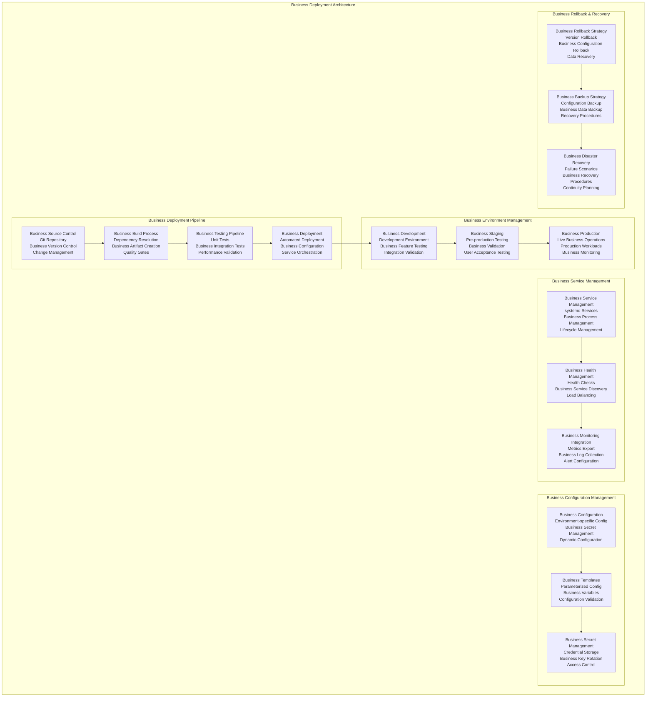

### 7.2 Business Operational Procedures

The operational procedures define comprehensive management processes for the Line of Business AI inference platform, ensuring consistent, reliable, and efficient operations that meet business requirements and maintain operational excellence standards.

**Daily Business Operations:**
The daily operational procedures ensure consistent system performance and business continuity through systematic monitoring, maintenance, and optimization activities. Morning startup procedures include comprehensive system health checks, AI model validation, external service connectivity verification, and business performance baseline establishment. The operations team performs regular monitoring of business KPIs, system performance metrics, user activity patterns, and resource utilization trends throughout the business day.

Midday operational activities include performance optimization reviews, capacity utilization analysis, business workflow monitoring, and proactive issue identification and resolution. The team conducts regular business user support activities, system performance tuning, cache optimization procedures, and integration health verification to ensure optimal business operations.

Evening operational procedures include comprehensive system backup operations, performance analytics review, business intelligence report generation, and preparation for overnight maintenance activities. The team performs end-of-day business data archival, system optimization procedures, and preparation for the following business day operations.

**Weekly Business Maintenance:**
Weekly maintenance procedures ensure long-term system reliability, performance optimization, and business continuity through systematic maintenance activities and strategic planning. Weekly activities include comprehensive system performance analysis, business intelligence trend analysis, capacity planning reviews, and strategic optimization planning.

The maintenance team conducts regular software updates and security patches, system configuration optimization, business workflow analysis and improvement, and comprehensive system health assessment. Weekly procedures also include business user feedback analysis, system performance benchmarking, integration health assessment, and strategic planning for business enhancements.

**Monthly Business Optimization:**
Monthly optimization procedures focus on strategic improvements, capacity planning, and long-term business value enhancement through comprehensive analysis and systematic optimization activities. Monthly activities include detailed business performance analysis, strategic capacity planning, cost optimization analysis, and business value assessment.

The optimization team conducts comprehensive system architecture review, business workflow optimization analysis, integration enhancement planning, and strategic technology assessment. Monthly procedures also include business intelligence trend analysis, competitive performance benchmarking, strategic planning for business enhancements, and long-term roadmap development.

### 7.3 Business Monitoring and Alerting

The monitoring and alerting architecture implements comprehensive observability capabilities specifically designed for Line of Business operations, ensuring complete visibility into system performance, business operations, and strategic metrics that support business decision-making and operational excellence.

```mermaid
graph TD
    subgraph "Business Monitoring & Alerting Architecture"
        subgraph "Business Performance Monitoring"
            BIZPERF_MON[Business Performance Monitor<br/>KPI Tracking<br/>Business Metrics<br/>SLA Monitoring]
            BIZUSER_MON[Business User Monitor<br/>User Activity<br/>Business Engagement<br/>Usage Analytics]
            BIZWORKFLOW_MON[Business Workflow Monitor<br/>Process Tracking<br/>Business Efficiency<br/>Workflow Analytics]
            BIZRESOURCE_MON[Business Resource Monitor<br/>Resource Utilization<br/>Business Capacity<br/>Performance Optimization]
        end
        
        subgraph "Business Intelligence Monitoring"
            BIZINTEL_MON[Business Intelligence Monitor<br/>BI Metrics<br/>Business Insights<br/>Strategic Analytics]
            BIZVALUE_MON[Business Value Monitor<br/>Value Metrics<br/>Business ROI<br/>Economic Performance]
            BIZQUALITY_MON[Business Quality Monitor<br/>Quality Metrics<br/>Business Standards<br/>Excellence Tracking]
            BIZCOMPLIANCE_MON[Business Compliance Monitor<br/>Compliance Metrics<br/>Business Governance<br/>Regulatory Tracking]
        end
        
        subgraph "Business Alerting System"
            BIZALERT_SYS[Business Alert System<br/>Alert Management<br/>Business Notifications<br/>Incident Response]
            BIZESCALATION[Business Escalation<br/>Escalation Procedures<br/>Business Hierarchy<br/>Response Management]
            BIZNOTIFICATION[Business Notification<br/>Notification Delivery<br/>Business Communication<br/>Stakeholder Updates]
            BIZRESPONSE[Business Response<br/>Response Coordination<br/>Business Actions<br/>Resolution Management]
        end
        
        subgraph "Business Dashboard System"
            BIZDASH_SYS[Business Dashboard System<br/>Executive Dashboards<br/>Business Visualization<br/>Strategic Insights]
            BIZEXEC_DASH[Business Executive Dashboard<br/>Executive Metrics<br/>Business Overview<br/>Strategic Performance]
            BIZOPER_DASH[Business Operations Dashboard<br/>Operational Metrics<br/>Business Operations<br/>Performance Tracking]
            BIZTECH_DASH[Business Technical Dashboard<br/>Technical Metrics<br/>Business Infrastructure<br/>System Performance]
        end
        
        subgraph "Business Analytics Platform"
            BIZANALYTICS_PLAT[Business Analytics Platform<br/>Analytics Engine<br/>Business Intelligence<br/>Data Analysis]
            BIZREPORT_PLAT[Business Reporting Platform<br/>Report Generation<br/>Business Reports<br/>Executive Reporting]
            BIZPREDICT_PLAT[Business Prediction Platform<br/>Predictive Analytics<br/>Business Forecasting<br/>Trend Analysis]
            BIZOPTIMIZE_PLAT[Business Optimization Platform<br/>Optimization Engine<br/>Business Efficiency<br/>Performance Enhancement]
        end
    end
    
    %% Business Monitoring Flow
    BIZPERF_MON --> BIZINTEL_MON
    BIZUSER_MON --> BIZINTEL_MON
    BIZWORKFLOW_MON --> BIZINTEL_MON
    BIZRESOURCE_MON --> BIZINTEL_MON
    
    BIZINTEL_MON --> BIZVALUE_MON
    BIZVALUE_MON --> BIZQUALITY_MON
    BIZQUALITY_MON --> BIZCOMPLIANCE_MON
    
    BIZCOMPLIANCE_MON --> BIZALERT_SYS
    BIZALERT_SYS --> BIZESCALATION
    BIZESCALATION --> BIZNOTIFICATION
    BIZNOTIFICATION --> BIZRESPONSE
    
    BIZRESPONSE --> BIZDASH_SYS
    BIZDASH_SYS --> BIZEXEC_DASH
    BIZEXEC_DASH --> BIZOPER_DASH
    BIZOPER_DASH --> BIZTECH_DASH
    
    BIZTECH_DASH --> BIZANALYTICS_PLAT
    BIZANALYTICS_PLAT --> BIZREPORT_PLAT
    BIZREPORT_PLAT --> BIZPREDICT_PLAT
    BIZPREDICT_PLAT --> BIZOPTIMIZE_PLAT
    
    %% Feedback Loops
    BIZOPTIMIZE_PLAT --> BIZPERF_MON
    BIZPREDICT_PLAT --> BIZUSER_MON
    BIZREPORT_PLAT --> BIZWORKFLOW_MON
    BIZANALYTICS_PLAT --> BIZRESOURCE_MON
```

---

## 8. Business Integration Patterns

### 8.1 Line of Business Application Integration

The Line of Business application integration patterns implement sophisticated connectivity and data exchange capabilities that enable seamless integration with existing business applications, enterprise systems, and operational workflows while maintaining data integrity, security, and performance standards.

**Enterprise Resource Planning (ERP) Integration:**
The ERP integration pattern provides comprehensive connectivity with enterprise resource planning systems, enabling AI-powered automation of business processes, intelligent data analysis, and automated decision support for financial, operational, and strategic business functions. The integration supports real-time data exchange, automated workflow triggers, and intelligent business process optimization.

**Customer Relationship Management (CRM) Integration:**
The CRM integration pattern enables sophisticated customer intelligence, automated customer service, and intelligent sales support through AI-powered analysis of customer data, interaction patterns, and business relationships. The integration provides real-time customer insights, automated response generation, and intelligent recommendation systems for enhanced customer engagement.

**Business Intelligence (BI) Integration:**
The BI integration pattern implements advanced analytics capabilities that leverage AI models for sophisticated business analysis, predictive analytics, and strategic intelligence generation. The integration provides automated report generation, intelligent data analysis, and strategic insight development for executive decision-making and business planning.

**Document Management System Integration:**
The document management integration pattern enables intelligent document processing, automated content analysis, and sophisticated knowledge management capabilities that leverage AI models for document understanding, classification, and intelligent content generation for business operations.

### 8.2 External Service Integration Architecture

The external service integration architecture implements robust, reliable, and high-performance connectivity patterns with all external infrastructure services, ensuring seamless data flow, consistent performance, and comprehensive operational integration for Line of Business operations.

```mermaid
graph TD
    subgraph "External Service Integration Architecture"
        subgraph "SQL Database Integration (192.168.10.35)"
            SQLBIZ_INT[Business SQL Integration<br/>PostgreSQL Connection<br/>Business Data Management<br/>Transaction Processing]
            SQLPOOL_INT[Business Connection Pool<br/>Pgpool-II Integration<br/>Business Load Balancing<br/>Performance Optimization]
            SQLCACHE_INT[Business SQL Cache<br/>Query Optimization<br/>Business Performance<br/>Response Acceleration]
            SQLTRANS_INT[Business Transaction<br/>ACID Compliance<br/>Business Consistency<br/>Data Integrity]
        end
        
        subgraph "Vector Database Integration (192.168.10.30)"
            VDBBIZ_INT[Business Vector Integration<br/>Qdrant Connection<br/>Business Knowledge<br/>Semantic Search]
            VDBMULTI_INT[Business Multi-Protocol<br/>REST/GraphQL/gRPC<br/>Business Flexibility<br/>Integration Options]
            VDBEMBED_INT[Business Embeddings<br/>Vector Operations<br/>Business Intelligence<br/>Knowledge Management]
            VDBSEARCH_INT[Business Search<br/>Semantic Search<br/>Business Discovery<br/>Knowledge Access]
        end
        
        subgraph "Metrics Server Integration (192.168.10.37)"
            METBIZ_INT[Business Metrics Integration<br/>Prometheus Connection<br/>Business Analytics<br/>Performance Monitoring]
            METDASH_INT[Business Dashboard Integration<br/>Grafana Connection<br/>Business Visualization<br/>Executive Reporting]
            METALERT_INT[Business Alert Integration<br/>Alertmanager Connection<br/>Business Notifications<br/>Incident Management]
            METHEALTH_INT[Business Health Integration<br/>Health Monitoring<br/>Business Status<br/>System Availability]
        end
        
        subgraph "Web Server Integration (192.168.10.38)"
            WEBBIZ_INT[Business Web Integration<br/>OpenUI Connection<br/>Business Interface<br/>User Experience]
            WEBAPI_INT[Business API Integration<br/>RESTful Connection<br/>Business Services<br/>Application Integration]
            WEBWS_INT[Business WebSocket<br/>Real-time Connection<br/>Business Updates<br/>Live Monitoring]
            WEBAUTH_INT[Business Auth Integration<br/>Authentication Sync<br/>Business Security<br/>Access Control]
        end
        
        subgraph "Integration Management"
            INTMGMT[Integration Management<br/>Connection Orchestration<br/>Business Coordination<br/>Service Management]
            INTMONITOR[Integration Monitoring<br/>Connection Health<br/>Business Performance<br/>Service Analytics]
            INTERROR[Integration Error Handling<br/>Failure Management<br/>Business Continuity<br/>Recovery Procedures]
            INTOPTIMIZE[Integration Optimization<br/>Performance Tuning<br/>Business Efficiency<br/>Resource Management]
        end
    end
    
    %% Integration Flow
    SQLBIZ_INT --> INTMGMT
    SQLPOOL_INT --> INTMONITOR
    SQLCACHE_INT --> INTERROR
    SQLTRANS_INT --> INTOPTIMIZE
    
    VDBBIZ_INT --> INTMGMT
    VDBMULTI_INT --> INTMONITOR
    VDBEMBED_INT --> INTERROR
    VDBSEARCH_INT --> INTOPTIMIZE
    
    METBIZ_INT --> INTMGMT
    METDASH_INT --> INTMONITOR
    METALERT_INT --> INTERROR
    METHEALTH_INT --> INTOPTIMIZE
    
    WEBBIZ_INT --> INTMGMT
    WEBAPI_INT --> INTMONITOR
    WEBWS_INT --> INTERROR
    WEBAUTH_INT --> INTOPTIMIZE
```

---

## 9. Conclusion

### 9.1 Architecture Summary

The HX-Enterprise-LLM-Server-02 architecture represents a comprehensive, business-focused AI inference platform specifically designed to support Line of Business operations within the Citadel AI Operating System ecosystem. This architecture successfully balances advanced AI capabilities with business requirements, operational efficiency, and strategic value creation through its sophisticated multi-layered design and proven integration patterns.

The architecture leverages the operational success of existing infrastructure components while introducing specialized capabilities for business operations, including advanced reasoning, code generation, high-volume processing, and strategic research capabilities. The system is designed with a focus on business continuity, operational excellence, and strategic value creation, enabling organizations to leverage advanced AI capabilities for critical business functions while maintaining reliability, security, and performance standards.

The comprehensive monitoring and observability framework ensures complete visibility into all aspects of business operations, enabling proactive management, continuous optimization, and strategic decision support. The scalable design ensures that the system can accommodate future business growth, additional capabilities, and evolving requirements without requiring fundamental architectural changes.

### 9.2 Key Architectural Strengths

The architecture demonstrates several key strengths that position it for long-term success in supporting Line of Business operations. First, the **business-centric design approach** ensures that all technical decisions are aligned with business objectives, operational requirements, and strategic value creation. This design facilitates business adoption, operational efficiency, and strategic value realization while ensuring system reliability and performance.

Second, the **comprehensive integration framework** provides seamless connectivity with all external services and business applications, enabling sophisticated business workflows, intelligent automation, and strategic intelligence capabilities. The integration patterns leverage proven architectural approaches while incorporating business-specific optimizations and requirements.

Third, the **advanced AI model architecture** provides specialized capabilities for different business functions, including complex reasoning, code generation, high-volume processing, and strategic research. Each model is optimized for specific business use cases while maintaining consistent quality, reliability, and performance standards.

Fourth, the **comprehensive operational framework** ensures reliable, efficient, and cost-effective operations through systematic procedures, automated management, and continuous optimization. The operational framework supports business continuity, performance excellence, and strategic value creation while minimizing operational overhead and complexity.

### 9.3 Implementation Readiness

This architecture document provides comprehensive technical specifications for implementing the HX-Enterprise-LLM-Server-02 with complete confidence in its design, business alignment, and operational approach. The architecture is built upon proven patterns, incorporates industry best practices, and addresses all aspects of system design from performance and scalability to security and business value creation.

The detailed component specifications, integration patterns, and operational procedures provide clear guidance for implementation teams, ensuring consistent and successful deployment that meets business requirements and operational standards. The comprehensive monitoring and quality assurance frameworks ensure that the implemented system will meet all performance, reliability, and business value requirements while providing the foundation for future growth and enhancement.

The business-focused design approach ensures that the system will deliver immediate value to Line of Business operations while providing the flexibility and scalability needed to support evolving business requirements and strategic objectives. The architecture positions the organization for success in leveraging advanced AI capabilities for critical business functions while maintaining operational excellence and strategic value creation.

### 9.4 Strategic Business Value

The HX-Enterprise-LLM-Server-02 architecture delivers significant strategic business value through its comprehensive design and business-focused implementation approach. The system provides essential AI capabilities that enable innovative business operations, strategic decision support, and operational excellence while maintaining seamless integration with existing business systems and processes.

The architecture positions the organization for success in the rapidly evolving business landscape by providing a robust, reliable, and high-performance platform for AI-powered business operations. The comprehensive operational framework ensures that the system can be managed efficiently and effectively, minimizing operational overhead while maximizing business value and strategic impact.

The business-centric design approach ensures that the investment in this architecture will continue to deliver value as business requirements evolve and new opportunities emerge. The system serves as a cornerstone for advanced business operations, enabling the organization to achieve its strategic objectives in business automation, intelligence, and operational excellence while maintaining competitive advantage and market leadership.

This architecture represents a significant advancement in business AI capabilities, providing the foundation for transformative business operations, strategic intelligence, and operational excellence that will drive long-term business success and competitive advantage in the evolving business landscape.

