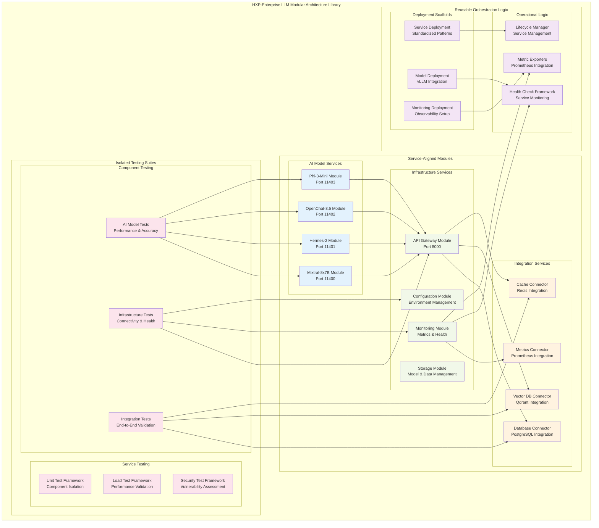

# HXP-Enterprise LLM Server - Modular Architecture Library

**Library Name:** `hxp-enterprise-llm-modular`  
**Version:** 3.0.0 (Architecture-Driven Design)  
**Date:** 2025-01-18  
**Author:** Manus AI  
**Project:** Citadel AI Operating System - HXP-Enterprise LLM Server  
**Server:** hx-llm-server-01 (192.168.10.29)  
**Design Paradigm:** Service-Aligned Modular Architecture  

---

## 🏗️ **ARCHITECTURE-DRIVEN DESIGN PARADIGM**

This modular architecture library adopts a structured, service-aligned approach that organizes configuration, shared code, and testing artifacts in direct alignment with the system architecture and task decomposition. The design emphasizes scalability, separation of concerns, and clear traceability to architectural components and tasks.

### **Core Design Principles:**

#### **1. Service-Aligned Modularity**
- Each module corresponds directly to architectural components
- Independent configuration schemas and APIs per service
- Clear service boundaries with well-defined interfaces
- Modular deployment and scaling capabilities

#### **2. Isolated Testing Architecture**
- Dedicated testing suites for each infrastructure component
- Model-serving component specific test frameworks
- Integration testing with external service mocking
- Performance testing aligned with architectural requirements

#### **3. Reusable Orchestration Logic**
- Standardized deployment scaffolds across services
- Unified health check and monitoring frameworks
- Centralized metric exporters and observability
- Common operational patterns and utilities

#### **4. Architectural Traceability**
- Direct mapping between modules and architecture components
- Task-aligned code organization and structure
- Clear dependency management and service relationships
- Comprehensive documentation linking code to architecture

---

## 📊 **MODULAR ARCHITECTURE OVERVIEW**



---

## 📦 **SERVICE-ALIGNED MODULE STRUCTURE**

```
hxp_enterprise_llm/
├── __init__.py
├── services/                           # Service-Aligned Modules
│   ├── __init__.py
│   ├── ai_models/                      # AI Model Services
│   │   ├── __init__.py
│   │   ├── mixtral/                    # Mixtral-8x7B Service Module
│   │   │   ├── __init__.py
│   │   │   ├── service.py              # Service implementation
│   │   │   ├── config.py               # Model-specific configuration
│   │   │   ├── api.py                  # Model API endpoints
│   │   │   ├── health.py               # Health monitoring
│   │   │   ├── metrics.py              # Performance metrics
│   │   │   └── schemas/                # Request/response schemas
│   │   │       ├── __init__.py
│   │   │       ├── requests.py
│   │   │       └── responses.py
│   │   ├── hermes/                     # Hermes-2 Service Module
│   │   │   ├── __init__.py
│   │   │   ├── service.py
│   │   │   ├── config.py
│   │   │   ├── api.py
│   │   │   ├── health.py
│   │   │   ├── metrics.py
│   │   │   └── schemas/
│   │   │       ├── __init__.py
│   │   │       ├── requests.py
│   │   │       └── responses.py
│   │   ├── openchat/                   # OpenChat-3.5 Service Module
│   │   │   ├── __init__.py
│   │   │   ├── service.py
│   │   │   ├── config.py
│   │   │   ├── api.py
│   │   │   ├── health.py
│   │   │   ├── metrics.py
│   │   │   └── schemas/
│   │   │       ├── __init__.py
│   │   │       ├── requests.py
│   │   │       └── responses.py
│   │   └── phi3/                       # Phi-3-Mini Service Module
│   │       ├── __init__.py
│   │       ├── service.py
│   │       ├── config.py
│   │       ├── api.py
│   │       ├── health.py
│   │       ├── metrics.py
│   │       └── schemas/
│   │           ├── __init__.py
│   │           ├── requests.py
│   │           └── responses.py
│   ├── infrastructure/                 # Infrastructure Services
│   │   ├── __init__.py
│   │   ├── api_gateway/                # API Gateway Service Module
│   │   │   ├── __init__.py
│   │   │   ├── gateway.py              # Unified API gateway
│   │   │   ├── routing.py              # Request routing logic
│   │   │   ├── middleware.py           # Authentication & validation
│   │   │   ├── load_balancer.py        # Load balancing algorithms
│   │   │   ├── circuit_breaker.py      # Circuit breaker patterns
│   │   │   ├── rate_limiter.py         # Rate limiting implementation
│   │   │   ├── config.py               # Gateway configuration
│   │   │   └── schemas/                # API schemas
│   │   │       ├── __init__.py
│   │   │       ├── rest.py             # REST API schemas
│   │   │       ├── graphql.py          # GraphQL schemas
│   │   │       └── grpc.py             # gRPC schemas
│   │   ├── monitoring/                 # Monitoring Service Module
│   │   │   ├── __init__.py
│   │   │   ├── collector.py            # Metrics collection
│   │   │   ├── exporter.py             # Prometheus exporter
│   │   │   ├── alerting.py             # Alert management
│   │   │   ├── dashboards.py           # Grafana dashboards
│   │   │   ├── health_monitor.py       # Health monitoring
│   │   │   ├── config.py               # Monitoring configuration
│   │   │   └── schemas/                # Monitoring schemas
│   │   │       ├── __init__.py
│   │   │       ├── metrics.py
│   │   │       └── alerts.py
│   │   ├── configuration/              # Configuration Service Module
│   │   │   ├── __init__.py
│   │   │   ├── manager.py              # Configuration management
│   │   │   ├── validator.py            # Configuration validation
│   │   │   ├── loader.py               # Multi-source loading
│   │   │   ├── environment.py          # Environment handling
│   │   │   ├── secrets.py              # Secret management
│   │   │   └── schemas/                # Configuration schemas
│   │   │       ├── __init__.py
│   │   │       ├── service_config.py
│   │   │       └── deployment_config.py
│   │   └── storage/                    # Storage Service Module
│   │       ├── __init__.py
│   │       ├── model_storage.py        # AI model file management
│   │       ├── data_storage.py         # Application data storage
│   │       ├── cache_storage.py        # Caching layer
│   │       ├── backup_storage.py       # Backup management
│   │       ├── config.py               # Storage configuration
│   │       └── schemas/                # Storage schemas
│   │           ├── __init__.py
│   │           ├── model_metadata.py
│   │           └── storage_config.py
│   └── integration/                    # Integration Services
│       ├── __init__.py
│       ├── database/                   # Database Integration Module
│       │   ├── __init__.py
│       │   ├── postgresql.py           # PostgreSQL connector
│       │   ├── connection_pool.py      # Connection pooling
│       │   ├── query_builder.py        # Query construction
│       │   ├── transaction_manager.py  # Transaction handling
│       │   ├── config.py               # Database configuration
│       │   └── schemas/                # Database schemas
│       │       ├── __init__.py
│       │       ├── models.py
│       │       └── queries.py
│       ├── vector_database/            # Vector Database Integration Module
│       │   ├── __init__.py
│       │   ├── qdrant_client.py        # Qdrant connector
│       │   ├── vector_operations.py    # Vector operations
│       │   ├── similarity_search.py    # Search algorithms
│       │   ├── batch_processor.py      # Batch operations
│       │   ├── config.py               # Vector DB configuration
│       │   └── schemas/                # Vector schemas
│       │       ├── __init__.py
│       │       ├── vectors.py
│       │       └── collections.py
│       ├── cache/                      # Cache Integration Module
│       │   ├── __init__.py
│       │   ├── redis_client.py         # Redis connector
│       │   ├── cache_manager.py        # Cache operations
│       │   ├── session_manager.py      # Session handling
│       │   ├── pub_sub.py              # Pub/Sub messaging
│       │   ├── config.py               # Cache configuration
│       │   └── schemas/                # Cache schemas
│       │       ├── __init__.py
│       │       ├── cache_keys.py
│       │       └── session_data.py
│       └── metrics/                    # Metrics Integration Module
│           ├── __init__.py
│           ├── prometheus_client.py    # Prometheus connector
│           ├── grafana_client.py       # Grafana connector
│           ├── alertmanager_client.py  # Alertmanager connector
│           ├── metric_aggregator.py    # Metric aggregation
│           ├── config.py               # Metrics configuration
│           └── schemas/                # Metrics schemas
│               ├── __init__.py
│               ├── metric_definitions.py
│               └── dashboard_config.py
├── testing/                            # Isolated Testing Suites
│   ├── __init__.py
│   ├── component/                      # Component Testing
│   │   ├── __init__.py
│   │   ├── ai_model_tests/             # AI Model Component Tests
│   │   │   ├── __init__.py
│   │   │   ├── test_mixtral.py         # Mixtral-specific tests
│   │   │   ├── test_hermes.py          # Hermes-specific tests
│   │   │   ├── test_openchat.py        # OpenChat-specific tests
│   │   │   ├── test_phi3.py            # Phi-3-specific tests
│   │   │   ├── performance_tests.py    # Performance validation
│   │   │   ├── accuracy_tests.py       # Accuracy validation
│   │   │   └── fixtures/               # Test fixtures
│   │   │       ├── __init__.py
│   │   │       ├── model_responses.py
│   │   │       └── test_data.py
│   │   ├── infrastructure_tests/       # Infrastructure Component Tests
│   │   │   ├── __init__.py
│   │   │   ├── test_api_gateway.py     # API Gateway tests
│   │   │   ├── test_monitoring.py      # Monitoring tests
│   │   │   ├── test_configuration.py   # Configuration tests
│   │   │   ├── test_storage.py         # Storage tests
│   │   │   ├── connectivity_tests.py   # Connectivity validation
│   │   │   ├── health_tests.py         # Health check validation
│   │   │   └── fixtures/               # Test fixtures
│   │   │       ├── __init__.py
│   │   │       ├── mock_services.py
│   │   │       └── test_configs.py
│   │   └── integration_tests/          # Integration Component Tests
│   │       ├── __init__.py
│   │       ├── test_database_integration.py    # Database integration
│   │       ├── test_vector_db_integration.py   # Vector DB integration
│   │       ├── test_cache_integration.py       # Cache integration
│   │       ├── test_metrics_integration.py     # Metrics integration
│   │       ├── end_to_end_tests.py             # E2E validation
│   │       ├── cross_service_tests.py          # Cross-service validation
│   │       └── fixtures/                       # Test fixtures
│   │           ├── __init__.py
│   │           ├── integration_data.py
│   │           └── mock_external_services.py
│   ├── service/                        # Service Testing
│   │   ├── __init__.py
│   │   ├── unit/                       # Unit Test Framework
│   │   │   ├── __init__.py
│   │   │   ├── test_framework.py       # Unit testing framework
│   │   │   ├── mock_factory.py         # Mock object factory
│   │   │   ├── assertion_helpers.py    # Custom assertions
│   │   │   ├── test_runners.py         # Test execution
│   │   │   └── fixtures/               # Unit test fixtures
│   │   │       ├── __init__.py
│   │   │       ├── service_mocks.py
│   │   │       └── data_fixtures.py
│   │   ├── load/                       # Load Test Framework
│   │   │   ├── __init__.py
│   │   │   ├── load_test_framework.py  # Load testing framework
│   │   │   ├── scenario_builder.py     # Test scenario construction
│   │   │   ├── metrics_collector.py    # Load test metrics
│   │   │   ├── report_generator.py     # Performance reports
│   │   │   └── scenarios/              # Load test scenarios
│   │   │       ├── __init__.py
│   │   │       ├── ai_model_scenarios.py
│   │   │       ├── api_gateway_scenarios.py
│   │   │       └── integration_scenarios.py
│   │   └── security/                   # Security Test Framework
│   │       ├── __init__.py
│   │       ├── security_test_framework.py      # Security testing framework
│   │       ├── vulnerability_scanner.py        # Vulnerability assessment
│   │       ├── penetration_tests.py            # Penetration testing
│   │       ├── compliance_checker.py           # Compliance validation
│   │       └── security_scenarios/             # Security test scenarios
│   │           ├── __init__.py
│   │           ├── authentication_tests.py
│   │           ├── authorization_tests.py
│   │           └── data_protection_tests.py
│   └── utilities/                      # Testing Utilities
│       ├── __init__.py
│       ├── test_data_generator.py      # Test data generation
│       ├── mock_service_factory.py     # Mock service creation
│       ├── assertion_library.py        # Custom assertion library
│       ├── test_environment_manager.py # Test environment management
│       └── reporting/                  # Test reporting
│           ├── __init__.py
│           ├── test_reporter.py        # Test result reporting
│           ├── coverage_analyzer.py    # Code coverage analysis
│           └── performance_analyzer.py # Performance analysis
├── orchestration/                      # Reusable Orchestration Logic
│   ├── __init__.py
│   ├── deployment/                     # Deployment Scaffolds
│   │   ├── __init__.py
│   │   ├── service_scaffold/           # Service Deployment Scaffold
│   │   │   ├── __init__.py
│   │   │   ├── service_deployer.py     # Service deployment logic
│   │   │   ├── dependency_manager.py   # Dependency resolution
│   │   │   ├── configuration_injector.py # Configuration injection
│   │   │   ├── health_validator.py     # Deployment validation
│   │   │   └── templates/              # Deployment templates
│   │   │       ├── __init__.py
│   │   │       ├── systemd_service.j2
│   │   │       ├── docker_compose.j2
│   │   │       └── kubernetes.j2
│   │   ├── model_scaffold/             # Model Deployment Scaffold
│   │   │   ├── __init__.py
│   │   │   ├── model_deployer.py       # AI model deployment
│   │   │   ├── vllm_configurator.py    # vLLM configuration
│   │   │   ├── resource_allocator.py   # Resource allocation
│   │   │   ├── performance_tuner.py    # Performance optimization
│   │   │   └── templates/              # Model templates
│   │   │       ├── __init__.py
│   │   │       ├── vllm_config.j2
│   │   │       ├── model_service.j2
│   │   │       └── resource_limits.j2
│   │   └── monitoring_scaffold/        # Monitoring Deployment Scaffold
│   │       ├── __init__.py
│   │       ├── monitoring_deployer.py  # Monitoring deployment
│   │       ├── prometheus_configurator.py # Prometheus setup
│   │       ├── grafana_configurator.py # Grafana setup
│   │       ├── alerting_configurator.py # Alerting setup
│   │       └── templates/              # Monitoring templates
│   │           ├── __init__.py
│   │           ├── prometheus_config.j2
│   │           ├── grafana_dashboard.j2
│   │           └── alert_rules.j2
│   ├── operational/                    # Operational Logic
│   │   ├── __init__.py
│   │   ├── health_checks/              # Health Check Framework
│   │   │   ├── __init__.py
│   │   │   ├── health_check_framework.py # Health monitoring framework
│   │   │   ├── service_health_checker.py # Service health validation
│   │   │   ├── dependency_health_checker.py # Dependency validation
│   │   │   ├── composite_health_checker.py # Composite health checks
│   │   │   └── checks/                 # Specific health checks
│   │   │       ├── __init__.py
│   │   │       ├── ai_model_health.py
│   │   │       ├── database_health.py
│   │   │       ├── cache_health.py
│   │   │       └── network_health.py
│   │   ├── metric_exporters/           # Metric Exporters
│   │   │   ├── __init__.py
│   │   │   ├── metric_exporter_framework.py # Metrics export framework
│   │   │   ├── prometheus_exporter.py  # Prometheus metrics export
│   │   │   ├── custom_metric_exporter.py # Custom metrics export
│   │   │   ├── business_metric_exporter.py # Business metrics export
│   │   │   └── exporters/              # Specific exporters
│   │   │       ├── __init__.py
│   │   │       ├── ai_model_metrics.py
│   │   │       ├── api_gateway_metrics.py
│   │   │       ├── infrastructure_metrics.py
│   │   │       └── business_metrics.py
│   │   └── lifecycle/                  # Lifecycle Manager
│   │       ├── __init__.py
│   │       ├── lifecycle_manager.py    # Service lifecycle management
│   │       ├── startup_orchestrator.py # Service startup coordination
│   │       ├── shutdown_orchestrator.py # Service shutdown coordination
│   │       ├── dependency_resolver.py  # Service dependency resolution
│   │       └── managers/               # Specific lifecycle managers
│   │           ├── __init__.py
│   │           ├── ai_model_lifecycle.py
│   │           ├── infrastructure_lifecycle.py
│   │           └── integration_lifecycle.py
│   └── utilities/                      # Orchestration Utilities
│       ├── __init__.py
│       ├── template_engine.py          # Template processing
│       ├── configuration_merger.py     # Configuration merging
│       ├── resource_calculator.py      # Resource calculation
│       ├── validation_framework.py     # Validation utilities
│       └── deployment_helpers.py       # Deployment helper functions
└── schemas/                            # Global Schemas
    ├── __init__.py
    ├── common/                         # Common Schemas
    │   ├── __init__.py
    │   ├── base_models.py              # Base Pydantic models
    │   ├── error_models.py             # Error response models
    │   ├── health_models.py            # Health check models
    │   └── metric_models.py            # Metrics models
    ├── api/                            # API Schemas
    │   ├── __init__.py
    │   ├── request_models.py           # API request models
    │   ├── response_models.py          # API response models
    │   ├── authentication_models.py    # Authentication models
    │   └── validation_models.py        # Validation models
    └── configuration/                  # Configuration Schemas
        ├── __init__.py
        ├── service_schemas.py          # Service configuration schemas
        ├── deployment_schemas.py       # Deployment configuration schemas
        ├── monitoring_schemas.py       # Monitoring configuration schemas
        └── integration_schemas.py      # Integration configuration schemas
```

---

## 🎯 **SERVICE-ALIGNED MODULE IMPLEMENTATION**

### **1. AI Model Service Module (Mixtral Example)**

```python
# hxp_enterprise_llm/services/ai_models/mixtral/service.py
from typing import Dict, Any, List, Optional
import asyncio
import time
from vllm import AsyncLLMEngine, AsyncEngineArgs
from vllm.sampling_params import SamplingParams
from ..base import BaseAIModelService
from .config import MixtralConfig
from .metrics import MixtralMetrics
from .health import MixtralHealthMonitor
from ....schemas.common.base_models import ServiceResponse, ErrorResponse

class MixtralService(BaseAIModelService):
    """
    Mixtral-8x7B AI Model Service Module.
    
    Provides high-performance inference for the Mixtral-8x7B model with
    optimized resource allocation and comprehensive monitoring.
    """
    
    def __init__(self, config: MixtralConfig):
        super().__init__(config)
        self.config = config
        self.metrics = MixtralMetrics()
        self.health_monitor = MixtralHealthMonitor(config)
        self.engine: Optional[AsyncLLMEngine] = None
        self.service_name = "mixtral-8x7b"
        self.port = 11400
        
        # Model-specific configuration
        self.model_path = config.model_path
        self.max_model_len = config.max_model_len or 32768
        self.tensor_parallel_size = config.tensor_parallel_size or 1
        self.gpu_memory_utilization = config.gpu_memory_utilization or 0.9
        
        # Performance targets
        self.target_latency_ms = 2000
        self.target_throughput_rps = 50
        self.memory_limit_gb = 90
        self.cpu_cores = 8
    
    async def initialize(self) -> ServiceResponse:
        """Initialize the Mixtral service with vLLM engine."""
        try:
            start_time = time.time()
            
            # Configure vLLM engine arguments
            engine_args = AsyncEngineArgs(
                model=self.model_path,
                max_model_len=self.max_model_len,
                tensor_parallel_size=self.tensor_parallel_size,
                gpu_memory_utilization=self.gpu_memory_utilization,
                trust_remote_code=True,
                enforce_eager=False,
                max_num_batched_tokens=8192,
                max_num_seqs=256,
                enable_prefix_caching=True,
                use_v2_block_manager=True
            )
            
            # Initialize async engine
            self.engine = AsyncLLMEngine.from_engine_args(engine_args)
            
            # Start health monitoring
            await self.health_monitor.start()
            
            # Record initialization metrics
            initialization_time = time.time() - start_time
            self.metrics.record_initialization(
                duration=initialization_time,
                status="success"
            )
            
            return ServiceResponse(
                status="success",
                message=f"Mixtral-8x7B service initialized successfully",
                data={
                    "service_name": self.service_name,
                    "port": self.port,
                    "model_path": self.model_path,
                    "max_model_len": self.max_model_len,
                    "initialization_time": initialization_time,
                    "memory_limit_gb": self.memory_limit_gb,
                    "cpu_cores": self.cpu_cores
                }
            )
            
        except Exception as e:
            self.metrics.record_initialization(
                duration=time.time() - start_time,
                status="error",
                error=str(e)
            )
            return ErrorResponse(
                status="error",
                message=f"Failed to initialize Mixtral service: {str(e)}",
                error_code="MIXTRAL_INIT_ERROR"
            )
    
    async def generate_completion(
        self,
        prompt: str,
        max_tokens: int = 1000,
        temperature: float = 0.7,
        top_p: float = 0.9,
        stream: bool = False
    ) -> ServiceResponse:
        """Generate text completion using Mixtral model."""
        if not self.engine:
            return ErrorResponse(
                status="error",
                message="Mixtral service not initialized",
                error_code="SERVICE_NOT_INITIALIZED"
            )
        
        start_time = time.time()
        request_id = f"mixtral_{int(time.time() * 1000)}"
        
        try:
            # Configure sampling parameters
            sampling_params = SamplingParams(
                max_tokens=max_tokens,
                temperature=temperature,
                top_p=top_p,
                use_beam_search=False,
                early_stopping=True
            )
            
            # Generate completion
            if stream:
                return await self._generate_streaming_completion(
                    prompt, sampling_params, request_id, start_time
                )
            else:
                return await self._generate_batch_completion(
                    prompt, sampling_params, request_id, start_time
                )
                
        except Exception as e:
            duration = time.time() - start_time
            self.metrics.record_completion_request(
                request_id=request_id,
                duration=duration,
                status="error",
                error=str(e)
            )
            
            return ErrorResponse(
                status="error",
                message=f"Completion generation failed: {str(e)}",
                error_code="COMPLETION_GENERATION_ERROR",
                request_id=request_id
            )
    
    async def _generate_batch_completion(
        self,
        prompt: str,
        sampling_params: SamplingParams,
        request_id: str,
        start_time: float
    ) -> ServiceResponse:
        """Generate batch completion (non-streaming)."""
        # Generate completion
        results = []
        async for request_output in self.engine.generate(
            prompt, sampling_params, request_id
        ):
            results.append(request_output)
        
        # Process final result
        final_output = results[-1]
        generated_text = final_output.outputs[0].text
        
        # Calculate metrics
        duration = time.time() - start_time
        tokens_generated = len(final_output.outputs[0].token_ids)
        tokens_per_second = tokens_generated / duration if duration > 0 else 0
        
        # Record metrics
        self.metrics.record_completion_request(
            request_id=request_id,
            duration=duration,
            tokens_generated=tokens_generated,
            tokens_per_second=tokens_per_second,
            status="success"
        )
        
        return ServiceResponse(
            status="success",
            message="Completion generated successfully",
            data={
                "request_id": request_id,
                "generated_text": generated_text,
                "tokens_generated": tokens_generated,
                "duration_ms": duration * 1000,
                "tokens_per_second": tokens_per_second,
                "model": self.service_name
            }
        )
    
    async def _generate_streaming_completion(
        self,
        prompt: str,
        sampling_params: SamplingParams,
        request_id: str,
        start_time: float
    ) -> ServiceResponse:
        """Generate streaming completion."""
        # This would implement streaming logic
        # For brevity, returning batch completion
        return await self._generate_batch_completion(
            prompt, sampling_params, request_id, start_time
        )
    
    async def get_health_status(self) -> Dict[str, Any]:
        """Get comprehensive health status."""
        return await self.health_monitor.get_comprehensive_status()
    
    async def get_metrics(self) -> Dict[str, Any]:
        """Get service metrics."""
        return self.metrics.get_all_metrics()
    
    async def shutdown(self) -> ServiceResponse:
        """Gracefully shutdown the Mixtral service."""
        try:
            if self.health_monitor:
                await self.health_monitor.stop()
            
            if self.engine:
                # Cleanup engine resources
                del self.engine
                self.engine = None
            
            return ServiceResponse(
                status="success",
                message="Mixtral service shutdown successfully"
            )
            
        except Exception as e:
            return ErrorResponse(
                status="error",
                message=f"Error during shutdown: {str(e)}",
                error_code="SHUTDOWN_ERROR"
            )
```

### **2. Configuration Service Module**

```python
# hxp_enterprise_llm/services/infrastructure/configuration/manager.py
from typing import Dict, Any, Optional, List, Union
import os
import yaml
import json
from pathlib import Path
from dataclasses import dataclass, field
from ..base import BaseInfrastructureService
from .validator import ConfigurationValidator
from .loader import ConfigurationLoader
from .environment import EnvironmentManager
from .secrets import SecretManager
from ....schemas.configuration.service_schemas import ServiceConfigSchema

@dataclass
class ConfigurationContext:
    """Configuration context for service-specific settings."""
    service_name: str
    environment: str
    deployment_type: str
    server_ip: str
    server_hostname: str
    config_sources: List[str] = field(default_factory=list)
    overrides: Dict[str, Any] = field(default_factory=dict)

class ConfigurationManager(BaseInfrastructureService):
    """
    Configuration Management Service Module.
    
    Provides centralized configuration management with multi-source loading,
    environment-specific overrides, and validation capabilities.
    """
    
    def __init__(self, context: ConfigurationContext):
        super().__init__()
        self.context = context
        self.validator = ConfigurationValidator()
        self.loader = ConfigurationLoader()
        self.env_manager = EnvironmentManager()
        self.secret_manager = SecretManager()
        
        self.config_cache: Dict[str, Any] = {}
        self.service_configs: Dict[str, ServiceConfigSchema] = {}
        
        # Configuration paths
        self.base_config_path = Path("/opt/citadel/config")
        self.service_config_path = self.base_config_path / "services"
        self.environment_config_path = self.base_config_path / "environments"
        self.secret_config_path = self.base_config_path / "secrets"
    
    async def initialize(self) -> Dict[str, Any]:
        """Initialize configuration management system."""
        try:
            # Create configuration directories
            self._ensure_config_directories()
            
            # Load base configuration
            base_config = await self._load_base_configuration()
            
            # Load environment-specific configuration
            env_config = await self._load_environment_configuration()
            
            # Load service-specific configurations
            service_configs = await self._load_service_configurations()
            
            # Merge configurations
            merged_config = self._merge_configurations(
                base_config, env_config, service_configs
            )
            
            # Apply environment variable overrides
            final_config = self._apply_environment_overrides(merged_config)
            
            # Validate final configuration
            validation_result = await self.validator.validate_configuration(
                final_config, self.context
            )
            
            if not validation_result.is_valid:
                raise ValueError(f"Configuration validation failed: {validation_result.errors}")
            
            # Cache configuration
            self.config_cache = final_config
            
            return {
                "status": "success",
                "message": "Configuration management initialized",
                "config_sources": self.context.config_sources,
                "services_configured": len(service_configs),
                "validation_status": "passed"
            }
            
        except Exception as e:
            return {
                "status": "error",
                "message": f"Configuration initialization failed: {str(e)}",
                "error_code": "CONFIG_INIT_ERROR"
            }
    
    def get_service_config(self, service_name: str) -> Optional[ServiceConfigSchema]:
        """Get configuration for a specific service."""
        return self.service_configs.get(service_name)
    
    def get_config_value(self, key_path: str, default: Any = None) -> Any:
        """Get configuration value by dot-notation key path."""
        keys = key_path.split('.')
        value = self.config_cache
        
        for key in keys:
            if isinstance(value, dict) and key in value:
                value = value[key]
            else:
                return default
        
        return value
    
    def set_config_value(self, key_path: str, value: Any) -> bool:
        """Set configuration value by dot-notation key path."""
        try:
            keys = key_path.split('.')
            config = self.config_cache
            
            # Navigate to parent key
            for key in keys[:-1]:
                if key not in config:
                    config[key] = {}
                config = config[key]
            
            # Set final value
            config[keys[-1]] = value
            return True
            
        except Exception:
            return False
    
    async def reload_configuration(self) -> Dict[str, Any]:
        """Reload configuration from all sources."""
        return await self.initialize()
    
    def _ensure_config_directories(self):
        """Ensure all configuration directories exist."""
        directories = [
            self.base_config_path,
            self.service_config_path,
            self.environment_config_path,
            self.secret_config_path
        ]
        
        for directory in directories:
            directory.mkdir(parents=True, exist_ok=True)
    
    async def _load_base_configuration(self) -> Dict[str, Any]:
        """Load base configuration settings."""
        base_config = {
            "server": {
                "ip": self.context.server_ip,
                "hostname": self.context.server_hostname,
                "environment": self.context.environment,
                "deployment_type": self.context.deployment_type
            },
            "ai_models": {
                "mixtral": {
                    "port": 11400,
                    "memory_limit_gb": 90,
                    "cpu_cores": 8,
                    "target_latency_ms": 2000,
                    "model_path": "/opt/models/mixtral-8x7b"
                },
                "hermes": {
                    "port": 11401,
                    "memory_limit_gb": 15,
                    "cpu_cores": 4,
                    "target_latency_ms": 1500,
                    "model_path": "/opt/models/hermes-2"
                },
                "openchat": {
                    "port": 11402,
                    "memory_limit_gb": 8,
                    "cpu_cores": 4,
                    "target_latency_ms": 1000,
                    "model_path": "/opt/models/openchat-3.5"
                },
                "phi3": {
                    "port": 11403,
                    "memory_limit_gb": 4,
                    "cpu_cores": 2,
                    "target_latency_ms": 500,
                    "model_path": "/opt/models/phi-3-mini"
                }
            },
            "infrastructure": {
                "api_gateway": {
                    "port": 8000,
                    "host": "0.0.0.0",
                    "workers": 4,
                    "timeout": 300
                },
                "monitoring": {
                    "prometheus_port": 9090,
                    "health_check_interval": 30,
                    "metrics_collection_interval": 15
                }
            },
            "integration": {
                "database": {
                    "host": "192.168.10.35",
                    "port": 5433,
                    "database": "citadel_ai",
                    "user": "citadel_admin",
                    "connection_pool_size": 20
                },
                "vector_database": {
                    "host": "192.168.10.30",
                    "port": 6333,
                    "grpc_port": 6334,
                    "prefer_grpc": True
                },
                "cache": {
                    "host": "192.168.10.35",
                    "port": 6379,
                    "db": 0,
                    "connection_pool_size": 10
                },
                "metrics": {
                    "prometheus_host": "192.168.10.37",
                    "prometheus_port": 9090,
                    "grafana_host": "192.168.10.37",
                    "grafana_port": 3000
                }
            }
        }
        
        self.context.config_sources.append("base_configuration")
        return base_config
    
    async def _load_environment_configuration(self) -> Dict[str, Any]:
        """Load environment-specific configuration."""
        env_config_file = self.environment_config_path / f"{self.context.environment}.yaml"
        
        if env_config_file.exists():
            with open(env_config_file, 'r') as f:
                env_config = yaml.safe_load(f)
            self.context.config_sources.append(f"environment_{self.context.environment}")
            return env_config or {}
        
        return {}
    
    async def _load_service_configurations(self) -> Dict[str, Dict[str, Any]]:
        """Load service-specific configurations."""
        service_configs = {}
        
        if self.service_config_path.exists():
            for config_file in self.service_config_path.glob("*.yaml"):
                service_name = config_file.stem
                with open(config_file, 'r') as f:
                    service_config = yaml.safe_load(f)
                service_configs[service_name] = service_config
                self.context.config_sources.append(f"service_{service_name}")
        
        return service_configs
    
    def _merge_configurations(
        self,
        base_config: Dict[str, Any],
        env_config: Dict[str, Any],
        service_configs: Dict[str, Dict[str, Any]]
    ) -> Dict[str, Any]:
        """Merge configurations with proper precedence."""
        merged = base_config.copy()
        
        # Apply environment configuration
        self._deep_merge(merged, env_config)
        
        # Apply service configurations
        for service_name, service_config in service_configs.items():
            if "services" not in merged:
                merged["services"] = {}
            merged["services"][service_name] = service_config
        
        # Apply context overrides
        self._deep_merge(merged, self.context.overrides)
        
        return merged
    
    def _apply_environment_overrides(self, config: Dict[str, Any]) -> Dict[str, Any]:
        """Apply environment variable overrides."""
        # AI Model overrides
        for model in ["mixtral", "hermes", "openchat", "phi3"]:
            model_config = config.get("ai_models", {}).get(model, {})
            
            # Port override
            env_port = os.getenv(f"{model.upper()}_PORT")
            if env_port:
                model_config["port"] = int(env_port)
            
            # Memory limit override
            env_memory = os.getenv(f"{model.upper()}_MEMORY_GB")
            if env_memory:
                model_config["memory_limit_gb"] = int(env_memory)
            
            # Model path override
            env_path = os.getenv(f"{model.upper()}_MODEL_PATH")
            if env_path:
                model_config["model_path"] = env_path
        
        # Infrastructure overrides
        api_config = config.get("infrastructure", {}).get("api_gateway", {})
        if os.getenv("API_GATEWAY_PORT"):
            api_config["port"] = int(os.getenv("API_GATEWAY_PORT"))
        
        # Integration overrides
        db_config = config.get("integration", {}).get("database", {})
        if os.getenv("DATABASE_HOST"):
            db_config["host"] = os.getenv("DATABASE_HOST")
        if os.getenv("DATABASE_PORT"):
            db_config["port"] = int(os.getenv("DATABASE_PORT"))
        
        return config
    
    def _deep_merge(self, target: Dict[str, Any], source: Dict[str, Any]):
        """Deep merge source dictionary into target dictionary."""
        for key, value in source.items():
            if key in target and isinstance(target[key], dict) and isinstance(value, dict):
                self._deep_merge(target[key], value)
            else:
                target[key] = value
```

### **3. Isolated Testing Suite (AI Model Tests)**

```python
# hxp_enterprise_llm/testing/component/ai_model_tests/test_mixtral.py
import pytest
import asyncio
import time
from typing import Dict, Any, List
from unittest.mock import Mock, AsyncMock, patch
from ....services.ai_models.mixtral.service import MixtralService
from ....services.ai_models.mixtral.config import MixtralConfig
from ....schemas.common.base_models import ServiceResponse, ErrorResponse
from ..fixtures.model_responses import MixtralTestResponses
from ..fixtures.test_data import AIModelTestData

class TestMixtralService:
    """
    Comprehensive test suite for Mixtral-8x7B AI Model Service.
    
    Tests performance, accuracy, error handling, and integration
    capabilities of the Mixtral service module.
    """
    
    @pytest.fixture
    async def mixtral_config(self):
        """Create test configuration for Mixtral service."""
        return MixtralConfig(
            model_path="/opt/models/mixtral-8x7b-test",
            max_model_len=4096,  # Reduced for testing
            tensor_parallel_size=1,
            gpu_memory_utilization=0.5,  # Reduced for testing
            port=11400,
            memory_limit_gb=10,  # Reduced for testing
            cpu_cores=2,  # Reduced for testing
            target_latency_ms=2000
        )
    
    @pytest.fixture
    async def mock_vllm_engine(self):
        """Create mock vLLM engine for testing."""
        mock_engine = AsyncMock()
        
        # Mock generate method
        async def mock_generate(prompt, sampling_params, request_id):
            # Simulate generation delay
            await asyncio.sleep(0.1)
            
            # Create mock output
            mock_output = Mock()
            mock_output.outputs = [Mock()]
            mock_output.outputs[0].text = MixtralTestResponses.get_test_response(prompt)
            mock_output.outputs[0].token_ids = list(range(100))  # Mock 100 tokens
            
            yield mock_output
        
        mock_engine.generate = mock_generate
        return mock_engine
    
    @pytest.fixture
    async def mixtral_service(self, mixtral_config, mock_vllm_engine):
        """Create Mixtral service instance with mocked dependencies."""
        service = MixtralService(mixtral_config)
        
        # Mock the engine initialization
        with patch('vllm.AsyncLLMEngine.from_engine_args', return_value=mock_vllm_engine):
            await service.initialize()
        
        return service
    
    @pytest.mark.asyncio
    async def test_service_initialization(self, mixtral_config):
        """Test successful service initialization."""
        with patch('vllm.AsyncLLMEngine.from_engine_args') as mock_engine_init:
            mock_engine_init.return_value = AsyncMock()
            
            service = MixtralService(mixtral_config)
            result = await service.initialize()
            
            assert isinstance(result, ServiceResponse)
            assert result.status == "success"
            assert result.data["service_name"] == "mixtral-8x7b"
            assert result.data["port"] == 11400
            assert "initialization_time" in result.data
    
    @pytest.mark.asyncio
    async def test_service_initialization_failure(self, mixtral_config):
        """Test service initialization failure handling."""
        with patch('vllm.AsyncLLMEngine.from_engine_args') as mock_engine_init:
            mock_engine_init.side_effect = Exception("Model loading failed")
            
            service = MixtralService(mixtral_config)
            result = await service.initialize()
            
            assert isinstance(result, ErrorResponse)
            assert result.status == "error"
            assert "Model loading failed" in result.message
            assert result.error_code == "MIXTRAL_INIT_ERROR"
    
    @pytest.mark.asyncio
    async def test_text_completion_generation(self, mixtral_service):
        """Test successful text completion generation."""
        prompt = "Explain the concept of artificial intelligence"
        
        result = await mixtral_service.generate_completion(
            prompt=prompt,
            max_tokens=500,
            temperature=0.7
        )
        
        assert isinstance(result, ServiceResponse)
        assert result.status == "success"
        assert "generated_text" in result.data
        assert "tokens_generated" in result.data
        assert "duration_ms" in result.data
        assert "tokens_per_second" in result.data
        assert result.data["model"] == "mixtral-8x7b"
    
    @pytest.mark.asyncio
    async def test_completion_performance_targets(self, mixtral_service):
        """Test that completion generation meets performance targets."""
        prompt = "Write a short story about space exploration"
        
        start_time = time.time()
        result = await mixtral_service.generate_completion(
            prompt=prompt,
            max_tokens=1000
        )
        duration_ms = (time.time() - start_time) * 1000
        
        assert isinstance(result, ServiceResponse)
        assert result.status == "success"
        
        # Check performance targets
        assert duration_ms < 2000  # Target: <2000ms
        assert result.data["tokens_per_second"] > 10  # Minimum throughput
    
    @pytest.mark.asyncio
    async def test_completion_with_invalid_parameters(self, mixtral_service):
        """Test completion generation with invalid parameters."""
        # Test with negative max_tokens
        result = await mixtral_service.generate_completion(
            prompt="Test prompt",
            max_tokens=-100
        )
        
        # Should handle gracefully (vLLM will validate)
        assert result is not None
    
    @pytest.mark.asyncio
    async def test_completion_without_initialization(self, mixtral_config):
        """Test completion generation without service initialization."""
        service = MixtralService(mixtral_config)
        # Don't initialize the service
        
        result = await service.generate_completion(
            prompt="Test prompt"
        )
        
        assert isinstance(result, ErrorResponse)
        assert result.status == "error"
        assert result.error_code == "SERVICE_NOT_INITIALIZED"
    
    @pytest.mark.asyncio
    async def test_health_status_monitoring(self, mixtral_service):
        """Test health status monitoring functionality."""
        health_status = await mixtral_service.get_health_status()
        
        assert isinstance(health_status, dict)
        assert "service_status" in health_status
        assert "memory_usage" in health_status
        assert "cpu_usage" in health_status
        assert "model_status" in health_status
        assert "last_request_time" in health_status
    
    @pytest.mark.asyncio
    async def test_metrics_collection(self, mixtral_service):
        """Test metrics collection functionality."""
        # Generate some completions to create metrics
        await mixtral_service.generate_completion("Test prompt 1")
        await mixtral_service.generate_completion("Test prompt 2")
        
        metrics = await mixtral_service.get_metrics()
        
        assert isinstance(metrics, dict)
        assert "total_requests" in metrics
        assert "average_latency" in metrics
        assert "tokens_generated" in metrics
        assert "error_rate" in metrics
        assert "throughput_rps" in metrics
    
    @pytest.mark.asyncio
    async def test_concurrent_request_handling(self, mixtral_service):
        """Test handling of concurrent completion requests."""
        prompts = [
            "Explain machine learning",
            "Describe quantum computing",
            "What is blockchain technology?",
            "How does neural network work?",
            "Define artificial intelligence"
        ]
        
        # Execute concurrent requests
        tasks = [
            mixtral_service.generate_completion(prompt, max_tokens=200)
            for prompt in prompts
        ]
        
        results = await asyncio.gather(*tasks)
        
        # Verify all requests completed successfully
        for result in results:
            assert isinstance(result, ServiceResponse)
            assert result.status == "success"
            assert "generated_text" in result.data
    
    @pytest.mark.asyncio
    async def test_memory_usage_monitoring(self, mixtral_service):
        """Test memory usage stays within limits."""
        # Generate multiple completions to test memory usage
        for i in range(10):
            await mixtral_service.generate_completion(
                f"Test prompt {i}",
                max_tokens=500
            )
        
        health_status = await mixtral_service.get_health_status()
        memory_usage_gb = health_status.get("memory_usage", {}).get("used_gb", 0)
        
        # Should stay within configured limit
        assert memory_usage_gb <= mixtral_service.memory_limit_gb
    
    @pytest.mark.asyncio
    async def test_service_shutdown(self, mixtral_service):
        """Test graceful service shutdown."""
        result = await mixtral_service.shutdown()
        
        assert isinstance(result, ServiceResponse)
        assert result.status == "success"
        assert "shutdown successfully" in result.message
    
    @pytest.mark.asyncio
    async def test_error_handling_and_recovery(self, mixtral_service):
        """Test error handling and recovery mechanisms."""
        # Mock engine failure
        with patch.object(mixtral_service.engine, 'generate') as mock_generate:
            mock_generate.side_effect = Exception("Engine failure")
            
            result = await mixtral_service.generate_completion("Test prompt")
            
            assert isinstance(result, ErrorResponse)
            assert result.status == "error"
            assert result.error_code == "COMPLETION_GENERATION_ERROR"
    
    @pytest.mark.parametrize("prompt,expected_tokens", [
        ("Short prompt", 50),
        ("Medium length prompt with more content", 100),
        ("Very long prompt with extensive content that should generate more tokens", 150)
    ])
    @pytest.mark.asyncio
    async def test_token_generation_scaling(self, mixtral_service, prompt, expected_tokens):
        """Test token generation scales with prompt complexity."""
        result = await mixtral_service.generate_completion(
            prompt=prompt,
            max_tokens=200
        )
        
        assert isinstance(result, ServiceResponse)
        assert result.status == "success"
        
        # Token count should correlate with prompt complexity
        tokens_generated = result.data["tokens_generated"]
        assert tokens_generated > 0
    
    @pytest.mark.asyncio
    async def test_configuration_validation(self, mixtral_config):
        """Test configuration validation and error handling."""
        # Test with invalid configuration
        invalid_config = MixtralConfig(
            model_path="",  # Invalid empty path
            max_model_len=-1,  # Invalid negative value
            port=0  # Invalid port
        )
        
        service = MixtralService(invalid_config)
        
        # Should handle configuration errors gracefully
        with patch('vllm.AsyncLLMEngine.from_engine_args') as mock_engine_init:
            mock_engine_init.side_effect = ValueError("Invalid configuration")
            
            result = await service.initialize()
            assert isinstance(result, ErrorResponse)

# Performance benchmark tests
class TestMixtralPerformance:
    """Performance-specific tests for Mixtral service."""
    
    @pytest.mark.asyncio
    @pytest.mark.performance
    async def test_latency_benchmark(self, mixtral_service):
        """Benchmark latency performance."""
        latencies = []
        
        for i in range(10):
            start_time = time.time()
            result = await mixtral_service.generate_completion(
                f"Performance test prompt {i}",
                max_tokens=100
            )
            latency = (time.time() - start_time) * 1000
            latencies.append(latency)
            
            assert isinstance(result, ServiceResponse)
            assert result.status == "success"
        
        avg_latency = sum(latencies) / len(latencies)
        p95_latency = sorted(latencies)[int(0.95 * len(latencies))]
        
        # Performance assertions
        assert avg_latency < 2000  # Average < 2000ms
        assert p95_latency < 3000  # P95 < 3000ms
        
        print(f"Average latency: {avg_latency:.2f}ms")
        print(f"P95 latency: {p95_latency:.2f}ms")
    
    @pytest.mark.asyncio
    @pytest.mark.performance
    async def test_throughput_benchmark(self, mixtral_service):
        """Benchmark throughput performance."""
        num_requests = 20
        start_time = time.time()
        
        # Execute concurrent requests
        tasks = [
            mixtral_service.generate_completion(
                f"Throughput test {i}",
                max_tokens=50
            )
            for i in range(num_requests)
        ]
        
        results = await asyncio.gather(*tasks)
        total_time = time.time() - start_time
        
        # Verify all requests succeeded
        successful_requests = sum(
            1 for result in results 
            if isinstance(result, ServiceResponse) and result.status == "success"
        )
        
        throughput_rps = successful_requests / total_time
        
        # Performance assertions
        assert successful_requests == num_requests
        assert throughput_rps >= 10  # Minimum 10 RPS
        
        print(f"Throughput: {throughput_rps:.2f} RPS")
        print(f"Success rate: {successful_requests/num_requests*100:.1f}%")
```

### **4. Reusable Orchestration Logic (Health Checks)**

```python
# hxp_enterprise_llm/orchestration/operational/health_checks/health_check_framework.py
from typing import Dict, Any, List, Optional, Callable, Awaitable
import asyncio
import time
from enum import Enum
from dataclasses import dataclass, field
from abc import ABC, abstractmethod
from ....schemas.common.health_models import HealthStatus, HealthCheckResult, ComponentHealth

class HealthLevel(Enum):
    """Health check severity levels."""
    CRITICAL = "critical"
    HIGH = "high"
    MEDIUM = "medium"
    LOW = "low"
    INFO = "info"

class HealthState(Enum):
    """Health check states."""
    HEALTHY = "healthy"
    DEGRADED = "degraded"
    UNHEALTHY = "unhealthy"
    UNKNOWN = "unknown"

@dataclass
class HealthCheckConfig:
    """Configuration for individual health checks."""
    name: str
    description: str
    level: HealthLevel
    timeout_seconds: float = 30.0
    retry_count: int = 3
    retry_delay_seconds: float = 1.0
    enabled: bool = True
    dependencies: List[str] = field(default_factory=list)
    metadata: Dict[str, Any] = field(default_factory=dict)

class BaseHealthCheck(ABC):
    """Base class for all health checks."""
    
    def __init__(self, config: HealthCheckConfig):
        self.config = config
        self.last_check_time: Optional[float] = None
        self.last_result: Optional[HealthCheckResult] = None
        self.consecutive_failures = 0
    
    @abstractmethod
    async def execute_check(self) -> HealthCheckResult:
        """Execute the health check logic."""
        pass
    
    async def run_check(self) -> HealthCheckResult:
        """Run health check with retry logic and error handling."""
        start_time = time.time()
        
        for attempt in range(self.config.retry_count):
            try:
                # Execute check with timeout
                result = await asyncio.wait_for(
                    self.execute_check(),
                    timeout=self.config.timeout_seconds
                )
                
                # Update success metrics
                self.consecutive_failures = 0
                self.last_check_time = time.time()
                self.last_result = result
                
                return result
                
            except asyncio.TimeoutError:
                error_msg = f"Health check '{self.config.name}' timed out after {self.config.timeout_seconds}s"
                if attempt == self.config.retry_count - 1:
                    return self._create_error_result(error_msg, start_time)
                await asyncio.sleep(self.config.retry_delay_seconds)
                
            except Exception as e:
                error_msg = f"Health check '{self.config.name}' failed: {str(e)}"
                if attempt == self.config.retry_count - 1:
                    return self._create_error_result(error_msg, start_time)
                await asyncio.sleep(self.config.retry_delay_seconds)
        
        # Should not reach here, but handle gracefully
        return self._create_error_result("Unknown error", start_time)
    
    def _create_error_result(self, error_message: str, start_time: float) -> HealthCheckResult:
        """Create error result for failed health check."""
        self.consecutive_failures += 1
        duration = time.time() - start_time
        
        return HealthCheckResult(
            name=self.config.name,
            status=HealthState.UNHEALTHY,
            message=error_message,
            level=self.config.level,
            duration_seconds=duration,
            timestamp=time.time(),
            metadata={
                "consecutive_failures": self.consecutive_failures,
                "retry_count": self.config.retry_count,
                "timeout_seconds": self.config.timeout_seconds
            }
        )

class HealthCheckFramework:
    """
    Comprehensive health check framework for HXP-Enterprise LLM Server.
    
    Provides centralized health monitoring with configurable checks,
    dependency management, and comprehensive reporting.
    """
    
    def __init__(self):
        self.health_checks: Dict[str, BaseHealthCheck] = {}
        self.check_configs: Dict[str, HealthCheckConfig] = {}
        self.dependency_graph: Dict[str, List[str]] = {}
        self.check_results: Dict[str, HealthCheckResult] = {}
        self.framework_status = HealthState.UNKNOWN
        
        # Framework configuration
        self.check_interval_seconds = 30
        self.parallel_execution = True
        self.max_concurrent_checks = 10
        self.result_retention_hours = 24
        
        # Monitoring
        self.total_checks_run = 0
        self.total_failures = 0
        self.framework_start_time = time.time()
    
    def register_health_check(
        self,
        health_check: BaseHealthCheck,
        dependencies: Optional[List[str]] = None
    ):
        """Register a health check with the framework."""
        check_name = health_check.config.name
        
        # Register the check
        self.health_checks[check_name] = health_check
        self.check_configs[check_name] = health_check.config
        
        # Register dependencies
        if dependencies:
            self.dependency_graph[check_name] = dependencies
        else:
            self.dependency_graph[check_name] = health_check.config.dependencies
    
    def unregister_health_check(self, check_name: str):
        """Unregister a health check from the framework."""
        if check_name in self.health_checks:
            del self.health_checks[check_name]
            del self.check_configs[check_name]
            del self.dependency_graph[check_name]
            
            # Remove from results
            if check_name in self.check_results:
                del self.check_results[check_name]
    
    async def run_all_checks(self) -> Dict[str, HealthCheckResult]:
        """Run all registered health checks."""
        if not self.health_checks:
            return {}
        
        # Determine execution order based on dependencies
        execution_order = self._resolve_dependency_order()
        
        if self.parallel_execution:
            return await self._run_checks_parallel(execution_order)
        else:
            return await self._run_checks_sequential(execution_order)
    
    async def run_specific_checks(self, check_names: List[str]) -> Dict[str, HealthCheckResult]:
        """Run specific health checks by name."""
        results = {}
        
        # Filter to only requested checks that exist
        valid_checks = [name for name in check_names if name in self.health_checks]
        
        if self.parallel_execution:
            tasks = [
                self.health_checks[name].run_check()
                for name in valid_checks
                if self.check_configs[name].enabled
            ]
            
            if tasks:
                check_results = await asyncio.gather(*tasks, return_exceptions=True)
                
                for i, result in enumerate(check_results):
                    check_name = valid_checks[i]
                    if isinstance(result, Exception):
                        results[check_name] = self._create_exception_result(check_name, result)
                    else:
                        results[check_name] = result
                        self.check_results[check_name] = result
        else:
            for check_name in valid_checks:
                if self.check_configs[check_name].enabled:
                    try:
                        result = await self.health_checks[check_name].run_check()
                        results[check_name] = result
                        self.check_results[check_name] = result
                    except Exception as e:
                        results[check_name] = self._create_exception_result(check_name, e)
        
        # Update framework metrics
        self.total_checks_run += len(results)
        self.total_failures += sum(
            1 for result in results.values()
            if result.status == HealthState.UNHEALTHY
        )
        
        return results
    
    async def get_overall_health(self) -> HealthStatus:
        """Get overall system health status."""
        # Run all checks
        check_results = await self.run_all_checks()
        
        if not check_results:
            return HealthStatus(
                status=HealthState.UNKNOWN,
                message="No health checks configured",
                timestamp=time.time(),
                components={}
            )
        
        # Analyze results
        component_healths = {}
        critical_failures = []
        high_failures = []
        total_checks = len(check_results)
        healthy_checks = 0
        
        for check_name, result in check_results.items():
            # Create component health
            component_healths[check_name] = ComponentHealth(
                name=check_name,
                status=result.status,
                message=result.message,
                level=result.level,
                duration_seconds=result.duration_seconds,
                timestamp=result.timestamp,
                metadata=result.metadata
            )
            
            # Count healthy checks
            if result.status == HealthState.HEALTHY:
                healthy_checks += 1
            elif result.status == HealthState.UNHEALTHY:
                if result.level == HealthLevel.CRITICAL:
                    critical_failures.append(check_name)
                elif result.level == HealthLevel.HIGH:
                    high_failures.append(check_name)
        
        # Determine overall status
        overall_status = self._determine_overall_status(
            critical_failures, high_failures, healthy_checks, total_checks
        )
        
        # Create status message
        status_message = self._create_status_message(
            overall_status, critical_failures, high_failures, healthy_checks, total_checks
        )
        
        return HealthStatus(
            status=overall_status,
            message=status_message,
            timestamp=time.time(),
            components=component_healths,
            metadata={
                "total_checks": total_checks,
                "healthy_checks": healthy_checks,
                "critical_failures": len(critical_failures),
                "high_failures": len(high_failures),
                "health_percentage": (healthy_checks / total_checks) * 100 if total_checks > 0 else 0,
                "framework_uptime_seconds": time.time() - self.framework_start_time,
                "total_checks_run": self.total_checks_run,
                "total_failures": self.total_failures
            }
        )
    
    def get_check_history(self, check_name: str, hours: int = 1) -> List[HealthCheckResult]:
        """Get historical results for a specific check."""
        # This would typically query a database or cache
        # For now, return the last result if available
        if check_name in self.check_results:
            return [self.check_results[check_name]]
        return []
    
    def get_framework_metrics(self) -> Dict[str, Any]:
        """Get framework performance metrics."""
        uptime = time.time() - self.framework_start_time
        
        return {
            "framework_uptime_seconds": uptime,
            "total_checks_registered": len(self.health_checks),
            "total_checks_run": self.total_checks_run,
            "total_failures": self.total_failures,
            "success_rate": (
                (self.total_checks_run - self.total_failures) / self.total_checks_run * 100
                if self.total_checks_run > 0 else 0
            ),
            "average_checks_per_minute": (
                self.total_checks_run / (uptime / 60)
                if uptime > 0 else 0
            ),
            "enabled_checks": sum(
                1 for config in self.check_configs.values()
                if config.enabled
            ),
            "disabled_checks": sum(
                1 for config in self.check_configs.values()
                if not config.enabled
            )
        }
    
    def _resolve_dependency_order(self) -> List[str]:
        """Resolve health check execution order based on dependencies."""
        # Simple topological sort for dependency resolution
        visited = set()
        temp_visited = set()
        order = []
        
        def visit(check_name: str):
            if check_name in temp_visited:
                # Circular dependency detected, skip
                return
            if check_name in visited:
                return
            
            temp_visited.add(check_name)
            
            # Visit dependencies first
            for dependency in self.dependency_graph.get(check_name, []):
                if dependency in self.health_checks:
                    visit(dependency)
            
            temp_visited.remove(check_name)
            visited.add(check_name)
            order.append(check_name)
        
        # Visit all checks
        for check_name in self.health_checks.keys():
            if check_name not in visited:
                visit(check_name)
        
        return order
    
    async def _run_checks_parallel(self, execution_order: List[str]) -> Dict[str, HealthCheckResult]:
        """Run health checks in parallel with concurrency limits."""
        results = {}
        semaphore = asyncio.Semaphore(self.max_concurrent_checks)
        
        async def run_single_check(check_name: str) -> tuple[str, HealthCheckResult]:
            async with semaphore:
                if not self.check_configs[check_name].enabled:
                    return check_name, self._create_disabled_result(check_name)
                
                try:
                    result = await self.health_checks[check_name].run_check()
                    return check_name, result
                except Exception as e:
                    return check_name, self._create_exception_result(check_name, e)
        
        # Create tasks for all enabled checks
        tasks = [run_single_check(name) for name in execution_order]
        
        if tasks:
            task_results = await asyncio.gather(*tasks, return_exceptions=True)
            
            for task_result in task_results:
                if isinstance(task_result, Exception):
                    # Handle task-level exceptions
                    continue
                
                check_name, result = task_result
                results[check_name] = result
                self.check_results[check_name] = result
        
        return results
    
    async def _run_checks_sequential(self, execution_order: List[str]) -> Dict[str, HealthCheckResult]:
        """Run health checks sequentially in dependency order."""
        results = {}
        
        for check_name in execution_order:
            if not self.check_configs[check_name].enabled:
                results[check_name] = self._create_disabled_result(check_name)
                continue
            
            try:
                result = await self.health_checks[check_name].run_check()
                results[check_name] = result
                self.check_results[check_name] = result
            except Exception as e:
                results[check_name] = self._create_exception_result(check_name, e)
        
        return results
    
    def _determine_overall_status(
        self,
        critical_failures: List[str],
        high_failures: List[str],
        healthy_checks: int,
        total_checks: int
    ) -> HealthState:
        """Determine overall system health status."""
        if critical_failures:
            return HealthState.UNHEALTHY
        elif high_failures:
            return HealthState.DEGRADED
        elif healthy_checks == total_checks:
            return HealthState.HEALTHY
        elif healthy_checks / total_checks >= 0.8:  # 80% healthy threshold
            return HealthState.DEGRADED
        else:
            return HealthState.UNHEALTHY
    
    def _create_status_message(
        self,
        status: HealthState,
        critical_failures: List[str],
        high_failures: List[str],
        healthy_checks: int,
        total_checks: int
    ) -> str:
        """Create human-readable status message."""
        if status == HealthState.HEALTHY:
            return f"All {total_checks} health checks are passing"
        elif status == HealthState.DEGRADED:
            issues = []
            if high_failures:
                issues.append(f"{len(high_failures)} high-priority issues")
            
            degraded_count = total_checks - healthy_checks - len(critical_failures)
            if degraded_count > 0:
                issues.append(f"{degraded_count} degraded services")
            
            return f"System degraded: {', '.join(issues)}"
        else:  # UNHEALTHY
            return f"System unhealthy: {len(critical_failures)} critical failures"
    
    def _create_disabled_result(self, check_name: str) -> HealthCheckResult:
        """Create result for disabled health check."""
        return HealthCheckResult(
            name=check_name,
            status=HealthState.UNKNOWN,
            message="Health check disabled",
            level=self.check_configs[check_name].level,
            duration_seconds=0,
            timestamp=time.time(),
            metadata={"enabled": False}
        )
    
    def _create_exception_result(self, check_name: str, exception: Exception) -> HealthCheckResult:
        """Create result for health check that raised an exception."""
        return HealthCheckResult(
            name=check_name,
            status=HealthState.UNHEALTHY,
            message=f"Health check exception: {str(exception)}",
            level=self.check_configs[check_name].level,
            duration_seconds=0,
            timestamp=time.time(),
            metadata={
                "exception_type": type(exception).__name__,
                "exception_message": str(exception)
            }
        )
```

---

## 🎯 **ARCHITECTURAL TRACEABILITY MATRIX**

### **Module-to-Architecture Component Mapping**

| **Architecture Component** | **Module Path** | **Configuration Schema** | **Testing Suite** | **Orchestration Logic** |
|---------------------------|-----------------|-------------------------|-------------------|-------------------------|
| **Mixtral-8x7B Service** | `services/ai_models/mixtral/` | `MixtralConfig` | `testing/component/ai_model_tests/test_mixtral.py` | `orchestration/deployment/model_scaffold/` |
| **Hermes-2 Service** | `services/ai_models/hermes/` | `HermesConfig` | `testing/component/ai_model_tests/test_hermes.py` | `orchestration/deployment/model_scaffold/` |
| **OpenChat-3.5 Service** | `services/ai_models/openchat/` | `OpenChatConfig` | `testing/component/ai_model_tests/test_openchat.py` | `orchestration/deployment/model_scaffold/` |
| **Phi-3-Mini Service** | `services/ai_models/phi3/` | `Phi3Config` | `testing/component/ai_model_tests/test_phi3.py` | `orchestration/deployment/model_scaffold/` |
| **API Gateway** | `services/infrastructure/api_gateway/` | `APIGatewayConfig` | `testing/component/infrastructure_tests/test_api_gateway.py` | `orchestration/deployment/service_scaffold/` |
| **Monitoring System** | `services/infrastructure/monitoring/` | `MonitoringConfig` | `testing/component/infrastructure_tests/test_monitoring.py` | `orchestration/deployment/monitoring_scaffold/` |
| **Configuration Management** | `services/infrastructure/configuration/` | `ConfigurationSchema` | `testing/component/infrastructure_tests/test_configuration.py` | `orchestration/operational/lifecycle/` |
| **Database Integration** | `services/integration/database/` | `DatabaseConfig` | `testing/component/integration_tests/test_database_integration.py` | `orchestration/operational/health_checks/` |
| **Vector DB Integration** | `services/integration/vector_database/` | `VectorDBConfig` | `testing/component/integration_tests/test_vector_db_integration.py` | `orchestration/operational/health_checks/` |
| **Cache Integration** | `services/integration/cache/` | `CacheConfig` | `testing/component/integration_tests/test_cache_integration.py` | `orchestration/operational/health_checks/` |
| **Metrics Integration** | `services/integration/metrics/` | `MetricsConfig` | `testing/component/integration_tests/test_metrics_integration.py` | `orchestration/operational/metric_exporters/` |

### **Task-to-Module Alignment**

| **High-Level Task** | **Primary Module** | **Supporting Modules** | **Testing Coverage** | **Orchestration Support** |
|--------------------|--------------------|------------------------|---------------------|---------------------------|
| **Task 1.2: Mixtral-8x7B Deployment** | `services/ai_models/mixtral/` | `services/infrastructure/configuration/`, `services/infrastructure/storage/` | `testing/component/ai_model_tests/test_mixtral.py` | `orchestration/deployment/model_scaffold/` |
| **Task 1.6: API Gateway Implementation** | `services/infrastructure/api_gateway/` | `services/ai_models/*/`, `services/integration/*/` | `testing/component/infrastructure_tests/test_api_gateway.py` | `orchestration/deployment/service_scaffold/` |
| **Task 2.1: Custom Metrics Framework** | `services/infrastructure/monitoring/` | `services/integration/metrics/` | `testing/component/infrastructure_tests/test_monitoring.py` | `orchestration/operational/metric_exporters/` |
| **Task 3.1: GraphQL API Implementation** | `services/infrastructure/api_gateway/graphql.py` | `schemas/api/`, `services/ai_models/*/` | `testing/service/unit/test_graphql_api.py` | `orchestration/deployment/service_scaffold/` |
| **Task 5.1: End-to-End Integration Testing** | `testing/component/integration_tests/` | All service modules | `testing/component/integration_tests/end_to_end_tests.py` | `orchestration/operational/health_checks/` |

---

## 🚀 **IMPLEMENTATION BENEFITS**

### **1. Scalability Through Modularity**
- **Independent Scaling**: Each service module can be scaled independently
- **Resource Optimization**: Granular resource allocation per component
- **Deployment Flexibility**: Modular deployment patterns support various architectures
- **Maintenance Efficiency**: Isolated updates and maintenance per module

### **2. Separation of Concerns**
- **Clear Boundaries**: Well-defined interfaces between modules
- **Responsibility Isolation**: Each module handles specific functionality
- **Dependency Management**: Explicit dependency declaration and resolution
- **Configuration Isolation**: Service-specific configuration schemas

### **3. Architectural Traceability**
- **Direct Mapping**: Clear relationship between code and architecture
- **Task Alignment**: Implementation directly supports task decomposition
- **Documentation Consistency**: Code structure reflects architectural decisions
- **Change Impact Analysis**: Easy to assess impact of architectural changes

### **4. Testing Excellence**
- **Component Isolation**: Independent testing of each component
- **Integration Validation**: Comprehensive integration testing framework
- **Performance Benchmarking**: Dedicated performance testing per component
- **Security Assessment**: Isolated security testing capabilities

### **5. Operational Excellence**
- **Standardized Deployment**: Consistent deployment patterns across services
- **Comprehensive Monitoring**: Unified health checking and metrics collection
- **Lifecycle Management**: Coordinated service startup and shutdown
- **Error Handling**: Consistent error handling and recovery patterns

---

## 📈 **CONCLUSION**

This modular architecture library represents a significant evolution from the previous generic shared library approach. By adopting service-aligned modularity, isolated testing suites, and reusable orchestration logic, the library provides:

### **Strategic Advantages:**
- **Architecture-Driven Design**: Direct alignment with system architecture and task decomposition
- **Scalable Foundation**: Modular structure supports independent scaling and deployment
- **Operational Excellence**: Comprehensive monitoring, health checking, and lifecycle management
- **Development Efficiency**: Clear separation of concerns and standardized patterns

### **Implementation Readiness:**
- **Complete Module Structure**: All architectural components have corresponding modules
- **Comprehensive Testing**: Isolated testing suites for each component and integration point
- **Orchestration Support**: Reusable deployment and operational logic
- **Configuration Management**: Flexible, environment-aware configuration system

### **Quality Assurance:**
- **Traceability**: Clear mapping between modules, architecture, and tasks
- **Testability**: Comprehensive testing framework with performance benchmarking
- **Maintainability**: Modular structure supports easy updates and maintenance
- **Reliability**: Robust error handling and recovery mechanisms

**This modular architecture library provides the complete foundation for implementing the HXP-Enterprise LLM Server with enterprise-grade scalability, operational excellence, and architectural alignment!** 🚀

