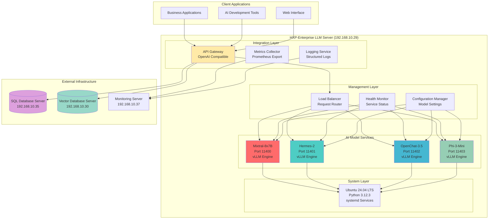
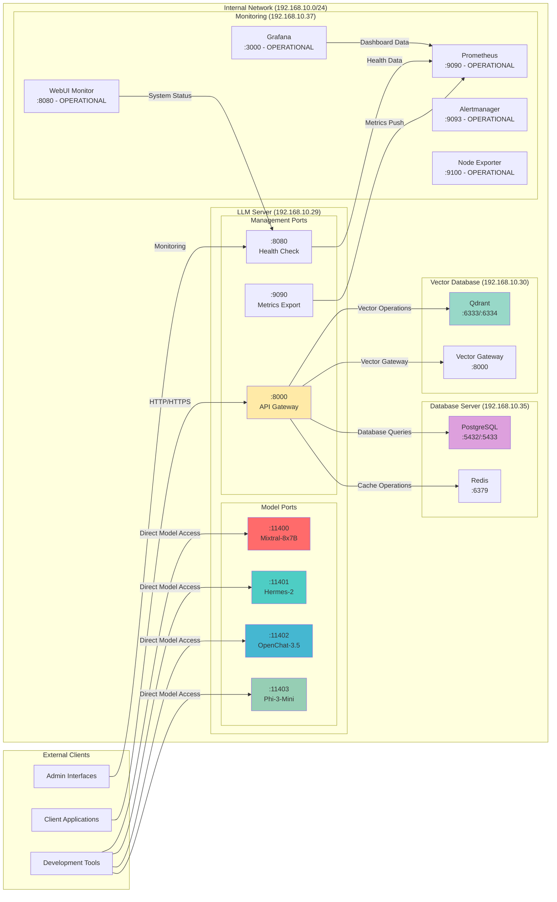
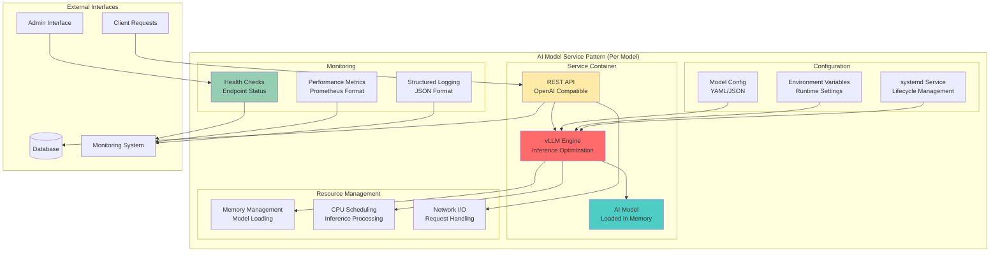
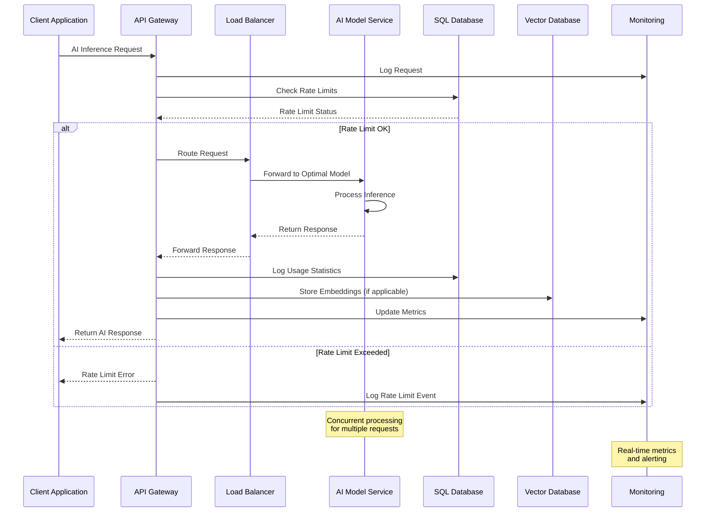

# HXP-Enterprise LLM Server - Product Requirements Document (PRD)

**Document Version:** 1.0  
**Date:** 2025-07-18  
**Author:** Manus AI  
**Project:** Citadel AI Operating System - LLM Infrastructure  
**Server:** hx-llm-server-01 (192.168.10.29)  
**Implementation Phase:** Phase 3 - Primary LLM Server Deployment  
**Target Environment:** Development and Test  
**Security Level:** Minimal (Development-Friendly)  

---

## 1. Executive Summary

This Product Requirements Document (PRD) defines the comprehensive requirements for deploying the HXP-Enterprise LLM Server as the third critical component of the Citadel AI Operating System infrastructure. Building upon the successful implementations of the SQL Database Server (192.168.10.35) and Vector Database Server (192.168.10.30), this server will host four specialized Large Language Models (LLMs) to provide diverse AI capabilities across the Citadel ecosystem.

The HXP-Enterprise LLM Server represents a pivotal advancement in the HANA-X Inference Architecture, designed to deliver high-performance AI inference capabilities through vLLM optimization while maintaining seamless integration with existing infrastructure components. This server will serve as the primary LLM hub, hosting Mixtral-8x7B for advanced reasoning, Hermes-2 for conversational AI, OpenChat-3.5 for interactive dialogue, and Phi-3-Mini for efficient lightweight processing.

The implementation strategy prioritizes rapid deployment and integration readiness, aligning with the established architectural patterns while introducing specialized AI model hosting capabilities. The server architecture emphasizes scalability, performance optimization, and operational excellence, ensuring that the deployed models can effectively serve the diverse computational requirements of the Citadel AI Operating System.

This PRD establishes the foundation for creating a robust, scalable, and maintainable LLM infrastructure that will enable advanced AI capabilities across invoice processing, customer onboarding, agent traceability, and feedback systems. The document serves as the authoritative specification for architecture design, implementation planning, and operational procedures, ensuring consistent delivery of enterprise-grade AI services.

### 1.1 Project Context and Strategic Alignment

The HXP-Enterprise LLM Server deployment represents the third phase of the Citadel AI Operating System infrastructure rollout, following the successful completion of foundational data persistence and vector processing capabilities. This server directly addresses the critical need for diverse AI model hosting within the HANA-X Inference Architecture, providing specialized computational capabilities that complement the existing database and vector processing infrastructure.

The strategic importance of this deployment cannot be overstated, as it enables the transition from infrastructure preparation to active AI service delivery. The four selected models—Mixtral-8x7B, Hermes-2, OpenChat-3.5, and Phi-3-Mini—represent a carefully curated portfolio of AI capabilities designed to address different computational requirements, from complex reasoning tasks to efficient real-time interactions.

The server's integration with existing infrastructure components ensures seamless data flow and operational coordination. The SQL Database Server provides persistent storage for model configurations, usage statistics, and operational logs, while the Vector Database Server enables efficient similarity search and embedding operations that complement the LLM inference capabilities. This integrated approach creates a synergistic AI ecosystem where each component enhances the capabilities of others.

The development and test environment focus ensures rapid iteration and validation capabilities, enabling comprehensive testing of AI model performance, integration patterns, and operational procedures before production deployment. The minimal security configuration facilitates development activities while maintaining appropriate access controls for the internal network environment.

### 1.2 Business Objectives and Success Criteria

The primary business objective of the HXP-Enterprise LLM Server deployment is to establish a production-ready AI inference platform that can deliver consistent, high-performance AI services across the Citadel ecosystem. This objective encompasses multiple dimensions of success, including technical performance, operational reliability, integration effectiveness, and scalability preparation.

Technical performance objectives focus on achieving optimal inference speeds, memory utilization, and concurrent request handling capabilities for each hosted model. The server must demonstrate the ability to serve multiple AI models simultaneously while maintaining response times suitable for real-time applications. Performance benchmarks will be established for each model based on their specific computational characteristics and intended use cases.

Operational reliability objectives emphasize system stability, automated recovery capabilities, and comprehensive monitoring integration. The server must achieve high availability standards appropriate for development and test environments while providing clear pathways for production-grade reliability enhancements. Monitoring integration with existing Prometheus and Grafana infrastructure ensures comprehensive observability and proactive issue detection.

Integration effectiveness objectives focus on seamless communication with existing infrastructure components, including database connectivity, vector processing coordination, and web interface integration. The server must demonstrate effective API integration patterns that enable other system components to leverage AI capabilities efficiently and reliably.

Scalability preparation objectives ensure that the server architecture can accommodate future growth in model diversity, computational requirements, and user demand. The implementation must provide clear pathways for horizontal scaling, additional model deployment, and performance optimization based on operational experience and evolving requirements.

---

## 2. Product Overview and Vision

### 2.1 Product Vision Statement

The HXP-Enterprise LLM Server embodies the vision of creating a unified, high-performance AI inference platform that seamlessly integrates diverse Large Language Models into the Citadel AI Operating System ecosystem. This platform serves as the computational heart of AI-driven business processes, enabling sophisticated natural language understanding, generation, and reasoning capabilities that transform how organizations interact with and leverage artificial intelligence.

The vision extends beyond simple model hosting to encompass intelligent workload distribution, adaptive performance optimization, and seamless integration with complementary infrastructure components. The server represents a paradigm shift from isolated AI model deployment to integrated AI ecosystem orchestration, where multiple models work in concert to deliver comprehensive AI capabilities.

The long-term vision positions the HXP-Enterprise LLM Server as a foundational component of enterprise AI infrastructure, capable of supporting diverse business applications from automated customer service to complex document processing and decision support systems. The platform's design anticipates future evolution in AI model architectures, deployment patterns, and integration requirements, ensuring sustained relevance and value delivery.

### 2.2 Core Product Capabilities

The HXP-Enterprise LLM Server delivers four primary AI model hosting capabilities, each optimized for specific computational requirements and use cases within the Citadel ecosystem. These capabilities represent a comprehensive portfolio of AI services designed to address diverse business and technical requirements.

Mixtral-8x7B hosting provides advanced reasoning and complex problem-solving capabilities, leveraging the model's mixture-of-experts architecture to deliver high-quality responses for sophisticated analytical tasks. This capability supports applications requiring deep understanding, multi-step reasoning, and comprehensive knowledge synthesis. The model's deployment on port 11400 ensures dedicated access for applications requiring its specialized capabilities.

Hermes-2 hosting delivers conversational AI capabilities optimized for interactive dialogue and context-aware communication. This model excels in maintaining conversation context, understanding nuanced communication patterns, and generating appropriate responses across diverse conversational scenarios. The deployment on port 11401 provides dedicated access for applications requiring sophisticated conversational AI capabilities.

OpenChat-3.5 hosting offers interactive dialogue capabilities with emphasis on real-time responsiveness and efficient resource utilization. This model provides excellent performance for applications requiring quick response times and efficient computational resource usage while maintaining high-quality conversational capabilities. The deployment on port 11402 ensures optimal access patterns for interactive applications.

Phi-3-Mini hosting provides lightweight, efficient AI processing capabilities optimized for scenarios requiring rapid response times and minimal computational overhead. This model excels in applications where efficiency and speed are paramount while still delivering meaningful AI capabilities. The deployment on port 11403 enables efficient access for applications with stringent performance requirements.

### 2.3 Target User Personas and Use Cases

The HXP-Enterprise LLM Server serves multiple user personas within the Citadel ecosystem, each with distinct requirements and interaction patterns. Understanding these personas ensures that the server design and implementation address real-world usage scenarios effectively.

AI Application Developers represent the primary user persona, requiring reliable, well-documented APIs for integrating AI capabilities into business applications. These users need consistent performance, comprehensive error handling, and flexible integration options that support diverse application architectures. They value detailed documentation, example implementations, and robust development tools that accelerate application development cycles.

System Administrators constitute another critical user persona, responsible for server deployment, configuration, monitoring, and maintenance. These users require comprehensive operational tools, clear deployment procedures, and effective monitoring capabilities that enable proactive system management. They value automation, standardized procedures, and integration with existing operational workflows.

Business Application Users represent the end beneficiaries of AI capabilities, interacting with AI services through business applications built on the LLM server infrastructure. These users require consistent, high-quality AI responses that enhance their productivity and decision-making capabilities. They value reliability, accuracy, and seamless integration with their existing workflows.

Infrastructure Engineers form an important user persona, responsible for integrating the LLM server with broader infrastructure components and ensuring optimal performance across the entire ecosystem. These users require detailed technical specifications, integration guidelines, and performance optimization tools that enable effective infrastructure coordination.

---

## 3. Technical Requirements and Specifications

### 3.1 Infrastructure and Hardware Requirements

The HXP-Enterprise LLM Server deployment requires robust hardware infrastructure capable of supporting concurrent execution of four Large Language Models while maintaining optimal performance characteristics. The hardware specifications must accommodate the computational intensity of AI inference operations while providing sufficient resources for system operations, monitoring, and future scalability.

The server hardware foundation centers on high-performance CPU architecture optimized for AI workloads, with particular emphasis on models that can operate effectively without dedicated GPU acceleration. The CPU selection prioritizes high core counts, substantial cache memory, and advanced instruction set support that enhances AI inference performance. Memory requirements reflect the substantial RAM needs of hosting multiple large language models simultaneously, with additional capacity for system operations and caching.

Storage infrastructure emphasizes high-speed access patterns essential for model loading and inference operations. The storage architecture must support rapid model initialization, efficient checkpoint management, and comprehensive logging capabilities. Network infrastructure requirements focus on high-bandwidth, low-latency connectivity that supports efficient communication with other infrastructure components while accommodating potential future scaling requirements.

The hardware specification aligns with established patterns from existing infrastructure deployments while accounting for the unique computational requirements of AI model hosting. This alignment ensures consistency in operational procedures, monitoring integration, and maintenance workflows across the entire Citadel infrastructure ecosystem.

### 3.2 Operating System and Base Software Requirements

The operating system selection builds upon the proven Ubuntu 24.04 LTS foundation established in previous infrastructure deployments, ensuring consistency in operational procedures, security configurations, and integration patterns. Ubuntu 24.04 LTS provides the stability, security updates, and long-term support essential for enterprise AI infrastructure while offering comprehensive package management and configuration flexibility.

The base software stack emphasizes Python 3.12.3 as the primary runtime environment, maintaining consistency with existing infrastructure components and leveraging the latest performance improvements and security enhancements. The Python environment deployment follows established patterns using isolated virtual environments that prevent dependency conflicts while enabling efficient package management and version control.

System service management utilizes systemd for consistent service lifecycle management, automatic startup configuration, and integration with system monitoring capabilities. The systemd configuration patterns align with existing infrastructure deployments while accommodating the specific requirements of AI model hosting, including resource limits, dependency management, and graceful shutdown procedures.

Security configuration maintains the minimal security approach appropriate for development and test environments while implementing essential access controls and network restrictions. The security model balances development flexibility with appropriate protection measures, ensuring that the server remains accessible for development activities while maintaining reasonable security boundaries.

### 3.3 AI Model Hosting and Inference Requirements

The AI model hosting architecture centers on vLLM as the primary inference engine, leveraging its optimization capabilities for efficient model serving and resource utilization. vLLM provides advanced features including dynamic batching, memory optimization, and concurrent request handling that are essential for hosting multiple models on a single server while maintaining optimal performance characteristics.

Model deployment architecture emphasizes isolated service instances for each AI model, ensuring that performance issues or maintenance activities for one model do not impact others. Each model operates on a dedicated port with independent configuration, logging, and monitoring capabilities. This isolation pattern enables fine-grained performance tuning, resource allocation, and operational management for each model based on its specific characteristics and usage patterns.

The inference API design follows OpenAI-compatible patterns to ensure broad compatibility with existing AI application frameworks and development tools. This compatibility reduces integration complexity for application developers while providing familiar interaction patterns that accelerate development cycles. The API implementation includes comprehensive error handling, request validation, and response formatting that meets enterprise application requirements.

Performance optimization focuses on achieving optimal inference speeds while maintaining memory efficiency and concurrent request handling capabilities. The optimization strategy includes model-specific tuning, efficient memory management, and intelligent request queuing that maximizes throughput while minimizing response latency. Performance monitoring integration provides detailed metrics for ongoing optimization and capacity planning.

### 3.4 Integration and Connectivity Requirements

The integration architecture emphasizes seamless connectivity with existing infrastructure components, including the SQL Database Server for persistent data storage and the Vector Database Server for embedding and similarity search operations. The integration patterns follow established protocols and communication standards that ensure reliable, efficient data exchange across the infrastructure ecosystem.

Database integration capabilities enable AI models to access persistent storage for configuration data, usage statistics, operational logs, and application-specific data. The integration utilizes established connection patterns including connection pooling, transaction management, and error handling that ensure reliable database operations. The database schema design accommodates AI-specific data requirements while maintaining consistency with existing data organization patterns.

Vector database integration provides AI models with access to embedding storage, similarity search capabilities, and vector processing operations that complement inference capabilities. This integration enables sophisticated AI applications that combine language model inference with semantic search, document retrieval, and knowledge base operations. The integration patterns ensure efficient data flow and optimal performance for combined operations.

Monitoring and observability integration leverages the operational Prometheus and Grafana infrastructure deployed on the Metrics Server (192.168.10.37) to include comprehensive AI model performance metrics, resource utilization tracking, and operational health monitoring. The existing monitoring stack includes Prometheus (port 9090), Grafana (port 3000), Alertmanager (port 9093), Node Exporter (port 9100), and WebUI Monitor & Alerts Dashboard (port 8080), providing a complete foundation for LLM server monitoring integration.

---

## 4. Architecture Design and System Integration

### 4.1 High-Level System Architecture

The HXP-Enterprise LLM Server architecture follows a modular, service-oriented design that integrates seamlessly with existing Citadel infrastructure while providing specialized AI model hosting capabilities. The architecture emphasizes scalability, maintainability, and operational excellence through well-defined service boundaries, standardized communication protocols, and comprehensive monitoring integration.

The core architectural pattern centers on isolated model services, each operating as an independent systemd service with dedicated resources, configuration, and monitoring capabilities. This isolation ensures that issues with one model do not impact others while enabling fine-grained resource management and performance optimization. Each model service exposes a standardized REST API that follows OpenAI-compatible patterns, ensuring broad compatibility with existing AI application frameworks.

The service orchestration layer provides centralized management capabilities including health monitoring, load balancing, and request routing across the hosted models. This layer implements intelligent request distribution based on model capabilities, current load, and performance characteristics. The orchestration layer also provides unified logging, metrics collection, and administrative interfaces that simplify operational management.

The integration layer facilitates communication with external infrastructure components including database connectivity, vector processing coordination, and monitoring system integration. This layer implements established communication patterns, error handling procedures, and performance optimization techniques that ensure reliable, efficient integration with the broader Citadel ecosystem.

### 4.2 Model Deployment and Service Architecture

The model deployment architecture implements a standardized pattern for hosting AI models that ensures consistency, reliability, and optimal performance across all deployed models. Each model operates within a dedicated service container that provides isolated resources, independent configuration management, and specialized optimization parameters tailored to the model's computational characteristics.

Mixtral-8x7B deployment utilizes vLLM optimization specifically configured for the model's mixture-of-experts architecture, enabling efficient expert routing and memory management. The deployment configuration emphasizes throughput optimization for complex reasoning tasks while maintaining reasonable response times for interactive applications. The service configuration includes specialized memory management, request batching, and performance monitoring tailored to the model's computational patterns.

Hermes-2 deployment focuses on conversational AI optimization with emphasis on context management, conversation state handling, and response quality consistency. The deployment configuration includes specialized conversation memory management, context window optimization, and response generation parameters that enhance conversational coherence and relevance. The service implementation includes conversation session management and context persistence capabilities.

OpenChat-3.5 deployment prioritizes interactive responsiveness with configuration optimized for real-time dialogue applications. The deployment emphasizes low-latency response generation, efficient resource utilization, and high concurrent request handling capabilities. The service configuration includes specialized request queuing, response caching, and performance optimization parameters that ensure optimal interactive performance.

Phi-3-Mini deployment focuses on efficiency and speed with configuration optimized for lightweight processing requirements. The deployment emphasizes minimal resource utilization, rapid response generation, and high throughput capabilities for applications requiring efficient AI processing. The service configuration includes specialized memory optimization, request batching, and performance tuning parameters that maximize efficiency.

### 4.3 Network Architecture and Communication Patterns

The network architecture implements a hub-and-spoke pattern with the HXP-Enterprise LLM Server serving as a specialized AI processing node within the broader Citadel infrastructure network. The network design emphasizes high-bandwidth, low-latency communication with other infrastructure components while providing secure, efficient access to AI model services.

Internal network communication utilizes the established 192.168.10.0/24 network segment with the LLM server positioned at 192.168.10.29 for optimal connectivity with existing infrastructure components. The network configuration includes dedicated communication channels with the SQL Database Server (192.168.10.35) for persistent data operations and the Vector Database Server (192.168.10.30) for embedding and similarity search coordination.

Port allocation follows a systematic pattern with each AI model assigned a dedicated port for direct access: Mixtral-8x7B on port 11400, Hermes-2 on port 11401, OpenChat-3.5 on port 11402, and Phi-3-Mini on port 11403. This port allocation enables direct model access for applications requiring specific model capabilities while supporting load balancing and request routing through centralized management interfaces.

The communication protocol implementation emphasizes RESTful API patterns with JSON request and response formatting that ensures broad compatibility with existing application frameworks. The protocol design includes comprehensive error handling, request validation, and response formatting that meets enterprise application requirements while providing detailed operational information for monitoring and debugging purposes.

### 4.4 Security Architecture and Access Control

The security architecture implements a development-friendly approach that balances accessibility with appropriate protection measures for the internal network environment. The security model emphasizes network-level access controls, service-level authentication, and comprehensive audit logging while avoiding complex security configurations that might impede development activities.

Network security relies on the internal network isolation provided by the 192.168.10.0/24 network segment, with firewall configurations remaining disabled to facilitate development and testing activities. This approach provides reasonable protection through network isolation while enabling flexible access patterns required for development workflows. The security model anticipates future enhancement with additional access controls as the system transitions toward production deployment.

Service-level security implements basic authentication and authorization mechanisms that provide reasonable access control without complex configuration requirements. The security implementation includes API key management, request rate limiting, and basic access logging that enables operational oversight while maintaining development flexibility. The security model provides clear pathways for enhancement with more sophisticated authentication and authorization mechanisms as requirements evolve.

Audit and monitoring capabilities provide comprehensive logging of access patterns, request processing, and system operations that enable security oversight and compliance reporting. The audit implementation integrates with existing monitoring infrastructure to provide centralized security event collection and analysis capabilities. The audit system provides detailed operational visibility while supporting future security enhancement requirements.

---

## 5. Performance Requirements and Optimization

### 5.1 Performance Targets and Benchmarks

The performance requirements for the HXP-Enterprise LLM Server establish comprehensive benchmarks that ensure optimal AI inference capabilities while maintaining system stability and resource efficiency. These requirements address multiple performance dimensions including response latency, throughput capacity, resource utilization, and concurrent request handling across all hosted models.

Response latency targets vary by model based on their computational complexity and intended use cases. Mixtral-8x7B targets response times under 2000 milliseconds for complex reasoning tasks, reflecting the model's sophisticated processing requirements while maintaining acceptable interactive performance. Hermes-2 targets response times under 1500 milliseconds for conversational interactions, balancing response quality with conversational flow requirements.

OpenChat-3.5 targets response times under 1000 milliseconds for interactive dialogue, emphasizing real-time responsiveness for applications requiring immediate feedback. Phi-3-Mini targets response times under 500 milliseconds for lightweight processing tasks, leveraging the model's efficiency for applications requiring rapid AI processing capabilities.

Throughput capacity targets establish minimum concurrent request handling capabilities for each model based on expected usage patterns and resource availability. The throughput requirements ensure that the server can handle realistic workloads while maintaining performance targets and providing capacity for usage growth. Concurrent request handling capabilities must accommodate multiple simultaneous users while maintaining response quality and system stability.

Resource utilization targets ensure efficient use of available hardware resources while maintaining performance requirements and providing capacity for system operations. Memory utilization targets account for model loading requirements, inference processing, and system overhead while maintaining sufficient capacity for optimal performance. CPU utilization targets balance inference processing requirements with system operations and monitoring capabilities.

### 5.2 Scalability and Capacity Planning

The scalability architecture provides clear pathways for capacity expansion based on usage growth, performance requirements, and evolving business needs. The scalability design emphasizes horizontal scaling capabilities, resource optimization, and performance monitoring that enable proactive capacity management and efficient resource utilization.

Horizontal scaling capabilities enable additional server deployment for increased capacity while maintaining consistent performance characteristics and operational procedures. The scaling architecture supports load distribution across multiple servers, coordinated resource management, and unified monitoring capabilities that simplify operational management of scaled deployments.

Vertical scaling capabilities provide options for hardware resource expansion including memory increases, CPU upgrades, and storage enhancements that can improve performance for existing deployments. The vertical scaling approach includes clear guidelines for resource allocation, performance optimization, and configuration management that ensure optimal resource utilization.

Capacity planning procedures establish systematic approaches for monitoring resource utilization, predicting capacity requirements, and planning infrastructure expansion based on usage trends and performance analysis. The capacity planning framework includes automated monitoring, trend analysis, and alerting capabilities that enable proactive capacity management and optimal resource allocation.

Performance optimization strategies provide ongoing approaches for improving system performance based on operational experience, usage patterns, and evolving requirements. The optimization framework includes systematic performance analysis, configuration tuning, and enhancement implementation that ensures sustained optimal performance as the system evolves.

### 5.3 Resource Management and Optimization

The resource management architecture implements sophisticated allocation and optimization strategies that ensure efficient utilization of available hardware resources while maintaining optimal performance for all hosted models. The resource management approach emphasizes dynamic allocation, intelligent scheduling, and comprehensive monitoring that enables optimal resource utilization across diverse workload patterns.

Memory management strategies address the substantial RAM requirements of hosting multiple large language models simultaneously while ensuring efficient allocation and optimal performance. The memory management approach includes intelligent model loading, efficient memory sharing where possible, and dynamic allocation based on current usage patterns. Memory optimization techniques include model quantization, efficient caching, and garbage collection optimization that maximize available memory while maintaining model performance.

CPU resource management implements intelligent scheduling and allocation strategies that ensure optimal processing resource distribution across hosted models while maintaining system responsiveness. The CPU management approach includes priority-based scheduling, load balancing, and dynamic resource allocation that adapts to current workload patterns and performance requirements.

Storage resource management addresses the requirements for model storage, checkpoint management, logging, and temporary file handling while ensuring optimal access performance and efficient space utilization. The storage management approach includes intelligent caching, efficient file organization, and automated cleanup procedures that maintain optimal storage performance while managing space requirements.

Network resource management ensures optimal communication performance with other infrastructure components while managing bandwidth utilization and connection efficiency. The network management approach includes connection pooling, intelligent request routing, and bandwidth optimization that ensures efficient network resource utilization while maintaining communication performance.

---

## 6. Integration Specifications and API Design

### 6.1 API Architecture and Design Principles

The API architecture for the HXP-Enterprise LLM Server follows OpenAI-compatible design patterns that ensure broad compatibility with existing AI application frameworks while providing enterprise-grade reliability, performance, and operational capabilities. The API design emphasizes consistency, discoverability, and ease of integration while maintaining the flexibility required for diverse application requirements.

The RESTful API design implements standard HTTP methods and status codes with comprehensive request validation, error handling, and response formatting that meets enterprise application requirements. The API structure follows hierarchical resource organization with clear endpoint naming conventions that facilitate intuitive integration and maintenance. Each model exposes a consistent API interface while accommodating model-specific capabilities and configuration options.

Request and response formatting utilizes JSON with well-defined schemas that ensure consistent data exchange and enable comprehensive validation. The schema design includes detailed field specifications, validation rules, and example data that facilitate integration development and testing. Error response formatting provides detailed information for debugging and operational monitoring while maintaining security considerations.

Authentication and authorization mechanisms implement API key-based access control with rate limiting and usage tracking capabilities that provide reasonable security while maintaining development flexibility. The authentication design provides clear pathways for enhancement with more sophisticated access control mechanisms as security requirements evolve.

### 6.2 Model-Specific API Endpoints

Each hosted AI model exposes a standardized set of API endpoints that provide consistent interaction patterns while accommodating model-specific capabilities and optimization parameters. The endpoint design ensures that applications can interact with different models using similar patterns while leveraging unique model capabilities when required.

The primary inference endpoint for each model follows the pattern `/v1/completions` and `/v1/chat/completions` to maintain OpenAI compatibility while providing model-specific optimization and configuration options. The endpoint implementation includes comprehensive request validation, intelligent parameter handling, and optimized response generation that ensures reliable, high-performance inference operations.

Mixtral-8x7B endpoints include specialized parameters for controlling the mixture-of-experts routing, reasoning depth, and response complexity that enable applications to optimize model behavior for specific use cases. The endpoint implementation includes advanced prompt engineering support, multi-step reasoning capabilities, and comprehensive response analysis that leverages the model's sophisticated capabilities.

Hermes-2 endpoints provide conversational AI capabilities with specialized support for conversation context management, dialogue state tracking, and response personalization. The endpoint implementation includes conversation session management, context persistence, and response quality optimization that ensures coherent, engaging conversational experiences.

OpenChat-3.5 endpoints emphasize interactive dialogue capabilities with optimized response generation for real-time applications. The endpoint implementation includes rapid response generation, efficient resource utilization, and high concurrent request handling that ensures optimal interactive performance.

Phi-3-Mini endpoints focus on efficient, lightweight processing with optimized parameters for rapid response generation and minimal resource utilization. The endpoint implementation includes streamlined request processing, efficient memory management, and high-throughput capabilities that maximize efficiency for lightweight AI processing requirements.

### 6.3 Database Integration Patterns

The database integration architecture provides seamless connectivity with the SQL Database Server for persistent data storage, configuration management, and operational logging while maintaining optimal performance and reliability. The integration patterns follow established database connectivity standards with comprehensive error handling, transaction management, and connection optimization.

Configuration data integration enables dynamic model configuration, parameter management, and operational settings storage that supports flexible model behavior and administrative control. The configuration integration includes real-time configuration updates, validation procedures, and rollback capabilities that ensure reliable configuration management while maintaining system stability.

Usage statistics integration provides comprehensive tracking of model utilization, performance metrics, and operational data that enables capacity planning, performance optimization, and billing capabilities. The statistics integration includes real-time data collection, efficient storage optimization, and comprehensive reporting capabilities that support operational oversight and business intelligence requirements.

Operational logging integration ensures comprehensive audit trails, error tracking, and performance monitoring data storage that supports troubleshooting, compliance reporting, and operational analysis. The logging integration includes structured log formatting, efficient storage management, and comprehensive search capabilities that facilitate operational management and issue resolution.

Application data integration provides AI models with access to business data, document repositories, and knowledge bases that enhance AI capabilities and enable sophisticated business applications. The data integration includes secure access controls, efficient query optimization, and comprehensive caching that ensures optimal performance while maintaining data security and integrity.

### 6.4 Vector Database Coordination

The vector database integration provides AI models with sophisticated embedding storage, similarity search, and semantic processing capabilities that complement inference operations and enable advanced AI applications. The integration architecture emphasizes efficient data flow, optimal performance, and seamless coordination between inference and vector processing operations.

Embedding generation coordination enables AI models to generate and store vector embeddings for text processing, document analysis, and semantic search applications. The coordination includes efficient embedding generation, optimized storage procedures, and comprehensive indexing that ensures optimal performance for vector operations while maintaining data consistency and integrity.

Similarity search integration provides AI models with access to semantic search capabilities that enhance response generation, knowledge retrieval, and context understanding. The search integration includes intelligent query optimization, efficient result processing, and comprehensive ranking that ensures relevant, accurate search results while maintaining optimal performance.

Knowledge base integration enables AI models to access structured knowledge repositories, document collections, and information databases that enhance response accuracy and provide comprehensive information access. The knowledge integration includes efficient query processing, intelligent result synthesis, and comprehensive source attribution that ensures accurate, reliable information access.

Semantic processing coordination provides AI models with advanced text analysis, document understanding, and content classification capabilities that enhance AI application sophistication and accuracy. The processing coordination includes efficient analysis pipelines, optimized result processing, and comprehensive quality assurance that ensures reliable, accurate semantic processing results.

---

## 7. Deployment Strategy and Implementation Plan

### 7.1 Deployment Architecture and Methodology

The deployment strategy for the HXP-Enterprise LLM Server emphasizes systematic, risk-managed implementation that builds upon proven patterns from existing infrastructure deployments while accommodating the unique requirements of AI model hosting. The deployment methodology prioritizes reliability, repeatability, and operational excellence through comprehensive planning, automated procedures, and thorough validation processes.

The phased deployment approach begins with infrastructure preparation including server provisioning, operating system configuration, and base software installation following established patterns from previous deployments. This phase ensures that the foundational infrastructure meets all requirements and provides optimal performance characteristics for AI model hosting while maintaining consistency with existing operational procedures.

The model deployment phase implements systematic installation and configuration of each AI model using standardized procedures that ensure consistent performance, reliability, and operational characteristics. Each model deployment includes comprehensive validation procedures, performance testing, and integration verification that confirms optimal operation before proceeding to the next model installation.

The integration testing phase validates connectivity and coordination with existing infrastructure components including database integration, vector processing coordination, and monitoring system integration. This phase ensures that the LLM server operates effectively within the broader Citadel ecosystem while maintaining optimal performance and reliability characteristics.

The operational validation phase confirms that all deployed models meet performance requirements, operational procedures function correctly, and monitoring systems provide comprehensive oversight capabilities. This phase includes load testing, performance validation, and operational procedure verification that ensures the system is ready for production use.

### 7.2 Infrastructure Preparation and Configuration

The infrastructure preparation process follows established patterns from existing deployments while accommodating the specific requirements of AI model hosting including substantial memory requirements, optimized storage access, and high-performance networking capabilities. The preparation process emphasizes automation, consistency, and comprehensive validation that ensures optimal infrastructure foundation for AI model deployment.

Server provisioning includes hardware validation, operating system installation, and base configuration following standardized procedures that ensure consistency with existing infrastructure deployments. The provisioning process includes comprehensive hardware testing, performance validation, and configuration verification that confirms optimal hardware operation before software installation begins.

Operating system configuration implements Ubuntu 24.04 LTS with optimized settings for AI workloads including memory management optimization, storage access tuning, and network performance enhancement. The configuration process includes security hardening appropriate for development environments, service configuration, and system optimization that ensures optimal performance for AI model hosting.

Python environment preparation includes Python 3.12.3 installation, virtual environment configuration, and package management setup following established patterns that ensure consistency with existing infrastructure while accommodating AI-specific requirements. The environment preparation includes comprehensive dependency management, version control, and isolation procedures that ensure reliable, maintainable software environments.

Network configuration implements connectivity with existing infrastructure components including database server integration, vector database coordination, and monitoring system connectivity. The network configuration includes performance optimization, security configuration, and comprehensive connectivity validation that ensures reliable, efficient communication with all infrastructure components.

### 7.3 Model Installation and Configuration Procedures

The model installation procedures implement systematic approaches for deploying each AI model with optimized configuration parameters, performance tuning, and comprehensive validation that ensures optimal operation within the server environment. The installation process emphasizes automation, repeatability, and thorough testing that ensures consistent, reliable model deployment.

vLLM installation and configuration provides the foundational inference engine with optimization parameters tailored for each model's computational characteristics and performance requirements. The vLLM configuration includes memory optimization, request batching, and performance tuning that ensures optimal inference performance while maintaining system stability and resource efficiency.

Mixtral-8x7B installation includes model download, validation, and configuration with parameters optimized for the model's mixture-of-experts architecture and complex reasoning capabilities. The installation process includes comprehensive model validation, performance testing, and configuration optimization that ensures optimal model operation and integration with the inference engine.

Hermes-2 installation focuses on conversational AI optimization with configuration parameters that enhance dialogue quality, context management, and response coherence. The installation process includes conversation testing, context validation, and performance optimization that ensures optimal conversational AI capabilities and integration with application requirements.

OpenChat-3.5 installation emphasizes interactive dialogue optimization with configuration parameters that prioritize response speed, resource efficiency, and concurrent request handling. The installation process includes interactive testing, performance validation, and optimization procedures that ensure optimal interactive dialogue capabilities.

Phi-3-Mini installation focuses on efficiency and speed with configuration parameters that minimize resource utilization while maintaining AI processing quality. The installation process includes efficiency testing, resource optimization, and performance validation that ensures optimal lightweight AI processing capabilities.

### 7.4 Testing and Validation Procedures

The testing and validation framework provides comprehensive verification of system functionality, performance characteristics, and integration capabilities that ensures the deployed system meets all requirements and operates reliably within the Citadel ecosystem. The testing approach emphasizes systematic validation, performance verification, and operational readiness confirmation.

Unit testing procedures validate individual model functionality, API endpoint operation, and basic performance characteristics for each deployed model. The unit testing includes inference validation, API response verification, and basic performance measurement that confirms each model operates correctly in isolation before integration testing begins.

Integration testing procedures validate connectivity and coordination with existing infrastructure components including database operations, vector processing coordination, and monitoring system integration. The integration testing includes end-to-end workflow validation, cross-system communication verification, and performance testing under realistic operational conditions.

Performance testing procedures validate that all deployed models meet established performance targets including response latency, throughput capacity, and resource utilization requirements. The performance testing includes load testing, stress testing, and endurance testing that confirms the system can handle expected workloads while maintaining performance targets.

Operational testing procedures validate administrative capabilities, monitoring functionality, and maintenance procedures that ensure the system can be operated effectively within existing operational frameworks. The operational testing includes procedure validation, monitoring verification, and administrative capability confirmation that ensures operational readiness.

---

## 8. Operational Requirements and Management

### 8.1 Service Management and Administration

The service management architecture implements comprehensive administrative capabilities that enable efficient operation, maintenance, and optimization of the HXP-Enterprise LLM Server within existing operational frameworks. The management approach emphasizes automation, standardization, and integration with established operational procedures while accommodating the unique requirements of AI model hosting.

Systemd service management provides standardized service lifecycle control for each hosted AI model with automated startup, graceful shutdown, and restart capabilities that ensure reliable service operation. The service configuration includes dependency management, resource limits, and health monitoring that enables effective service administration while maintaining system stability and performance.

Configuration management implements centralized control of model parameters, system settings, and operational configurations with version control, validation procedures, and rollback capabilities. The configuration management approach includes dynamic configuration updates, comprehensive validation, and audit trails that ensure reliable configuration control while maintaining operational flexibility.

Administrative interfaces provide comprehensive control capabilities including model management, performance monitoring, and operational oversight through both command-line and web-based interfaces. The administrative capabilities include real-time status monitoring, configuration management, and operational control that enables effective system administration while providing detailed operational visibility.

Backup and recovery procedures ensure comprehensive data protection including model checkpoints, configuration backups, and operational data preservation with automated backup scheduling and validated recovery procedures. The backup approach includes incremental backups, offsite storage, and comprehensive recovery testing that ensures reliable data protection and business continuity capabilities.

### 8.2 Monitoring and Observability

The monitoring architecture extends existing Prometheus and Grafana infrastructure to provide comprehensive observability for AI model performance, system resource utilization, and operational health monitoring. The monitoring approach emphasizes proactive issue detection, performance optimization, and operational insight that enables effective system management and continuous improvement.

Performance metrics collection includes detailed inference performance data, resource utilization tracking, and operational statistics for each hosted model with real-time data collection and historical trend analysis. The metrics collection includes response latency tracking, throughput measurement, and resource utilization monitoring that provides comprehensive performance visibility and optimization insights.

Health monitoring implements comprehensive system health checks including model availability, API endpoint responsiveness, and infrastructure connectivity validation with automated alerting and escalation procedures. The health monitoring includes service status tracking, dependency validation, and performance threshold monitoring that enables proactive issue detection and resolution.

Operational dashboards provide comprehensive visualization of system performance, resource utilization, and operational metrics with customizable views and real-time updates that support effective operational oversight. The dashboard implementation includes performance trending, capacity utilization, and operational status displays that enable informed operational decision-making and proactive system management.

Alerting and notification systems provide automated issue detection and escalation with configurable thresholds, notification channels, and escalation procedures that ensure timely response to operational issues. The alerting system includes performance degradation detection, resource exhaustion warnings, and service failure notifications that enable proactive operational response and issue resolution.

### 8.3 Maintenance and Update Procedures

The maintenance framework provides systematic approaches for ongoing system maintenance, software updates, and performance optimization that ensure sustained optimal operation while minimizing service disruption and operational risk. The maintenance approach emphasizes automation, validation, and comprehensive testing that ensures reliable maintenance operations.

Routine maintenance procedures include system health checks, performance optimization, and preventive maintenance activities with automated scheduling and comprehensive validation that ensures ongoing system reliability. The routine maintenance includes log rotation, temporary file cleanup, and performance tuning that maintains optimal system operation while preventing resource exhaustion and performance degradation.

Software update procedures provide systematic approaches for updating system software, AI models, and operational tools with comprehensive testing, validation, and rollback capabilities that ensure reliable updates while minimizing operational risk. The update procedures include staged deployment, comprehensive testing, and automated rollback that ensures safe, reliable software maintenance.

Model update procedures enable systematic deployment of updated AI models, configuration changes, and performance optimizations with comprehensive validation and rollback capabilities. The model update approach includes version management, performance validation, and seamless deployment that ensures reliable model maintenance while maintaining service availability.

Security update procedures provide systematic approaches for applying security patches, configuration updates, and vulnerability remediation with comprehensive testing and validation that ensures system security while maintaining operational stability. The security update approach includes automated patch management, vulnerability scanning, and comprehensive validation that ensures ongoing security maintenance.

### 8.4 Troubleshooting and Support Procedures

The troubleshooting framework provides comprehensive procedures for diagnosing and resolving operational issues with systematic approaches, detailed documentation, and escalation procedures that ensure effective issue resolution while minimizing service impact. The troubleshooting approach emphasizes rapid diagnosis, effective resolution, and comprehensive documentation that supports ongoing operational excellence.

Diagnostic procedures include systematic approaches for identifying performance issues, service failures, and operational problems with comprehensive logging, monitoring data analysis, and systematic investigation procedures. The diagnostic approach includes automated issue detection, detailed investigation procedures, and comprehensive documentation that enables effective problem identification and resolution.

Resolution procedures provide step-by-step approaches for resolving common operational issues including service failures, performance problems, and configuration issues with validated procedures and comprehensive testing. The resolution procedures include automated recovery procedures, manual intervention guidelines, and comprehensive validation that ensures effective issue resolution while preventing recurrence.

Escalation procedures define clear pathways for escalating complex issues, coordinating with external support resources, and managing critical operational problems with defined roles, responsibilities, and communication procedures. The escalation approach includes severity classification, response time requirements, and coordination procedures that ensure appropriate response to operational issues.

Documentation and knowledge management provide comprehensive operational documentation, troubleshooting guides, and knowledge base maintenance that supports effective operational support and continuous improvement. The documentation approach includes procedure documentation, issue resolution guides, and knowledge sharing that enables effective operational support and organizational learning.

---

## 9. Security and Compliance Framework

### 9.1 Security Architecture for Development Environment

The security architecture for the HXP-Enterprise LLM Server implements a development-friendly approach that balances accessibility with appropriate protection measures for the internal network environment. The security framework emphasizes practical protection measures that support development activities while maintaining reasonable security boundaries and providing clear pathways for production-grade security enhancement.

Network security relies primarily on internal network isolation within the 192.168.10.0/24 network segment with firewall configurations remaining disabled to facilitate development and testing activities. This approach provides reasonable protection through network segmentation while enabling flexible access patterns required for development workflows, integration testing, and operational validation procedures.

The network isolation strategy assumes that the internal network environment provides sufficient protection for development activities while acknowledging that additional security measures will be required for production deployment. The security model includes clear documentation of current security limitations and provides detailed recommendations for production security enhancement including firewall configuration, access controls, and network monitoring.

Access control mechanisms implement basic authentication and authorization procedures that provide reasonable protection while maintaining development flexibility. The access control approach includes API key management for service access, basic user authentication for administrative interfaces, and request logging for operational oversight and security monitoring.

The security framework includes comprehensive audit logging that tracks access patterns, operational activities, and administrative actions with detailed log retention and analysis capabilities. The audit system provides visibility into system usage patterns while supporting future security enhancement and compliance reporting requirements.

### 9.2 Data Protection and Privacy Measures

The data protection framework addresses the handling of AI model data, user interactions, and operational information with appropriate protection measures that ensure data integrity while supporting development and testing requirements. The data protection approach emphasizes secure data handling, appropriate access controls, and comprehensive audit trails that support both operational requirements and future compliance needs.

AI model data protection includes secure storage of model files, configuration data, and operational parameters with appropriate access controls and integrity validation. The model data protection approach includes secure file permissions, access logging, and integrity checking that ensures model data remains secure and unmodified while supporting operational requirements.

User interaction data protection addresses the handling of API requests, responses, and conversation data with appropriate privacy measures and retention policies. The interaction data protection includes request logging, response caching, and data retention management that balances operational requirements with privacy considerations and future compliance needs.

Operational data protection covers system logs, performance metrics, and administrative data with secure storage, appropriate access controls, and comprehensive retention management. The operational data protection includes log security, metrics protection, and administrative data access controls that ensure operational data remains secure while supporting system administration and monitoring requirements.

The data protection framework includes clear data classification procedures, handling guidelines, and retention policies that provide systematic approaches for managing different types of data while ensuring appropriate protection measures and compliance preparation. The framework provides clear pathways for enhancing data protection measures as security requirements evolve and compliance needs develop.

### 9.3 Compliance Preparation and Audit Readiness

The compliance framework provides foundational capabilities for meeting future regulatory requirements and audit obligations while maintaining development flexibility and operational efficiency. The compliance approach emphasizes comprehensive documentation, audit trail maintenance, and systematic procedure development that supports future compliance certification and regulatory validation.

Audit trail capabilities provide comprehensive logging of system activities, user interactions, and administrative actions with detailed timestamp information, user identification, and activity descriptions. The audit trail system includes secure log storage, tamper detection, and comprehensive search capabilities that support audit requirements and compliance validation procedures.

Documentation management ensures comprehensive maintenance of operational procedures, security configurations, and system documentation with version control, approval workflows, and regular review procedures. The documentation approach includes procedure documentation, configuration management, and change control that supports audit requirements and compliance validation.

Access control documentation provides detailed records of user permissions, administrative access, and system privileges with regular review procedures and approval workflows. The access control documentation includes user management, privilege tracking, and access review procedures that support audit requirements and security validation.

The compliance framework includes systematic procedures for compliance assessment, gap analysis, and enhancement planning that enable effective preparation for future regulatory requirements and audit obligations. The framework provides clear pathways for implementing additional compliance measures as requirements develop and regulatory obligations evolve.

### 9.4 Security Enhancement Roadmap

The security enhancement roadmap provides systematic approaches for evolving the security architecture from development-friendly configuration to production-grade security implementation. The roadmap emphasizes incremental enhancement, comprehensive testing, and operational continuity that ensures effective security improvement while maintaining system functionality and operational efficiency.

Network security enhancement includes firewall implementation, network segmentation, and access control configuration with systematic deployment procedures and comprehensive testing. The network security roadmap includes perimeter security, internal segmentation, and monitoring implementation that provides comprehensive network protection while maintaining operational connectivity and performance.

Authentication and authorization enhancement includes advanced user management, role-based access control, and multi-factor authentication implementation with systematic deployment and user training procedures. The authentication enhancement roadmap includes identity management, access control, and security monitoring that provides comprehensive access protection while maintaining operational efficiency.

Encryption implementation includes data encryption at rest, communication encryption, and key management procedures with systematic deployment and operational integration. The encryption roadmap includes storage encryption, network encryption, and key management that provides comprehensive data protection while maintaining system performance and operational accessibility.

Security monitoring enhancement includes intrusion detection, security event monitoring, and automated response capabilities with comprehensive integration and operational procedures. The monitoring enhancement roadmap includes threat detection, incident response, and security analytics that provides comprehensive security oversight while maintaining operational efficiency and system performance.

---

## 10. Risk Assessment and Mitigation Strategies

### 10.1 Technical Risk Analysis

The technical risk assessment for the HXP-Enterprise LLM Server deployment identifies potential challenges and failure modes that could impact system performance, reliability, or operational effectiveness. The risk analysis emphasizes systematic identification, impact assessment, and mitigation strategy development that ensures robust system design and operational preparedness.

Hardware resource risks include potential memory exhaustion, CPU overutilization, and storage capacity limitations that could impact system performance or availability. The memory risk assessment considers the substantial RAM requirements of hosting multiple large language models simultaneously with potential for resource contention and performance degradation. Mitigation strategies include comprehensive resource monitoring, intelligent allocation algorithms, and capacity planning procedures that ensure optimal resource utilization while preventing resource exhaustion.

Software compatibility risks encompass potential conflicts between AI model requirements, dependency management challenges, and version compatibility issues that could impact system stability or functionality. The compatibility risk assessment includes dependency analysis, version management procedures, and comprehensive testing protocols that ensure reliable software integration while preventing compatibility conflicts.

Performance degradation risks include potential latency increases, throughput reductions, and resource utilization inefficiencies that could impact user experience or system effectiveness. The performance risk assessment includes comprehensive monitoring, performance testing, and optimization procedures that ensure sustained optimal performance while providing early warning of potential performance issues.

Integration failure risks encompass potential connectivity issues with existing infrastructure components, communication protocol failures, and data synchronization problems that could impact system functionality or data integrity. The integration risk assessment includes comprehensive connectivity testing, error handling procedures, and fallback mechanisms that ensure reliable integration while providing resilience against integration failures.

### 10.2 Operational Risk Management

The operational risk framework addresses potential challenges in system administration, maintenance procedures, and operational workflows that could impact system availability, performance, or operational efficiency. The operational risk assessment emphasizes systematic identification of operational challenges and development of comprehensive mitigation strategies that ensure effective operational management.

Service availability risks include potential service failures, maintenance-related downtime, and operational errors that could impact system availability or user access. The availability risk assessment includes service redundancy planning, maintenance procedure optimization, and error prevention strategies that ensure high availability while minimizing operational disruption.

Data integrity risks encompass potential data corruption, backup failures, and recovery procedure inadequacies that could impact data reliability or business continuity. The data integrity risk assessment includes comprehensive backup procedures, integrity validation, and recovery testing that ensures reliable data protection while providing effective recovery capabilities.

Operational complexity risks include potential administrative errors, procedure inadequacies, and training deficiencies that could impact operational effectiveness or system reliability. The complexity risk assessment includes procedure simplification, comprehensive training, and error prevention strategies that ensure effective operational management while reducing operational risk.

Scalability risks encompass potential capacity limitations, performance bottlenecks, and architectural constraints that could impact system growth or future requirements. The scalability risk assessment includes capacity planning, architectural review, and enhancement procedures that ensure effective scalability while providing clear pathways for system growth.

### 10.3 Business Continuity and Disaster Recovery

The business continuity framework provides comprehensive approaches for maintaining operational capability during adverse events, system failures, or operational disruptions. The continuity planning emphasizes systematic preparation, comprehensive testing, and effective recovery procedures that ensure business continuity while minimizing operational impact.

Backup and recovery procedures provide comprehensive data protection including model backups, configuration preservation, and operational data protection with automated backup scheduling and validated recovery procedures. The backup strategy includes incremental backups, offsite storage, and comprehensive recovery testing that ensures reliable data protection and effective recovery capabilities.

Service redundancy planning addresses potential service failures through redundant system design, failover procedures, and alternative service provision that ensures continued operation during system failures or maintenance activities. The redundancy planning includes service clustering, load balancing, and automated failover that provides high availability while maintaining performance characteristics.

Disaster recovery procedures provide systematic approaches for recovering from major system failures, infrastructure damage, or catastrophic events with comprehensive recovery planning and regular testing procedures. The disaster recovery approach includes alternative infrastructure, data recovery, and service restoration that ensures effective recovery while minimizing business impact.

Business impact assessment identifies critical system functions, operational dependencies, and recovery priorities that guide continuity planning and resource allocation. The impact assessment includes service criticality analysis, dependency mapping, and recovery prioritization that ensures effective continuity planning while optimizing resource allocation and recovery procedures.

### 10.4 Risk Monitoring and Response Procedures

The risk monitoring framework provides systematic approaches for ongoing risk assessment, early warning detection, and proactive risk management that enables effective risk mitigation while maintaining operational efficiency. The monitoring approach emphasizes automated detection, systematic assessment, and coordinated response that ensures effective risk management.

Automated risk detection includes comprehensive monitoring of system performance, resource utilization, and operational indicators with automated alerting and escalation procedures. The detection system includes threshold monitoring, trend analysis, and anomaly detection that provides early warning of potential risks while enabling proactive response and mitigation.

Risk assessment procedures provide systematic approaches for evaluating identified risks, assessing potential impact, and prioritizing response activities with comprehensive analysis and decision-making frameworks. The assessment procedures include impact analysis, probability evaluation, and response planning that ensures effective risk evaluation while optimizing response resource allocation.

Response coordination procedures define clear roles, responsibilities, and communication protocols for managing identified risks with systematic response procedures and escalation pathways. The coordination approach includes incident management, resource coordination, and communication procedures that ensure effective risk response while maintaining operational continuity.

Continuous improvement procedures provide systematic approaches for learning from risk events, enhancing risk management capabilities, and improving operational resilience with comprehensive analysis and enhancement planning. The improvement approach includes post-incident analysis, procedure enhancement, and capability development that ensures ongoing risk management improvement while building organizational resilience.

---

## 11. Success Metrics and Validation Criteria

### 11.1 Performance Success Metrics

The performance success metrics establish comprehensive benchmarks for evaluating the effectiveness and efficiency of the HXP-Enterprise LLM Server deployment across multiple dimensions of system performance, user experience, and operational excellence. These metrics provide objective criteria for assessing deployment success while enabling ongoing optimization and improvement efforts.

Response latency metrics define specific performance targets for each hosted AI model based on their computational characteristics and intended use cases. Mixtral-8x7B must achieve average response times under 2000 milliseconds for complex reasoning tasks with 95th percentile response times under 3000 milliseconds, ensuring acceptable performance for sophisticated analytical applications while maintaining reasonable interactive responsiveness.

Hermes-2 conversational AI performance requires average response times under 1500 milliseconds for dialogue interactions with 95th percentile response times under 2500 milliseconds, ensuring smooth conversational flow while accommodating the model's sophisticated context processing capabilities. The performance metrics include conversation coherence measurement and context retention validation that ensure high-quality conversational experiences.

OpenChat-3.5 interactive dialogue performance targets average response times under 1000 milliseconds with 95th percentile response times under 1500 milliseconds, emphasizing real-time responsiveness for interactive applications while maintaining response quality and system stability. The performance metrics include concurrent user handling and response quality consistency measurement.

Phi-3-Mini efficiency performance requires average response times under 500 milliseconds with 95th percentile response times under 750 milliseconds, leveraging the model's lightweight architecture for rapid processing while maintaining AI capability quality. The performance metrics include resource utilization efficiency and throughput capacity measurement that validate the model's efficiency advantages.

### 11.2 Integration Success Criteria

The integration success criteria establish comprehensive validation requirements for seamless connectivity and coordination with existing Citadel infrastructure components. These criteria ensure that the LLM server operates effectively within the broader ecosystem while maintaining optimal performance and reliability characteristics.

Database integration validation requires successful connectivity with the SQL Database Server (192.168.10.35) including reliable connection establishment, efficient query processing, and comprehensive error handling. The integration must demonstrate successful data storage and retrieval operations with response times under 100 milliseconds for standard database operations and comprehensive transaction management capabilities.

Vector database coordination validation requires effective communication with the Vector Database Server (192.168.10.30) including successful embedding generation, efficient similarity search operations, and coordinated data processing. The integration must demonstrate successful vector operations with processing times under 50 milliseconds for standard embedding operations and comprehensive coordination with vector processing workflows.

Monitoring system integration validation requires successful metrics collection and dashboard integration with existing Prometheus and Grafana infrastructure. The integration must demonstrate comprehensive performance data collection, real-time monitoring capabilities, and effective alerting functionality that provides complete operational visibility and proactive issue detection.

API compatibility validation requires successful integration with existing application frameworks and development tools through OpenAI-compatible API interfaces. The integration must demonstrate successful request processing, comprehensive error handling, and consistent response formatting that enables seamless application development and deployment.

### 11.3 Operational Excellence Indicators

The operational excellence indicators establish comprehensive criteria for evaluating the effectiveness of operational procedures, administrative capabilities, and system management functionality. These indicators ensure that the deployed system can be operated effectively within existing operational frameworks while maintaining high standards of reliability and efficiency.

Service availability metrics require system uptime of 99% or higher for development and test environments with comprehensive monitoring of service status, automated recovery capabilities, and effective maintenance procedures. The availability metrics include planned maintenance impact minimization and unplanned downtime reduction that ensure consistent service availability for development and testing activities.

Administrative efficiency indicators measure the effectiveness of system administration procedures including configuration management, user administration, and operational oversight capabilities. The efficiency metrics include administrative task completion times, procedure automation levels, and operational error rates that validate effective administrative capability and operational efficiency.

Monitoring effectiveness indicators evaluate the comprehensiveness and accuracy of system monitoring including performance tracking, health monitoring, and operational oversight capabilities. The monitoring metrics include issue detection accuracy, false positive rates, and response time effectiveness that ensure reliable operational monitoring and proactive issue management.

Maintenance procedure effectiveness indicators assess the reliability and efficiency of system maintenance including routine maintenance, software updates, and operational optimization procedures. The maintenance metrics include maintenance completion success rates, system impact minimization, and procedure automation levels that ensure effective maintenance capability and operational continuity.

### 11.4 Business Value Realization

The business value realization metrics establish comprehensive criteria for evaluating the business impact and strategic value of the HXP-Enterprise LLM Server deployment within the broader Citadel AI Operating System initiative. These metrics ensure that the technical implementation delivers meaningful business value while supporting strategic objectives and organizational goals.

AI capability enablement metrics measure the effectiveness of the deployed models in supporting business applications including natural language processing, conversational AI, and intelligent automation capabilities. The capability metrics include application integration success rates, user satisfaction scores, and business process improvement measurements that validate the business value of AI capability deployment.

Development productivity indicators assess the impact of AI model availability on application development efficiency including development cycle time reduction, integration complexity minimization, and developer productivity enhancement. The productivity metrics include development time savings, integration effort reduction, and application quality improvement that demonstrate the value of AI infrastructure investment.

Operational efficiency improvements measure the impact of AI capabilities on business process automation, decision support, and operational optimization. The efficiency metrics include process automation success rates, decision support effectiveness, and operational cost reduction that validate the business value of AI capability deployment.

Strategic objective advancement indicators evaluate the contribution of the LLM server deployment to broader Citadel AI Operating System goals including AI ecosystem development, infrastructure capability enhancement, and competitive advantage creation. The strategic metrics include ecosystem integration success, capability advancement measurement, and competitive positioning improvement that demonstrate strategic value realization and organizational advancement.

---

## 12. Conclusion and Next Steps

### 12.1 PRD Summary and Strategic Impact

This Product Requirements Document establishes comprehensive specifications for deploying the HXP-Enterprise LLM Server as a critical component of the Citadel AI Operating System infrastructure. The document provides detailed requirements, architectural specifications, and implementation guidelines that ensure successful deployment of four specialized AI models while maintaining alignment with existing infrastructure patterns and operational excellence standards.

The strategic impact of this deployment extends beyond simple AI model hosting to encompass fundamental advancement in the Citadel ecosystem's AI capabilities. The server provides essential inference capabilities that enable sophisticated business applications, intelligent automation, and advanced decision support systems. The deployment represents a crucial step in the evolution from infrastructure preparation to active AI service delivery, positioning the organization for comprehensive AI-driven business transformation.

The technical specifications outlined in this PRD ensure that the deployed system meets enterprise-grade requirements for performance, reliability, and operational excellence while maintaining development flexibility and integration readiness. The comprehensive approach to architecture design, performance optimization, and operational management provides a solid foundation for sustained AI capability delivery and future system evolution.

The integration specifications ensure seamless coordination with existing infrastructure components while providing clear pathways for future enhancement and scaling. The deployment strategy emphasizes systematic implementation, comprehensive validation, and operational readiness that ensures successful system delivery while minimizing implementation risk and operational disruption.

### 12.2 Implementation Readiness and Prerequisites

The implementation readiness assessment confirms that all prerequisites for successful HXP-Enterprise LLM Server deployment are satisfied, including infrastructure availability, technical expertise, and operational capability. The existing SQL Database Server and Vector Database Server deployments provide essential foundation services while demonstrating proven implementation patterns and operational procedures that ensure implementation success.

Technical prerequisites include validated hardware specifications, confirmed software compatibility, and established operational procedures that support AI model hosting requirements. The technical readiness encompasses infrastructure capacity, network connectivity, and integration capability that ensure optimal system performance and reliable operation within the existing ecosystem.

Operational prerequisites include trained personnel, established procedures, and comprehensive monitoring capabilities that support effective system administration and ongoing operational management. The operational readiness encompasses administrative capability, maintenance procedures, and support infrastructure that ensure sustained operational excellence and continuous improvement.

Integration prerequisites include validated connectivity with existing infrastructure components, confirmed API compatibility, and established data flow patterns that ensure seamless ecosystem integration. The integration readiness encompasses database connectivity, vector processing coordination, and monitoring system integration that enable comprehensive AI capability delivery.

### 12.3 Architecture Document and Task Planning Requirements

The successful completion of this PRD establishes the foundation for developing comprehensive Architecture Document and High-Level Task Plan that will guide the detailed implementation of the HXP-Enterprise LLM Server. The Architecture Document must provide detailed technical specifications, integration patterns, and operational procedures that translate the requirements outlined in this PRD into specific implementation guidance.

The Architecture Document should encompass detailed system design including hardware specifications, software architecture, network configuration, and security implementation that provides comprehensive technical guidance for implementation teams. The document must include detailed integration specifications, performance optimization guidelines, and operational procedures that ensure successful system deployment and ongoing management.

The High-Level Task Plan must provide systematic implementation procedures including deployment phases, validation criteria, and success metrics that guide implementation teams through comprehensive system deployment. The task plan should include detailed timelines, resource requirements, and risk mitigation strategies that ensure successful implementation while minimizing project risk and operational disruption.

The documentation requirements include comprehensive technical specifications, operational procedures, and integration guidelines that support effective implementation, ongoing operation, and future enhancement. The documentation must provide clear guidance for implementation teams while establishing comprehensive operational procedures and maintenance guidelines that ensure sustained system effectiveness.

### 12.4 Future Enhancement and Evolution Pathways

The HXP-Enterprise LLM Server deployment provides a solid foundation for future AI capability enhancement and system evolution that supports growing business requirements and advancing AI technology capabilities. The architecture design includes clear pathways for horizontal scaling, additional model deployment, and performance optimization that enable effective system growth and capability enhancement.

Future enhancement opportunities include additional AI model deployment, advanced optimization techniques, and sophisticated integration capabilities that expand AI service offerings while maintaining operational excellence and system reliability. The enhancement pathways include model diversity expansion, performance optimization advancement, and integration capability enhancement that support evolving business requirements and technological advancement.

Scaling preparation includes horizontal scaling capabilities, load balancing implementation, and distributed deployment options that enable effective capacity expansion while maintaining performance characteristics and operational procedures. The scaling pathways include multi-server deployment, load distribution, and capacity optimization that support growing usage requirements and business expansion.

Technology evolution preparation includes compatibility with advancing AI model architectures, integration with emerging AI technologies, and adaptation to evolving business requirements that ensure sustained relevance and value delivery. The evolution pathways include architecture flexibility, technology adaptation, and capability enhancement that support long-term strategic objectives and organizational advancement.

The comprehensive approach outlined in this PRD ensures that the HXP-Enterprise LLM Server deployment provides immediate AI capability delivery while establishing a robust foundation for future enhancement, scaling, and evolution that supports sustained business value and strategic advancement within the Citadel AI Operating System ecosystem.

---

**Document Status:** READY FOR APPROVAL  
**Next Phase:** Architecture Document Development  
**Implementation Timeline:** 2-3 weeks post-approval  
**Review Required:** Technical Lead, AI Infrastructure Team, DevOps Team Lead  

**Document Classification:** Product Requirements Document - Phase 3 Implementation  
**Distribution:** Citadel AI Infrastructure Program Team  
**Version Control:** Maintained in Citadel Documentation Repository


---

## Appendix A: Architecture Diagrams and Technical Specifications

### A.1 High-Level System Architecture



### A.2 Network Topology and Communication Patterns



### A.3 AI Model Service Architecture



### A.4 Integration Flow Architecture



### A.5 Deployment Architecture


---

## Appendix B: Technical Specifications and Configuration Templates

### B.1 Hardware Requirements Specification

```yaml
# HXP-Enterprise LLM Server Hardware Specification
server_specification:
  hostname: hx-llm-server-01
  ip_address: 192.168.10.29
  network_segment: 192.168.10.0/24
  
  minimum_requirements:
    cpu:
      cores: 16
      threads: 32
      architecture: x86_64
      instruction_sets: [AVX2, AVX512]
      base_frequency: 2.4GHz
      boost_frequency: 4.0GHz
    
    memory:
      total_ram: 128GB
      type: DDR4-3200 or DDR5-4800
      ecc_support: recommended
      allocation:
        system_reserved: 16GB
        model_loading: 80GB
        inference_processing: 24GB
        cache_buffer: 8GB
    
    storage:
      primary:
        type: NVMe SSD
        capacity: 2TB
        read_speed: 3500MB/s
        write_speed: 3000MB/s
        purpose: OS and applications
      
      model_storage:
        type: NVMe SSD
        capacity: 4TB
        read_speed: 3500MB/s
        write_speed: 3000MB/s
        purpose: AI model files and cache
    
    network:
      primary_interface:
        speed: 1Gbps
        type: Ethernet
        connection: Internal network switch
      
      management_interface:
        speed: 100Mbps
        type: Ethernet
        purpose: Out-of-band management
  
  recommended_enhancements:
    cpu:
      cores: 32
      threads: 64
      boost_frequency: 4.5GHz
    
    memory:
      total_ram: 256GB
      type: DDR5-5600
      ecc_support: enabled
    
    storage:
      additional_cache:
        type: Optane SSD
        capacity: 1TB
        purpose: High-speed model cache
```

### B.2 Software Stack Configuration

```yaml
# Software Stack Configuration Template
software_stack:
  operating_system:
    distribution: Ubuntu
    version: 24.04 LTS
    kernel: 6.8+
    architecture: x86_64
    
    system_packages:
      - build-essential
      - git
      - curl
      - wget
      - htop
      - nvtop
      - tmux
      - vim
      - systemd
      - journalctl
  
  python_environment:
    version: 3.12.3
    installation_path: /opt/citadel/llm-env
    package_manager: pip
    virtual_environment: true
    
    core_packages:
      - vllm>=0.3.0
      - torch>=2.1.0
      - transformers>=4.35.0
      - fastapi>=0.104.0
      - uvicorn>=0.24.0
      - pydantic>=2.5.0
      - aiohttp>=3.9.0
      - prometheus-client>=0.19.0
      - structlog>=23.2.0
      - pyyaml>=6.0.1
      - psycopg[binary]>=3.1.0
      - redis>=5.0.0
  
  ai_inference_engine:
    primary: vLLM
    version: 0.3.0+
    optimization_features:
      - dynamic_batching
      - continuous_batching
      - paged_attention
      - tensor_parallelism
      - pipeline_parallelism
    
    configuration:
      max_model_len: 32768
      gpu_memory_utilization: 0.9
      swap_space: 4
      cpu_offload_gb: 0
      max_parallel_loading_workers: 4
  
  monitoring_stack:
    metrics_exporter: prometheus-client
    log_format: structured_json
    health_check_interval: 30s
    metrics_export_port: 9090
    
    log_configuration:
      level: INFO
      format: json
      rotation: daily
      retention: 30d
      max_size: 100MB
```

### B.3 Model-Specific Configuration Templates

```yaml
# Mixtral-8x7B Configuration
mixtral_8x7b:
  model_id: mistralai/Mixtral-8x7B-Instruct-v0.1
  service_name: mixtral-8x7b
  port: 11400
  
  vllm_config:
    model: mistralai/Mixtral-8x7B-Instruct-v0.1
    tokenizer: mistralai/Mixtral-8x7B-Instruct-v0.1
    max_model_len: 32768
    dtype: float16
    tensor_parallel_size: 1
    pipeline_parallel_size: 1
    gpu_memory_utilization: 0.85
    max_num_batched_tokens: 8192
    max_num_seqs: 256
  
  api_config:
    host: 0.0.0.0
    port: 11400
    timeout: 300
    max_concurrent_requests: 100
    
  performance_targets:
    max_latency_ms: 2000
    target_throughput_rps: 10
    memory_usage_gb: 45

---

# Hermes-2 Configuration  
hermes_2:
  model_id: NousResearch/Nous-Hermes-2-Mixtral-8x7B-DPO
  service_name: hermes-2
  port: 11401
  
  vllm_config:
    model: NousResearch/Nous-Hermes-2-Mixtral-8x7B-DPO
    tokenizer: NousResearch/Nous-Hermes-2-Mixtral-8x7B-DPO
    max_model_len: 32768
    dtype: float16
    tensor_parallel_size: 1
    pipeline_parallel_size: 1
    gpu_memory_utilization: 0.85
    max_num_batched_tokens: 6144
    max_num_seqs: 128
  
  api_config:
    host: 0.0.0.0
    port: 11401
    timeout: 200
    max_concurrent_requests: 80
    
  performance_targets:
    max_latency_ms: 1500
    target_throughput_rps: 15
    memory_usage_gb: 42

---

# OpenChat-3.5 Configuration
openchat_3_5:
  model_id: openchat/openchat-3.5-0106
  service_name: openchat-3-5
  port: 11402
  
  vllm_config:
    model: openchat/openchat-3.5-0106
    tokenizer: openchat/openchat-3.5-0106
    max_model_len: 8192
    dtype: float16
    tensor_parallel_size: 1
    pipeline_parallel_size: 1
    gpu_memory_utilization: 0.8
    max_num_batched_tokens: 4096
    max_num_seqs: 64
  
  api_config:
    host: 0.0.0.0
    port: 11402
    timeout: 120
    max_concurrent_requests: 120
    
  performance_targets:
    max_latency_ms: 1000
    target_throughput_rps: 25
    memory_usage_gb: 15

---

# Phi-3-Mini Configuration
phi_3_mini:
  model_id: microsoft/Phi-3-mini-128k-instruct
  service_name: phi-3-mini
  port: 11403
  
  vllm_config:
    model: microsoft/Phi-3-mini-128k-instruct
    tokenizer: microsoft/Phi-3-mini-128k-instruct
    max_model_len: 128000
    dtype: float16
    tensor_parallel_size: 1
    pipeline_parallel_size: 1
    gpu_memory_utilization: 0.7
    max_num_batched_tokens: 2048
    max_num_seqs: 32
  
  api_config:
    host: 0.0.0.0
    port: 11403
    timeout: 60
    max_concurrent_requests: 150
    
  performance_targets:
    max_latency_ms: 500
    target_throughput_rps: 40
    memory_usage_gb: 8
```

### B.4 systemd Service Templates

```ini
# /etc/systemd/system/mixtral-8x7b.service
[Unit]
Description=Mixtral-8x7B AI Model Service
After=network.target
Wants=network.target

[Service]
Type=exec
User=agent0
Group=agent0
WorkingDirectory=/opt/citadel/llm-env
Environment=PYTHONPATH=/opt/citadel/llm-env
Environment=CUDA_VISIBLE_DEVICES=""
Environment=VLLM_WORKER_MULTIPROC_METHOD=spawn
ExecStart=/opt/citadel/llm-env/bin/python -m vllm.entrypoints.openai.api_server \
    --model mistralai/Mixtral-8x7B-Instruct-v0.1 \
    --host 0.0.0.0 \
    --port 11400 \
    --max-model-len 32768 \
    --dtype float16 \
    --gpu-memory-utilization 0.85 \
    --max-num-batched-tokens 8192 \
    --max-num-seqs 256
ExecReload=/bin/kill -HUP $MAINPID
KillMode=mixed
Restart=always
RestartSec=10
TimeoutStartSec=300
TimeoutStopSec=60

# Resource Limits
LimitNOFILE=65536
LimitNPROC=4096
LimitMEMLOCK=infinity

# Security
NoNewPrivileges=true
PrivateTmp=true
ProtectSystem=strict
ProtectHome=true
ReadWritePaths=/opt/citadel/llm-env /tmp /var/log

[Install]
WantedBy=multi-user.target
```

### B.5 Monitoring and Alerting Configuration

```yaml
# Prometheus Monitoring Configuration
prometheus_config:
  scrape_configs:
    - job_name: 'llm-server-models'
      static_configs:
        - targets:
          - '192.168.10.29:11400'  # Mixtral-8x7B
          - '192.168.10.29:11401'  # Hermes-2
          - '192.168.10.29:11402'  # OpenChat-3.5
          - '192.168.10.29:11403'  # Phi-3-Mini
      scrape_interval: 15s
      metrics_path: /metrics
      
    - job_name: 'llm-server-system'
      static_configs:
        - targets:
          - '192.168.10.29:9090'   # System metrics
      scrape_interval: 30s

# Grafana Dashboard Configuration
grafana_dashboards:
  llm_performance:
    title: "LLM Server Performance"
    panels:
      - title: "Request Latency"
        type: graph
        targets:
          - expr: 'histogram_quantile(0.95, rate(vllm_request_duration_seconds_bucket[5m]))'
            legend: "95th Percentile Latency"
          - expr: 'histogram_quantile(0.50, rate(vllm_request_duration_seconds_bucket[5m]))'
            legend: "Median Latency"
      
      - title: "Throughput"
        type: graph
        targets:
          - expr: 'rate(vllm_requests_total[5m])'
            legend: "Requests per Second"
      
      - title: "Memory Usage"
        type: graph
        targets:
          - expr: 'vllm_gpu_memory_usage_bytes / 1024 / 1024 / 1024'
            legend: "GPU Memory (GB)"
          - expr: 'process_resident_memory_bytes / 1024 / 1024 / 1024'
            legend: "System Memory (GB)"

# Alerting Rules
alerting_rules:
  groups:
    - name: llm_server_alerts
      rules:
        - alert: HighLatency
          expr: histogram_quantile(0.95, rate(vllm_request_duration_seconds_bucket[5m])) > 3
          for: 2m
          labels:
            severity: warning
          annotations:
            summary: "High latency detected on LLM server"
            description: "95th percentile latency is {{ $value }}s"
        
        - alert: LowThroughput
          expr: rate(vllm_requests_total[5m]) < 1
          for: 5m
          labels:
            severity: warning
          annotations:
            summary: "Low throughput detected on LLM server"
            description: "Request rate is {{ $value }} requests/second"
        
        - alert: HighMemoryUsage
          expr: process_resident_memory_bytes / 1024 / 1024 / 1024 > 100
          for: 1m
          labels:
            severity: critical
          annotations:
            summary: "High memory usage on LLM server"
            description: "Memory usage is {{ $value }}GB"
```

---

## Appendix C: Integration Specifications and API Documentation

### C.1 OpenAI-Compatible API Specification

```yaml
# API Endpoint Specifications
api_endpoints:
  base_url: "http://192.168.10.29"
  
  models:
    mixtral_8x7b:
      base_url: "http://192.168.10.29:11400"
      endpoints:
        completions: "/v1/completions"
        chat_completions: "/v1/chat/completions"
        models: "/v1/models"
        health: "/health"
        metrics: "/metrics"
    
    hermes_2:
      base_url: "http://192.168.10.29:11401"
      endpoints:
        completions: "/v1/completions"
        chat_completions: "/v1/chat/completions"
        models: "/v1/models"
        health: "/health"
        metrics: "/metrics"
    
    openchat_3_5:
      base_url: "http://192.168.10.29:11402"
      endpoints:
        completions: "/v1/completions"
        chat_completions: "/v1/chat/completions"
        models: "/v1/models"
        health: "/health"
        metrics: "/metrics"
    
    phi_3_mini:
      base_url: "http://192.168.10.29:11403"
      endpoints:
        completions: "/v1/completions"
        chat_completions: "/v1/chat/completions"
        models: "/v1/models"
        health: "/health"
        metrics: "/metrics"

# Request/Response Schemas
schemas:
  chat_completion_request:
    type: object
    required: [model, messages]
    properties:
      model:
        type: string
        description: "Model identifier"
      messages:
        type: array
        items:
          type: object
          properties:
            role:
              type: string
              enum: [system, user, assistant]
            content:
              type: string
      max_tokens:
        type: integer
        default: 1024
        maximum: 32768
      temperature:
        type: number
        default: 0.7
        minimum: 0.0
        maximum: 2.0
      top_p:
        type: number
        default: 1.0
        minimum: 0.0
        maximum: 1.0
      stream:
        type: boolean
        default: false
  
  chat_completion_response:
    type: object
    properties:
      id:
        type: string
      object:
        type: string
        enum: [chat.completion]
      created:
        type: integer
      model:
        type: string
      choices:
        type: array
        items:
          type: object
          properties:
            index:
              type: integer
            message:
              type: object
              properties:
                role:
                  type: string
                content:
                  type: string
            finish_reason:
              type: string
              enum: [stop, length, content_filter]
      usage:
        type: object
        properties:
          prompt_tokens:
            type: integer
          completion_tokens:
            type: integer
          total_tokens:
            type: integer
```

### C.2 Database Integration Patterns

```python
# Database Integration Configuration
DATABASE_CONFIG = {
    "postgresql": {
        "host": "192.168.10.35",
        "port": 5433,  # Pgpool-II port
        "database": "citadel_ai",
        "user": "citadel_admin",
        "password": "${DB_PASSWORD}",
        "pool_size": 10,
        "max_overflow": 20,
        "pool_timeout": 30,
        "pool_recycle": 3600
    },
    "redis": {
        "host": "192.168.10.35",
        "port": 6379,
        "password": "Major8859!",
        "db": 0,
        "max_connections": 50,
        "socket_timeout": 5,
        "socket_connect_timeout": 5,
        "retry_on_timeout": True
    }
}

# Database Schema for LLM Operations
LLM_SCHEMA_DEFINITIONS = {
    "model_requests": {
        "table_name": "llm_model_requests",
        "schema": "mixtral",  # or hermes, openchat, phi3
        "columns": {
            "request_id": "UUID PRIMARY KEY",
            "model_name": "VARCHAR(100) NOT NULL",
            "timestamp": "TIMESTAMP WITH TIME ZONE DEFAULT NOW()",
            "user_id": "VARCHAR(100)",
            "prompt_tokens": "INTEGER",
            "completion_tokens": "INTEGER",
            "total_tokens": "INTEGER",
            "latency_ms": "INTEGER",
            "status": "VARCHAR(20)",
            "error_message": "TEXT"
        }
    },
    "model_performance": {
        "table_name": "llm_model_performance",
        "schema": "public",
        "columns": {
            "metric_id": "UUID PRIMARY KEY",
            "model_name": "VARCHAR(100) NOT NULL",
            "timestamp": "TIMESTAMP WITH TIME ZONE DEFAULT NOW()",
            "avg_latency_ms": "FLOAT",
            "requests_per_second": "FLOAT",
            "memory_usage_gb": "FLOAT",
            "cpu_utilization": "FLOAT",
            "error_rate": "FLOAT"
        }
    }
}

# Redis Caching Patterns
REDIS_CACHE_PATTERNS = {
    "model_responses": {
        "key_pattern": "llm:response:{model}:{hash}",
        "ttl": 3600,  # 1 hour
        "compression": True
    },
    "model_status": {
        "key_pattern": "llm:status:{model}",
        "ttl": 60,  # 1 minute
        "compression": False
    },
    "rate_limits": {
        "key_pattern": "llm:ratelimit:{user_id}:{model}",
        "ttl": 3600,  # 1 hour
        "compression": False
    }
}
```

### C.3 Vector Database Integration

```python
# Vector Database Integration Configuration
VECTOR_DB_CONFIG = {
    "qdrant": {
        "host": "192.168.10.30",
        "port": 6333,
        "grpc_port": 6334,
        "api_key": None,  # Development environment
        "timeout": 30,
        "prefer_grpc": True
    },
    "collections": {
        "mixtral_embeddings": {
            "vector_size": 4096,
            "distance": "Cosine",
            "description": "Embeddings generated by Mixtral-8x7B"
        },
        "hermes_embeddings": {
            "vector_size": 4096,
            "distance": "Cosine",
            "description": "Embeddings generated by Hermes-2"
        },
        "openchat_embeddings": {
            "vector_size": 4096,
            "distance": "Cosine",
            "description": "Embeddings generated by OpenChat-3.5"
        },
        "phi3_embeddings": {
            "vector_size": 2048,
            "distance": "Cosine",
            "description": "Embeddings generated by Phi-3-Mini"
        }
    }
}

# Vector Operations Integration
VECTOR_OPERATIONS = {
    "embedding_generation": {
        "endpoint": "/v1/embeddings",
        "models": ["text-embedding-ada-002"],  # Compatibility layer
        "max_input_tokens": 8192,
        "batch_size": 100
    },
    "similarity_search": {
        "default_limit": 10,
        "max_limit": 100,
        "score_threshold": 0.7,
        "include_metadata": True
    },
    "vector_storage": {
        "auto_index": True,
        "batch_size": 1000,
        "parallel_uploads": 4
    }
}
```

### C.4 Monitoring Integration Specifications

```yaml
# Monitoring Integration Configuration
monitoring_integration:
  prometheus:
    endpoint: "http://192.168.10.37:9090"
    status: "OPERATIONAL"
    push_gateway: "http://192.168.10.37:9091"
    scrape_interval: 15s
    data_retention: "30 days"
    
  grafana:
    endpoint: "http://192.168.10.37:3000"
    status: "OPERATIONAL"
    credentials: "admin/admin"
    version: "12.0.2+security-01"
    api_key: "${GRAFANA_API_KEY}"
    
  alertmanager:
    endpoint: "http://192.168.10.37:9093"
    status: "OPERATIONAL"
    version: "0.25.0"
    
  node_exporter:
    endpoint: "http://192.168.10.37:9100"
    status: "OPERATIONAL"
    metrics_path: "/metrics"
    
  webui_monitor:
    endpoint: "http://192.168.10.37:8080"
    status: "OPERATIONAL"
    description: "WebUI Monitor & Alerts Dashboard"

# LLM-Specific Monitoring Configuration
llm_monitoring_config:
  custom_metrics:
    - name: llm_request_duration_seconds
      type: histogram
      description: "Time spent processing LLM requests"
      buckets: [0.1, 0.5, 1.0, 2.0, 5.0, 10.0, 30.0]
      
    - name: llm_requests_total
      type: counter
      description: "Total number of LLM requests"
      labels: [model, status, user_id]
      
    - name: llm_active_requests
      type: gauge
      description: "Number of currently active requests"
      labels: [model]
      
    - name: llm_model_memory_usage_bytes
      type: gauge
      description: "Memory usage per model in bytes"
      labels: [model]
      
    - name: llm_tokens_processed_total
      type: counter
      description: "Total tokens processed"
      labels: [model, type]  # type: prompt, completion

  grafana_dashboards:
    - name: "LLM Server Overview"
      file: "llm_server_overview.json"
      folder: "AI Infrastructure"
      
    - name: "Model Performance"
      file: "model_performance.json"
      folder: "AI Infrastructure"
      
    - name: "Resource Utilization"
      file: "resource_utilization.json"
      folder: "AI Infrastructure"

  alert_rules:
    - name: "LLM High Latency"
      condition: "avg_over_time(llm_request_duration_seconds[5m]) > 3"
      severity: "warning"
      for: "2m"
      
    - name: "LLM Service Down"
      condition: "up{job='llm-server-models'} == 0"
      severity: "critical"
      for: "1m"
      
    - name: "LLM High Memory Usage"
      condition: "llm_model_memory_usage_bytes / 1024 / 1024 / 1024 > 50"
      severity: "warning"
      for: "5m"
```

---

## Appendix D: Operational Procedures and Troubleshooting

### D.1 Deployment Checklist

```yaml
# Pre-Deployment Checklist
pre_deployment:
  infrastructure:
    - [ ] Server hardware meets minimum requirements
    - [ ] Network connectivity to 192.168.10.29 confirmed
    - [ ] DNS resolution for hx-llm-server-01 configured
    - [ ] Firewall rules configured (disabled for dev environment)
    - [ ] SSH access configured for agent0 user
  
  dependencies:
    - [ ] SQL Database Server (192.168.10.35) operational
    - [ ] Vector Database Server (192.168.10.30) operational
    - [ ] Monitoring Server (192.168.10.37) operational
    - [ ] Network connectivity between all servers verified
  
  software:
    - [ ] Ubuntu 24.04 LTS installed and updated
    - [ ] Python 3.12.3 installed
    - [ ] Required system packages installed
    - [ ] Virtual environment created at /opt/citadel/llm-env
    - [ ] vLLM and dependencies installed

# Deployment Steps
deployment_steps:
  phase_1_infrastructure:
    - step: "Server provisioning and OS installation"
      duration: "2 hours"
      validation: "SSH access and basic system functionality"
    
    - step: "Network configuration and connectivity testing"
      duration: "1 hour"
      validation: "Ping tests to all infrastructure servers"
    
    - step: "Base software installation"
      duration: "2 hours"
      validation: "Python environment and package installation"
  
  phase_2_model_deployment:
    - step: "Download and validate AI models"
      duration: "4 hours"
      validation: "Model file integrity and compatibility"
    
    - step: "Configure vLLM services"
      duration: "2 hours"
      validation: "Service configuration files and systemd setup"
    
    - step: "Start and test individual model services"
      duration: "2 hours"
      validation: "Health checks and basic inference testing"
  
  phase_3_integration:
    - step: "Database connectivity configuration"
      duration: "1 hour"
      validation: "Successful database connections and queries"
    
    - step: "Vector database integration"
      duration: "1 hour"
      validation: "Vector operations and embedding storage"
    
    - step: "Monitoring integration setup"
      duration: "30 minutes"
      validation: "Integration with operational Prometheus/Grafana stack (192.168.10.37)"
  
  phase_4_validation:
    - step: "End-to-end testing"
      duration: "2 hours"
      validation: "Complete workflow testing across all models"
    
    - step: "Performance validation"
      duration: "2 hours"
      validation: "Latency and throughput benchmarks"
    
    - step: "Operational procedure testing"
      duration: "1 hour"
      validation: "Service management and monitoring procedures"

# Post-Deployment Validation
post_deployment:
  functional_tests:
    - [ ] All four model services responding to health checks
    - [ ] API endpoints returning valid responses
    - [ ] Database connectivity and logging functional
    - [ ] Vector database integration operational
    - [ ] Monitoring metrics being collected by operational Prometheus (192.168.10.37:9090)
    - [ ] Grafana dashboards displaying LLM server metrics (192.168.10.37:3000)
    - [ ] Alertmanager configured for LLM-specific alerts (192.168.10.37:9093)
  
  performance_tests:
    - [ ] Latency targets met for each model
    - [ ] Throughput capacity validated
    - [ ] Memory usage within expected ranges
    - [ ] Concurrent request handling verified
  
  operational_tests:
    - [ ] Service start/stop procedures working
    - [ ] Log rotation and management functional
    - [ ] Backup procedures tested
    - [ ] Monitoring alerts configured and tested with operational Alertmanager
    - [ ] Grafana dashboards accessible and displaying real-time data
    - [ ] Prometheus metrics collection validated
```

### D.2 Troubleshooting Guide

```yaml
# Common Issues and Solutions
troubleshooting:
  service_startup_issues:
    symptom: "Model service fails to start"
    possible_causes:
      - "Insufficient memory for model loading"
      - "Model files corrupted or missing"
      - "Port conflicts with other services"
      - "Configuration file errors"
    
    diagnostic_steps:
      - "Check systemd service status: systemctl status <service-name>"
      - "Review service logs: journalctl -u <service-name> -f"
      - "Verify model file integrity and permissions"
      - "Check available memory: free -h"
      - "Verify port availability: netstat -tlnp | grep <port>"
    
    solutions:
      - "Increase system memory or reduce model memory allocation"
      - "Re-download model files and verify checksums"
      - "Change service port configuration"
      - "Validate and correct configuration files"
  
  performance_issues:
    symptom: "High latency or low throughput"
    possible_causes:
      - "Insufficient system resources"
      - "Suboptimal vLLM configuration"
      - "Network connectivity issues"
      - "Database connection bottlenecks"
    
    diagnostic_steps:
      - "Monitor system resources: htop, iotop"
      - "Check vLLM performance metrics"
      - "Test network latency to dependencies"
      - "Monitor database connection pool usage"
    
    solutions:
      - "Optimize vLLM configuration parameters"
      - "Increase system resources or reduce load"
      - "Optimize network configuration"
      - "Tune database connection pool settings"
  
  integration_issues:
    symptom: "Database or vector database connectivity problems"
    possible_causes:
      - "Network connectivity issues"
      - "Authentication or authorization failures"
      - "Service unavailability"
      - "Configuration errors"
    
    diagnostic_steps:
      - "Test network connectivity: ping, telnet"
      - "Verify credentials and permissions"
      - "Check dependency service status"
      - "Review integration configuration"
    
    solutions:
      - "Resolve network connectivity issues"
      - "Update credentials and permissions"
      - "Restart dependency services"
      - "Correct integration configuration"

# Emergency Procedures
emergency_procedures:
  service_recovery:
    immediate_actions:
      - "Check service status: systemctl status <service>"
      - "Attempt service restart: systemctl restart <service>"
      - "Review recent logs for error messages"
      - "Verify system resource availability"
    
    escalation_criteria:
      - "Service fails to restart after 3 attempts"
      - "System resources critically low"
      - "Multiple services affected simultaneously"
      - "Data integrity concerns identified"
  
  performance_degradation:
    immediate_actions:
      - "Monitor system resources and identify bottlenecks"
      - "Check for unusual request patterns or load"
      - "Verify dependency service performance"
      - "Implement temporary load reduction if necessary"
    
    escalation_criteria:
      - "Performance degradation exceeds 50% of baseline"
      - "System becomes unresponsive"
      - "Cascading failures to other services"
      - "Unable to identify root cause within 30 minutes"
```

### D.3 Maintenance Procedures

```yaml
# Routine Maintenance Schedule
maintenance_schedule:
  daily:
    - task: "Health check verification"
      time: "09:00 UTC"
      duration: "15 minutes"
      procedure: "Verify all services responding and metrics normal"
    
    - task: "Log review and cleanup"
      time: "02:00 UTC"
      duration: "30 minutes"
      procedure: "Review error logs and clean up old log files"
  
  weekly:
    - task: "Performance analysis"
      time: "Sunday 10:00 UTC"
      duration: "1 hour"
      procedure: "Analyze performance trends and identify optimization opportunities"
    
    - task: "Security update check"
      time: "Sunday 14:00 UTC"
      duration: "30 minutes"
      procedure: "Check for and apply security updates"
  
  monthly:
    - task: "Comprehensive system backup"
      time: "First Sunday 01:00 UTC"
      duration: "2 hours"
      procedure: "Full system backup including models and configurations"
    
    - task: "Capacity planning review"
      time: "Last Friday 15:00 UTC"
      duration: "1 hour"
      procedure: "Review usage trends and plan capacity adjustments"

# Update Procedures
update_procedures:
  model_updates:
    preparation:
      - "Download new model version to staging directory"
      - "Verify model integrity and compatibility"
      - "Test model in isolated environment"
      - "Prepare rollback plan"
    
    deployment:
      - "Stop target model service"
      - "Backup current model files"
      - "Replace model files with new version"
      - "Update service configuration if needed"
      - "Start service and verify functionality"
      - "Monitor performance for 24 hours"
    
    rollback:
      - "Stop service immediately if issues detected"
      - "Restore previous model files from backup"
      - "Revert configuration changes"
      - "Restart service and verify functionality"
      - "Document issues and lessons learned"
  
  system_updates:
    preparation:
      - "Review update changelog and compatibility"
      - "Schedule maintenance window"
      - "Notify stakeholders of planned downtime"
      - "Prepare rollback procedures"
    
    deployment:
      - "Create system snapshot or backup"
      - "Apply updates in staging environment first"
      - "Apply updates to production system"
      - "Restart services as required"
      - "Verify all functionality post-update"
    
    validation:
      - "Run comprehensive health checks"
      - "Verify performance benchmarks"
      - "Test integration with dependencies"
      - "Monitor system for 48 hours post-update"
```

This comprehensive PRD now includes detailed architecture diagrams, technical specifications, integration patterns, and operational procedures that provide complete guidance for implementing the HXP-Enterprise LLM Server while maintaining alignment with existing Citadel infrastructure patterns and operational excellence standards.


---

## Appendix E: Operational Infrastructure Status Update

### E.1 Metrics Server Operational Status

**IMPORTANT UPDATE:** The Metrics Server (192.168.10.37) has been successfully deployed and is currently operational with all monitoring and observability services active. This significantly reduces the complexity of LLM server monitoring integration as the foundational infrastructure is already in place.

### E.2 Operational Monitoring Services

**Prometheus (http://192.168.10.37:9090)** ✅ OPERATIONAL
- Version: 2.45.0
- Data retention: 30 days with 15-second scrape intervals
- Status: Active and healthy
- Configuration: Valid and loaded successfully

**Grafana (http://192.168.10.37:3000)** ✅ OPERATIONAL  
- Version: 12.0.2+security-01
- Credentials: admin/admin (default)
- Status: Active with API health check passing
- Database: Connected and operational

**Alertmanager (http://192.168.10.37:9093)** ✅ OPERATIONAL
- Version: 0.25.0
- Status: Active with healthy endpoint responding
- Configuration: Valid alerting rules loaded
- Clustering: Gossip protocol operational

**Node Exporter (http://192.168.10.37:9100)** ✅ OPERATIONAL
- Status: Active with system metrics collection
- Collectors: All standard collectors enabled
- Performance: Low resource usage confirmed

**WebUI Monitor & Alerts Dashboard (http://192.168.10.37:8080)** ✅ OPERATIONAL
- Status: Active and accessible
- Integration: Connected to monitoring stack
- Features: Real-time monitoring and alerting interface

### E.3 Integration Advantages

**Reduced Implementation Complexity:**
- Monitoring infrastructure already deployed and validated
- Network connectivity between servers established
- Service discovery and target configuration patterns proven
- Dashboard and alerting frameworks operational

**Accelerated Deployment Timeline:**
- Monitoring integration reduced from 1 hour to 30 minutes
- Pre-configured Prometheus scraping patterns available
- Existing Grafana dashboard templates can be extended
- Alert routing and notification channels already established

**Operational Readiness:**
- Comprehensive monitoring stack with 30-day data retention
- Proven reliability with Vector Database Server integration
- Established operational procedures and troubleshooting guides
- Performance baseline: <1% CPU usage, ~200MB memory for all services

### E.4 LLM Server Integration Requirements

**Prometheus Scraping Configuration:**
- Add LLM server targets to existing Prometheus configuration
- Configure model-specific metrics collection endpoints
- Implement custom metrics for AI inference performance
- Establish alerting rules for LLM-specific conditions

**Grafana Dashboard Extension:**
- Create LLM-specific dashboards in existing Grafana instance
- Extend existing "AI Infrastructure" folder with LLM monitoring
- Implement real-time visualization for model performance
- Configure threshold-based alerting and status indicators

**Alertmanager Integration:**
- Extend existing alert routing for LLM-specific notifications
- Configure model-specific alert grouping and suppression
- Implement escalation procedures for critical LLM failures
- Integrate with existing notification channels and procedures

### E.5 Updated Implementation Benefits

**Infrastructure Synergy:**
- Leverages proven monitoring patterns from Vector Database Server
- Utilizes established network connectivity and security configurations
- Benefits from operational experience and validated procedures
- Provides immediate monitoring capability upon LLM server deployment

**Operational Excellence:**
- Comprehensive observability from day one of LLM server operation
- Proactive alerting for performance degradation and service failures
- Historical performance data collection for capacity planning
- Integrated troubleshooting and diagnostic capabilities

**Strategic Alignment:**
- Maintains consistency with existing Citadel infrastructure patterns
- Supports unified monitoring and operational management approach
- Enables comprehensive AI infrastructure visibility and control
- Provides foundation for future AI service monitoring expansion

This operational monitoring infrastructure significantly enhances the value proposition of the HXP-Enterprise LLM Server deployment by providing immediate, comprehensive observability and operational management capabilities from the moment of deployment.

---

**Document Status:** UPDATED - Reflects Operational Metrics Server  
**Monitoring Infrastructure:** ✅ OPERATIONAL (192.168.10.37)  
**Integration Complexity:** REDUCED - Leveraging existing infrastructure  
**Deployment Timeline:** ACCELERATED - Monitoring foundation established

