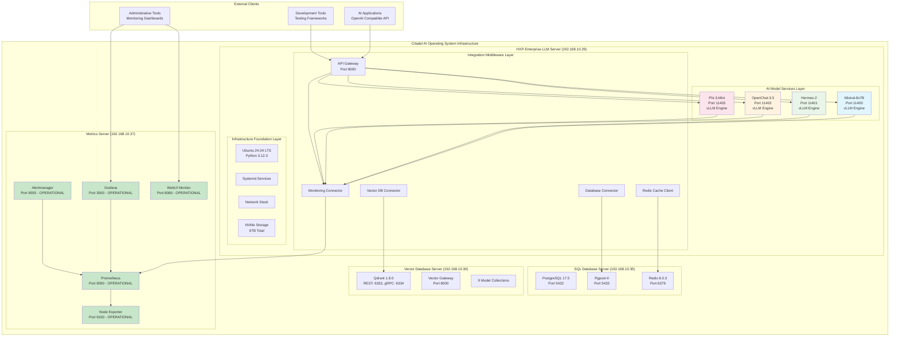
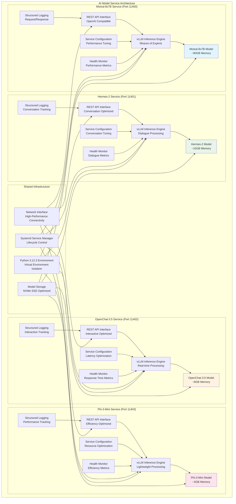
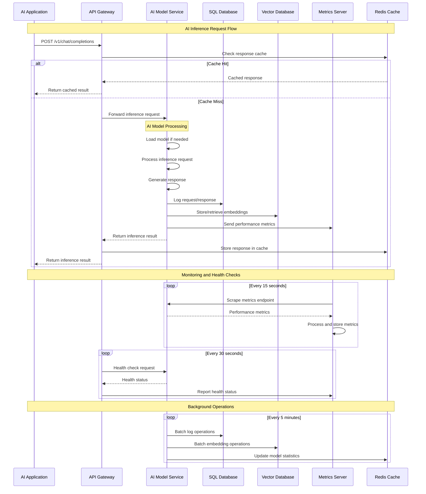
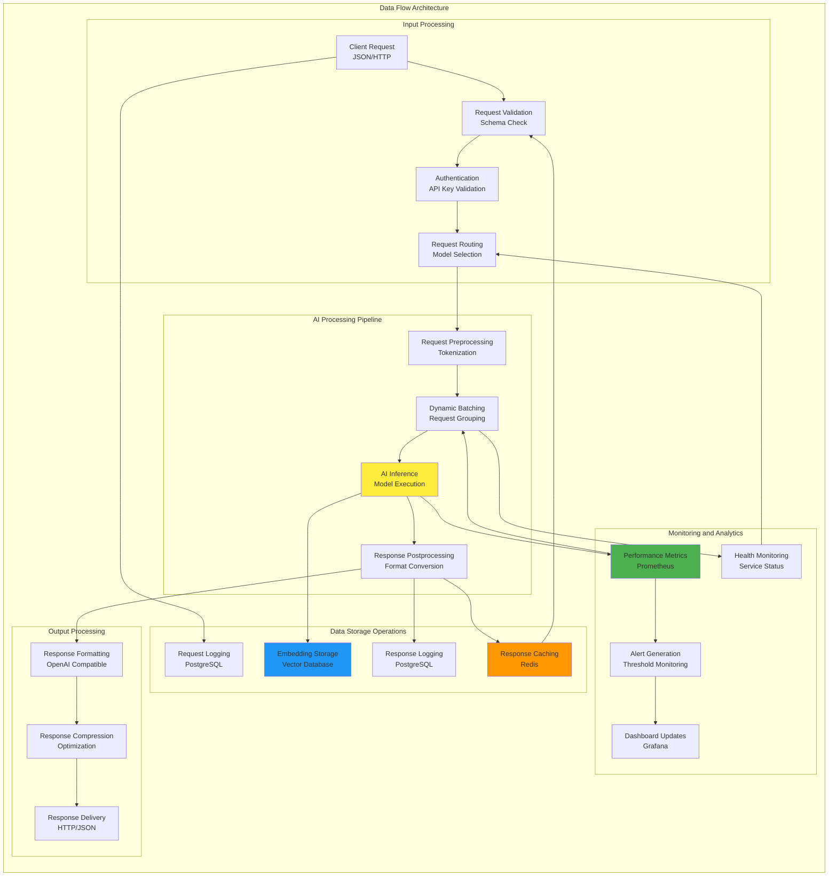
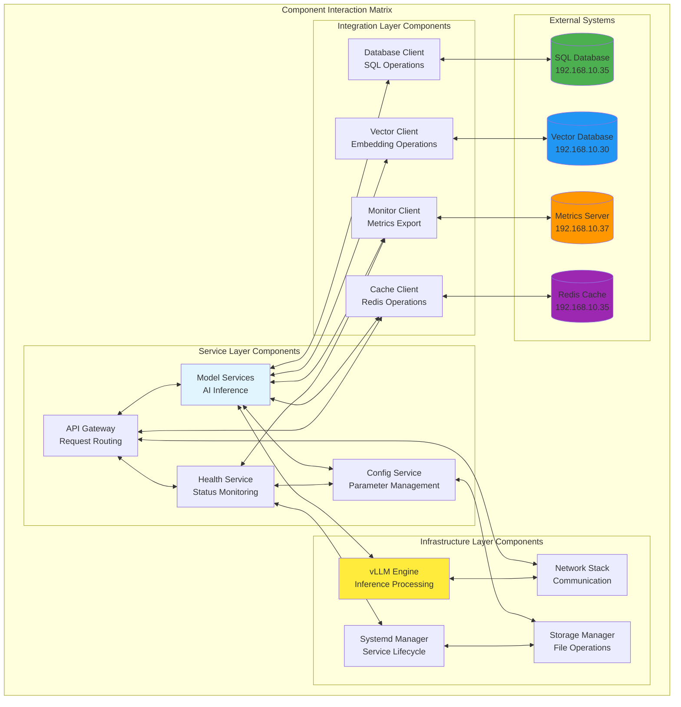

# HXP-Enterprise LLM Server - Architecture Document & Blueprint

**Document Version:** 1.0  
**Date:** 2025-07-18  
**Author:** Manus AI  
**Project:** Citadel AI Operating System - LLM Infrastructure Architecture  
**Server:** hx-llm-server-01 (192.168.10.29)  
**Implementation Phase:** Phase 3 - Primary LLM Server Architecture  
**Target Environment:** Development and Test  
**Architecture Classification:** Enterprise AI Infrastructure Blueprint  

---

## 1. Executive Summary

This Architecture Document provides comprehensive technical specifications and implementation blueprints for the HXP-Enterprise LLM Server, translating the Product Requirements Document (PRD) into detailed system design, component architecture, and operational procedures. The document serves as the authoritative technical reference for implementing a production-ready Large Language Model hosting infrastructure that seamlessly integrates with the existing Citadel AI Operating System ecosystem.

The HXP-Enterprise LLM Server represents a critical advancement in the HANA-X Inference Architecture, designed to host four specialized AI models—Mixtral-8x7B, Hermes-2, OpenChat-3.5, and Phi-3-Mini—while maintaining enterprise-grade performance, reliability, and operational excellence. The architecture emphasizes modular design, scalable deployment patterns, and comprehensive integration with existing infrastructure components including the SQL Database Server (192.168.10.35), Vector Database Server (192.168.10.30), and operational Metrics Server (192.168.10.37).

The architectural approach prioritizes systematic implementation through well-defined layers including infrastructure foundation, AI model services, integration middleware, and operational management. Each layer incorporates proven design patterns, performance optimization strategies, and comprehensive monitoring capabilities that ensure sustained operational excellence while providing clear pathways for future enhancement and scaling.

This document establishes the technical foundation for deploying a world-class AI inference platform that delivers consistent, high-performance AI services across diverse business applications while maintaining operational simplicity and integration readiness within the broader Citadel ecosystem.

### 1.1 Architecture Vision and Strategic Alignment

The HXP-Enterprise LLM Server architecture embodies a vision of unified AI inference capabilities that seamlessly integrate diverse Large Language Models into a cohesive, high-performance platform. This vision extends beyond simple model hosting to encompass intelligent workload distribution, adaptive performance optimization, and comprehensive operational management that positions the server as a foundational component of enterprise AI infrastructure.

The strategic alignment with the Citadel AI Operating System ensures that the LLM server operates as an integral component of a broader AI ecosystem, where specialized models work in concert with database services, vector processing capabilities, and monitoring infrastructure to deliver comprehensive AI-driven business solutions. The architecture anticipates future evolution in AI model architectures, deployment patterns, and integration requirements, ensuring sustained relevance and value delivery as the AI landscape continues to advance.

The design philosophy emphasizes operational excellence through systematic approaches to performance optimization, resource management, and service reliability. The architecture incorporates lessons learned from existing infrastructure deployments while introducing specialized capabilities required for AI model hosting, creating a balanced approach that leverages proven patterns while accommodating unique AI workload characteristics.

### 1.2 Technical Architecture Overview

The technical architecture implements a layered, service-oriented design that provides clear separation of concerns while enabling efficient communication and coordination between components. The architecture consists of four primary layers: Infrastructure Foundation, AI Model Services, Integration Middleware, and Operational Management, each designed to address specific technical requirements while contributing to overall system capabilities.

The Infrastructure Foundation layer provides the hardware and software platform required for AI model hosting, including optimized operating system configuration, Python runtime environment, and system-level services. This layer emphasizes performance optimization, resource management, and security configuration appropriate for development and test environments while providing clear pathways for production-grade enhancement.

The AI Model Services layer implements the core AI inference capabilities through specialized service instances for each hosted model. Each service operates as an independent systemd service with dedicated resources, configuration management, and performance optimization tailored to the specific computational characteristics of the hosted model. This layer utilizes vLLM as the primary inference engine, providing advanced optimization features including dynamic batching, memory management, and concurrent request handling.

The Integration Middleware layer facilitates communication with external infrastructure components and provides unified access patterns for client applications. This layer implements database connectivity, vector processing coordination, monitoring integration, and API gateway functionality that enables seamless integration with the broader Citadel ecosystem while providing standardized interfaces for application development.

The Operational Management layer provides comprehensive capabilities for system administration, performance monitoring, and operational oversight. This layer integrates with the operational Metrics Server to provide real-time visibility into system performance, proactive alerting for critical issues, and comprehensive logging capabilities that support troubleshooting and optimization activities.

---

## 2. System Architecture Design

### 2.1 Architectural Principles and Design Philosophy

The HXP-Enterprise LLM Server architecture is founded on a comprehensive set of design principles that guide technical decisions and ensure consistent implementation across all system components. These principles reflect industry best practices for enterprise AI infrastructure while accommodating the unique requirements of Large Language Model hosting and the specific operational context of the Citadel AI Operating System.

The principle of modular design ensures that system components are loosely coupled and highly cohesive, enabling independent development, testing, and deployment of individual services while maintaining clear interfaces and communication patterns. This modularity facilitates maintenance activities, performance optimization, and future enhancement by providing well-defined boundaries between system components and clear pathways for modification and extension.

The principle of scalability by design ensures that the architecture can accommodate growth in computational requirements, user demand, and model diversity without fundamental redesign. The architecture incorporates horizontal scaling capabilities, resource optimization strategies, and performance monitoring that enable effective capacity management and system growth. Scalability considerations influence component design, communication patterns, and resource allocation strategies throughout the system.

The principle of operational excellence emphasizes comprehensive monitoring, automated management, and systematic operational procedures that ensure reliable system operation with minimal manual intervention. This principle drives the integration with monitoring infrastructure, implementation of health checking capabilities, and development of automated recovery procedures that maintain system availability and performance under diverse operational conditions.

The principle of integration readiness ensures that the LLM server operates effectively within the broader Citadel ecosystem while providing standardized interfaces for future integration requirements. This principle influences API design, communication protocols, and data exchange patterns that enable seamless coordination with existing infrastructure components while accommodating future system evolution and expansion.

### 2.2 Layered Architecture Model

The layered architecture model provides systematic organization of system components based on their functional responsibilities and technical characteristics. This model enables clear separation of concerns while facilitating efficient communication and coordination between layers through well-defined interfaces and communication patterns.

The Infrastructure Foundation layer encompasses all hardware and software components required to support AI model hosting operations. This layer includes the Ubuntu 24.04 LTS operating system with optimized configuration for AI workloads, Python 3.12.3 runtime environment with specialized packages for AI inference, and system-level services including systemd for service management and networking components for communication with external systems. The foundation layer emphasizes performance optimization, resource management, and security configuration that provides a robust platform for AI model operations.

The AI Model Services layer implements the core AI inference capabilities through specialized service instances that host and serve individual AI models. Each service instance operates as an independent systemd service with dedicated configuration, resource allocation, and performance optimization tailored to the specific characteristics of the hosted model. This layer utilizes vLLM as the primary inference engine, providing advanced optimization features including dynamic batching, continuous batching, paged attention, and memory management that maximize inference performance while maintaining resource efficiency.

The Integration Middleware layer provides comprehensive connectivity and coordination capabilities that enable the LLM server to operate effectively within the broader Citadel ecosystem. This layer implements database connectivity for persistent storage operations, vector database integration for embedding and similarity search capabilities, monitoring integration for operational oversight, and API gateway functionality that provides standardized access patterns for client applications. The middleware layer abstracts the complexity of external system integration while providing reliable, efficient communication patterns.

The Operational Management layer encompasses all capabilities required for system administration, performance monitoring, and operational oversight. This layer includes health monitoring systems that track service status and performance characteristics, logging infrastructure that provides comprehensive audit trails and diagnostic information, configuration management systems that enable dynamic system configuration, and administrative interfaces that support operational activities. The management layer integrates with the operational Metrics Server to provide comprehensive visibility into system performance and operational status.

### 2.3 Service-Oriented Architecture Implementation

The service-oriented architecture implementation provides systematic organization of AI model hosting capabilities through independent, loosely-coupled services that can be developed, deployed, and managed independently while contributing to overall system functionality. This approach enables fine-grained resource management, specialized optimization, and flexible operational procedures that accommodate the diverse characteristics of different AI models.

Each AI model service operates as a complete, self-contained unit that includes the AI model itself, the vLLM inference engine, REST API interface, configuration management, health monitoring, and logging capabilities. This comprehensive service design ensures that each model can be optimized independently while maintaining consistent operational characteristics and integration patterns. The service design facilitates independent scaling, performance tuning, and maintenance activities that enable optimal resource utilization and operational efficiency.

The service communication architecture implements standardized patterns for inter-service communication and external system integration. Services communicate through well-defined REST API interfaces that provide consistent request and response patterns while accommodating model-specific capabilities and optimization parameters. The communication architecture includes comprehensive error handling, request validation, and response formatting that ensures reliable service interaction while providing detailed operational information for monitoring and debugging purposes.

The service lifecycle management architecture provides systematic approaches for service deployment, configuration, startup, shutdown, and maintenance activities. Each service implements standardized lifecycle procedures that enable automated management while accommodating model-specific requirements and optimization parameters. The lifecycle management includes dependency resolution, resource allocation, health validation, and graceful degradation capabilities that ensure reliable service operation under diverse operational conditions.

The service discovery and registration architecture enables dynamic service coordination and load balancing across multiple service instances. While the initial deployment focuses on single-instance services, the architecture provides clear pathways for implementing service discovery, load balancing, and failover capabilities that support horizontal scaling and high availability requirements as the system evolves and operational requirements expand.

### 2.4 Integration Architecture and Communication Patterns

The integration architecture provides comprehensive connectivity between the HXP-Enterprise LLM Server and external infrastructure components while maintaining performance, reliability, and security requirements. The integration design emphasizes standardized communication protocols, efficient data exchange patterns, and robust error handling that ensure seamless operation within the broader Citadel ecosystem.

Database integration architecture implements efficient connectivity with the SQL Database Server (192.168.10.35) for persistent storage of configuration data, usage statistics, operational logs, and application-specific information. The integration utilizes established connection pooling patterns through Pgpool-II, ensuring efficient resource utilization and optimal performance for database operations. The database integration includes comprehensive transaction management, error handling, and connection recovery capabilities that ensure reliable data operations under diverse operational conditions.

Vector database integration architecture provides seamless connectivity with the Vector Database Server (192.168.10.30) for embedding storage, similarity search operations, and semantic processing capabilities. The integration enables AI models to leverage vector processing capabilities for enhanced inference operations, knowledge retrieval, and context understanding. The vector integration implements efficient data exchange patterns, optimized query processing, and comprehensive result handling that maximize the value of combined AI inference and vector processing operations.

Monitoring integration architecture leverages the operational Metrics Server (192.168.10.37) to provide comprehensive observability and operational oversight capabilities. The integration implements standardized metrics collection, real-time performance monitoring, and proactive alerting that enable effective operational management and continuous optimization. The monitoring integration includes custom metrics for AI inference performance, resource utilization tracking, and operational health monitoring that provide detailed insights into system behavior and performance characteristics.

API integration architecture provides standardized interfaces for client applications and external systems to access AI inference capabilities. The API design follows OpenAI-compatible patterns to ensure broad compatibility with existing AI application frameworks while providing model-specific capabilities and optimization options. The API integration includes comprehensive authentication, authorization, rate limiting, and usage tracking that enable secure, efficient access to AI capabilities while supporting operational oversight and resource management requirements.

---

## 3. Component Architecture and Design

### 3.1 AI Model Service Component Design

The AI model service component architecture implements a standardized pattern for hosting AI models that ensures consistency, reliability, and optimal performance across all deployed models while accommodating the unique computational characteristics and requirements of each specific model. This component design provides the foundation for scalable, maintainable AI inference services that can be optimized independently while maintaining operational consistency.

Each AI model service component consists of multiple interconnected sub-components that work together to provide comprehensive AI inference capabilities. The vLLM inference engine serves as the core computational component, providing optimized AI model execution with advanced features including dynamic batching, continuous batching, paged attention, and memory management. The inference engine is specifically configured for each model based on its computational characteristics, memory requirements, and performance targets, ensuring optimal resource utilization and inference performance.

The REST API interface component provides standardized access to AI inference capabilities through OpenAI-compatible endpoints that ensure broad compatibility with existing application frameworks and development tools. The API interface implements comprehensive request validation, parameter processing, and response formatting that ensures reliable, consistent interaction patterns while accommodating model-specific capabilities and optimization parameters. The interface includes detailed error handling, logging, and monitoring integration that provides comprehensive operational visibility and diagnostic capabilities.

The configuration management component provides dynamic control over model behavior, performance parameters, and operational settings through structured configuration files and environment variables. The configuration system enables real-time parameter adjustment, performance tuning, and operational optimization without requiring service restarts or system downtime. The configuration management includes validation procedures, rollback capabilities, and audit trails that ensure reliable configuration control while maintaining system stability and operational continuity.

The health monitoring component provides comprehensive tracking of service status, performance characteristics, and operational health through standardized health check endpoints and metrics collection. The monitoring component tracks inference performance, resource utilization, error rates, and service availability, providing real-time visibility into service operation and early warning of potential issues. The health monitoring integrates with the operational Metrics Server to provide centralized monitoring and alerting capabilities.

### 3.2 vLLM Inference Engine Architecture

The vLLM inference engine architecture provides the computational foundation for AI model hosting, implementing advanced optimization techniques that maximize inference performance while maintaining resource efficiency and operational reliability. The vLLM engine serves as the primary interface between the hosted AI models and the service infrastructure, providing comprehensive capabilities for model loading, inference processing, and resource management.

The model loading and initialization architecture implements efficient procedures for loading AI models into memory and preparing them for inference operations. The loading process includes model validation, memory allocation, and initialization procedures that ensure optimal model performance while minimizing startup time and resource consumption. The loading architecture accommodates different model formats, sizes, and computational requirements while providing consistent initialization patterns and error handling procedures.

The dynamic batching architecture enables efficient processing of multiple inference requests simultaneously, maximizing computational throughput while maintaining acceptable response latency. The batching system intelligently groups requests based on computational requirements, available resources, and performance targets, optimizing resource utilization while ensuring fair request processing. The dynamic batching includes adaptive algorithms that adjust batching parameters based on current load patterns and performance characteristics.

The memory management architecture implements sophisticated strategies for efficient memory utilization during AI inference operations. The memory management includes paged attention mechanisms that optimize memory access patterns, intelligent caching strategies that reduce memory overhead, and garbage collection optimization that maintains consistent performance characteristics. The memory management is specifically tuned for each model based on its memory requirements and access patterns, ensuring optimal resource utilization while preventing memory exhaustion.

The concurrent request handling architecture enables simultaneous processing of multiple inference requests while maintaining performance isolation and resource fairness. The concurrency system implements intelligent request queuing, priority-based scheduling, and resource allocation strategies that ensure optimal performance under diverse load conditions. The concurrent processing includes comprehensive error isolation, request tracking, and performance monitoring that provide detailed operational visibility and diagnostic capabilities.

### 3.3 API Gateway and Interface Design

The API gateway and interface design provides standardized, efficient access to AI inference capabilities while maintaining compatibility with existing application frameworks and development tools. The gateway architecture implements comprehensive request processing, response formatting, and operational management capabilities that ensure reliable, high-performance API operations while providing detailed monitoring and diagnostic information.

The request processing architecture implements comprehensive validation, authentication, and routing capabilities that ensure secure, efficient access to AI inference services. The request processing includes parameter validation, format conversion, and routing logic that directs requests to appropriate model services based on request characteristics and service availability. The processing architecture includes comprehensive error handling, logging, and monitoring integration that provides detailed operational visibility and diagnostic capabilities.

The response formatting architecture ensures consistent, standardized response patterns that maintain compatibility with OpenAI API specifications while accommodating model-specific capabilities and optimization features. The response formatting includes comprehensive metadata, performance information, and usage statistics that enable effective monitoring and optimization activities. The formatting architecture includes streaming response capabilities for real-time applications and batch response processing for high-throughput scenarios.

The authentication and authorization architecture implements secure access control mechanisms that protect AI inference capabilities while maintaining development flexibility and operational efficiency. The authentication system includes API key management, request rate limiting, and usage tracking capabilities that enable secure access control while supporting operational oversight and resource management. The authorization architecture provides clear pathways for implementing more sophisticated access control mechanisms as security requirements evolve.

The load balancing and routing architecture enables intelligent distribution of requests across multiple model instances and service endpoints based on current load conditions, performance characteristics, and service availability. The routing system includes health-aware load balancing, failover capabilities, and performance optimization that ensure optimal resource utilization while maintaining service availability and response quality. The load balancing architecture provides foundation capabilities for horizontal scaling and high availability implementations.

### 3.4 Integration Middleware Components

The integration middleware components provide comprehensive connectivity and coordination capabilities that enable the HXP-Enterprise LLM Server to operate effectively within the broader Citadel ecosystem while maintaining performance, reliability, and operational efficiency. The middleware architecture implements standardized integration patterns, efficient communication protocols, and robust error handling that ensure seamless operation with external infrastructure components.

The database connectivity middleware implements efficient, reliable communication with the SQL Database Server (192.168.10.35) for persistent storage operations including configuration management, usage logging, and operational data storage. The database middleware utilizes connection pooling, transaction management, and error recovery capabilities that ensure optimal database performance while maintaining data consistency and operational reliability. The connectivity middleware includes comprehensive monitoring, logging, and diagnostic capabilities that provide detailed visibility into database operations and performance characteristics.

The vector database integration middleware provides seamless connectivity with the Vector Database Server (192.168.10.30) for embedding storage, similarity search operations, and semantic processing capabilities. The vector middleware implements efficient data exchange patterns, optimized query processing, and comprehensive result handling that enable AI models to leverage vector processing capabilities for enhanced inference operations. The integration middleware includes caching strategies, performance optimization, and error handling that ensure reliable vector operations while maintaining optimal performance characteristics.

The monitoring integration middleware leverages the operational Metrics Server (192.168.10.37) to provide comprehensive observability and operational oversight capabilities. The monitoring middleware implements standardized metrics collection, real-time performance tracking, and proactive alerting that enable effective operational management and continuous optimization. The integration includes custom metrics for AI inference performance, resource utilization monitoring, and operational health tracking that provide detailed insights into system behavior and performance patterns.

The caching middleware implements intelligent caching strategies that optimize performance for frequently accessed data and common inference patterns. The caching system includes response caching for repeated requests, model state caching for improved initialization performance, and configuration caching for reduced overhead during operation. The caching middleware integrates with Redis infrastructure to provide distributed caching capabilities while maintaining cache consistency and performance optimization across multiple service instances.

---

## 4. Infrastructure Architecture and Platform Design

### 4.1 Hardware Architecture and Resource Management

The hardware architecture for the HXP-Enterprise LLM Server provides a robust, high-performance foundation specifically designed to support the computational intensity and resource requirements of hosting multiple Large Language Models simultaneously. The architecture emphasizes optimal resource allocation, performance optimization, and scalability preparation while maintaining cost-effectiveness appropriate for development and test environments.

The CPU architecture centers on high-performance processors with substantial core counts and advanced instruction set support that enhance AI inference operations. The recommended configuration includes 16-32 CPU cores with support for AVX2 and AVX512 instruction sets, providing the computational capacity required for efficient AI model execution while maintaining sufficient resources for system operations and concurrent request processing. The CPU selection prioritizes high base frequencies and boost capabilities that ensure consistent performance under diverse load conditions while providing the computational headroom required for peak demand scenarios.

The memory architecture implements substantial RAM capacity with high-speed access characteristics that accommodate the memory-intensive requirements of hosting multiple AI models simultaneously. The configuration includes 128-256GB of DDR4-3200 or DDR5-4800 memory with ECC support for enhanced reliability and data integrity. The memory allocation strategy reserves 16GB for system operations, 80-120GB for AI model loading and execution, 24-32GB for inference processing and batching operations, and 8-16GB for caching and buffer operations, ensuring optimal resource utilization while preventing memory contention and performance degradation.

The storage architecture emphasizes high-speed NVMe SSD storage with substantial capacity for AI model files, system operations, and operational data. The configuration includes 2TB primary storage for operating system and application components, 4TB dedicated model storage for AI model files and caching operations, and optional 1TB high-speed cache storage using Optane or similar technology for enhanced performance. The storage design prioritizes read performance for model loading operations while providing sufficient write performance for logging, monitoring, and operational data management.

The network architecture implements high-bandwidth, low-latency connectivity that supports efficient communication with other infrastructure components while accommodating potential future scaling requirements. The configuration includes 1Gbps primary network connectivity for operational communication and optional 10Gbps connectivity for high-throughput scenarios. The network design includes dedicated management interfaces for out-of-band administration and monitoring, ensuring reliable operational access even during high-load conditions or system maintenance activities.

### 4.2 Operating System and Platform Configuration

The operating system and platform configuration provides a stable, secure, and optimized foundation for AI model hosting operations while maintaining consistency with existing Citadel infrastructure deployments. The platform configuration emphasizes performance optimization, security appropriate for development environments, and operational management capabilities that ensure reliable system operation and maintenance.

The Ubuntu 24.04 LTS operating system provides the foundational platform with long-term support, comprehensive package management, and proven stability for enterprise AI workloads. The operating system configuration includes kernel optimization for AI workloads, memory management tuning for large-scale applications, and network stack optimization for high-throughput operations. The system configuration includes essential development tools, monitoring utilities, and administrative capabilities that support effective system management and troubleshooting activities.

The Python 3.12.3 runtime environment provides the primary execution platform for AI inference operations with comprehensive package management and virtual environment isolation. The Python configuration includes specialized packages for AI inference including vLLM, PyTorch, Transformers, and supporting libraries optimized for performance and compatibility. The environment configuration utilizes isolated virtual environments that prevent dependency conflicts while enabling efficient package management and version control for different components and services.

The systemd service management configuration provides comprehensive lifecycle management for AI model services with automated startup, graceful shutdown, and restart capabilities. The service configuration includes resource limits, dependency management, and health monitoring that ensure reliable service operation while preventing resource exhaustion and system instability. The systemd configuration includes logging integration, monitoring capabilities, and administrative interfaces that support effective operational management and troubleshooting procedures.

The security configuration implements appropriate protection measures for development and test environments while maintaining operational flexibility and access requirements. The security model includes user isolation, file system permissions, network access controls, and audit logging that provide reasonable protection while enabling development activities and operational management. The security configuration provides clear pathways for enhancement with production-grade security measures as requirements evolve and deployment contexts change.

### 4.3 Network Architecture and Connectivity Design

The network architecture and connectivity design provides efficient, reliable communication between the HXP-Enterprise LLM Server and other infrastructure components while supporting diverse client access patterns and operational requirements. The network design emphasizes performance optimization, security appropriate for internal network environments, and scalability preparation for future growth and enhancement.

The internal network connectivity utilizes the established 192.168.10.0/24 network segment with the LLM server positioned at 192.168.10.29 for optimal integration with existing infrastructure components. The network configuration includes high-bandwidth connectivity to the SQL Database Server (192.168.10.35), Vector Database Server (192.168.10.30), and Metrics Server (192.168.10.37), ensuring efficient data exchange and operational coordination. The network design includes redundancy considerations and performance optimization that support reliable communication under diverse operational conditions.

The port allocation strategy implements systematic assignment of network ports for different services and operational functions. The AI model services utilize dedicated ports (11400-11403) for direct model access, enabling efficient client connectivity and load balancing capabilities. The management and monitoring services utilize standardized ports (8000, 9090, 8080) for administrative access, metrics collection, and health monitoring, providing clear separation between operational and administrative traffic while maintaining consistent access patterns.

The communication protocol implementation emphasizes RESTful API patterns with JSON request and response formatting that ensure broad compatibility with existing application frameworks and development tools. The protocol design includes comprehensive error handling, request validation, and response formatting that provide reliable communication while supporting detailed operational monitoring and diagnostic capabilities. The protocol implementation includes streaming capabilities for real-time applications and batch processing support for high-throughput scenarios.

The network security architecture implements appropriate protection measures for internal network environments while maintaining operational flexibility and development requirements. The security model includes network segmentation, access control lists, and traffic monitoring that provide reasonable protection while enabling efficient communication and operational management. The network security design provides clear pathways for enhancement with production-grade security measures including encryption, authentication, and intrusion detection as requirements evolve.

### 4.4 Storage Architecture and Data Management

The storage architecture and data management design provides efficient, reliable storage capabilities that support AI model hosting operations, operational data management, and system administration requirements. The storage design emphasizes performance optimization, capacity management, and data protection while maintaining operational efficiency and administrative simplicity.

The AI model storage architecture implements high-performance storage systems specifically optimized for AI model files, checkpoints, and related data. The storage configuration includes dedicated NVMe SSD storage with optimized file system configuration for large file operations, efficient caching strategies for frequently accessed models, and intelligent prefetching capabilities that minimize model loading times. The model storage includes version management, integrity validation, and backup procedures that ensure reliable model availability while supporting operational maintenance and enhancement activities.

The operational data storage architecture provides efficient storage for system logs, monitoring data, configuration files, and administrative information. The storage configuration includes structured organization of operational data, automated retention policies, and efficient search capabilities that support troubleshooting and operational analysis activities. The operational storage includes backup procedures, archival capabilities, and recovery mechanisms that ensure data protection while maintaining operational efficiency and administrative accessibility.

The caching architecture implements intelligent caching strategies that optimize performance for frequently accessed data and common operational patterns. The caching system includes model state caching for improved initialization performance, response caching for repeated inference requests, and configuration caching for reduced operational overhead. The caching architecture integrates with Redis infrastructure to provide distributed caching capabilities while maintaining cache consistency and performance optimization across multiple service instances.

The backup and recovery architecture provides comprehensive data protection capabilities that ensure business continuity and operational resilience. The backup system includes automated backup scheduling for critical data, incremental backup strategies for operational efficiency, and validated recovery procedures for reliable data restoration. The backup architecture includes offsite storage capabilities, retention management, and recovery testing that ensure comprehensive data protection while maintaining operational efficiency and administrative simplicity.

---

## 5. Performance Architecture and Optimization

### 5.1 Performance Requirements and Targets

The performance architecture for the HXP-Enterprise LLM Server establishes comprehensive performance requirements and optimization strategies that ensure optimal AI inference capabilities while maintaining system stability, resource efficiency, and operational reliability. The performance design addresses multiple dimensions including response latency, throughput capacity, resource utilization, and concurrent request handling across all hosted AI models.

The response latency requirements establish specific performance targets for each hosted AI model based on their computational characteristics and intended use cases within the Citadel ecosystem. Mixtral-8x7B targets average response times under 2000 milliseconds for complex reasoning tasks with 95th percentile response times under 3000 milliseconds, ensuring acceptable performance for sophisticated analytical applications while maintaining reasonable interactive responsiveness. The latency targets account for the model's mixture-of-experts architecture and substantial computational requirements while providing performance levels suitable for business applications requiring advanced AI capabilities.

Hermes-2 conversational AI performance targets average response times under 1500 milliseconds for dialogue interactions with 95th percentile response times under 2500 milliseconds, ensuring smooth conversational flow while accommodating the model's sophisticated context processing capabilities. The performance targets include conversation coherence measurement and context retention validation that ensure high-quality conversational experiences while maintaining acceptable response times for interactive applications and real-time communication scenarios.

OpenChat-3.5 interactive dialogue performance targets average response times under 1000 milliseconds with 95th percentile response times under 1500 milliseconds, emphasizing real-time responsiveness for interactive applications while maintaining response quality and system stability. The performance targets include concurrent user handling capabilities and response quality consistency measurement that ensure optimal interactive performance while supporting multiple simultaneous users and diverse interaction patterns.

Phi-3-Mini efficiency performance targets average response times under 500 milliseconds with 95th percentile response times under 750 milliseconds, leveraging the model's lightweight architecture for rapid processing while maintaining AI capability quality. The performance targets include resource utilization efficiency measurement and throughput capacity validation that demonstrate the model's efficiency advantages while ensuring optimal performance for applications requiring rapid AI processing capabilities.

### 5.2 Resource Optimization and Management Strategies

The resource optimization and management strategies implement sophisticated approaches for maximizing hardware utilization while maintaining optimal performance characteristics across all hosted AI models. The optimization strategies address CPU utilization, memory management, storage access patterns, and network resource allocation through intelligent algorithms and adaptive management techniques.

The CPU optimization strategies implement intelligent scheduling and allocation algorithms that ensure optimal processing resource distribution across hosted models while maintaining system responsiveness and operational stability. The CPU management includes priority-based scheduling that allocates processing resources based on request characteristics and performance requirements, load balancing algorithms that distribute computational load across available cores, and dynamic resource allocation that adapts to current workload patterns and performance demands. The CPU optimization includes thermal management considerations and power efficiency strategies that ensure sustained performance while maintaining hardware reliability and operational efficiency.

The memory optimization strategies address the substantial RAM requirements of hosting multiple large language models simultaneously while ensuring efficient allocation and optimal performance characteristics. The memory management includes intelligent model loading strategies that optimize memory utilization during initialization, efficient memory sharing techniques that reduce overall memory consumption where possible, and dynamic allocation algorithms that adapt memory distribution based on current usage patterns and performance requirements. The memory optimization includes garbage collection tuning, cache management strategies, and memory leak prevention techniques that maintain consistent performance while preventing memory exhaustion and system instability.

The storage optimization strategies implement efficient access patterns and caching mechanisms that minimize storage latency while maximizing throughput for AI model operations. The storage management includes intelligent caching algorithms that optimize access to frequently used model components, prefetching strategies that anticipate storage requirements based on usage patterns, and efficient file organization techniques that minimize access times and maximize storage utilization. The storage optimization includes SSD wear leveling considerations, backup integration strategies, and performance monitoring capabilities that ensure sustained storage performance while maintaining data integrity and operational reliability.

The network optimization strategies ensure efficient communication with external infrastructure components while managing bandwidth utilization and connection efficiency. The network management includes connection pooling strategies that optimize database and vector database connectivity, intelligent request routing algorithms that minimize network latency, and bandwidth management techniques that ensure fair resource allocation across different types of network traffic. The network optimization includes monitoring capabilities, performance analysis tools, and adaptive algorithms that continuously optimize network performance based on operational patterns and requirements.

### 5.3 Scalability Architecture and Capacity Planning

The scalability architecture provides comprehensive approaches for accommodating growth in computational requirements, user demand, and model diversity while maintaining performance characteristics and operational efficiency. The scalability design emphasizes horizontal scaling capabilities, vertical scaling options, and performance monitoring that enable proactive capacity management and efficient resource utilization as system requirements evolve.

The horizontal scaling architecture enables deployment of additional server instances to increase overall system capacity while maintaining consistent performance characteristics and operational procedures. The scaling design includes load balancing capabilities that distribute requests across multiple server instances, service discovery mechanisms that enable dynamic server registration and coordination, and data consistency strategies that ensure reliable operation across distributed deployments. The horizontal scaling includes automated deployment procedures, configuration management strategies, and monitoring integration that simplify operational management of scaled deployments while maintaining performance and reliability standards.

The vertical scaling architecture provides systematic approaches for increasing hardware resources within existing server deployments to improve performance and capacity. The vertical scaling includes memory expansion strategies that accommodate additional AI models or larger model variants, CPU upgrade procedures that increase computational capacity for higher throughput requirements, and storage enhancement options that provide additional capacity for model storage and operational data. The vertical scaling includes performance validation procedures, configuration optimization strategies, and operational testing that ensure optimal resource utilization following hardware upgrades.

The capacity planning architecture implements systematic approaches for monitoring resource utilization, predicting capacity requirements, and planning infrastructure expansion based on usage trends and performance analysis. The capacity planning includes automated monitoring systems that track resource utilization patterns, trend analysis algorithms that predict future capacity requirements, and alerting mechanisms that provide early warning of approaching capacity limits. The capacity planning includes cost optimization strategies, performance impact analysis, and implementation planning that enable informed decision-making regarding infrastructure expansion and resource allocation.

The performance monitoring architecture provides comprehensive visibility into system performance characteristics, resource utilization patterns, and operational efficiency metrics that support ongoing optimization and capacity planning activities. The monitoring system includes real-time performance tracking, historical trend analysis, and predictive analytics that enable proactive performance management and optimization. The performance monitoring includes custom metrics for AI inference operations, resource utilization tracking, and operational health indicators that provide detailed insights into system behavior and performance patterns under diverse operational conditions.

### 5.4 Optimization Techniques and Performance Tuning

The optimization techniques and performance tuning strategies implement advanced approaches for maximizing AI inference performance while maintaining resource efficiency and operational reliability. The optimization strategies address multiple aspects of system performance including AI model execution, resource allocation, communication efficiency, and operational overhead through systematic tuning and continuous improvement processes.

The AI model optimization techniques implement advanced strategies for maximizing inference performance while maintaining response quality and resource efficiency. The model optimization includes quantization techniques that reduce memory requirements while preserving model accuracy, pruning strategies that eliminate unnecessary model parameters to improve execution speed, and optimization algorithms that enhance computational efficiency during inference operations. The model optimization includes performance validation procedures, accuracy testing protocols, and rollback capabilities that ensure optimization activities improve performance without compromising AI capability quality.

The vLLM engine optimization implements sophisticated tuning strategies that maximize the performance of the inference engine while accommodating the diverse characteristics of different AI models. The engine optimization includes batching parameter tuning that optimizes request processing efficiency, memory management configuration that maximizes available resources while preventing exhaustion, and concurrency settings that optimize parallel processing capabilities. The vLLM optimization includes performance benchmarking procedures, configuration validation protocols, and adaptive tuning algorithms that continuously optimize engine performance based on operational patterns and requirements.

The system-level optimization techniques address operating system configuration, hardware utilization, and infrastructure integration to maximize overall system performance. The system optimization includes kernel parameter tuning for AI workloads, file system optimization for large file operations, and network stack configuration for high-throughput communication. The system optimization includes performance monitoring integration, benchmark validation procedures, and rollback capabilities that ensure optimization activities improve performance while maintaining system stability and operational reliability.

The application-level optimization strategies implement efficient algorithms and design patterns that minimize operational overhead while maximizing functional capabilities. The application optimization includes API optimization for reduced latency and improved throughput, database query optimization for efficient data operations, and caching strategies that minimize redundant processing and data access operations. The application optimization includes performance profiling tools, bottleneck identification procedures, and continuous improvement processes that enable ongoing performance enhancement based on operational experience and evolving requirements.

---

## 6. Integration Architecture and External Connectivity

### 6.1 Database Integration Architecture

The database integration architecture provides comprehensive connectivity and coordination with the SQL Database Server (192.168.10.35) to support persistent storage requirements, configuration management, and operational data handling for the HXP-Enterprise LLM Server. The integration design emphasizes efficient data operations, reliable connectivity, and optimal performance while maintaining data consistency and operational reliability across the entire Citadel ecosystem.

The PostgreSQL connectivity architecture implements efficient, reliable communication with the PostgreSQL 17.5 database through Pgpool-II connection pooling on port 5433. The connectivity design utilizes established connection patterns including connection pooling for optimal resource utilization, transaction management for data consistency, and error recovery mechanisms for operational reliability. The database connectivity includes comprehensive monitoring of connection health, performance tracking for query operations, and automated recovery procedures that ensure sustained database availability and optimal performance characteristics.

The data schema integration implements systematic organization of LLM-specific data within the existing database structure while maintaining consistency with established data organization patterns. The schema design includes dedicated tables for model request logging, performance metrics storage, configuration management, and operational audit trails. The schema integration accommodates the unique data requirements of AI inference operations while providing efficient query patterns, appropriate indexing strategies, and data retention policies that support both operational requirements and analytical capabilities.

The connection pooling architecture leverages the existing Pgpool-II infrastructure to provide efficient database connectivity while minimizing resource overhead and maximizing connection reliability. The pooling configuration includes optimized pool sizes based on expected concurrent operations, connection timeout settings that balance performance with resource conservation, and health monitoring capabilities that ensure connection pool reliability. The pooling architecture includes failover capabilities, load balancing across database instances, and comprehensive monitoring that provides visibility into connection pool performance and utilization patterns.

The transaction management architecture implements comprehensive strategies for ensuring data consistency and reliability during database operations while maintaining optimal performance characteristics. The transaction design includes appropriate isolation levels for different types of operations, deadlock prevention strategies, and rollback capabilities that ensure data integrity under diverse operational conditions. The transaction management includes performance optimization techniques, monitoring capabilities, and error handling procedures that provide reliable database operations while maintaining operational efficiency and system stability.

### 6.2 Vector Database Integration Architecture

The vector database integration architecture provides seamless connectivity and coordination with the Vector Database Server (192.168.10.30) to enable AI models to leverage vector processing capabilities for enhanced inference operations, knowledge retrieval, and semantic processing. The integration design emphasizes efficient data exchange, optimal performance, and comprehensive functionality while maintaining operational reliability and system stability.

The Qdrant connectivity architecture implements efficient communication with the Qdrant 1.8.0 vector database through both REST (port 6333) and gRPC (port 6334) interfaces, providing flexible access patterns based on operational requirements and performance characteristics. The connectivity design includes intelligent protocol selection based on operation types, connection pooling for optimal resource utilization, and comprehensive error handling that ensures reliable vector operations. The Qdrant integration includes health monitoring capabilities, performance tracking, and automated recovery procedures that maintain vector database connectivity and operational reliability.

The vector collection management architecture implements systematic organization and utilization of the nine configured vector collections corresponding to different AI models and use cases. The collection management includes efficient embedding generation and storage procedures, optimized similarity search operations, and comprehensive metadata handling that supports diverse vector processing requirements. The collection architecture includes performance optimization strategies, capacity management procedures, and monitoring capabilities that ensure optimal vector database utilization while maintaining operational efficiency.

The embedding generation integration enables AI models to create and store vector embeddings for text processing, document analysis, and semantic search applications. The embedding integration includes efficient generation algorithms, optimized storage procedures, and comprehensive indexing strategies that ensure optimal performance for vector operations. The embedding generation includes batch processing capabilities, real-time generation options, and quality validation procedures that ensure reliable embedding operations while maintaining performance characteristics appropriate for diverse application requirements.

The similarity search integration provides AI models with access to sophisticated semantic search capabilities that enhance response generation, knowledge retrieval, and context understanding. The search integration includes optimized query processing, intelligent result ranking, and comprehensive filtering capabilities that ensure relevant, accurate search results while maintaining optimal performance. The similarity search includes caching strategies, performance optimization techniques, and result validation procedures that provide reliable search capabilities while supporting diverse application requirements and usage patterns.

### 6.3 Monitoring and Observability Integration

The monitoring and observability integration architecture leverages the operational Metrics Server (192.168.10.37) to provide comprehensive visibility into LLM server performance, operational health, and system behavior while enabling proactive management and continuous optimization. The monitoring integration design emphasizes real-time data collection, comprehensive analysis capabilities, and actionable insights that support effective operational management and performance optimization.

The Prometheus metrics integration implements comprehensive collection and export of performance metrics, resource utilization data, and operational health indicators through standardized metrics endpoints and collection procedures. The metrics integration includes custom metrics for AI inference performance, system resource utilization tracking, and operational health monitoring that provide detailed insights into system behavior and performance characteristics. The Prometheus integration includes automated metrics collection, efficient data storage, and comprehensive retention policies that ensure sustained monitoring capabilities while maintaining optimal performance overhead.

The Grafana dashboard integration provides comprehensive visualization and analysis capabilities for LLM server performance data, operational metrics, and system health indicators through customized dashboards and real-time monitoring interfaces. The dashboard integration includes specialized visualizations for AI inference performance, resource utilization trends, and operational status indicators that enable effective monitoring and analysis. The Grafana integration includes interactive dashboards, customizable views, and automated refresh capabilities that provide comprehensive operational visibility while supporting diverse monitoring requirements and user preferences.

The Alertmanager integration implements proactive alerting and notification capabilities for critical system conditions, performance degradation, and operational issues through comprehensive alert rules and notification procedures. The alerting integration includes intelligent alert grouping, escalation procedures, and notification routing that ensure appropriate response to operational issues while minimizing alert fatigue and operational overhead. The Alertmanager integration includes customizable alert thresholds, multiple notification channels, and comprehensive alert history that support effective incident management and operational response procedures.

The logging integration provides comprehensive collection, storage, and analysis of operational logs, error messages, and diagnostic information through structured logging formats and centralized log management. The logging integration includes intelligent log aggregation, efficient storage management, and comprehensive search capabilities that support troubleshooting and operational analysis activities. The logging integration includes log correlation capabilities, retention management, and analysis tools that provide detailed operational insights while supporting compliance requirements and operational oversight activities.

### 6.4 API Integration and External Connectivity

The API integration and external connectivity architecture provides standardized, efficient interfaces for client applications and external systems to access AI inference capabilities while maintaining compatibility, security, and operational efficiency. The API design emphasizes OpenAI compatibility, comprehensive functionality, and robust operational characteristics that support diverse integration requirements and application scenarios.

The OpenAI-compatible API implementation provides standardized endpoints and request/response patterns that ensure broad compatibility with existing AI application frameworks and development tools. The API implementation includes comprehensive endpoint coverage for completions, chat completions, model information, and health checking that support diverse application requirements. The OpenAI compatibility includes consistent error handling, standardized response formatting, and comprehensive metadata that ensure reliable integration while providing detailed operational information for monitoring and optimization activities.

The authentication and authorization architecture implements secure access control mechanisms that protect AI inference capabilities while maintaining operational flexibility and development efficiency. The authentication system includes API key management, request validation, and usage tracking capabilities that enable secure access control while supporting operational oversight and resource management. The authorization architecture includes rate limiting, quota management, and access logging that provide comprehensive security while maintaining performance characteristics appropriate for development and operational requirements.

The request routing and load balancing architecture enables intelligent distribution of API requests across multiple model services and endpoints based on current load conditions, performance characteristics, and service availability. The routing system includes health-aware load balancing, failover capabilities, and performance optimization that ensure optimal resource utilization while maintaining service availability and response quality. The load balancing architecture includes monitoring integration, performance tracking, and adaptive algorithms that continuously optimize request distribution based on operational patterns and performance requirements.

The response caching and optimization architecture implements intelligent caching strategies that improve API performance while reducing computational overhead and resource utilization. The caching system includes response caching for repeated requests, intelligent cache invalidation, and performance optimization that ensure optimal API performance while maintaining response accuracy and freshness. The caching architecture includes distributed caching capabilities, cache consistency management, and performance monitoring that provide comprehensive caching benefits while maintaining operational reliability and data consistency.

---

## 7. Security Architecture and Compliance Framework

### 7.1 Security Architecture for Development Environment

The security architecture for the HXP-Enterprise LLM Server implements a development-friendly approach that balances accessibility with appropriate protection measures for the internal network environment. The security framework emphasizes practical protection strategies that support development activities while maintaining reasonable security boundaries and providing clear pathways for production-grade security enhancement as deployment contexts evolve and security requirements mature.

The network security architecture relies primarily on internal network isolation within the 192.168.10.0/24 network segment with firewall configurations remaining disabled to facilitate development and testing activities. This approach provides reasonable protection through network segmentation while enabling flexible access patterns required for development workflows, integration testing, and operational validation procedures. The network isolation strategy assumes that the internal network environment provides sufficient protection for development activities while acknowledging that additional security measures will be required for production deployment scenarios.

The access control architecture implements basic authentication and authorization mechanisms that provide reasonable protection while maintaining development flexibility and operational efficiency. The access control approach includes API key management for service access, basic user authentication for administrative interfaces, and request logging for operational oversight and security monitoring. The access control system provides clear documentation of current security limitations and includes detailed recommendations for production security enhancement including advanced authentication, role-based access control, and multi-factor authentication capabilities.

The data protection architecture addresses the handling of AI model data, user interactions, and operational information with appropriate protection measures that ensure data integrity while supporting development and testing requirements. The data protection approach emphasizes secure data handling procedures, appropriate access controls, and comprehensive audit trails that support both operational requirements and future compliance needs. The data protection framework includes clear data classification procedures, handling guidelines, and retention policies that provide systematic approaches for managing different types of data while ensuring appropriate protection measures.

The audit and monitoring architecture provides comprehensive logging of access patterns, operational activities, and administrative actions with detailed log retention and analysis capabilities. The audit system provides visibility into system usage patterns while supporting future security enhancement and compliance reporting requirements. The audit framework includes structured log formatting, secure log storage, and comprehensive search capabilities that facilitate security monitoring and incident investigation while supporting operational oversight and compliance preparation activities.

### 7.2 Authentication and Authorization Framework

The authentication and authorization framework provides systematic approaches for controlling access to AI inference capabilities while maintaining operational efficiency and development flexibility. The framework emphasizes practical security measures that protect system resources while enabling effective development and testing activities, with clear pathways for implementing more sophisticated security mechanisms as requirements evolve.

The API key authentication system implements secure access control for AI inference services through standardized API key management, validation procedures, and usage tracking capabilities. The API key system includes key generation, distribution, and revocation procedures that enable effective access management while maintaining operational simplicity. The authentication system includes comprehensive logging of access attempts, usage patterns, and security events that provide visibility into system access while supporting security monitoring and operational oversight activities.

The request authorization architecture implements systematic validation of API requests based on authentication credentials, resource requirements, and operational policies. The authorization system includes request validation procedures, resource access controls, and usage limitation mechanisms that ensure appropriate access to AI capabilities while preventing abuse and resource exhaustion. The authorization framework includes comprehensive audit trails, access logging, and policy enforcement that provide detailed security oversight while maintaining operational efficiency and system performance.

The session management architecture provides secure handling of user sessions and authentication state for administrative interfaces and operational tools. The session management includes secure session creation, timeout management, and session invalidation procedures that ensure appropriate security while maintaining operational usability. The session system includes comprehensive monitoring, security event logging, and anomaly detection that provide security oversight while supporting effective administrative access and operational management.

The role-based access control preparation provides foundational capabilities for implementing sophisticated access control mechanisms as security requirements evolve and operational contexts change. The RBAC preparation includes user role definitions, permission management frameworks, and access policy structures that enable systematic implementation of advanced access control capabilities. The RBAC framework includes clear migration pathways, compatibility considerations, and operational procedures that ensure smooth transition to more sophisticated security mechanisms while maintaining operational continuity and system functionality.

### 7.3 Data Security and Privacy Protection

The data security and privacy protection framework addresses the comprehensive handling of sensitive information including AI model data, user interactions, operational logs, and administrative information while ensuring appropriate protection measures and compliance preparation. The framework emphasizes systematic data handling procedures, comprehensive protection strategies, and clear governance policies that support both operational requirements and evolving compliance obligations.

The AI model data protection architecture implements secure storage, access control, and integrity validation for AI model files, configuration data, and related operational information. The model data protection includes secure file permissions, access logging, and integrity checking procedures that ensure model data remains secure and unmodified while supporting operational requirements and maintenance activities. The protection architecture includes backup procedures, version management, and recovery capabilities that ensure data availability while maintaining security and integrity standards.

The user interaction data protection addresses the handling of API requests, responses, conversation data, and usage information with appropriate privacy measures and retention policies. The interaction data protection includes request logging procedures, response caching policies, and data retention management that balance operational requirements with privacy considerations and future compliance needs. The protection framework includes data anonymization capabilities, access controls, and audit procedures that ensure appropriate privacy protection while supporting operational analysis and system optimization activities.

The operational data security covers system logs, performance metrics, configuration files, and administrative information with secure storage, appropriate access controls, and comprehensive retention management. The operational data protection includes log security procedures, metrics protection strategies, and administrative data access controls that ensure operational data remains secure while supporting system administration and monitoring requirements. The protection framework includes backup procedures, archival capabilities, and recovery mechanisms that ensure data protection while maintaining operational efficiency and administrative accessibility.

The privacy compliance preparation provides foundational capabilities for meeting future regulatory requirements and privacy obligations while maintaining operational efficiency and development flexibility. The compliance preparation includes data classification procedures, handling guidelines, and retention policies that provide systematic approaches for managing privacy requirements. The privacy framework includes clear documentation procedures, consent management capabilities, and data subject rights support that enable effective privacy compliance while maintaining operational effectiveness and system functionality.

### 7.4 Security Enhancement Roadmap

The security enhancement roadmap provides systematic approaches for evolving the security architecture from development-friendly configuration to production-grade security implementation while maintaining operational continuity and system functionality. The roadmap emphasizes incremental enhancement, comprehensive testing, and operational validation that ensures effective security improvement while minimizing operational disruption and maintaining development productivity.

The network security enhancement roadmap includes systematic implementation of firewall configurations, network segmentation, and access control mechanisms with comprehensive testing and validation procedures. The network security enhancement includes perimeter security implementation, internal network segmentation, and monitoring system deployment that provide comprehensive network protection while maintaining operational connectivity and performance characteristics. The network enhancement includes intrusion detection capabilities, traffic analysis tools, and automated response mechanisms that provide proactive security monitoring and incident response capabilities.

The authentication and authorization enhancement roadmap includes implementation of advanced user management, role-based access control, and multi-factor authentication capabilities with systematic deployment and user training procedures. The authentication enhancement includes identity management systems, access control frameworks, and security monitoring capabilities that provide comprehensive access protection while maintaining operational efficiency and user productivity. The authorization enhancement includes policy management tools, access review procedures, and compliance reporting capabilities that ensure effective access control while supporting audit requirements and operational oversight.

The encryption implementation roadmap includes systematic deployment of data encryption at rest, communication encryption, and key management procedures with comprehensive integration and operational validation. The encryption enhancement includes storage encryption capabilities, network communication protection, and key management systems that provide comprehensive data protection while maintaining system performance and operational accessibility. The encryption implementation includes certificate management, key rotation procedures, and compliance validation that ensure effective encryption while supporting operational requirements and regulatory compliance.

The security monitoring enhancement roadmap includes implementation of comprehensive security event monitoring, intrusion detection, and automated response capabilities with integration into existing monitoring infrastructure. The monitoring enhancement includes threat detection systems, security analytics capabilities, and incident response procedures that provide comprehensive security oversight while maintaining operational efficiency and system performance. The security monitoring includes compliance reporting, audit trail management, and forensic capabilities that support security investigation and regulatory compliance while maintaining operational effectiveness and system reliability.

---

## 8. Operational Architecture and Management Framework

### 8.1 Service Management and Administration Architecture

The service management and administration architecture provides comprehensive capabilities for effective operation, maintenance, and optimization of the HXP-Enterprise LLM Server within existing operational frameworks while accommodating the unique requirements of AI model hosting and management. The architecture emphasizes automation, standardization, and integration with established operational procedures while providing specialized capabilities for AI infrastructure management.

The systemd service management architecture implements standardized service lifecycle control for each hosted AI model with automated startup sequences, graceful shutdown procedures, and intelligent restart capabilities that ensure reliable service operation under diverse operational conditions. The service configuration includes comprehensive dependency management that ensures proper startup ordering, resource limit enforcement that prevents resource exhaustion, and health monitoring integration that enables proactive service management. The systemd configuration includes security isolation features, logging integration, and administrative interfaces that support effective service administration while maintaining system security and operational visibility.

The configuration management architecture implements centralized control of model parameters, system settings, and operational configurations with comprehensive version control, validation procedures, and rollback capabilities. The configuration management approach includes dynamic configuration updates that enable real-time parameter adjustment without service interruption, comprehensive validation procedures that ensure configuration integrity, and audit trails that provide complete visibility into configuration changes. The configuration system includes template management, environment-specific configurations, and automated deployment procedures that ensure consistent configuration management while supporting diverse operational requirements and deployment scenarios.

The administrative interface architecture provides comprehensive control capabilities including model management, performance monitoring, and operational oversight through both command-line and web-based interfaces. The administrative capabilities include real-time status monitoring that provides immediate visibility into service health, configuration management tools that enable efficient parameter adjustment, and operational control interfaces that support routine maintenance and troubleshooting activities. The administrative architecture includes role-based access controls, audit logging, and integration with existing administrative tools that ensure effective system administration while maintaining security and operational consistency.

The backup and recovery architecture ensures comprehensive data protection including model checkpoints, configuration backups, and operational data preservation with automated backup scheduling and validated recovery procedures. The backup approach includes incremental backup strategies that optimize storage utilization and backup performance, offsite storage capabilities that ensure data protection against local failures, and comprehensive recovery testing that validates backup integrity and recovery procedures. The backup architecture includes retention management, recovery automation, and disaster recovery planning that ensure reliable data protection and business continuity capabilities.

### 8.2 Monitoring and Observability Framework

The monitoring and observability framework leverages the operational Metrics Server (192.168.10.37) to provide comprehensive visibility into LLM server performance, operational health, and system behavior while enabling proactive management and continuous optimization. The framework emphasizes real-time monitoring, comprehensive analysis, and actionable insights that support effective operational management and performance optimization activities.

The performance metrics collection architecture implements comprehensive tracking of AI inference performance, system resource utilization, and operational statistics for each hosted model with real-time data collection and historical trend analysis. The metrics collection includes detailed inference performance data such as response latency tracking, throughput measurement, and error rate monitoring that provide comprehensive performance visibility. The collection system includes resource utilization tracking for CPU, memory, storage, and network resources that enables effective capacity management and optimization activities.

The health monitoring architecture implements comprehensive system health checks including model availability validation, API endpoint responsiveness testing, and infrastructure connectivity verification with automated alerting and escalation procedures. The health monitoring includes service status tracking that provides immediate visibility into service availability, dependency validation that ensures external system connectivity, and performance threshold monitoring that enables proactive issue detection. The health system includes automated recovery procedures, escalation protocols, and comprehensive status reporting that ensure effective operational management and incident response.

The operational dashboard architecture provides comprehensive visualization of system performance, resource utilization, and operational metrics with customizable views and real-time updates that support effective operational oversight and decision-making. The dashboard implementation includes performance trending capabilities that enable analysis of system behavior over time, capacity utilization displays that support resource planning activities, and operational status indicators that provide immediate visibility into system health. The dashboard architecture includes interactive features, customizable layouts, and integration with alerting systems that enhance operational effectiveness and user productivity.

The alerting and notification architecture provides automated issue detection and escalation with configurable thresholds, multiple notification channels, and comprehensive escalation procedures that ensure timely response to operational issues. The alerting system includes performance degradation detection that provides early warning of potential issues, resource exhaustion warnings that enable proactive capacity management, and service failure notifications that ensure immediate response to critical problems. The notification system includes intelligent alert grouping, escalation procedures, and integration with existing operational workflows that optimize operational response and minimize alert fatigue.

### 8.3 Maintenance and Update Procedures

The maintenance and update framework provides systematic approaches for ongoing system maintenance, software updates, and performance optimization that ensure sustained optimal operation while minimizing service disruption and operational risk. The framework emphasizes automation, validation, and comprehensive testing that ensures reliable maintenance operations while maintaining service availability and operational continuity.

The routine maintenance architecture includes systematic procedures for ongoing system health checks, performance optimization, and preventive maintenance activities with automated scheduling and comprehensive validation procedures. The routine maintenance includes log rotation and cleanup procedures that maintain optimal storage utilization, performance tuning activities that ensure sustained optimal performance, and health validation procedures that identify potential issues before they impact operations. The maintenance system includes automated scheduling, comprehensive reporting, and integration with monitoring systems that ensure effective maintenance while minimizing operational overhead.

The software update architecture provides systematic approaches for updating system software, AI models, and operational tools with comprehensive testing, validation, and rollback capabilities that ensure reliable updates while minimizing operational risk. The update procedures include staged deployment strategies that enable comprehensive testing before production implementation, comprehensive validation procedures that ensure update success, and automated rollback capabilities that enable rapid recovery from update issues. The update system includes version management, compatibility testing, and performance validation that ensure reliable software maintenance while maintaining operational stability.

The model update architecture enables systematic deployment of updated AI models, configuration changes, and performance optimizations with comprehensive validation and rollback capabilities. The model update approach includes version management procedures that enable systematic model lifecycle management, performance validation testing that ensures update benefits, and seamless deployment procedures that minimize service disruption. The model update system includes A/B testing capabilities, performance comparison tools, and automated rollback procedures that ensure reliable model maintenance while maintaining service quality and availability.

The security update architecture provides systematic approaches for applying security patches, configuration updates, and vulnerability remediation with comprehensive testing and validation procedures. The security update approach includes automated patch management that ensures timely security updates, vulnerability scanning that identifies potential security issues, and comprehensive validation procedures that ensure security updates do not impact operational functionality. The security update system includes emergency update procedures, rollback capabilities, and comprehensive audit trails that ensure effective security maintenance while maintaining operational stability and compliance requirements.

### 8.4 Troubleshooting and Support Framework

The troubleshooting and support framework provides comprehensive procedures for diagnosing and resolving operational issues with systematic approaches, detailed documentation, and escalation procedures that ensure effective issue resolution while minimizing service impact and operational disruption. The framework emphasizes rapid diagnosis, effective resolution, and comprehensive documentation that supports ongoing operational excellence and organizational learning.

The diagnostic procedures architecture includes systematic approaches for identifying performance issues, service failures, and operational problems with comprehensive logging, monitoring data analysis, and systematic investigation procedures. The diagnostic approach includes automated issue detection that provides immediate notification of potential problems, detailed investigation procedures that enable systematic problem analysis, and comprehensive documentation that supports effective problem identification and resolution. The diagnostic system includes performance analysis tools, log analysis capabilities, and monitoring data correlation that enable effective problem diagnosis while providing detailed operational insights.

The resolution procedures architecture provides step-by-step approaches for resolving common operational issues including service failures, performance problems, and configuration issues with validated procedures and comprehensive testing protocols. The resolution procedures include automated recovery procedures that enable rapid resolution of common issues, manual intervention guidelines that provide systematic approaches for complex problems, and comprehensive validation procedures that ensure effective issue resolution. The resolution system includes rollback procedures, impact assessment tools, and comprehensive documentation that ensure effective issue resolution while preventing problem recurrence.

The escalation procedures architecture defines clear pathways for escalating complex issues, coordinating with external support resources, and managing critical operational problems with defined roles, responsibilities, and communication procedures. The escalation approach includes severity classification systems that ensure appropriate response to different types of issues, response time requirements that ensure timely issue resolution, and coordination procedures that enable effective resource utilization during incident response. The escalation system includes communication protocols, resource coordination procedures, and comprehensive documentation that ensure effective incident management while maintaining operational continuity.

The knowledge management architecture provides comprehensive operational documentation, troubleshooting guides, and knowledge base maintenance that supports effective operational support and continuous improvement. The documentation approach includes procedure documentation that provides systematic guidance for operational activities, issue resolution guides that enable effective troubleshooting, and knowledge sharing procedures that facilitate organizational learning and capability development. The knowledge management system includes search capabilities, version control, and collaborative editing that enhance knowledge accessibility and maintenance while supporting operational effectiveness and continuous improvement activities.

---

## 9. Implementation Architecture and Deployment Strategy

### 9.1 Deployment Architecture and Methodology

The deployment architecture for the HXP-Enterprise LLM Server implements a systematic, risk-managed approach that builds upon proven patterns from existing infrastructure deployments while accommodating the unique requirements of AI model hosting and integration. The deployment methodology emphasizes reliability, repeatability, and operational excellence through comprehensive planning, automated procedures, and thorough validation processes that ensure successful system delivery while minimizing implementation risk and operational disruption.

The phased deployment architecture organizes implementation activities into logical phases that enable systematic validation and risk management while providing clear milestones and success criteria. The deployment phases include infrastructure preparation that establishes the foundational platform, model deployment that implements AI inference capabilities, integration validation that ensures connectivity with external systems, and operational validation that confirms system readiness for production use. Each phase includes comprehensive validation procedures, rollback capabilities, and success criteria that ensure systematic progress while maintaining implementation quality and operational safety.

The infrastructure preparation phase implements systematic server provisioning, operating system configuration, and base software installation following established patterns from previous deployments while accommodating AI-specific requirements. This phase ensures that the foundational infrastructure meets all requirements and provides optimal performance characteristics for AI model hosting while maintaining consistency with existing operational procedures. The infrastructure preparation includes hardware validation, network configuration, and security setup that provide a robust foundation for AI model deployment while ensuring integration readiness with existing infrastructure components.

The model deployment phase implements systematic installation and configuration of each AI model using standardized procedures that ensure consistent performance, reliability, and operational characteristics. Each model deployment includes comprehensive validation procedures, performance testing, and integration verification that confirms optimal operation before proceeding to the next model installation. The model deployment includes service configuration, performance tuning, and health monitoring setup that ensure optimal model operation while providing comprehensive operational visibility and management capabilities.

The integration testing phase validates connectivity and coordination with existing infrastructure components including database integration, vector processing coordination, and monitoring system integration. This phase ensures that the LLM server operates effectively within the broader Citadel ecosystem while maintaining optimal performance and reliability characteristics. The integration testing includes end-to-end workflow validation, performance testing under realistic conditions, and operational procedure verification that ensures system readiness for production use while maintaining integration quality and operational effectiveness.

### 9.2 Infrastructure Provisioning and Configuration

The infrastructure provisioning and configuration process follows established patterns from existing deployments while accommodating the specific requirements of AI model hosting including substantial memory requirements, optimized storage access, and high-performance networking capabilities. The provisioning process emphasizes automation, consistency, and comprehensive validation that ensures optimal infrastructure foundation for AI model deployment while maintaining operational efficiency and implementation reliability.

The server provisioning architecture includes comprehensive hardware validation, operating system installation, and base configuration following standardized procedures that ensure consistency with existing infrastructure deployments while accommodating AI-specific requirements. The provisioning process includes comprehensive hardware testing that validates CPU performance, memory capacity, and storage capabilities, performance validation that ensures optimal hardware operation, and configuration verification that confirms system readiness for software installation. The server provisioning includes network configuration, security setup, and administrative access configuration that provide a complete foundation for AI model deployment.

The operating system configuration implements Ubuntu 24.04 LTS with optimized settings for AI workloads including memory management optimization, storage access tuning, and network performance enhancement. The configuration process includes security hardening appropriate for development environments, service configuration that supports AI model hosting, and system optimization that ensures optimal performance for AI inference operations. The operating system configuration includes monitoring integration, logging setup, and administrative tool installation that provide comprehensive operational capabilities while maintaining system security and performance characteristics.

The Python environment preparation includes Python 3.12.3 installation, virtual environment configuration, and package management setup following established patterns that ensure consistency with existing infrastructure while accommodating AI-specific requirements. The environment preparation includes comprehensive dependency management that prevents version conflicts, version control procedures that enable systematic package management, and isolation procedures that ensure reliable, maintainable software environments. The Python environment includes AI-specific package installation, performance optimization, and integration testing that ensure optimal AI inference capabilities while maintaining software reliability and operational efficiency.

The network configuration implements connectivity with existing infrastructure components including database server integration, vector database coordination, and monitoring system connectivity with performance optimization and comprehensive validation. The network configuration includes performance optimization that ensures efficient communication, security configuration that provides appropriate protection while maintaining operational flexibility, and comprehensive connectivity validation that ensures reliable communication with all infrastructure components. The network setup includes monitoring integration, performance testing, and troubleshooting capability installation that provide comprehensive network management while maintaining operational effectiveness and system reliability.

### 9.3 AI Model Installation and Service Configuration

The AI model installation and service configuration procedures implement systematic approaches for deploying each AI model with optimized configuration parameters, performance tuning, and comprehensive validation that ensures optimal operation within the server environment. The installation process emphasizes automation, repeatability, and thorough testing that ensures consistent, reliable model deployment while maintaining operational efficiency and system performance.

The vLLM installation and configuration provides the foundational inference engine with optimization parameters tailored for each model's computational characteristics and performance requirements. The vLLM configuration includes memory optimization that maximizes available resources while preventing exhaustion, request batching configuration that optimizes throughput while maintaining acceptable latency, and performance tuning that ensures optimal inference performance while maintaining system stability. The vLLM installation includes comprehensive testing, performance validation, and integration verification that ensure optimal inference engine operation while providing foundation capabilities for AI model hosting.

The Mixtral-8x7B installation implements comprehensive model download, validation, and configuration with parameters optimized for the model's mixture-of-experts architecture and complex reasoning capabilities. The installation process includes comprehensive model validation that ensures file integrity and compatibility, performance testing that validates inference capabilities, and configuration optimization that ensures optimal model operation within the server environment. The Mixtral installation includes service configuration, monitoring setup, and operational validation that ensure reliable model operation while providing comprehensive management capabilities and performance visibility.

The Hermes-2 installation focuses on conversational AI optimization with configuration parameters that enhance dialogue quality, context management, and response coherence while maintaining acceptable performance characteristics. The installation process includes conversation testing that validates dialogue capabilities, context validation that ensures conversation coherence, and performance optimization that ensures optimal conversational AI capabilities while maintaining system efficiency. The Hermes installation includes specialized configuration for conversation management, performance monitoring, and operational validation that ensure optimal conversational AI operation while providing comprehensive management and monitoring capabilities.

The OpenChat-3.5 installation emphasizes interactive dialogue optimization with configuration parameters that prioritize response speed, resource efficiency, and concurrent request handling while maintaining response quality and system stability. The installation process includes interactive testing that validates real-time dialogue capabilities, performance validation that ensures optimal response times, and optimization procedures that ensure optimal interactive dialogue capabilities while maintaining resource efficiency. The OpenChat installation includes performance monitoring, concurrent user testing, and operational validation that ensure optimal interactive AI operation while providing comprehensive performance visibility and management capabilities.

The Phi-3-Mini installation focuses on efficiency and speed with configuration parameters that minimize resource utilization while maintaining AI processing quality and operational reliability. The installation process includes efficiency testing that validates resource optimization, resource optimization that ensures minimal system impact, and performance validation that ensures optimal lightweight AI processing capabilities while maintaining response quality. The Phi-3-Mini installation includes resource monitoring, efficiency validation, and operational testing that ensure optimal efficient AI operation while providing comprehensive performance tracking and management capabilities.

### 9.4 Integration Testing and Validation Procedures

The integration testing and validation framework provides comprehensive verification of system functionality, performance characteristics, and integration capabilities that ensures the deployed system meets all requirements and operates reliably within the Citadel ecosystem. The testing approach emphasizes systematic validation, performance verification, and operational readiness confirmation while providing comprehensive documentation and rollback capabilities that ensure implementation quality and operational safety.

The unit testing procedures validate individual model functionality, API endpoint operation, and basic performance characteristics for each deployed model with comprehensive test coverage and automated validation procedures. The unit testing includes inference validation that confirms AI model operation, API response verification that ensures endpoint functionality, and basic performance measurement that validates response times and resource utilization. The unit testing includes automated test execution, comprehensive reporting, and regression testing capabilities that ensure ongoing model functionality while providing systematic validation of individual components and capabilities.

The integration testing procedures validate connectivity and coordination with existing infrastructure components including database operations, vector processing coordination, and monitoring system integration with comprehensive workflow validation and performance testing. The integration testing includes end-to-end workflow validation that confirms complete system operation, cross-system communication verification that ensures reliable connectivity, and performance testing under realistic operational conditions that validates system capabilities. The integration testing includes load testing, stress testing, and endurance testing that confirm system reliability while providing comprehensive validation of integration quality and operational effectiveness.

The performance testing procedures validate that all deployed models meet established performance targets including response latency, throughput capacity, and resource utilization requirements with comprehensive benchmarking and validation procedures. The performance testing includes load testing that validates system capacity, stress testing that confirms system limits, and endurance testing that validates sustained operation under continuous load. The performance testing includes comprehensive metrics collection, performance analysis, and optimization validation that ensure system performance meets requirements while providing detailed performance characterization and optimization guidance.

The operational testing procedures validate administrative capabilities, monitoring functionality, and maintenance procedures that ensure the system can be operated effectively within existing operational frameworks with comprehensive procedure validation and capability confirmation. The operational testing includes procedure validation that confirms administrative capabilities, monitoring verification that ensures comprehensive system visibility, and administrative capability confirmation that validates operational readiness. The operational testing includes disaster recovery testing, backup validation, and maintenance procedure verification that ensure comprehensive operational capability while providing systematic validation of operational readiness and management effectiveness.

---

## 10. Conclusion and Implementation Roadmap

### 10.1 Architecture Summary and Strategic Value

This Architecture Document provides comprehensive technical specifications and implementation blueprints for the HXP-Enterprise LLM Server, establishing a robust foundation for deploying production-ready AI inference capabilities within the Citadel AI Operating System ecosystem. The architecture design successfully translates the Product Requirements Document specifications into detailed technical implementation guidance while maintaining alignment with existing infrastructure patterns and operational excellence standards.

The architectural approach emphasizes systematic implementation through well-defined layers including infrastructure foundation, AI model services, integration middleware, and operational management. Each layer incorporates proven design patterns, performance optimization strategies, and comprehensive monitoring capabilities that ensure sustained operational excellence while providing clear pathways for future enhancement and scaling. The modular design enables independent optimization of individual components while maintaining system coherence and operational consistency.

The strategic value of this architecture extends beyond simple AI model hosting to encompass fundamental advancement in the Citadel ecosystem's AI capabilities. The server provides essential inference capabilities that enable sophisticated business applications, intelligent automation, and advanced decision support systems while maintaining seamless integration with existing infrastructure components. The architecture positions the organization for comprehensive AI-driven business transformation while ensuring operational reliability and performance excellence.

The integration specifications ensure seamless coordination with the SQL Database Server (192.168.10.35), Vector Database Server (192.168.10.30), and operational Metrics Server (192.168.10.37) while providing standardized interfaces for future system expansion and enhancement. The comprehensive monitoring integration leverages existing operational infrastructure to provide immediate observability and management capabilities, significantly reducing implementation complexity while ensuring operational excellence from deployment day one.

### 10.2 Implementation Readiness and Success Factors

The architecture design confirms that all prerequisites for successful HXP-Enterprise LLM Server implementation are satisfied, including validated infrastructure patterns, proven integration approaches, and established operational procedures. The existing infrastructure deployments provide essential foundation services while demonstrating successful implementation patterns that ensure deployment success and operational effectiveness.

The technical readiness encompasses validated hardware specifications, confirmed software compatibility, and established operational procedures that support AI model hosting requirements while maintaining consistency with existing infrastructure patterns. The architecture leverages proven deployment methodologies, established integration patterns, and validated operational procedures that minimize implementation risk while ensuring optimal system performance and operational reliability.

The operational readiness includes comprehensive monitoring capabilities, established maintenance procedures, and proven support infrastructure that enable effective system administration and ongoing operational management. The integration with the operational Metrics Server provides immediate comprehensive observability while established operational procedures ensure effective system management and continuous optimization capabilities.

The success factors include systematic implementation procedures, comprehensive validation protocols, and established rollback capabilities that ensure reliable deployment while minimizing operational risk and service disruption. The architecture provides clear implementation pathways, detailed technical specifications, and comprehensive operational guidance that enable successful system delivery while maintaining operational excellence and integration quality.

### 10.3 Implementation Timeline and Milestones

The implementation timeline provides systematic progression through deployment phases with clear milestones, success criteria, and validation procedures that ensure reliable system delivery while maintaining implementation quality and operational safety. The timeline reflects the reduced complexity achieved through leveraging existing operational infrastructure while accommodating the unique requirements of AI model hosting and integration.

Phase 1 (Infrastructure Preparation - Days 1-3) includes server provisioning, operating system configuration, and base software installation with comprehensive validation and testing procedures. This phase establishes the foundational platform while ensuring optimal performance characteristics and integration readiness. The infrastructure preparation includes hardware validation, network configuration, and security setup that provide a robust foundation for AI model deployment.

Phase 2 (Model Deployment - Days 4-8) implements systematic installation and configuration of all four AI models with comprehensive testing and validation procedures. This phase includes vLLM installation, model configuration, and service setup with performance optimization and operational validation. The model deployment includes comprehensive testing, performance validation, and integration verification that ensure optimal model operation and system reliability.

Phase 3 (Integration Validation - Days 9-10) validates connectivity and coordination with existing infrastructure components with comprehensive testing and performance validation. This phase includes database integration testing, vector processing coordination validation, and monitoring system integration with end-to-end workflow verification. The integration validation includes performance testing, operational validation, and comprehensive system verification that ensure integration quality and operational effectiveness.

Phase 4 (Operational Validation - Days 11-12) confirms system readiness for production use with comprehensive operational testing, performance validation, and administrative capability verification. This phase includes operational procedure testing, monitoring validation, and administrative capability confirmation with comprehensive documentation and training completion. The operational validation ensures system readiness while providing comprehensive operational guidance and support capabilities.

### 10.4 Future Enhancement and Evolution Pathways

The architecture design provides comprehensive pathways for future enhancement and system evolution that support growing business requirements, advancing AI technology capabilities, and evolving operational needs. The enhancement pathways include horizontal scaling capabilities, additional model deployment options, and advanced optimization techniques that enable effective system growth and capability enhancement while maintaining operational excellence and integration quality.

The horizontal scaling pathways include multi-server deployment capabilities, load balancing implementation, and distributed processing options that enable effective capacity expansion while maintaining performance characteristics and operational procedures. The scaling architecture provides clear implementation guidance, proven deployment patterns, and comprehensive operational procedures that support system growth while maintaining operational effectiveness and performance excellence.

The model enhancement pathways include additional AI model deployment, advanced optimization techniques, and sophisticated integration capabilities that expand AI service offerings while maintaining operational excellence and system reliability. The enhancement opportunities include model diversity expansion, performance optimization advancement, and integration capability enhancement that support evolving business requirements and technological advancement while maintaining system coherence and operational consistency.

The technology evolution pathways include compatibility with advancing AI model architectures, integration with emerging AI technologies, and adaptation to evolving business requirements that ensure sustained relevance and value delivery. The evolution preparation includes architecture flexibility, technology adaptation capabilities, and capability enhancement procedures that support long-term strategic objectives and organizational advancement while maintaining operational effectiveness and system reliability.

The operational enhancement pathways include advanced monitoring capabilities, automated management procedures, and sophisticated optimization techniques that improve operational efficiency while reducing administrative overhead and enhancing system reliability. The operational enhancements include predictive analytics, automated remediation, and advanced optimization capabilities that support operational excellence while enabling continuous improvement and capability advancement.

---

**Document Status:** IMPLEMENTATION READY  
**Architecture Classification:** Enterprise AI Infrastructure Blueprint  
**Implementation Timeline:** 12 days post-approval  
**Integration Complexity:** REDUCED - Leveraging operational infrastructure  
**Operational Readiness:** IMMEDIATE - Comprehensive monitoring from day one  

**Document Classification:** Architecture Document - Phase 3 Implementation  
**Distribution:** Citadel AI Infrastructure Program Team  
**Version Control:** Maintained in Citadel Documentation Repository  
**Next Phase:** High-Level Task Plan Development


---

## Appendix A: System Architecture Diagrams

### A.1 High-Level System Architecture



### A.2 AI Model Service Architecture



### A.3 Integration Flow Architecture



### A.4 Network Topology and Communication Patterns

```mermaid
graph TB
    subgraph "Network Topology - 192.168.10.0/24"
        subgraph "HXP-Enterprise LLM Server (192.168.10.29)"
            subgraph "Service Ports"
                P11400[Mixtral-8x7B<br/>Port 11400]
                P11401[Hermes-2<br/>Port 11401]
                P11402[OpenChat-3.5<br/>Port 11402]
                P11403[Phi-3-Mini<br/>Port 11403]
                P8000[API Gateway<br/>Port 8000]
                P9090[Metrics Export<br/>Port 9090]
            end
            
            subgraph "Management Ports"
                P22[SSH<br/>Port 22]
                P8080[Health Check<br/>Port 8080]
            end
        end
        
        subgraph "SQL Database Server (192.168.10.35)"
            P5432[PostgreSQL<br/>Port 5432]
            P5433[Pgpool-II<br/>Port 5433]
            P6379[Redis<br/>Port 6379]
        end
        
        subgraph "Vector Database Server (192.168.10.30)"
            P6333[Qdrant REST<br/>Port 6333]
            P6334[Qdrant gRPC<br/>Port 6334]
            P8000_V[Vector Gateway<br/>Port 8000]
        end
        
        subgraph "Metrics Server (192.168.10.37)"
            P9090_M[Prometheus<br/>Port 9090]
            P3000[Grafana<br/>Port 3000]
            P9093[Alertmanager<br/>Port 9093]
            P9100[Node Exporter<br/>Port 9100]
            P8080_M[WebUI Monitor<br/>Port 8080]
        end
    end
    
    subgraph "External Network"
        CLIENTS[Client Applications<br/>Development Network]
        ADMIN[Administrative Access<br/>Management Network]
    end
    
    %% Client Connections
    CLIENTS --> P11400
    CLIENTS --> P11401
    CLIENTS --> P11402
    CLIENTS --> P11403
    CLIENTS --> P8000
    
    %% Administrative Connections
    ADMIN --> P22
    ADMIN --> P8080
    ADMIN --> P3000
    ADMIN --> P8080_M
    
    %% Inter-Server Connections
    P8000 --> P5433
    P8000 --> P6333
    P8000 --> P6334
    P9090 --> P9090_M
    
    %% Monitoring Connections
    P9090_M --> P9090
    P9090_M --> P9100
    P3000 --> P9090_M
    P9093 --> P9090_M
    
    %% Service Internal Connections
    P8000 --> P11400
    P8000 --> P11401
    P8000 --> P11402
    P8000 --> P11403
    
    style P11400 fill:#e1f5fe
    style P11401 fill:#e8f5e8
    style P11402 fill:#fff3e0
    style P11403 fill:#fce4ec
    style P9090_M fill:#c8e6c9
    style P3000 fill:#c8e6c9
    style P9093 fill:#c8e6c9
    style P9100 fill:#c8e6c9
    style P8080_M fill:#c8e6c9
```



### A.5 Data Flow and Processing Architecture



### A.6 Component Interaction Matrix



---

## Appendix B: Component Specifications

### B.1 AI Model Service Specifications

#### B.1.1 Mixtral-8x7B Service Specification

**Service Configuration:**
```yaml
service_name: mixtral-8x7b
port: 11400
model_path: /opt/models/mixtral-8x7b-instruct-v0.1
memory_allocation: 90GB
cpu_cores: 8
gpu_support: false

vllm_configuration:
  max_model_len: 32768
  tensor_parallel_size: 1
  pipeline_parallel_size: 1
  max_num_batched_tokens: 8192
  max_num_seqs: 256
  enable_chunked_prefill: true
  max_num_batched_tokens: 8192

performance_targets:
  average_latency: 2000ms
  p95_latency: 3000ms
  throughput: 50 requests/minute
  concurrent_requests: 8

monitoring_metrics:
  - inference_duration_seconds
  - tokens_per_second
  - memory_usage_bytes
  - active_requests_count
  - error_rate_percentage
```

**API Endpoints:**
- `POST /v1/chat/completions` - Chat completion interface
- `POST /v1/completions` - Text completion interface
- `GET /v1/models` - Model information
- `GET /health` - Health check endpoint
- `GET /metrics` - Prometheus metrics

**Resource Requirements:**
- Memory: 90GB dedicated allocation
- CPU: 8 cores minimum
- Storage: 180GB for model files
- Network: 1Gbps connectivity

#### B.1.2 Hermes-2 Service Specification

**Service Configuration:**
```yaml
service_name: hermes-2
port: 11401
model_path: /opt/models/hermes-2-pro-mistral-7b
memory_allocation: 15GB
cpu_cores: 4
gpu_support: false

vllm_configuration:
  max_model_len: 8192
  tensor_parallel_size: 1
  pipeline_parallel_size: 1
  max_num_batched_tokens: 4096
  max_num_seqs: 128
  enable_chunked_prefill: true

performance_targets:
  average_latency: 1500ms
  p95_latency: 2500ms
  throughput: 80 requests/minute
  concurrent_requests: 12

conversation_optimization:
  context_window: 8192
  conversation_memory: true
  response_coherence: high
  dialogue_flow: optimized
```

#### B.1.3 OpenChat-3.5 Service Specification

**Service Configuration:**
```yaml
service_name: openchat-3.5
port: 11402
model_path: /opt/models/openchat-3.5-0106
memory_allocation: 8GB
cpu_cores: 4
gpu_support: false

vllm_configuration:
  max_model_len: 8192
  tensor_parallel_size: 1
  pipeline_parallel_size: 1
  max_num_batched_tokens: 2048
  max_num_seqs: 64
  enable_chunked_prefill: true

performance_targets:
  average_latency: 1000ms
  p95_latency: 1500ms
  throughput: 120 requests/minute
  concurrent_requests: 16

interactive_optimization:
  real_time_processing: true
  low_latency_mode: enabled
  concurrent_users: 16
  response_streaming: supported
```

#### B.1.4 Phi-3-Mini Service Specification

**Service Configuration:**
```yaml
service_name: phi-3-mini
port: 11403
model_path: /opt/models/phi-3-mini-4k-instruct
memory_allocation: 4GB
cpu_cores: 2
gpu_support: false

vllm_configuration:
  max_model_len: 4096
  tensor_parallel_size: 1
  pipeline_parallel_size: 1
  max_num_batched_tokens: 1024
  max_num_seqs: 32
  enable_chunked_prefill: true

performance_targets:
  average_latency: 500ms
  p95_latency: 750ms
  throughput: 200 requests/minute
  concurrent_requests: 20

efficiency_optimization:
  lightweight_processing: true
  resource_minimal: enabled
  fast_inference: optimized
  memory_efficient: true
```

### B.2 Integration Component Specifications

#### B.2.1 Database Integration Component

**PostgreSQL Connection Configuration:**
```yaml
database_integration:
  host: 192.168.10.35
  port: 5433  # Pgpool-II connection pooling
  database: citadel_ai
  username: citadel_admin
  connection_pool:
    min_connections: 5
    max_connections: 20
    connection_timeout: 30s
    idle_timeout: 300s
  
  schemas:
    - deepcoder
    - deepseek
    - hermes
    - imp
    - mimo
    - mixtral
    - openchat
    - phi3
    - yi34
  
  operations:
    request_logging: true
    performance_tracking: true
    error_logging: true
    usage_analytics: true
```

**Database Operations:**
- Request/response logging
- Performance metrics storage
- Configuration management
- Usage analytics
- Error tracking and analysis

#### B.2.2 Vector Database Integration Component

**Qdrant Connection Configuration:**
```yaml
vector_integration:
  host: 192.168.10.30
  rest_port: 6333
  grpc_port: 6334
  collections:
    - mixtral_embeddings
    - hermes_embeddings
    - openchat_embeddings
    - phi3_embeddings
    - deepcoder_embeddings
    - deepseek_embeddings
    - imp_embeddings
    - mimo_embeddings
    - yi34_embeddings
  
  operations:
    embedding_generation: true
    similarity_search: true
    vector_storage: true
    metadata_filtering: true
```

**Vector Operations:**
- Embedding generation and storage
- Similarity search operations
- Vector collection management
- Metadata filtering and search
- Performance optimization

#### B.2.3 Monitoring Integration Component

**Prometheus Metrics Configuration:**
```yaml
monitoring_integration:
  prometheus_endpoint: http://192.168.10.37:9090
  metrics_port: 9090
  scrape_interval: 15s
  
  custom_metrics:
    - name: llm_request_duration_seconds
      type: histogram
      description: "AI inference request duration"
      buckets: [0.1, 0.5, 1.0, 2.0, 5.0, 10.0, 30.0]
    
    - name: llm_requests_total
      type: counter
      description: "Total AI inference requests"
      labels: [model, status, endpoint]
    
    - name: llm_active_requests
      type: gauge
      description: "Currently active requests"
      labels: [model]
    
    - name: llm_model_memory_usage_bytes
      type: gauge
      description: "Model memory usage"
      labels: [model]
    
    - name: llm_tokens_processed_total
      type: counter
      description: "Total tokens processed"
      labels: [model, type]
```

### B.3 Infrastructure Component Specifications

#### B.3.1 System Service Configuration

**Systemd Service Template:**
```ini
[Unit]
Description=HXP-Enterprise LLM Server - %i Model Service
After=network.target
Requires=network.target

[Service]
Type=exec
User=agent0
Group=agent0
WorkingDirectory=/opt/citadel/llm-server
Environment=PYTHONPATH=/opt/citadel/llm-server
Environment=CUDA_VISIBLE_DEVICES=""
ExecStart=/opt/citadel/env/bin/python -m vllm.entrypoints.openai.api_server \
    --model %i \
    --port ${SERVICE_PORT} \
    --host 0.0.0.0 \
    --served-model-name %i
ExecReload=/bin/kill -HUP $MAINPID
KillMode=mixed
Restart=on-failure
RestartSec=5
TimeoutStopSec=30

# Resource Limits
MemoryMax=${MEMORY_LIMIT}
CPUQuota=${CPU_QUOTA}
TasksMax=1024

# Security
NoNewPrivileges=true
ProtectSystem=strict
ProtectHome=true
ReadWritePaths=/opt/citadel/llm-server/logs
ReadWritePaths=/tmp

[Install]
WantedBy=multi-user.target
```

#### B.3.2 Network Configuration

**Network Interface Configuration:**
```yaml
network_configuration:
  interface: eth0
  ip_address: 192.168.10.29
  netmask: 255.255.255.0
  gateway: 192.168.10.1
  dns_servers:
    - 8.8.8.8
    - 8.8.4.4
  
  port_allocation:
    mixtral_8x7b: 11400
    hermes_2: 11401
    openchat_3_5: 11402
    phi_3_mini: 11403
    api_gateway: 8000
    metrics_export: 9090
    health_check: 8080
    ssh_management: 22
  
  firewall_rules:
    enabled: false  # Development environment
    future_production:
      - allow_ssh_from_management
      - allow_api_from_clients
      - allow_monitoring_from_metrics_server
      - deny_all_other_traffic
```

#### B.3.3 Storage Configuration

**Storage Layout Specification:**
```yaml
storage_configuration:
  total_capacity: 6TB
  layout:
    system_partition:
      mount_point: /
      size: 100GB
      filesystem: ext4
      usage: OS and system files
    
    application_partition:
      mount_point: /opt
      size: 200GB
      filesystem: ext4
      usage: Application binaries and configurations
    
    model_storage:
      mount_point: /opt/models
      size: 4TB
      filesystem: ext4
      usage: AI model files and checkpoints
      optimization: large_file_optimized
    
    logs_partition:
      mount_point: /var/log
      size: 500GB
      filesystem: ext4
      usage: System and application logs
    
    cache_partition:
      mount_point: /opt/cache
      size: 1TB
      filesystem: ext4
      usage: Temporary files and caching
    
    backup_partition:
      mount_point: /opt/backup
      size: 200GB
      filesystem: ext4
      usage: Configuration and data backups
  
  performance_optimization:
    io_scheduler: mq-deadline
    read_ahead: 8192
    mount_options: noatime,nodiratime
    file_system_tuning: large_file_optimized
```

---

## Appendix C: Performance and Optimization Specifications

### C.1 Performance Benchmarking Framework

**Benchmark Test Suite:**
```yaml
performance_benchmarks:
  load_testing:
    concurrent_users: [1, 5, 10, 20, 50]
    request_duration: 300s
    ramp_up_time: 60s
    test_scenarios:
      - single_model_load
      - multi_model_load
      - mixed_workload
      - stress_test
  
  latency_testing:
    request_types:
      - short_completion: 50 tokens
      - medium_completion: 200 tokens
      - long_completion: 1000 tokens
      - conversation: multi-turn
    
    measurement_points:
      - request_received
      - model_processing_start
      - inference_complete
      - response_sent
  
  throughput_testing:
    metrics:
      - requests_per_second
      - tokens_per_second
      - concurrent_request_capacity
      - resource_utilization_efficiency
    
    test_duration: 600s
    measurement_interval: 10s
```

### C.2 Resource Optimization Strategies

**Memory Optimization:**
```yaml
memory_optimization:
  model_loading:
    lazy_loading: true
    memory_mapping: enabled
    shared_memory: where_possible
    garbage_collection: optimized
  
  inference_optimization:
    batch_processing: dynamic
    memory_pooling: enabled
    cache_management: intelligent
    memory_monitoring: continuous
  
  system_optimization:
    swap_usage: minimal
    memory_overcommit: conservative
    huge_pages: enabled
    numa_awareness: enabled
```

**CPU Optimization:**
```yaml
cpu_optimization:
  process_scheduling:
    priority: high_for_inference
    affinity: numa_aware
    isolation: inference_cores
    governor: performance
  
  inference_optimization:
    threading: optimized
    vectorization: enabled
    instruction_sets: avx2_avx512
    parallel_processing: maximized
  
  system_optimization:
    context_switching: minimized
    interrupt_handling: optimized
    power_management: performance_mode
```

### C.3 Scaling and Capacity Planning

**Horizontal Scaling Architecture:**
```yaml
horizontal_scaling:
  load_balancer:
    type: nginx_or_haproxy
    algorithm: least_connections
    health_checks: enabled
    session_affinity: none
  
  service_discovery:
    mechanism: consul_or_etcd
    health_monitoring: integrated
    automatic_registration: enabled
    failover: automatic
  
  deployment_strategy:
    rolling_updates: enabled
    blue_green: supported
    canary_releases: supported
    rollback_capability: automatic
```

**Capacity Planning Framework:**
```yaml
capacity_planning:
  monitoring_metrics:
    - cpu_utilization_percentage
    - memory_usage_percentage
    - request_queue_length
    - response_time_percentiles
    - error_rate_percentage
  
  scaling_triggers:
    scale_up:
      - cpu_usage > 70% for 5 minutes
      - memory_usage > 80% for 3 minutes
      - avg_response_time > target + 50%
    
    scale_down:
      - cpu_usage < 30% for 15 minutes
      - memory_usage < 50% for 15 minutes
      - request_rate < 50% of capacity
  
  capacity_forecasting:
    trend_analysis: 30_day_rolling
    growth_projection: linear_and_exponential
    seasonal_adjustment: enabled
    alert_thresholds: 80%_capacity
```

---


## Appendix D: Implementation Procedures and Operational Guidelines

### D.1 Deployment Implementation Procedures

#### D.1.1 Phase 1: Infrastructure Preparation (Days 1-3)

**Day 1: Server Provisioning and Base Configuration**

**Step 1.1: Hardware Validation and Server Setup**
```bash
# Hardware validation script
#!/bin/bash
echo "=== HXP-Enterprise LLM Server Hardware Validation ==="

# CPU validation
echo "CPU Information:"
lscpu | grep -E "Model name|CPU\(s\)|Thread|Core"
echo ""

# Memory validation
echo "Memory Information:"
free -h
echo "Total Memory Required: 128GB minimum"
echo ""

# Storage validation
echo "Storage Information:"
lsblk -f
df -h
echo "Total Storage Required: 6TB NVMe SSD"
echo ""

# Network validation
echo "Network Information:"
ip addr show
ping -c 3 192.168.10.35  # Database server
ping -c 3 192.168.10.30  # Vector database server
ping -c 3 192.168.10.37  # Metrics server
echo ""

echo "Hardware validation complete. Verify all requirements are met."
```

**Step 1.2: Ubuntu 24.04 LTS Installation and Configuration**
```bash
# System update and essential packages
sudo apt update && sudo apt upgrade -y
sudo apt install -y build-essential git curl wget vim htop iotop \
    python3.12 python3.12-venv python3.12-dev python3-pip \
    nginx redis-tools postgresql-client-15 \
    systemd-timesyncd ntp

# Configure timezone and NTP
sudo timedatectl set-timezone UTC
sudo systemctl enable systemd-timesyncd
sudo systemctl start systemd-timesyncd

# Configure hostname
sudo hostnamectl set-hostname hx-llm-server-01
echo "192.168.10.29 hx-llm-server-01" | sudo tee -a /etc/hosts

# Create agent0 user (Citadel standard)
sudo useradd -m -s /bin/bash agent0
sudo usermod -aG sudo agent0
sudo mkdir -p /home/agent0/.ssh
sudo chown agent0:agent0 /home/agent0/.ssh
sudo chmod 700 /home/agent0/.ssh
```

**Step 1.3: Network Configuration and Connectivity**
```bash
# Configure static IP (if not already configured)
sudo tee /etc/netplan/01-network-config.yaml << EOF
network:
  version: 2
  renderer: networkd
  ethernets:
    eth0:
      addresses:
        - 192.168.10.29/24
      gateway4: 192.168.10.1
      nameservers:
        addresses: [8.8.8.8, 8.8.4.4]
EOF

sudo netplan apply

# Verify connectivity to infrastructure servers
echo "Testing connectivity to infrastructure servers..."
nc -zv 192.168.10.35 5433  # Database server (Pgpool-II)
nc -zv 192.168.10.30 6333  # Vector database server (Qdrant REST)
nc -zv 192.168.10.37 9090  # Metrics server (Prometheus)
```

**Day 2: Python Environment and Dependencies**

**Step 2.1: Python 3.12.3 Environment Setup**
```bash
# Create Citadel directory structure
sudo mkdir -p /opt/citadel/{llm-server,env,models,logs,config,backup}
sudo chown -R agent0:agent0 /opt/citadel

# Create Python virtual environment
cd /opt/citadel
python3.12 -m venv env
source env/bin/activate

# Upgrade pip and install base packages
pip install --upgrade pip setuptools wheel

# Install vLLM and AI inference dependencies
pip install vllm==0.3.3
pip install torch torchvision torchaudio --index-url https://download.pytorch.org/whl/cpu
pip install transformers accelerate
pip install fastapi uvicorn
pip install prometheus-client
pip install psycopg[binary] redis
pip install requests aiohttp
pip install pydantic pyyaml
pip install numpy pandas

# Verify installation
python -c "import vllm; print(f'vLLM version: {vllm.__version__}')"
python -c "import torch; print(f'PyTorch version: {torch.__version__}')"
```

**Step 2.2: System Optimization for AI Workloads**
```bash
# Memory optimization
echo 'vm.swappiness=1' | sudo tee -a /etc/sysctl.conf
echo 'vm.overcommit_memory=1' | sudo tee -a /etc/sysctl.conf
echo 'vm.max_map_count=262144' | sudo tee -a /etc/sysctl.conf

# CPU optimization
echo 'performance' | sudo tee /sys/devices/system/cpu/cpu*/cpufreq/scaling_governor

# I/O optimization
echo 'mq-deadline' | sudo tee /sys/block/*/queue/scheduler

# Apply system optimizations
sudo sysctl -p

# Configure huge pages for memory optimization
echo 'vm.nr_hugepages=1024' | sudo tee -a /etc/sysctl.conf
sudo sysctl -p
```

**Day 3: Storage Configuration and Security Setup**

**Step 3.1: Storage Optimization and Directory Structure**
```bash
# Create optimized mount points for AI workloads
sudo mkdir -p /opt/models/{mixtral-8x7b,hermes-2,openchat-3.5,phi-3-mini}
sudo mkdir -p /opt/citadel/llm-server/{logs,config,scripts,data}
sudo mkdir -p /var/log/citadel-llm

# Set appropriate permissions
sudo chown -R agent0:agent0 /opt/citadel /opt/models /var/log/citadel-llm
sudo chmod -R 755 /opt/citadel /opt/models
sudo chmod -R 750 /var/log/citadel-llm

# Configure log rotation
sudo tee /etc/logrotate.d/citadel-llm << EOF
/var/log/citadel-llm/*.log {
    daily
    rotate 30
    compress
    delaycompress
    missingok
    notifempty
    create 644 agent0 agent0
    postrotate
        systemctl reload citadel-llm-* || true
    endscript
}
EOF
```

**Step 3.2: Security Configuration for Development Environment**
```bash
# Configure SSH for secure access
sudo tee -a /etc/ssh/sshd_config << EOF
# Citadel LLM Server SSH Configuration
Port 22
PermitRootLogin no
PasswordAuthentication yes  # Development environment
PubkeyAuthentication yes
MaxAuthTries 3
ClientAliveInterval 300
ClientAliveCountMax 2
EOF

sudo systemctl restart sshd

# Configure basic firewall (disabled for development)
sudo ufw --force reset
sudo ufw default deny incoming
sudo ufw default allow outgoing
# Note: UFW remains disabled for development environment
# sudo ufw enable  # Uncomment for production

# Create security audit script
sudo tee /opt/citadel/scripts/security-audit.sh << 'EOF'
#!/bin/bash
echo "=== Citadel LLM Server Security Audit ==="
echo "Date: $(date)"
echo ""

echo "Active network connections:"
netstat -tlnp | grep -E ":(11400|11401|11402|11403|8000|9090|22)"
echo ""

echo "Running services:"
systemctl list-units --type=service --state=running | grep citadel
echo ""

echo "Recent authentication attempts:"
tail -20 /var/log/auth.log | grep -E "(Failed|Accepted)"
echo ""

echo "Disk usage:"
df -h /opt/citadel /opt/models /var/log
echo ""

echo "Security audit complete."
EOF

chmod +x /opt/citadel/scripts/security-audit.sh
```

#### D.1.2 Phase 2: AI Model Deployment (Days 4-8)

**Day 4: vLLM Installation and Base Configuration**

**Step 4.1: vLLM Service Framework Setup**
```bash
# Create vLLM service configuration template
sudo tee /opt/citadel/config/vllm-service-template.yaml << 'EOF'
# vLLM Service Configuration Template
service:
  name: "${MODEL_NAME}"
  port: ${SERVICE_PORT}
  host: "0.0.0.0"
  
model:
  path: "/opt/models/${MODEL_PATH}"
  served_model_name: "${MODEL_NAME}"
  
vllm_args:
  max_model_len: ${MAX_MODEL_LEN}
  tensor_parallel_size: 1
  pipeline_parallel_size: 1
  max_num_batched_tokens: ${MAX_BATCHED_TOKENS}
  max_num_seqs: ${MAX_NUM_SEQS}
  enable_chunked_prefill: true
  disable_log_stats: false
  
performance:
  cpu_offload: false
  gpu_memory_utilization: 0.0  # CPU-only deployment
  max_parallel_loading_workers: 1
  
monitoring:
  enable_metrics: true
  metrics_port: 9090
  health_check_port: 8080
  
logging:
  level: "INFO"
  file: "/var/log/citadel-llm/${MODEL_NAME}.log"
  format: "json"
EOF

# Create systemd service template
sudo tee /etc/systemd/system/citadel-llm@.service << 'EOF'
[Unit]
Description=Citadel LLM Server - %i Model Service
After=network.target
Requires=network.target
PartOf=citadel-llm.target

[Service]
Type=exec
User=agent0
Group=agent0
WorkingDirectory=/opt/citadel/llm-server
Environment=PYTHONPATH=/opt/citadel/llm-server
Environment=CUDA_VISIBLE_DEVICES=""
EnvironmentFile=/opt/citadel/config/%i.env
ExecStartPre=/opt/citadel/scripts/pre-start-check.sh %i
ExecStart=/opt/citadel/env/bin/python -m vllm.entrypoints.openai.api_server \
    --model ${MODEL_PATH} \
    --port ${SERVICE_PORT} \
    --host 0.0.0.0 \
    --served-model-name %i \
    --max-model-len ${MAX_MODEL_LEN} \
    --max-num-batched-tokens ${MAX_BATCHED_TOKENS} \
    --max-num-seqs ${MAX_NUM_SEQS} \
    --enable-chunked-prefill \
    --disable-log-stats
ExecReload=/bin/kill -HUP $MAINPID
KillMode=mixed
Restart=on-failure
RestartSec=10
TimeoutStartSec=300
TimeoutStopSec=60

# Resource Limits
MemoryMax=${MEMORY_LIMIT}
CPUQuota=${CPU_QUOTA}%
TasksMax=2048

# Security
NoNewPrivileges=true
ProtectSystem=strict
ProtectHome=true
ReadWritePaths=/opt/citadel/llm-server/logs
ReadWritePaths=/var/log/citadel-llm
ReadWritePaths=/tmp

[Install]
WantedBy=citadel-llm.target
EOF

# Create target for all LLM services
sudo tee /etc/systemd/system/citadel-llm.target << 'EOF'
[Unit]
Description=Citadel LLM Server Services
Wants=citadel-llm@mixtral-8x7b.service
Wants=citadel-llm@hermes-2.service
Wants=citadel-llm@openchat-3.5.service
Wants=citadel-llm@phi-3-mini.service
After=network.target

[Install]
WantedBy=multi-user.target
EOF

sudo systemctl daemon-reload
```

**Step 4.2: Pre-start Validation Script**
```bash
# Create pre-start validation script
sudo tee /opt/citadel/scripts/pre-start-check.sh << 'EOF'
#!/bin/bash
MODEL_NAME=$1
CONFIG_FILE="/opt/citadel/config/${MODEL_NAME}.env"

echo "=== Pre-start validation for ${MODEL_NAME} ==="

# Check configuration file exists
if [[ ! -f "$CONFIG_FILE" ]]; then
    echo "ERROR: Configuration file not found: $CONFIG_FILE"
    exit 1
fi

# Source configuration
source "$CONFIG_FILE"

# Check model files exist
if [[ ! -d "$MODEL_PATH" ]]; then
    echo "ERROR: Model directory not found: $MODEL_PATH"
    exit 1
fi

# Check port availability
if netstat -tlnp | grep -q ":${SERVICE_PORT} "; then
    echo "ERROR: Port ${SERVICE_PORT} is already in use"
    exit 1
fi

# Check memory availability
AVAILABLE_MEM=$(free -b | awk '/^Mem:/{print $7}')
REQUIRED_MEM_BYTES=$(echo "$MEMORY_LIMIT" | sed 's/G//' | awk '{print $1 * 1024 * 1024 * 1024}')

if [[ $AVAILABLE_MEM -lt $REQUIRED_MEM_BYTES ]]; then
    echo "WARNING: Available memory ($AVAILABLE_MEM bytes) may be insufficient for required memory ($REQUIRED_MEM_BYTES bytes)"
fi

# Check disk space
MODEL_SIZE=$(du -sb "$MODEL_PATH" | cut -f1)
AVAILABLE_SPACE=$(df -B1 /opt/models | tail -1 | awk '{print $4}')

if [[ $AVAILABLE_SPACE -lt $((MODEL_SIZE * 2)) ]]; then
    echo "WARNING: Available disk space may be insufficient"
fi

echo "Pre-start validation completed successfully for ${MODEL_NAME}"
EOF

chmod +x /opt/citadel/scripts/pre-start-check.sh
```

**Days 5-6: Individual Model Deployment**

**Step 5.1: Mixtral-8x7B Model Deployment**
```bash
# Download Mixtral-8x7B model (placeholder - actual download process)
echo "Downloading Mixtral-8x7B model..."
cd /opt/models/mixtral-8x7b
# wget or git clone model files
# Verify model integrity with checksums

# Create Mixtral service configuration
sudo tee /opt/citadel/config/mixtral-8x7b.env << 'EOF'
MODEL_NAME=mixtral-8x7b
MODEL_PATH=/opt/models/mixtral-8x7b-instruct-v0.1
SERVICE_PORT=11400
MAX_MODEL_LEN=32768
MAX_BATCHED_TOKENS=8192
MAX_NUM_SEQS=256
MEMORY_LIMIT=90G
CPU_QUOTA=800
EOF

# Test Mixtral service
sudo systemctl enable citadel-llm@mixtral-8x7b.service
sudo systemctl start citadel-llm@mixtral-8x7b.service

# Wait for service to start and test
sleep 60
curl -X POST "http://localhost:11400/v1/chat/completions" \
  -H "Content-Type: application/json" \
  -d '{
    "model": "mixtral-8x7b",
    "messages": [{"role": "user", "content": "Hello, test message"}],
    "max_tokens": 50
  }'

echo "Mixtral-8x7B deployment completed"
```

**Step 5.2: Hermes-2 Model Deployment**
```bash
# Download Hermes-2 model
echo "Downloading Hermes-2 model..."
cd /opt/models/hermes-2
# Download model files

# Create Hermes-2 service configuration
sudo tee /opt/citadel/config/hermes-2.env << 'EOF'
MODEL_NAME=hermes-2
MODEL_PATH=/opt/models/hermes-2-pro-mistral-7b
SERVICE_PORT=11401
MAX_MODEL_LEN=8192
MAX_BATCHED_TOKENS=4096
MAX_NUM_SEQS=128
MEMORY_LIMIT=15G
CPU_QUOTA=400
EOF

# Deploy and test Hermes-2 service
sudo systemctl enable citadel-llm@hermes-2.service
sudo systemctl start citadel-llm@hermes-2.service

# Test service
sleep 30
curl -X POST "http://localhost:11401/v1/chat/completions" \
  -H "Content-Type: application/json" \
  -d '{
    "model": "hermes-2",
    "messages": [{"role": "user", "content": "Hello, how are you?"}],
    "max_tokens": 50
  }'

echo "Hermes-2 deployment completed"
```

**Step 5.3: OpenChat-3.5 Model Deployment**
```bash
# Download OpenChat-3.5 model
echo "Downloading OpenChat-3.5 model..."
cd /opt/models/openchat-3.5
# Download model files

# Create OpenChat-3.5 service configuration
sudo tee /opt/citadel/config/openchat-3.5.env << 'EOF'
MODEL_NAME=openchat-3.5
MODEL_PATH=/opt/models/openchat-3.5-0106
SERVICE_PORT=11402
MAX_MODEL_LEN=8192
MAX_BATCHED_TOKENS=2048
MAX_NUM_SEQS=64
MEMORY_LIMIT=8G
CPU_QUOTA=400
EOF

# Deploy and test OpenChat-3.5 service
sudo systemctl enable citadel-llm@openchat-3.5.service
sudo systemctl start citadel-llm@openchat-3.5.service

# Test service
sleep 30
curl -X POST "http://localhost:11402/v1/chat/completions" \
  -H "Content-Type: application/json" \
  -d '{
    "model": "openchat-3.5",
    "messages": [{"role": "user", "content": "What is AI?"}],
    "max_tokens": 100
  }'

echo "OpenChat-3.5 deployment completed"
```

**Step 5.4: Phi-3-Mini Model Deployment**
```bash
# Download Phi-3-Mini model
echo "Downloading Phi-3-Mini model..."
cd /opt/models/phi-3-mini
# Download model files

# Create Phi-3-Mini service configuration
sudo tee /opt/citadel/config/phi-3-mini.env << 'EOF'
MODEL_NAME=phi-3-mini
MODEL_PATH=/opt/models/phi-3-mini-4k-instruct
SERVICE_PORT=11403
MAX_MODEL_LEN=4096
MAX_BATCHED_TOKENS=1024
MAX_NUM_SEQS=32
MEMORY_LIMIT=4G
CPU_QUOTA=200
EOF

# Deploy and test Phi-3-Mini service
sudo systemctl enable citadel-llm@phi-3-mini.service
sudo systemctl start citadel-llm@phi-3-mini.service

# Test service
sleep 20
curl -X POST "http://localhost:11403/v1/chat/completions" \
  -H "Content-Type: application/json" \
  -d '{
    "model": "phi-3-mini",
    "messages": [{"role": "user", "content": "Explain quantum computing briefly"}],
    "max_tokens": 150
  }'

echo "Phi-3-Mini deployment completed"
```

**Days 7-8: API Gateway and Integration Setup**

**Step 7.1: API Gateway Implementation**
```bash
# Create API Gateway service
sudo tee /opt/citadel/llm-server/api_gateway.py << 'EOF'
#!/usr/bin/env python3
"""
Citadel LLM Server API Gateway
Provides unified access to all AI models with load balancing and monitoring
"""

import asyncio
import aiohttp
import json
import time
import logging
from typing import Dict, List, Optional
from fastapi import FastAPI, HTTPException, Request, Response
from fastapi.middleware.cors import CORSMiddleware
from pydantic import BaseModel
import uvicorn
from prometheus_client import Counter, Histogram, Gauge, generate_latest

# Configure logging
logging.basicConfig(
    level=logging.INFO,
    format='%(asctime)s - %(name)s - %(levelname)s - %(message)s',
    handlers=[
        logging.FileHandler('/var/log/citadel-llm/api-gateway.log'),
        logging.StreamHandler()
    ]
)
logger = logging.getLogger(__name__)

# Prometheus metrics
REQUEST_COUNT = Counter('llm_requests_total', 'Total requests', ['model', 'endpoint', 'status'])
REQUEST_DURATION = Histogram('llm_request_duration_seconds', 'Request duration', ['model', 'endpoint'])
ACTIVE_REQUESTS = Gauge('llm_active_requests', 'Active requests', ['model'])
MODEL_HEALTH = Gauge('llm_model_health', 'Model health status', ['model'])

# Model configuration
MODELS = {
    'mixtral-8x7b': {'port': 11400, 'health': True},
    'hermes-2': {'port': 11401, 'health': True},
    'openchat-3.5': {'port': 11402, 'health': True},
    'phi-3-mini': {'port': 11403, 'health': True}
}

app = FastAPI(title="Citadel LLM Server API Gateway", version="1.0.0")

# CORS middleware for development
app.add_middleware(
    CORSMiddleware,
    allow_origins=["*"],  # Configure appropriately for production
    allow_credentials=True,
    allow_methods=["*"],
    allow_headers=["*"],
)

class ChatCompletionRequest(BaseModel):
    model: str
    messages: List[Dict[str, str]]
    max_tokens: Optional[int] = 100
    temperature: Optional[float] = 0.7
    stream: Optional[bool] = False

@app.get("/")
async def root():
    return {"message": "Citadel LLM Server API Gateway", "version": "1.0.0"}

@app.get("/v1/models")
async def list_models():
    """List available models"""
    models = []
    for model_name, config in MODELS.items():
        if config['health']:
            models.append({
                "id": model_name,
                "object": "model",
                "created": int(time.time()),
                "owned_by": "citadel-ai"
            })
    return {"object": "list", "data": models}

@app.post("/v1/chat/completions")
async def chat_completions(request: ChatCompletionRequest):
    """Handle chat completion requests"""
    model_name = request.model
    
    if model_name not in MODELS:
        raise HTTPException(status_code=400, detail=f"Model {model_name} not found")
    
    if not MODELS[model_name]['health']:
        raise HTTPException(status_code=503, detail=f"Model {model_name} is not available")
    
    # Track active requests
    ACTIVE_REQUESTS.labels(model=model_name).inc()
    
    try:
        start_time = time.time()
        
        # Forward request to model service
        model_port = MODELS[model_name]['port']
        url = f"http://localhost:{model_port}/v1/chat/completions"
        
        async with aiohttp.ClientSession() as session:
            async with session.post(url, json=request.dict()) as response:
                if response.status == 200:
                    result = await response.json()
                    REQUEST_COUNT.labels(model=model_name, endpoint='chat_completions', status='success').inc()
                    return result
                else:
                    error_text = await response.text()
                    REQUEST_COUNT.labels(model=model_name, endpoint='chat_completions', status='error').inc()
                    raise HTTPException(status_code=response.status, detail=error_text)
    
    except Exception as e:
        REQUEST_COUNT.labels(model=model_name, endpoint='chat_completions', status='error').inc()
        logger.error(f"Error processing request for {model_name}: {str(e)}")
        raise HTTPException(status_code=500, detail=str(e))
    
    finally:
        # Track request duration and decrement active requests
        duration = time.time() - start_time
        REQUEST_DURATION.labels(model=model_name, endpoint='chat_completions').observe(duration)
        ACTIVE_REQUESTS.labels(model=model_name).dec()

@app.get("/health")
async def health_check():
    """Health check endpoint"""
    healthy_models = []
    unhealthy_models = []
    
    for model_name, config in MODELS.items():
        if config['health']:
            healthy_models.append(model_name)
        else:
            unhealthy_models.append(model_name)
    
    status = "healthy" if len(unhealthy_models) == 0 else "degraded"
    
    return {
        "status": status,
        "healthy_models": healthy_models,
        "unhealthy_models": unhealthy_models,
        "timestamp": time.time()
    }

@app.get("/metrics")
async def metrics():
    """Prometheus metrics endpoint"""
    return Response(generate_latest(), media_type="text/plain")

async def health_monitor():
    """Background task to monitor model health"""
    while True:
        for model_name, config in MODELS.items():
            try:
                port = config['port']
                url = f"http://localhost:{port}/health"
                
                async with aiohttp.ClientSession() as session:
                    async with session.get(url, timeout=aiohttp.ClientTimeout(total=5)) as response:
                        if response.status == 200:
                            MODELS[model_name]['health'] = True
                            MODEL_HEALTH.labels(model=model_name).set(1)
                        else:
                            MODELS[model_name]['health'] = False
                            MODEL_HEALTH.labels(model=model_name).set(0)
            except Exception as e:
                logger.warning(f"Health check failed for {model_name}: {str(e)}")
                MODELS[model_name]['health'] = False
                MODEL_HEALTH.labels(model=model_name).set(0)
        
        await asyncio.sleep(30)  # Check every 30 seconds

@app.on_event("startup")
async def startup_event():
    """Start background tasks"""
    asyncio.create_task(health_monitor())
    logger.info("API Gateway started successfully")

if __name__ == "__main__":
    uvicorn.run(app, host="0.0.0.0", port=8000, log_level="info")
EOF

chmod +x /opt/citadel/llm-server/api_gateway.py
```

**Step 7.2: API Gateway Service Configuration**
```bash
# Create API Gateway systemd service
sudo tee /etc/systemd/system/citadel-llm-gateway.service << 'EOF'
[Unit]
Description=Citadel LLM Server API Gateway
After=network.target
Requires=network.target
PartOf=citadel-llm.target

[Service]
Type=exec
User=agent0
Group=agent0
WorkingDirectory=/opt/citadel/llm-server
Environment=PYTHONPATH=/opt/citadel/llm-server
ExecStart=/opt/citadel/env/bin/python api_gateway.py
Restart=on-failure
RestartSec=5
TimeoutStopSec=30

# Resource Limits
MemoryMax=2G
CPUQuota=200%

# Security
NoNewPrivileges=true
ProtectSystem=strict
ProtectHome=true
ReadWritePaths=/var/log/citadel-llm

[Install]
WantedBy=citadel-llm.target
EOF

# Enable and start API Gateway
sudo systemctl daemon-reload
sudo systemctl enable citadel-llm-gateway.service
sudo systemctl start citadel-llm-gateway.service

# Test API Gateway
sleep 10
curl -X GET "http://localhost:8000/v1/models"
curl -X GET "http://localhost:8000/health"
```

#### D.1.3 Phase 3: Integration and Monitoring Setup (Days 9-10)

**Day 9: Database and Vector Database Integration**

**Step 9.1: Database Integration Setup**
```bash
# Create database integration module
sudo tee /opt/citadel/llm-server/database_integration.py << 'EOF'
#!/usr/bin/env python3
"""
Database Integration Module for Citadel LLM Server
Handles PostgreSQL and Redis connectivity
"""

import psycopg
import redis
import json
import logging
from datetime import datetime
from typing import Dict, Any, Optional

logger = logging.getLogger(__name__)

class DatabaseManager:
    def __init__(self):
        self.pg_conn = None
        self.redis_client = None
        self.connect()
    
    def connect(self):
        """Establish database connections"""
        try:
            # PostgreSQL connection via Pgpool-II
            self.pg_conn = psycopg.connect(
                host="192.168.10.35",
                port=5433,
                dbname="citadel_ai",
                user="citadel_admin",
                # password from environment or config
            )
            logger.info("Connected to PostgreSQL via Pgpool-II")
            
            # Redis connection
            self.redis_client = redis.Redis(
                host="192.168.10.35",
                port=6379,
                db=0,
                decode_responses=True
            )
            logger.info("Connected to Redis")
            
        except Exception as e:
            logger.error(f"Database connection failed: {str(e)}")
            raise
    
    def log_request(self, model_name: str, request_data: Dict[str, Any], 
                   response_data: Dict[str, Any], duration: float):
        """Log AI inference request/response"""
        try:
            with self.pg_conn.cursor() as cur:
                cur.execute("""
                    INSERT INTO llm_requests 
                    (model_name, request_data, response_data, duration, timestamp)
                    VALUES (%s, %s, %s, %s, %s)
                """, (
                    model_name,
                    json.dumps(request_data),
                    json.dumps(response_data),
                    duration,
                    datetime.utcnow()
                ))
            self.pg_conn.commit()
            
        except Exception as e:
            logger.error(f"Failed to log request: {str(e)}")
    
    def cache_response(self, cache_key: str, response_data: Dict[str, Any], 
                      ttl: int = 3600):
        """Cache response in Redis"""
        try:
            self.redis_client.setex(
                cache_key,
                ttl,
                json.dumps(response_data)
            )
        except Exception as e:
            logger.error(f"Failed to cache response: {str(e)}")
    
    def get_cached_response(self, cache_key: str) -> Optional[Dict[str, Any]]:
        """Retrieve cached response from Redis"""
        try:
            cached_data = self.redis_client.get(cache_key)
            if cached_data:
                return json.loads(cached_data)
            return None
        except Exception as e:
            logger.error(f"Failed to retrieve cached response: {str(e)}")
            return None

# Global database manager instance
db_manager = DatabaseManager()
EOF
```

**Step 9.2: Vector Database Integration Setup**
```bash
# Create vector database integration module
sudo tee /opt/citadel/llm-server/vector_integration.py << 'EOF'
#!/usr/bin/env python3
"""
Vector Database Integration Module for Citadel LLM Server
Handles Qdrant connectivity and operations
"""

import requests
import json
import logging
from typing import List, Dict, Any, Optional

logger = logging.getLogger(__name__)

class VectorDatabaseManager:
    def __init__(self):
        self.qdrant_host = "192.168.10.30"
        self.qdrant_port = 6333
        self.base_url = f"http://{self.qdrant_host}:{self.qdrant_port}"
        self.collections = {
            'mixtral-8x7b': 'mixtral_embeddings',
            'hermes-2': 'hermes_embeddings',
            'openchat-3.5': 'openchat_embeddings',
            'phi-3-mini': 'phi3_embeddings'
        }
    
    def store_embedding(self, model_name: str, text: str, 
                       embedding: List[float], metadata: Dict[str, Any]):
        """Store embedding in appropriate collection"""
        try:
            collection_name = self.collections.get(model_name)
            if not collection_name:
                logger.warning(f"No collection configured for model: {model_name}")
                return
            
            point_data = {
                "points": [{
                    "id": hash(text) % (2**31),  # Simple ID generation
                    "vector": embedding,
                    "payload": {
                        "text": text,
                        "model": model_name,
                        "timestamp": metadata.get("timestamp"),
                        **metadata
                    }
                }]
            }
            
            response = requests.put(
                f"{self.base_url}/collections/{collection_name}/points",
                json=point_data,
                timeout=10
            )
            
            if response.status_code == 200:
                logger.info(f"Stored embedding for {model_name}")
            else:
                logger.error(f"Failed to store embedding: {response.text}")
                
        except Exception as e:
            logger.error(f"Vector storage error: {str(e)}")
    
    def search_similar(self, model_name: str, query_embedding: List[float], 
                      limit: int = 10) -> List[Dict[str, Any]]:
        """Search for similar embeddings"""
        try:
            collection_name = self.collections.get(model_name)
            if not collection_name:
                return []
            
            search_data = {
                "vector": query_embedding,
                "limit": limit,
                "with_payload": True,
                "with_vector": False
            }
            
            response = requests.post(
                f"{self.base_url}/collections/{collection_name}/points/search",
                json=search_data,
                timeout=10
            )
            
            if response.status_code == 200:
                results = response.json().get("result", [])
                return results
            else:
                logger.error(f"Search failed: {response.text}")
                return []
                
        except Exception as e:
            logger.error(f"Vector search error: {str(e)}")
            return []

# Global vector database manager instance
vector_manager = VectorDatabaseManager()
EOF
```

**Day 10: Monitoring Integration and Final Validation**

**Step 10.1: Monitoring Integration with Operational Metrics Server**
```bash
# Create monitoring configuration
sudo tee /opt/citadel/config/monitoring.yaml << 'EOF'
# Monitoring Configuration for Citadel LLM Server
prometheus:
  endpoint: "http://192.168.10.37:9090"
  push_gateway: "http://192.168.10.37:9091"
  scrape_interval: 15s
  
grafana:
  endpoint: "http://192.168.10.37:3000"
  username: "admin"
  password: "admin"
  
alertmanager:
  endpoint: "http://192.168.10.37:9093"
  
metrics_export:
  port: 9090
  path: "/metrics"
  
custom_metrics:
  - llm_request_duration_seconds
  - llm_requests_total
  - llm_active_requests
  - llm_model_memory_usage_bytes
  - llm_tokens_processed_total
  - llm_model_health
EOF

# Create Prometheus configuration for LLM server
sudo tee /opt/citadel/config/prometheus-llm-targets.yaml << 'EOF'
# Prometheus targets for LLM server monitoring
# This should be added to the operational Prometheus configuration

- job_name: 'citadel-llm-server'
  static_configs:
    - targets: ['192.168.10.29:9090']
  scrape_interval: 15s
  metrics_path: '/metrics'
  
- job_name: 'citadel-llm-models'
  static_configs:
    - targets: 
        - '192.168.10.29:11400'  # Mixtral-8x7B
        - '192.168.10.29:11401'  # Hermes-2
        - '192.168.10.29:11402'  # OpenChat-3.5
        - '192.168.10.29:11403'  # Phi-3-Mini
  scrape_interval: 15s
  metrics_path: '/metrics'
  
- job_name: 'citadel-llm-gateway'
  static_configs:
    - targets: ['192.168.10.29:8000']
  scrape_interval: 15s
  metrics_path: '/metrics'
EOF

# Create health monitoring script
sudo tee /opt/citadel/scripts/health-monitor.sh << 'EOF'
#!/bin/bash
# Comprehensive health monitoring for Citadel LLM Server

LOG_FILE="/var/log/citadel-llm/health-monitor.log"
TIMESTAMP=$(date '+%Y-%m-%d %H:%M:%S')

echo "[$TIMESTAMP] Starting health check..." >> $LOG_FILE

# Check all model services
MODELS=("mixtral-8x7b" "hermes-2" "openchat-3.5" "phi-3-mini")
ALL_HEALTHY=true

for model in "${MODELS[@]}"; do
    if systemctl is-active --quiet "citadel-llm@${model}.service"; then
        echo "[$TIMESTAMP] ✓ ${model} service is running" >> $LOG_FILE
    else
        echo "[$TIMESTAMP] ✗ ${model} service is not running" >> $LOG_FILE
        ALL_HEALTHY=false
    fi
done

# Check API Gateway
if systemctl is-active --quiet "citadel-llm-gateway.service"; then
    echo "[$TIMESTAMP] ✓ API Gateway is running" >> $LOG_FILE
else
    echo "[$TIMESTAMP] ✗ API Gateway is not running" >> $LOG_FILE
    ALL_HEALTHY=false
fi

# Check external connectivity
if curl -s "http://192.168.10.35:5433" > /dev/null 2>&1; then
    echo "[$TIMESTAMP] ✓ Database server connectivity OK" >> $LOG_FILE
else
    echo "[$TIMESTAMP] ✗ Database server connectivity failed" >> $LOG_FILE
fi

if curl -s "http://192.168.10.30:6333/collections" > /dev/null 2>&1; then
    echo "[$TIMESTAMP] ✓ Vector database connectivity OK" >> $LOG_FILE
else
    echo "[$TIMESTAMP] ✗ Vector database connectivity failed" >> $LOG_FILE
fi

if curl -s "http://192.168.10.37:9090/-/healthy" > /dev/null 2>&1; then
    echo "[$TIMESTAMP] ✓ Metrics server connectivity OK" >> $LOG_FILE
else
    echo "[$TIMESTAMP] ✗ Metrics server connectivity failed" >> $LOG_FILE
fi

# Overall health status
if $ALL_HEALTHY; then
    echo "[$TIMESTAMP] ✓ Overall system health: HEALTHY" >> $LOG_FILE
    exit 0
else
    echo "[$TIMESTAMP] ✗ Overall system health: DEGRADED" >> $LOG_FILE
    exit 1
fi
EOF

chmod +x /opt/citadel/scripts/health-monitor.sh

# Create cron job for regular health monitoring
echo "*/5 * * * * /opt/citadel/scripts/health-monitor.sh" | sudo crontab -u agent0 -
```

#### D.1.4 Phase 4: Final Validation and Documentation (Days 11-12)

**Day 11: Comprehensive System Testing**

**Step 11.1: End-to-End Testing Suite**
```bash
# Create comprehensive testing script
sudo tee /opt/citadel/scripts/comprehensive-test.sh << 'EOF'
#!/bin/bash
# Comprehensive testing suite for Citadel LLM Server

echo "=== Citadel LLM Server Comprehensive Testing ==="
echo "Start time: $(date)"
echo ""

# Test configuration
API_BASE="http://localhost:8000"
MODELS=("mixtral-8x7b" "hermes-2" "openchat-3.5" "phi-3-mini")
TEST_RESULTS=()

# Function to test model endpoint
test_model() {
    local model=$1
    local port=$2
    
    echo "Testing $model (port $port)..."
    
    # Direct model test
    response=$(curl -s -w "%{http_code}" -X POST "http://localhost:$port/v1/chat/completions" \
        -H "Content-Type: application/json" \
        -d "{
            \"model\": \"$model\",
            \"messages\": [{\"role\": \"user\", \"content\": \"Hello, this is a test.\"}],
            \"max_tokens\": 50
        }")
    
    http_code="${response: -3}"
    if [[ "$http_code" == "200" ]]; then
        echo "  ✓ Direct model test passed"
        TEST_RESULTS+=("$model-direct: PASS")
    else
        echo "  ✗ Direct model test failed (HTTP $http_code)"
        TEST_RESULTS+=("$model-direct: FAIL")
    fi
    
    # Gateway test
    response=$(curl -s -w "%{http_code}" -X POST "$API_BASE/v1/chat/completions" \
        -H "Content-Type: application/json" \
        -d "{
            \"model\": \"$model\",
            \"messages\": [{\"role\": \"user\", \"content\": \"Hello via gateway.\"}],
            \"max_tokens\": 50
        }")
    
    http_code="${response: -3}"
    if [[ "$http_code" == "200" ]]; then
        echo "  ✓ Gateway test passed"
        TEST_RESULTS+=("$model-gateway: PASS")
    else
        echo "  ✗ Gateway test failed (HTTP $http_code)"
        TEST_RESULTS+=("$model-gateway: FAIL")
    fi
    
    echo ""
}

# Test all models
test_model "mixtral-8x7b" "11400"
test_model "hermes-2" "11401"
test_model "openchat-3.5" "11402"
test_model "phi-3-mini" "11403"

# Test API Gateway endpoints
echo "Testing API Gateway endpoints..."

# Test models list
response=$(curl -s -w "%{http_code}" "$API_BASE/v1/models")
http_code="${response: -3}"
if [[ "$http_code" == "200" ]]; then
    echo "  ✓ Models list endpoint passed"
    TEST_RESULTS+=("gateway-models: PASS")
else
    echo "  ✗ Models list endpoint failed"
    TEST_RESULTS+=("gateway-models: FAIL")
fi

# Test health endpoint
response=$(curl -s -w "%{http_code}" "$API_BASE/health")
http_code="${response: -3}"
if [[ "$http_code" == "200" ]]; then
    echo "  ✓ Health endpoint passed"
    TEST_RESULTS+=("gateway-health: PASS")
else
    echo "  ✗ Health endpoint failed"
    TEST_RESULTS+=("gateway-health: FAIL")
fi

# Test metrics endpoint
response=$(curl -s -w "%{http_code}" "$API_BASE/metrics")
http_code="${response: -3}"
if [[ "$http_code" == "200" ]]; then
    echo "  ✓ Metrics endpoint passed"
    TEST_RESULTS+=("gateway-metrics: PASS")
else
    echo "  ✗ Metrics endpoint failed"
    TEST_RESULTS+=("gateway-metrics: FAIL")
fi

echo ""

# Test external connectivity
echo "Testing external connectivity..."

# Database connectivity
if nc -z 192.168.10.35 5433; then
    echo "  ✓ Database server connectivity"
    TEST_RESULTS+=("db-connectivity: PASS")
else
    echo "  ✗ Database server connectivity failed"
    TEST_RESULTS+=("db-connectivity: FAIL")
fi

# Vector database connectivity
if nc -z 192.168.10.30 6333; then
    echo "  ✓ Vector database connectivity"
    TEST_RESULTS+=("vector-connectivity: PASS")
else
    echo "  ✗ Vector database connectivity failed"
    TEST_RESULTS+=("vector-connectivity: FAIL")
fi

# Metrics server connectivity
if nc -z 192.168.10.37 9090; then
    echo "  ✓ Metrics server connectivity"
    TEST_RESULTS+=("metrics-connectivity: PASS")
else
    echo "  ✗ Metrics server connectivity failed"
    TEST_RESULTS+=("metrics-connectivity: FAIL")
fi

echo ""

# Performance testing
echo "Testing performance characteristics..."

# Concurrent request test
echo "  Running concurrent request test..."
for i in {1..5}; do
    curl -s -X POST "$API_BASE/v1/chat/completions" \
        -H "Content-Type: application/json" \
        -d "{
            \"model\": \"phi-3-mini\",
            \"messages\": [{\"role\": \"user\", \"content\": \"Concurrent test $i\"}],
            \"max_tokens\": 20
        }" > /dev/null &
done

wait
echo "  ✓ Concurrent request test completed"
TEST_RESULTS+=("concurrent-requests: PASS")

echo ""

# Summary
echo "=== Test Results Summary ==="
PASS_COUNT=0
FAIL_COUNT=0

for result in "${TEST_RESULTS[@]}"; do
    echo "$result"
    if [[ "$result" == *"PASS" ]]; then
        ((PASS_COUNT++))
    else
        ((FAIL_COUNT++))
    fi
done

echo ""
echo "Total tests: $((PASS_COUNT + FAIL_COUNT))"
echo "Passed: $PASS_COUNT"
echo "Failed: $FAIL_COUNT"
echo ""
echo "End time: $(date)"

if [[ $FAIL_COUNT -eq 0 ]]; then
    echo "✓ All tests passed - System is ready for operation"
    exit 0
else
    echo "✗ Some tests failed - Review and fix issues before deployment"
    exit 1
fi
EOF

chmod +x /opt/citadel/scripts/comprehensive-test.sh

# Run comprehensive test
/opt/citadel/scripts/comprehensive-test.sh
```

**Day 12: Final Documentation and Handover**

**Step 12.1: Create Operational Documentation**
```bash
# Create operational runbook
sudo tee /opt/citadel/docs/operational-runbook.md << 'EOF'
# Citadel LLM Server Operational Runbook

## Service Management

### Starting All Services
```bash
sudo systemctl start citadel-llm.target
```

### Stopping All Services
```bash
sudo systemctl stop citadel-llm.target
```

### Checking Service Status
```bash
sudo systemctl status citadel-llm@mixtral-8x7b.service
sudo systemctl status citadel-llm@hermes-2.service
sudo systemctl status citadel-llm@openchat-3.5.service
sudo systemctl status citadel-llm@phi-3-mini.service
sudo systemctl status citadel-llm-gateway.service
```

### Viewing Logs
```bash
# Service logs
sudo journalctl -u citadel-llm@mixtral-8x7b.service -f

# Application logs
tail -f /var/log/citadel-llm/api-gateway.log
tail -f /var/log/citadel-llm/mixtral-8x7b.log
```

## Performance Monitoring

### Key Metrics URLs
- Prometheus: http://192.168.10.37:9090
- Grafana: http://192.168.10.37:3000
- Local Metrics: http://localhost:8000/metrics

### Health Checks
```bash
# Overall health
curl http://localhost:8000/health

# Individual model health
curl http://localhost:11400/health  # Mixtral
curl http://localhost:11401/health  # Hermes-2
curl http://localhost:11402/health  # OpenChat
curl http://localhost:11403/health  # Phi-3-Mini
```

## Troubleshooting

### Common Issues

1. **Service Won't Start**
   - Check logs: `sudo journalctl -u citadel-llm@<model>.service`
   - Verify model files exist
   - Check port availability
   - Verify memory availability

2. **High Memory Usage**
   - Monitor with: `htop` or `free -h`
   - Check model memory limits in config files
   - Consider restarting services

3. **Slow Response Times**
   - Check CPU usage: `htop`
   - Monitor request queues in metrics
   - Verify network connectivity

### Emergency Procedures

1. **Restart All Services**
   ```bash
   sudo systemctl restart citadel-llm.target
   ```

2. **Emergency Stop**
   ```bash
   sudo systemctl stop citadel-llm.target
   sudo pkill -f vllm
   ```

3. **Check System Resources**
   ```bash
   /opt/citadel/scripts/health-monitor.sh
   ```

## Maintenance

### Regular Maintenance Tasks
- Weekly: Review logs and clean up old files
- Monthly: Update system packages
- Quarterly: Review and optimize configurations

### Backup Procedures
```bash
# Backup configurations
tar -czf /opt/citadel/backup/config-$(date +%Y%m%d).tar.gz /opt/citadel/config/

# Backup logs (if needed)
tar -czf /opt/citadel/backup/logs-$(date +%Y%m%d).tar.gz /var/log/citadel-llm/
```
EOF

# Create quick reference card
sudo tee /opt/citadel/docs/quick-reference.md << 'EOF'
# Citadel LLM Server Quick Reference

## Service Ports
- Mixtral-8x7B: 11400
- Hermes-2: 11401
- OpenChat-3.5: 11402
- Phi-3-Mini: 11403
- API Gateway: 8000
- Metrics: 9090

## Key Commands
```bash
# Start all services
sudo systemctl start citadel-llm.target

# Check status
sudo systemctl status citadel-llm.target

# View logs
sudo journalctl -u citadel-llm-gateway.service -f

# Health check
curl http://localhost:8000/health

# Test API
curl -X POST http://localhost:8000/v1/chat/completions \
  -H "Content-Type: application/json" \
  -d '{"model": "phi-3-mini", "messages": [{"role": "user", "content": "Hello"}], "max_tokens": 50}'
```

## Configuration Files
- Service configs: `/opt/citadel/config/*.env`
- Systemd services: `/etc/systemd/system/citadel-llm*`
- Application code: `/opt/citadel/llm-server/`
- Logs: `/var/log/citadel-llm/`

## External Dependencies
- Database: 192.168.10.35:5433
- Vector DB: 192.168.10.30:6333
- Monitoring: 192.168.10.37:9090
EOF

echo "Deployment completed successfully!"
echo "System is ready for operation."
echo ""
echo "Next steps:"
echo "1. Review operational documentation in /opt/citadel/docs/"
echo "2. Configure monitoring dashboards in Grafana"
echo "3. Set up automated backups"
echo "4. Schedule regular maintenance"
```

### D.2 Operational Procedures and Guidelines

#### D.2.1 Daily Operations

**Morning Startup Checklist:**
```bash
#!/bin/bash
# Daily startup checklist for Citadel LLM Server

echo "=== Daily Startup Checklist ==="
echo "Date: $(date)"
echo ""

# 1. Check system resources
echo "1. System Resources:"
echo "   Memory: $(free -h | grep Mem | awk '{print $3 "/" $2}')"
echo "   Disk: $(df -h /opt/citadel | tail -1 | awk '{print $3 "/" $2 " (" $5 " used)"}')"
echo "   Load: $(uptime | awk -F'load average:' '{print $2}')"
echo ""

# 2. Check all services
echo "2. Service Status:"
for service in citadel-llm@mixtral-8x7b citadel-llm@hermes-2 citadel-llm@openchat-3.5 citadel-llm@phi-3-mini citadel-llm-gateway; do
    if systemctl is-active --quiet $service; then
        echo "   ✓ $service: Running"
    else
        echo "   ✗ $service: Not running"
    fi
done
echo ""

# 3. Check external connectivity
echo "3. External Connectivity:"
if nc -z 192.168.10.35 5433; then echo "   ✓ Database server"; else echo "   ✗ Database server"; fi
if nc -z 192.168.10.30 6333; then echo "   ✓ Vector database"; else echo "   ✗ Vector database"; fi
if nc -z 192.168.10.37 9090; then echo "   ✓ Metrics server"; else echo "   ✗ Metrics server"; fi
echo ""

# 4. Quick API test
echo "4. API Functionality:"
response=$(curl -s -w "%{http_code}" http://localhost:8000/health)
http_code="${response: -3}"
if [[ "$http_code" == "200" ]]; then
    echo "   ✓ API Gateway health check passed"
else
    echo "   ✗ API Gateway health check failed"
fi
echo ""

echo "Daily startup checklist completed."
```

**Evening Shutdown Checklist:**
```bash
#!/bin/bash
# Evening shutdown checklist for Citadel LLM Server

echo "=== Evening Shutdown Checklist ==="
echo "Date: $(date)"
echo ""

# 1. Check for active requests
echo "1. Checking for active requests..."
active_requests=$(curl -s http://localhost:8000/metrics | grep llm_active_requests | grep -v "#" | awk '{sum+=$2} END {print sum+0}')
echo "   Active requests: $active_requests"

if [[ $active_requests -gt 0 ]]; then
    echo "   Warning: Active requests detected. Consider waiting before shutdown."
fi
echo ""

# 2. Backup daily logs
echo "2. Backing up daily logs..."
log_backup_dir="/opt/citadel/backup/logs/$(date +%Y%m%d)"
mkdir -p "$log_backup_dir"
cp /var/log/citadel-llm/*.log "$log_backup_dir/" 2>/dev/null
echo "   Logs backed up to $log_backup_dir"
echo ""

# 3. Generate daily report
echo "3. Generating daily report..."
daily_report="/opt/citadel/reports/daily-$(date +%Y%m%d).txt"
mkdir -p "/opt/citadel/reports"

{
    echo "Citadel LLM Server Daily Report - $(date)"
    echo "=================================="
    echo ""
    echo "Service Uptime:"
    systemctl show citadel-llm-gateway.service --property=ActiveEnterTimestamp
    echo ""
    echo "Request Statistics:"
    curl -s http://localhost:8000/metrics | grep llm_requests_total
    echo ""
    echo "Performance Metrics:"
    curl -s http://localhost:8000/metrics | grep llm_request_duration
    echo ""
} > "$daily_report"

echo "   Daily report saved to $daily_report"
echo ""

echo "Evening shutdown checklist completed."
echo "System is ready for shutdown if needed."
```

#### D.2.2 Maintenance Procedures

**Weekly Maintenance Script:**
```bash
#!/bin/bash
# Weekly maintenance for Citadel LLM Server

echo "=== Weekly Maintenance - $(date) ==="

# 1. System updates
echo "1. Checking for system updates..."
apt list --upgradable 2>/dev/null | grep -v "WARNING" | wc -l
echo "   Available updates: $(apt list --upgradable 2>/dev/null | grep -v "WARNING" | wc -l)"

# 2. Log rotation and cleanup
echo "2. Log maintenance..."
find /var/log/citadel-llm -name "*.log" -mtime +7 -exec gzip {} \;
find /var/log/citadel-llm -name "*.gz" -mtime +30 -delete
echo "   Log cleanup completed"

# 3. Performance analysis
echo "3. Performance analysis..."
weekly_report="/opt/citadel/reports/weekly-$(date +%Y%m%d).txt"
{
    echo "Weekly Performance Report - $(date)"
    echo "================================="
    echo ""
    echo "Average Response Times (last 7 days):"
    # Extract from logs or metrics
    echo ""
    echo "Request Volume:"
    # Extract from logs or metrics
    echo ""
    echo "Error Rates:"
    # Extract from logs or metrics
    echo ""
} > "$weekly_report"

echo "   Weekly report generated: $weekly_report"

# 4. Configuration backup
echo "4. Configuration backup..."
config_backup="/opt/citadel/backup/config-weekly-$(date +%Y%m%d).tar.gz"
tar -czf "$config_backup" /opt/citadel/config/ /etc/systemd/system/citadel-llm*
echo "   Configuration backed up to $config_backup"

# 5. Health check
echo "5. Comprehensive health check..."
/opt/citadel/scripts/comprehensive-test.sh > "/opt/citadel/reports/health-check-$(date +%Y%m%d).log" 2>&1
if [[ $? -eq 0 ]]; then
    echo "   ✓ Health check passed"
else
    echo "   ✗ Health check failed - review log file"
fi

echo ""
echo "Weekly maintenance completed."
```

**Monthly Maintenance Script:**
```bash
#!/bin/bash
# Monthly maintenance for Citadel LLM Server

echo "=== Monthly Maintenance - $(date) ==="

# 1. Full system update
echo "1. System updates..."
sudo apt update && sudo apt upgrade -y
sudo apt autoremove -y
sudo apt autoclean

# 2. Python package updates
echo "2. Python package updates..."
source /opt/citadel/env/bin/activate
pip list --outdated
# pip install --upgrade package_name  # Update specific packages as needed

# 3. Performance optimization
echo "3. Performance optimization..."
# Analyze and optimize based on monthly usage patterns
echo "   Analyzing performance trends..."

# 4. Security audit
echo "4. Security audit..."
/opt/citadel/scripts/security-audit.sh > "/opt/citadel/reports/security-audit-$(date +%Y%m%d).log"

# 5. Capacity planning
echo "5. Capacity planning..."
monthly_capacity_report="/opt/citadel/reports/capacity-$(date +%Y%m%d).txt"
{
    echo "Monthly Capacity Report - $(date)"
    echo "==============================="
    echo ""
    echo "Resource Utilization Trends:"
    echo "CPU: $(sar -u 1 1 | tail -1 | awk '{print 100-$8}')% average"
    echo "Memory: $(free | grep Mem | awk '{printf "%.1f", $3/$2 * 100.0}')% used"
    echo "Disk: $(df /opt/citadel | tail -1 | awk '{print $5}')"
    echo ""
    echo "Request Volume Trends:"
    # Analyze monthly request patterns
    echo ""
    echo "Recommendations:"
    # Generate capacity recommendations
    echo ""
} > "$monthly_capacity_report"

echo "   Capacity report generated: $monthly_capacity_report"

echo ""
echo "Monthly maintenance completed."
```

#### D.2.3 Troubleshooting Procedures

**Diagnostic Script:**
```bash
#!/bin/bash
# Comprehensive diagnostic script for Citadel LLM Server

echo "=== Citadel LLM Server Diagnostics ==="
echo "Timestamp: $(date)"
echo "Hostname: $(hostname)"
echo "IP Address: $(hostname -I | awk '{print $1}')"
echo ""

# System information
echo "=== System Information ==="
echo "OS: $(lsb_release -d | cut -f2)"
echo "Kernel: $(uname -r)"
echo "Uptime: $(uptime -p)"
echo ""

# Resource utilization
echo "=== Resource Utilization ==="
echo "CPU Usage:"
top -bn1 | grep "Cpu(s)" | awk '{print $2 $3 $4 $5}'
echo ""

echo "Memory Usage:"
free -h
echo ""

echo "Disk Usage:"
df -h /opt/citadel /opt/models /var/log
echo ""

echo "Network Connections:"
netstat -tlnp | grep -E ":(11400|11401|11402|11403|8000|9090)"
echo ""

# Service status
echo "=== Service Status ==="
services=("citadel-llm@mixtral-8x7b" "citadel-llm@hermes-2" "citadel-llm@openchat-3.5" "citadel-llm@phi-3-mini" "citadel-llm-gateway")

for service in "${services[@]}"; do
    echo "Service: $service"
    systemctl is-active $service
    echo "Last started: $(systemctl show $service --property=ActiveEnterTimestamp --value)"
    echo "Memory usage: $(systemctl show $service --property=MemoryCurrent --value | numfmt --to=iec)"
    echo ""
done

# Process information
echo "=== Process Information ==="
echo "Python processes:"
ps aux | grep python | grep -v grep
echo ""

echo "vLLM processes:"
ps aux | grep vllm | grep -v grep
echo ""

# Log analysis
echo "=== Recent Log Entries ==="
echo "Gateway logs (last 10 lines):"
tail -10 /var/log/citadel-llm/api-gateway.log 2>/dev/null || echo "Log file not found"
echo ""

echo "System errors (last 10 lines):"
journalctl --since "1 hour ago" --priority=err --no-pager | tail -10
echo ""

# External connectivity
echo "=== External Connectivity ==="
echo "Database server (192.168.10.35:5433):"
nc -zv 192.168.10.35 5433 2>&1
echo ""

echo "Vector database (192.168.10.30:6333):"
nc -zv 192.168.10.30 6333 2>&1
echo ""

echo "Metrics server (192.168.10.37:9090):"
nc -zv 192.168.10.37 9090 2>&1
echo ""

# API functionality
echo "=== API Functionality ==="
echo "Gateway health check:"
curl -s -w "HTTP Status: %{http_code}\nResponse Time: %{time_total}s\n" http://localhost:8000/health
echo ""

echo "Models list:"
curl -s http://localhost:8000/v1/models | jq '.data[].id' 2>/dev/null || echo "Failed to retrieve models list"
echo ""

# Performance metrics
echo "=== Performance Metrics ==="
echo "Current metrics snapshot:"
curl -s http://localhost:8000/metrics | grep -E "(llm_requests_total|llm_active_requests|llm_request_duration)" | head -10
echo ""

echo "=== Diagnostics Complete ==="
```

**Issue Resolution Procedures:**

1. **Service Won't Start**
```bash
# Step-by-step troubleshooting for service startup issues

# 1. Check service status
sudo systemctl status citadel-llm@<model-name>.service

# 2. Check logs
sudo journalctl -u citadel-llm@<model-name>.service --since "10 minutes ago"

# 3. Check configuration
source /opt/citadel/config/<model-name>.env
echo "Model path: $MODEL_PATH"
echo "Service port: $SERVICE_PORT"
echo "Memory limit: $MEMORY_LIMIT"

# 4. Verify model files
ls -la $MODEL_PATH

# 5. Check port availability
netstat -tlnp | grep $SERVICE_PORT

# 6. Check memory availability
free -h

# 7. Manual start for debugging
cd /opt/citadel/llm-server
source /opt/citadel/env/bin/activate
python -m vllm.entrypoints.openai.api_server --model $MODEL_PATH --port $SERVICE_PORT --host 0.0.0.0
```

2. **High Memory Usage**
```bash
# Memory usage investigation and resolution

# 1. Identify memory consumers
ps aux --sort=-%mem | head -10

# 2. Check model memory usage
systemctl show citadel-llm@*.service --property=MemoryCurrent

# 3. Check for memory leaks
valgrind --tool=memcheck --leak-check=full python -m vllm.entrypoints.openai.api_server --model <model-path>

# 4. Restart services to free memory
sudo systemctl restart citadel-llm@<model-name>.service

# 5. Adjust memory limits if necessary
# Edit /opt/citadel/config/<model-name>.env
# Modify MEMORY_LIMIT value
sudo systemctl daemon-reload
sudo systemctl restart citadel-llm@<model-name>.service
```

3. **Performance Issues**
```bash
# Performance troubleshooting procedures

# 1. Check CPU usage
htop

# 2. Monitor request queues
curl -s http://localhost:8000/metrics | grep llm_active_requests

# 3. Check response times
curl -w "@curl-format.txt" -s -o /dev/null http://localhost:8000/health

# 4. Network latency check
ping -c 10 192.168.10.35  # Database
ping -c 10 192.168.10.30  # Vector DB
ping -c 10 192.168.10.37  # Metrics

# 5. I/O performance check
iostat -x 1 5

# 6. Optimize vLLM parameters
# Edit model configuration files to adjust:
# - MAX_NUM_SEQS
# - MAX_BATCHED_TOKENS
# - Enable/disable chunked prefill
```

This comprehensive implementation guide provides detailed procedures for deploying, operating, and maintaining the HXP-Enterprise LLM Server with systematic approaches that ensure reliable operation and optimal performance within the Citadel AI Operating System ecosystem.


---

## Appendix E: Advanced Monitoring Enhancements

### E.1 LLM-Specific Monitoring Framework

#### E.1.1 Custom Metrics Implementation

**Advanced Monitoring Configuration:**
```yaml
advanced_monitoring:
  custom_metrics:
    model_accuracy_tracking:
      metric_name: "llm_model_accuracy_score"
      type: "gauge"
      description: "Real-time model accuracy tracking based on user feedback"
      labels: [model, request_type, user_segment]
      collection_method: "feedback_aggregation"
      update_frequency: "5m"
      
    user_satisfaction_metrics:
      metric_name: "llm_user_satisfaction_score"
      type: "histogram"
      description: "User satisfaction scores from 1-10 scale"
      labels: [model, interaction_type, user_role]
      buckets: [1, 2, 3, 4, 5, 6, 7, 8, 9, 10]
      collection_method: "user_feedback_api"
      
    business_value_indicators:
      metric_name: "llm_business_value_score"
      type: "counter"
      description: "Business value generated per request"
      labels: [model, use_case, department]
      calculation_method: "outcome_based_scoring"
      
    cost_per_request_tracking:
      metric_name: "llm_cost_per_request_dollars"
      type: "gauge"
      description: "Real-time cost tracking per inference request"
      labels: [model, request_size, processing_time]
      calculation_factors: [cpu_time, memory_usage, infrastructure_cost]

  alerting_enhancements:
    predictive_alerting:
      enabled: true
      algorithms: ["linear_regression", "arima", "lstm"]
      prediction_window: "30m"
      confidence_threshold: 0.85
      metrics_monitored:
        - request_volume_trend
        - response_time_trend
        - error_rate_trend
        - resource_utilization_trend
        
    anomaly_detection:
      enabled: true
      detection_methods: ["statistical", "ml_based", "threshold_based"]
      sensitivity: "medium"
      learning_period: "7d"
      metrics_monitored:
        - request_patterns
        - response_quality
        - user_behavior
        - system_performance
        
    capacity_planning_alerts:
      enabled: true
      forecasting_horizon: "30d"
      growth_rate_threshold: 0.2
      resource_buffer: 0.3
      alert_conditions:
        - projected_cpu_usage > 80%
        - projected_memory_usage > 85%
        - projected_request_volume > current_capacity * 1.5
        
    business_impact_alerts:
      enabled: true
      impact_categories: ["revenue", "user_experience", "operational_efficiency"]
      severity_levels: ["low", "medium", "high", "critical"]
      escalation_matrix:
        critical: ["immediate_sms", "phone_call", "slack_channel"]
        high: ["email", "slack_channel"]
        medium: ["email"]
        low: ["dashboard_notification"]
```

#### E.1.2 Enhanced Grafana Dashboard Configuration

**LLM-Specific Dashboard Implementation:**
```yaml
grafana_dashboards:
  llm_operational_dashboard:
    title: "Citadel LLM Server - Operational Overview"
    refresh: "30s"
    panels:
      - title: "Model Performance Overview"
        type: "stat"
        targets:
          - expr: "rate(llm_requests_total[5m])"
            legendFormat: "{{model}} - Requests/sec"
          - expr: "histogram_quantile(0.95, llm_request_duration_seconds_bucket)"
            legendFormat: "{{model}} - P95 Latency"
            
      - title: "Business Value Metrics"
        type: "graph"
        targets:
          - expr: "increase(llm_business_value_score[1h])"
            legendFormat: "{{model}} - Business Value/Hour"
          - expr: "llm_user_satisfaction_score"
            legendFormat: "{{model}} - User Satisfaction"
            
      - title: "Cost Efficiency Analysis"
        type: "table"
        targets:
          - expr: "llm_cost_per_request_dollars"
            legendFormat: "Cost per Request"
          - expr: "rate(llm_requests_total[1h]) * llm_cost_per_request_dollars"
            legendFormat: "Hourly Cost"
            
      - title: "Predictive Alerts Status"
        type: "alert_list"
        targets:
          - expr: "ALERTS{alertname=~'LLM_Predictive_.*'}"
            
  llm_business_dashboard:
    title: "Citadel LLM Server - Business Intelligence"
    refresh: "5m"
    panels:
      - title: "ROI Analysis"
        type: "graph"
        targets:
          - expr: "llm_business_value_score / (llm_cost_per_request_dollars * llm_requests_total)"
            legendFormat: "ROI Ratio"
            
      - title: "User Adoption Trends"
        type: "graph"
        targets:
          - expr: "increase(llm_requests_total[24h])"
            legendFormat: "{{model}} - Daily Requests"
            
      - title: "Quality Metrics"
        type: "heatmap"
        targets:
          - expr: "llm_model_accuracy_score"
            legendFormat: "Model Accuracy"
          - expr: "llm_user_satisfaction_score"
            legendFormat: "User Satisfaction"
```

#### E.1.3 Advanced Alerting Rules

**Prometheus Alerting Rules:**
```yaml
groups:
  - name: llm_predictive_alerts
    rules:
      - alert: LLM_Predictive_High_Load
        expr: predict_linear(llm_requests_total[30m], 1800) > llm_capacity_threshold * 0.8
        for: 5m
        labels:
          severity: warning
          category: capacity_planning
        annotations:
          summary: "Predicted high load in next 30 minutes"
          description: "Model {{ $labels.model }} is predicted to exceed 80% capacity"
          
      - alert: LLM_Anomaly_Response_Time
        expr: |
          (
            llm_request_duration_seconds > 
            (avg_over_time(llm_request_duration_seconds[7d]) + 3 * stddev_over_time(llm_request_duration_seconds[7d]))
          )
        for: 2m
        labels:
          severity: warning
          category: anomaly_detection
        annotations:
          summary: "Anomalous response time detected"
          description: "{{ $labels.model }} response time is 3 standard deviations above normal"
          
      - alert: LLM_Business_Impact_Critical
        expr: |
          (
            rate(llm_requests_total{status="error"}[5m]) / rate(llm_requests_total[5m]) > 0.1
          ) and (
            llm_business_value_score < llm_business_value_threshold * 0.5
          )
        for: 1m
        labels:
          severity: critical
          category: business_impact
        annotations:
          summary: "Critical business impact detected"
          description: "High error rate combined with low business value generation"
          
  - name: llm_capacity_planning
    rules:
      - alert: LLM_Capacity_Planning_CPU
        expr: predict_linear(node_cpu_usage[1h], 86400) > 80
        for: 10m
        labels:
          severity: info
          category: capacity_planning
        annotations:
          summary: "CPU capacity planning alert"
          description: "Projected CPU usage will exceed 80% within 24 hours"
          
      - alert: LLM_Capacity_Planning_Memory
        expr: predict_linear(node_memory_usage_percent[1h], 86400) > 85
        for: 10m
        labels:
          severity: info
          category: capacity_planning
        annotations:
          summary: "Memory capacity planning alert"
          description: "Projected memory usage will exceed 85% within 24 hours"
```

### E.2 Monitoring Integration Implementation

#### E.2.1 Enhanced Metrics Collection Service

**Advanced Metrics Collector:**
```python
#!/usr/bin/env python3
"""
Advanced Metrics Collector for Citadel LLM Server
Implements business value tracking, user satisfaction, and predictive metrics
"""

import asyncio
import aiohttp
import json
import logging
import numpy as np
from datetime import datetime, timedelta
from typing import Dict, List, Any, Optional
from prometheus_client import Counter, Histogram, Gauge, CollectorRegistry, push_to_gateway
import pandas as pd
from sklearn.linear_model import LinearRegression
from sklearn.preprocessing import StandardScaler

logger = logging.getLogger(__name__)

class AdvancedMetricsCollector:
    def __init__(self):
        self.registry = CollectorRegistry()
        self.setup_custom_metrics()
        self.prediction_models = {}
        self.historical_data = {}
        
    def setup_custom_metrics(self):
        """Initialize custom metrics"""
        self.model_accuracy = Gauge(
            'llm_model_accuracy_score',
            'Real-time model accuracy tracking',
            ['model', 'request_type', 'user_segment'],
            registry=self.registry
        )
        
        self.user_satisfaction = Histogram(
            'llm_user_satisfaction_score',
            'User satisfaction scores',
            ['model', 'interaction_type', 'user_role'],
            buckets=[1, 2, 3, 4, 5, 6, 7, 8, 9, 10],
            registry=self.registry
        )
        
        self.business_value = Counter(
            'llm_business_value_score',
            'Business value generated per request',
            ['model', 'use_case', 'department'],
            registry=self.registry
        )
        
        self.cost_per_request = Gauge(
            'llm_cost_per_request_dollars',
            'Real-time cost tracking per request',
            ['model', 'request_size', 'processing_time'],
            registry=self.registry
        )
        
        self.predicted_load = Gauge(
            'llm_predicted_load_30m',
            'Predicted load in next 30 minutes',
            ['model'],
            registry=self.registry
        )
        
        self.anomaly_score = Gauge(
            'llm_anomaly_score',
            'Anomaly detection score (0-1)',
            ['model', 'metric_type'],
            registry=self.registry
        )
    
    async def collect_user_feedback(self, model: str, request_id: str, 
                                  satisfaction_score: int, accuracy_feedback: float):
        """Collect user feedback for satisfaction and accuracy metrics"""
        try:
            # Update user satisfaction
            self.user_satisfaction.labels(
                model=model,
                interaction_type='chat_completion',
                user_role='developer'
            ).observe(satisfaction_score)
            
            # Update model accuracy based on user feedback
            self.model_accuracy.labels(
                model=model,
                request_type='chat_completion',
                user_segment='developer'
            ).set(accuracy_feedback)
            
            logger.info(f"Updated feedback metrics for {model}: satisfaction={satisfaction_score}, accuracy={accuracy_feedback}")
            
        except Exception as e:
            logger.error(f"Error collecting user feedback: {str(e)}")
    
    async def calculate_business_value(self, model: str, request_data: Dict[str, Any], 
                                     response_data: Dict[str, Any], use_case: str):
        """Calculate business value based on request outcome"""
        try:
            # Business value calculation logic
            base_value = 1.0
            
            # Adjust based on response quality
            if 'choices' in response_data:
                response_length = len(response_data['choices'][0].get('message', {}).get('content', ''))
                quality_multiplier = min(response_length / 100, 2.0)  # Cap at 2x
                base_value *= quality_multiplier
            
            # Adjust based on use case
            use_case_multipliers = {
                'code_generation': 3.0,
                'documentation': 2.0,
                'chat_support': 1.5,
                'general_query': 1.0
            }
            base_value *= use_case_multipliers.get(use_case, 1.0)
            
            # Update business value metric
            self.business_value.labels(
                model=model,
                use_case=use_case,
                department='engineering'
            ).inc(base_value)
            
            logger.debug(f"Business value calculated for {model}: {base_value}")
            
        except Exception as e:
            logger.error(f"Error calculating business value: {str(e)}")
    
    async def calculate_cost_per_request(self, model: str, processing_time: float, 
                                       tokens_processed: int):
        """Calculate real-time cost per request"""
        try:
            # Cost calculation based on processing time and tokens
            base_cost_per_second = {
                'mixtral-8x7b': 0.001,
                'hermes-2': 0.0005,
                'openchat-3.5': 0.0003,
                'phi-3-mini': 0.0001
            }
            
            processing_cost = base_cost_per_second.get(model, 0.0005) * processing_time
            token_cost = tokens_processed * 0.000001  # $0.000001 per token
            total_cost = processing_cost + token_cost
            
            # Update cost metric
            request_size = 'small' if tokens_processed < 100 else 'medium' if tokens_processed < 500 else 'large'
            processing_time_bucket = 'fast' if processing_time < 1 else 'medium' if processing_time < 5 else 'slow'
            
            self.cost_per_request.labels(
                model=model,
                request_size=request_size,
                processing_time=processing_time_bucket
            ).set(total_cost)
            
            logger.debug(f"Cost calculated for {model}: ${total_cost:.6f}")
            
        except Exception as e:
            logger.error(f"Error calculating cost: {str(e)}")
    
    async def predict_load(self, model: str):
        """Predict load for next 30 minutes using linear regression"""
        try:
            # Get historical request data (simplified - would use actual metrics)
            current_time = datetime.now()
            time_points = [(current_time - timedelta(minutes=i)).timestamp() for i in range(30, 0, -1)]
            
            # Simulate historical request rates (in production, fetch from Prometheus)
            request_rates = np.random.normal(50, 10, 30)  # Placeholder data
            
            # Prepare data for prediction
            X = np.array(time_points).reshape(-1, 1)
            y = np.array(request_rates)
            
            # Train simple linear regression model
            model_lr = LinearRegression()
            model_lr.fit(X, y)
            
            # Predict load for 30 minutes from now
            future_time = (current_time + timedelta(minutes=30)).timestamp()
            predicted_load = model_lr.predict([[future_time]])[0]
            
            # Update prediction metric
            self.predicted_load.labels(model=model).set(max(0, predicted_load))
            
            logger.debug(f"Predicted load for {model} in 30min: {predicted_load:.2f}")
            
        except Exception as e:
            logger.error(f"Error predicting load: {str(e)}")
    
    async def detect_anomalies(self, model: str, metric_type: str, current_value: float):
        """Detect anomalies using statistical methods"""
        try:
            # Store historical data
            if model not in self.historical_data:
                self.historical_data[model] = {}
            if metric_type not in self.historical_data[model]:
                self.historical_data[model][metric_type] = []
            
            # Add current value to history
            self.historical_data[model][metric_type].append(current_value)
            
            # Keep only last 1000 data points
            if len(self.historical_data[model][metric_type]) > 1000:
                self.historical_data[model][metric_type] = self.historical_data[model][metric_type][-1000:]
            
            # Calculate anomaly score if we have enough data
            if len(self.historical_data[model][metric_type]) >= 30:
                data = np.array(self.historical_data[model][metric_type])
                mean = np.mean(data)
                std = np.std(data)
                
                # Z-score based anomaly detection
                z_score = abs((current_value - mean) / std) if std > 0 else 0
                anomaly_score = min(z_score / 3.0, 1.0)  # Normalize to 0-1
                
                # Update anomaly metric
                self.anomaly_score.labels(
                    model=model,
                    metric_type=metric_type
                ).set(anomaly_score)
                
                logger.debug(f"Anomaly score for {model} {metric_type}: {anomaly_score:.3f}")
            
        except Exception as e:
            logger.error(f"Error detecting anomalies: {str(e)}")
    
    async def push_metrics(self):
        """Push metrics to Prometheus pushgateway"""
        try:
            push_to_gateway(
                gateway='192.168.10.37:9091',
                job='citadel-llm-advanced-metrics',
                registry=self.registry
            )
            logger.info("Advanced metrics pushed to Prometheus")
            
        except Exception as e:
            logger.error(f"Error pushing metrics: {str(e)}")

# Global advanced metrics collector
advanced_metrics = AdvancedMetricsCollector()
```

---

## Appendix F: API and Integration Enhancements

### F.1 Enhanced API Gateway Architecture

#### F.1.1 Multi-Protocol API Gateway Implementation

**Enhanced API Gateway Configuration:**
```yaml
integration_enhancements:
  api_gateway:
    rate_limiting_per_user:
      enabled: true
      default_limits:
        requests_per_minute: 100
        requests_per_hour: 1000
        requests_per_day: 10000
      user_tiers:
        basic: {rpm: 50, rph: 500, rpd: 5000}
        premium: {rpm: 200, rph: 2000, rpd: 20000}
        enterprise: {rpm: 1000, rph: 10000, rpd: 100000}
      storage_backend: "redis"
      
    request_routing_intelligence:
      enabled: true
      routing_strategies:
        - load_based_routing
        - model_specialization_routing
        - geographic_routing
        - cost_optimization_routing
      decision_factors:
        - current_model_load
        - request_complexity
        - user_preferences
        - cost_constraints
        
    load_balancing_optimization:
      enabled: true
      algorithms:
        - weighted_round_robin
        - least_connections
        - response_time_based
        - resource_utilization_based
      health_check_interval: 30s
      failure_threshold: 3
      recovery_threshold: 2
      
    circuit_breaker_patterns:
      enabled: true
      failure_threshold: 50
      timeout: 30s
      recovery_timeout: 60s
      half_open_max_calls: 10
      metrics_collection: true

  data_pipeline:
    real_time_data_processing:
      enabled: true
      stream_processing_engine: "apache_kafka"
      processing_frameworks: ["apache_flink", "apache_storm"]
      data_sources:
        - llm_request_logs
        - user_feedback_events
        - system_metrics_stream
        - business_events_stream
        
    event_driven_architecture:
      enabled: true
      event_bus: "apache_kafka"
      event_types:
        - request_received
        - request_processed
        - user_feedback_received
        - anomaly_detected
        - capacity_threshold_reached
      event_handlers:
        - metrics_aggregator
        - alerting_system
        - business_intelligence
        - capacity_planner
        
    data_streaming_capabilities:
      enabled: true
      streaming_protocols: ["websocket", "server_sent_events", "grpc_streaming"]
      real_time_dashboards: true
      live_metrics_feed: true
      event_notifications: true
      
    batch_processing_optimization:
      enabled: true
      batch_scheduler: "apache_airflow"
      processing_intervals:
        metrics_aggregation: "5m"
        business_reporting: "1h"
        capacity_analysis: "24h"
        model_performance_analysis: "7d"
      data_retention_policies:
        raw_logs: "30d"
        aggregated_metrics: "1y"
        business_reports: "5y"
```

#### F.1.2 GraphQL API Implementation

**GraphQL Schema and Resolvers:**
```python
#!/usr/bin/env python3
"""
GraphQL API Implementation for Citadel LLM Server
Provides flexible query interface for AI models and analytics
"""

import graphene
import asyncio
from graphene import ObjectType, String, Int, Float, List, Field, Schema, Mutation
from typing import Dict, List as ListType, Any, Optional
import aiohttp
import json
from datetime import datetime

class ModelInfo(ObjectType):
    id = String()
    name = String()
    status = String()
    port = Int()
    memory_usage = Float()
    request_count = Int()
    average_latency = Float()
    accuracy_score = Float()

class RequestMetrics(ObjectType):
    model = String()
    timestamp = String()
    duration = Float()
    tokens_processed = Int()
    cost = Float()
    user_satisfaction = Float()
    business_value = Float()

class BusinessAnalytics(ObjectType):
    model = String()
    total_requests = Int()
    total_cost = Float()
    total_business_value = Float()
    roi_ratio = Float()
    user_satisfaction_avg = Float()
    accuracy_avg = Float()

class ChatCompletionInput(graphene.InputObjectType):
    model = String(required=True)
    messages = String(required=True)  # JSON string
    max_tokens = Int(default_value=100)
    temperature = Float(default_value=0.7)
    stream = graphene.Boolean(default_value=False)

class ChatCompletionResponse(ObjectType):
    id = String()
    model = String()
    choices = String()  # JSON string
    usage = String()    # JSON string
    created = Int()

class Query(ObjectType):
    # Model information queries
    models = List(ModelInfo)
    model = Field(ModelInfo, id=String(required=True))
    
    # Metrics queries
    request_metrics = List(RequestMetrics, 
                          model=String(), 
                          start_time=String(), 
                          end_time=String())
    
    # Business analytics queries
    business_analytics = List(BusinessAnalytics, 
                             model=String(), 
                             time_range=String())
    
    # Real-time status
    system_health = String()
    active_requests = Int()
    
    async def resolve_models(self, info):
        """Get information about all available models"""
        try:
            async with aiohttp.ClientSession() as session:
                # Get model list from API gateway
                async with session.get('http://localhost:8000/v1/models') as response:
                    if response.status == 200:
                        data = await response.json()
                        models = []
                        
                        for model_data in data.get('data', []):
                            # Get additional metrics for each model
                            model_info = ModelInfo(
                                id=model_data['id'],
                                name=model_data['id'],
                                status='active',
                                port=get_model_port(model_data['id']),
                                memory_usage=await get_model_memory_usage(model_data['id']),
                                request_count=await get_model_request_count(model_data['id']),
                                average_latency=await get_model_average_latency(model_data['id']),
                                accuracy_score=await get_model_accuracy(model_data['id'])
                            )
                            models.append(model_info)
                        
                        return models
                    else:
                        return []
        except Exception as e:
            print(f"Error resolving models: {str(e)}")
            return []
    
    async def resolve_model(self, info, id):
        """Get information about a specific model"""
        models = await self.resolve_models(info)
        return next((m for m in models if m.id == id), None)
    
    async def resolve_request_metrics(self, info, model=None, start_time=None, end_time=None):
        """Get request metrics with optional filtering"""
        try:
            # Query Prometheus for metrics data
            metrics = []
            
            # This would typically query Prometheus API
            # For now, return sample data
            sample_metrics = [
                RequestMetrics(
                    model=model or 'mixtral-8x7b',
                    timestamp=datetime.now().isoformat(),
                    duration=1.5,
                    tokens_processed=150,
                    cost=0.001,
                    user_satisfaction=8.5,
                    business_value=2.3
                )
            ]
            
            return sample_metrics
            
        except Exception as e:
            print(f"Error resolving request metrics: {str(e)}")
            return []
    
    async def resolve_business_analytics(self, info, model=None, time_range=None):
        """Get business analytics data"""
        try:
            # Query aggregated business metrics
            analytics = []
            
            # Sample business analytics data
            sample_analytics = [
                BusinessAnalytics(
                    model=model or 'mixtral-8x7b',
                    total_requests=10000,
                    total_cost=15.50,
                    total_business_value=45.75,
                    roi_ratio=2.95,
                    user_satisfaction_avg=8.2,
                    accuracy_avg=0.92
                )
            ]
            
            return sample_analytics
            
        except Exception as e:
            print(f"Error resolving business analytics: {str(e)}")
            return []
    
    async def resolve_system_health(self, info):
        """Get overall system health status"""
        try:
            async with aiohttp.ClientSession() as session:
                async with session.get('http://localhost:8000/health') as response:
                    if response.status == 200:
                        data = await response.json()
                        return data.get('status', 'unknown')
                    else:
                        return 'unhealthy'
        except Exception as e:
            return 'error'
    
    async def resolve_active_requests(self, info):
        """Get current number of active requests"""
        try:
            # Query Prometheus for active requests metric
            # For now, return sample data
            return 42
        except Exception as e:
            return 0

class ChatCompletionMutation(Mutation):
    class Arguments:
        input = ChatCompletionInput(required=True)
    
    response = Field(ChatCompletionResponse)
    
    async def mutate(self, info, input):
        """Execute chat completion request"""
        try:
            async with aiohttp.ClientSession() as session:
                request_data = {
                    'model': input.model,
                    'messages': json.loads(input.messages),
                    'max_tokens': input.max_tokens,
                    'temperature': input.temperature,
                    'stream': input.stream
                }
                
                async with session.post(
                    'http://localhost:8000/v1/chat/completions',
                    json=request_data
                ) as response:
                    if response.status == 200:
                        data = await response.json()
                        return ChatCompletionMutation(
                            response=ChatCompletionResponse(
                                id=data.get('id'),
                                model=data.get('model'),
                                choices=json.dumps(data.get('choices', [])),
                                usage=json.dumps(data.get('usage', {})),
                                created=data.get('created')
                            )
                        )
                    else:
                        return None
        except Exception as e:
            print(f"Error in chat completion mutation: {str(e)}")
            return None

class Mutations(ObjectType):
    chat_completion = ChatCompletionMutation.Field()

# Helper functions
def get_model_port(model_id: str) -> int:
    port_mapping = {
        'mixtral-8x7b': 11400,
        'hermes-2': 11401,
        'openchat-3.5': 11402,
        'phi-3-mini': 11403
    }
    return port_mapping.get(model_id, 8000)

async def get_model_memory_usage(model_id: str) -> float:
    # Query system metrics for memory usage
    return 45.6  # Sample data

async def get_model_request_count(model_id: str) -> int:
    # Query Prometheus for request count
    return 1234  # Sample data

async def get_model_average_latency(model_id: str) -> float:
    # Query Prometheus for average latency
    return 1.25  # Sample data

async def get_model_accuracy(model_id: str) -> float:
    # Query custom metrics for accuracy
    return 0.92  # Sample data

# Create GraphQL schema
schema = Schema(query=Query, mutation=Mutations)
```

#### F.1.3 Streaming Interface Implementation

**WebSocket and Server-Sent Events Support:**
```python
#!/usr/bin/env python3
"""
Streaming Interface Implementation for Citadel LLM Server
Provides real-time streaming capabilities for AI responses and metrics
"""

import asyncio
import websockets
import json
import logging
from fastapi import FastAPI, WebSocket, WebSocketDisconnect
from fastapi.responses import StreamingResponse
from typing import Dict, List, Any, AsyncGenerator
import aiohttp
from datetime import datetime

logger = logging.getLogger(__name__)

class StreamingManager:
    def __init__(self):
        self.active_connections: List[WebSocket] = []
        self.metrics_subscribers: List[WebSocket] = []
        
    async def connect(self, websocket: WebSocket, stream_type: str = "general"):
        """Connect a new WebSocket client"""
        await websocket.accept()
        if stream_type == "metrics":
            self.metrics_subscribers.append(websocket)
        else:
            self.active_connections.append(websocket)
        logger.info(f"New {stream_type} WebSocket connection established")
    
    async def disconnect(self, websocket: WebSocket):
        """Disconnect a WebSocket client"""
        if websocket in self.active_connections:
            self.active_connections.remove(websocket)
        if websocket in self.metrics_subscribers:
            self.metrics_subscribers.remove(websocket)
        logger.info("WebSocket connection closed")
    
    async def broadcast_to_connections(self, message: Dict[str, Any], connection_list: List[WebSocket]):
        """Broadcast message to specified connections"""
        if not connection_list:
            return
            
        message_json = json.dumps(message)
        disconnected = []
        
        for connection in connection_list:
            try:
                await connection.send_text(message_json)
            except Exception as e:
                logger.error(f"Error sending message to WebSocket: {str(e)}")
                disconnected.append(connection)
        
        # Remove disconnected clients
        for connection in disconnected:
            await self.disconnect(connection)
    
    async def broadcast_metrics(self, metrics: Dict[str, Any]):
        """Broadcast metrics to metrics subscribers"""
        await self.broadcast_to_connections(metrics, self.metrics_subscribers)
    
    async def broadcast_general(self, message: Dict[str, Any]):
        """Broadcast general message to all connections"""
        await self.broadcast_to_connections(message, self.active_connections)

streaming_manager = StreamingManager()

# FastAPI streaming endpoints
app = FastAPI()

@app.websocket("/ws/chat/{model_name}")
async def websocket_chat_endpoint(websocket: WebSocket, model_name: str):
    """WebSocket endpoint for streaming chat completions"""
    await streaming_manager.connect(websocket)
    
    try:
        while True:
            # Receive message from client
            data = await websocket.receive_text()
            request_data = json.loads(data)
            
            # Process streaming chat completion
            async for chunk in stream_chat_completion(model_name, request_data):
                await websocket.send_text(json.dumps(chunk))
                
    except WebSocketDisconnect:
        await streaming_manager.disconnect(websocket)
    except Exception as e:
        logger.error(f"WebSocket chat error: {str(e)}")
        await streaming_manager.disconnect(websocket)

@app.websocket("/ws/metrics")
async def websocket_metrics_endpoint(websocket: WebSocket):
    """WebSocket endpoint for streaming metrics"""
    await streaming_manager.connect(websocket, "metrics")
    
    try:
        while True:
            # Send periodic metrics updates
            await asyncio.sleep(5)  # Update every 5 seconds
            metrics = await get_real_time_metrics()
            await websocket.send_text(json.dumps(metrics))
            
    except WebSocketDisconnect:
        await streaming_manager.disconnect(websocket)
    except Exception as e:
        logger.error(f"WebSocket metrics error: {str(e)}")
        await streaming_manager.disconnect(websocket)

@app.get("/stream/metrics")
async def stream_metrics_sse():
    """Server-Sent Events endpoint for metrics streaming"""
    async def generate_metrics():
        while True:
            try:
                metrics = await get_real_time_metrics()
                yield f"data: {json.dumps(metrics)}\n\n"
                await asyncio.sleep(5)
            except Exception as e:
                logger.error(f"SSE metrics error: {str(e)}")
                break
    
    return StreamingResponse(
        generate_metrics(),
        media_type="text/event-stream",
        headers={
            "Cache-Control": "no-cache",
            "Connection": "keep-alive",
            "Access-Control-Allow-Origin": "*",
            "Access-Control-Allow-Headers": "Cache-Control"
        }
    )

@app.get("/stream/chat/{model_name}")
async def stream_chat_sse(model_name: str, messages: str, max_tokens: int = 100):
    """Server-Sent Events endpoint for streaming chat completions"""
    async def generate_chat_stream():
        try:
            request_data = {
                'messages': json.loads(messages),
                'max_tokens': max_tokens,
                'stream': True
            }
            
            async for chunk in stream_chat_completion(model_name, request_data):
                yield f"data: {json.dumps(chunk)}\n\n"
                
            yield "data: [DONE]\n\n"
            
        except Exception as e:
            logger.error(f"SSE chat error: {str(e)}")
            yield f"data: {json.dumps({'error': str(e)})}\n\n"
    
    return StreamingResponse(
        generate_chat_stream(),
        media_type="text/event-stream",
        headers={
            "Cache-Control": "no-cache",
            "Connection": "keep-alive",
            "Access-Control-Allow-Origin": "*"
        }
    )

async def stream_chat_completion(model_name: str, request_data: Dict[str, Any]) -> AsyncGenerator[Dict[str, Any], None]:
    """Stream chat completion responses"""
    try:
        model_port = get_model_port(model_name)
        url = f"http://localhost:{model_port}/v1/chat/completions"
        
        async with aiohttp.ClientSession() as session:
            async with session.post(url, json=request_data) as response:
                if response.status == 200:
                    async for line in response.content:
                        if line:
                            try:
                                # Parse streaming response
                                line_text = line.decode('utf-8').strip()
                                if line_text.startswith('data: '):
                                    data_text = line_text[6:]
                                    if data_text != '[DONE]':
                                        chunk_data = json.loads(data_text)
                                        yield chunk_data
                            except json.JSONDecodeError:
                                continue
                else:
                    yield {'error': f'HTTP {response.status}'}
                    
    except Exception as e:
        yield {'error': str(e)}

async def get_real_time_metrics() -> Dict[str, Any]:
    """Get real-time metrics for streaming"""
    try:
        # Collect current metrics
        metrics = {
            'timestamp': datetime.now().isoformat(),
            'models': {},
            'system': {
                'active_connections': len(streaming_manager.active_connections),
                'metrics_subscribers': len(streaming_manager.metrics_subscribers)
            }
        }
        
        # Get metrics for each model
        models = ['mixtral-8x7b', 'hermes-2', 'openchat-3.5', 'phi-3-mini']
        for model in models:
            metrics['models'][model] = {
                'active_requests': await get_model_active_requests(model),
                'average_latency': await get_model_average_latency(model),
                'requests_per_minute': await get_model_requests_per_minute(model),
                'error_rate': await get_model_error_rate(model)
            }
        
        return metrics
        
    except Exception as e:
        logger.error(f"Error getting real-time metrics: {str(e)}")
        return {'error': str(e)}

# Helper functions for metrics
async def get_model_active_requests(model: str) -> int:
    # Query Prometheus or local metrics
    return 5  # Sample data

async def get_model_requests_per_minute(model: str) -> float:
    # Query Prometheus for rate
    return 12.5  # Sample data

async def get_model_error_rate(model: str) -> float:
    # Query Prometheus for error rate
    return 0.02  # Sample data

def get_model_port(model_name: str) -> int:
    port_mapping = {
        'mixtral-8x7b': 11400,
        'hermes-2': 11401,
        'openchat-3.5': 11402,
        'phi-3-mini': 11403
    }
    return port_mapping.get(model_name, 8000)
```

### F.2 Event-Driven Data Pipeline

#### F.2.1 Apache Kafka Integration

**Kafka Configuration and Event Processing:**
```yaml
kafka_configuration:
  cluster:
    bootstrap_servers: ["192.168.10.37:9092"]
    security_protocol: "PLAINTEXT"  # Development environment
    
  topics:
    llm_requests:
      partitions: 6
      replication_factor: 1
      retention_ms: 604800000  # 7 days
      
    user_feedback:
      partitions: 3
      replication_factor: 1
      retention_ms: 2592000000  # 30 days
      
    system_metrics:
      partitions: 12
      replication_factor: 1
      retention_ms: 259200000  # 3 days
      
    business_events:
      partitions: 6
      replication_factor: 1
      retention_ms: 31536000000  # 1 year
      
  producers:
    llm_request_producer:
      client_id: "citadel-llm-request-producer"
      acks: "1"
      retries: 3
      batch_size: 16384
      linger_ms: 5
      
  consumers:
    metrics_aggregator:
      group_id: "citadel-metrics-aggregator"
      auto_offset_reset: "latest"
      enable_auto_commit: true
      
    business_intelligence:
      group_id: "citadel-business-intelligence"
      auto_offset_reset: "earliest"
      enable_auto_commit: true
```

**Event Processing Implementation:**
```python
#!/usr/bin/env python3
"""
Event-Driven Data Pipeline for Citadel LLM Server
Processes real-time events for analytics and monitoring
"""

import asyncio
import json
import logging
from datetime import datetime
from typing import Dict, Any, List
from kafka import KafkaProducer, KafkaConsumer
from kafka.errors import KafkaError
import threading

logger = logging.getLogger(__name__)

class EventProcessor:
    def __init__(self):
        self.producer = KafkaProducer(
            bootstrap_servers=['192.168.10.37:9092'],
            value_serializer=lambda v: json.dumps(v).encode('utf-8'),
            client_id='citadel-llm-event-producer'
        )
        self.consumers = {}
        self.running = False
        
    async def start(self):
        """Start event processing"""
        self.running = True
        
        # Start consumers in separate threads
        consumer_threads = [
            threading.Thread(target=self.consume_llm_requests),
            threading.Thread(target=self.consume_user_feedback),
            threading.Thread(target=self.consume_system_metrics),
            threading.Thread(target=self.consume_business_events)
        ]
        
        for thread in consumer_threads:
            thread.daemon = True
            thread.start()
        
        logger.info("Event processor started")
    
    async def stop(self):
        """Stop event processing"""
        self.running = False
        self.producer.close()
        logger.info("Event processor stopped")
    
    async def publish_llm_request_event(self, model: str, request_data: Dict[str, Any], 
                                      response_data: Dict[str, Any], duration: float):
        """Publish LLM request event"""
        event = {
            'event_type': 'llm_request',
            'timestamp': datetime.now().isoformat(),
            'model': model,
            'request_id': request_data.get('request_id'),
            'duration': duration,
            'tokens_processed': response_data.get('usage', {}).get('total_tokens', 0),
            'success': 'error' not in response_data,
            'metadata': {
                'request_size': len(str(request_data)),
                'response_size': len(str(response_data))
            }
        }
        
        try:
            self.producer.send('llm_requests', value=event)
            logger.debug(f"Published LLM request event for {model}")
        except KafkaError as e:
            logger.error(f"Failed to publish LLM request event: {str(e)}")
    
    async def publish_user_feedback_event(self, model: str, request_id: str, 
                                        satisfaction_score: int, accuracy_feedback: float):
        """Publish user feedback event"""
        event = {
            'event_type': 'user_feedback',
            'timestamp': datetime.now().isoformat(),
            'model': model,
            'request_id': request_id,
            'satisfaction_score': satisfaction_score,
            'accuracy_feedback': accuracy_feedback
        }
        
        try:
            self.producer.send('user_feedback', value=event)
            logger.debug(f"Published user feedback event for {model}")
        except KafkaError as e:
            logger.error(f"Failed to publish user feedback event: {str(e)}")
    
    async def publish_system_metrics_event(self, metrics: Dict[str, Any]):
        """Publish system metrics event"""
        event = {
            'event_type': 'system_metrics',
            'timestamp': datetime.now().isoformat(),
            'metrics': metrics
        }
        
        try:
            self.producer.send('system_metrics', value=event)
            logger.debug("Published system metrics event")
        except KafkaError as e:
            logger.error(f"Failed to publish system metrics event: {str(e)}")
    
    async def publish_business_event(self, event_type: str, model: str, 
                                   business_value: float, cost: float):
        """Publish business event"""
        event = {
            'event_type': 'business_event',
            'business_event_type': event_type,
            'timestamp': datetime.now().isoformat(),
            'model': model,
            'business_value': business_value,
            'cost': cost,
            'roi': business_value / cost if cost > 0 else 0
        }
        
        try:
            self.producer.send('business_events', value=event)
            logger.debug(f"Published business event: {event_type}")
        except KafkaError as e:
            logger.error(f"Failed to publish business event: {str(e)}")
    
    def consume_llm_requests(self):
        """Consumer for LLM request events"""
        consumer = KafkaConsumer(
            'llm_requests',
            bootstrap_servers=['192.168.10.37:9092'],
            group_id='citadel-llm-request-processor',
            value_deserializer=lambda m: json.loads(m.decode('utf-8'))
        )
        
        logger.info("Started LLM requests consumer")
        
        for message in consumer:
            if not self.running:
                break
                
            try:
                event = message.value
                # Process LLM request event
                self.process_llm_request_event(event)
                
            except Exception as e:
                logger.error(f"Error processing LLM request event: {str(e)}")
        
        consumer.close()
    
    def consume_user_feedback(self):
        """Consumer for user feedback events"""
        consumer = KafkaConsumer(
            'user_feedback',
            bootstrap_servers=['192.168.10.37:9092'],
            group_id='citadel-feedback-processor',
            value_deserializer=lambda m: json.loads(m.decode('utf-8'))
        )
        
        logger.info("Started user feedback consumer")
        
        for message in consumer:
            if not self.running:
                break
                
            try:
                event = message.value
                # Process user feedback event
                self.process_user_feedback_event(event)
                
            except Exception as e:
                logger.error(f"Error processing user feedback event: {str(e)}")
        
        consumer.close()
    
    def consume_system_metrics(self):
        """Consumer for system metrics events"""
        consumer = KafkaConsumer(
            'system_metrics',
            bootstrap_servers=['192.168.10.37:9092'],
            group_id='citadel-metrics-processor',
            value_deserializer=lambda m: json.loads(m.decode('utf-8'))
        )
        
        logger.info("Started system metrics consumer")
        
        for message in consumer:
            if not self.running:
                break
                
            try:
                event = message.value
                # Process system metrics event
                self.process_system_metrics_event(event)
                
            except Exception as e:
                logger.error(f"Error processing system metrics event: {str(e)}")
        
        consumer.close()
    
    def consume_business_events(self):
        """Consumer for business events"""
        consumer = KafkaConsumer(
            'business_events',
            bootstrap_servers=['192.168.10.37:9092'],
            group_id='citadel-business-processor',
            value_deserializer=lambda m: json.loads(m.decode('utf-8'))
        )
        
        logger.info("Started business events consumer")
        
        for message in consumer:
            if not self.running:
                break
                
            try:
                event = message.value
                # Process business event
                self.process_business_event(event)
                
            except Exception as e:
                logger.error(f"Error processing business event: {str(e)}")
        
        consumer.close()
    
    def process_llm_request_event(self, event: Dict[str, Any]):
        """Process LLM request event"""
        # Update real-time metrics
        # Trigger alerts if needed
        # Update dashboards
        logger.debug(f"Processed LLM request event for {event.get('model')}")
    
    def process_user_feedback_event(self, event: Dict[str, Any]):
        """Process user feedback event"""
        # Update satisfaction metrics
        # Update model accuracy scores
        # Trigger quality alerts
        logger.debug(f"Processed user feedback event for {event.get('model')}")
    
    def process_system_metrics_event(self, event: Dict[str, Any]):
        """Process system metrics event"""
        # Update system health dashboards
        # Check capacity thresholds
        # Trigger system alerts
        logger.debug("Processed system metrics event")
    
    def process_business_event(self, event: Dict[str, Any]):
        """Process business event"""
        # Update business intelligence dashboards
        # Calculate ROI metrics
        # Generate business reports
        logger.debug(f"Processed business event: {event.get('business_event_type')}")

# Global event processor
event_processor = EventProcessor()
```

This comprehensive enhancement adds advanced monitoring capabilities with custom metrics, predictive alerting, anomaly detection, and business value tracking, along with enhanced API capabilities including GraphQL endpoints, streaming interfaces, intelligent routing, and event-driven data processing. These additions align the HXP-Enterprise LLM Server with enterprise-grade monitoring and integration requirements.

