```mermaid
graph LR
    subgraph "🌐 Citadel AI Operating System Network"
        subgraph "🖥️ HXP-Enterprise LLM Server<br/>192.168.10.29"
            S1[Mixtral-8x7B<br/>Port: 11400]
            S2[Hermes-2<br/>Port: 11401]
            S3[OpenChat-3.5<br/>Port: 11402]
            S4[Phi-3-Mini<br/>Port: 11403]
        end
        
        subgraph "🗄️ SQL Database Server<br/>192.168.10.35"
            DB1[PostgreSQL<br/>Port: 5432]
        end
        
        subgraph "🔍 Vector Database Server<br/>192.168.10.30"
            VDB1[Qdrant<br/>Port: 6333]
        end
        
        subgraph "📊 Metrics Server<br/>192.168.10.37"
            M1[Prometheus<br/>Port: 9090]
            M2[Grafana<br/>Port: 3000]
        end
    end
    
    S1 -.->|Data Storage| DB1
    S2 -.->|Data Storage| DB1
    S3 -.->|Data Storage| DB1
    S4 -.->|Data Storage| DB1
    
    S1 -.->|Vector Search| VDB1
    S2 -.->|Vector Search| VDB1
    S3 -.->|Vector Search| VDB1
    S4 -.->|Vector Search| VDB1
    
    S1 -.->|Metrics| M1
    S2 -.->|Metrics| M1
    S3 -.->|Metrics| M1
    S4 -.->|Metrics| M1
    
    M1 -.->|Visualization| M2
    
    %% Styling
    classDef serverStyle fill:#e3f2fd,stroke:#1565c0,stroke-width:2px
    classDef dbStyle fill:#f1f8e9,stroke:#33691e,stroke-width:2px
    classDef metricsStyle fill:#fff8e1,stroke:#f57f17,stroke-width:2px
    
    class S1,S2,S3,S4 serverStyle
    class DB1,VDB1 dbStyle
    class M1,M2 metricsStyle
```

# HX-Enterprise LLM Server

**Enterprise-Grade Large Language Model Infrastructure for the Citadel AI Operating System**

[](https://opensource.org/licenses/MIT)
[](https://www.python.org/downloads/)
[](https://github.com/vllm-project/vllm)
[](https://ubuntu.com/)

## 🚀 Overview

The **HX-Enterprise LLM Server** is a high-performance, enterprise-grade infrastructure for hosting and serving Large Language Models (LLMs) within the Citadel AI Operating System ecosystem. This server provides a unified platform for deploying multiple AI models with optimized performance, comprehensive monitoring, and seamless integration with existing infrastructure components.

### 🎯 Key Features

- **Multi-Model Hosting**: Simultaneously host 4 specialized AI models
- **vLLM Optimization**: Advanced inference engine with dynamic batching and memory optimization
- **Enterprise Integration**: Seamless connectivity with PostgreSQL, Qdrant, and monitoring infrastructure
- **Modular Architecture**: Service-oriented design with independent model deployment
- **Comprehensive Monitoring**: Real-time metrics, health checks, and operational oversight
- **Scalable Design**: Horizontal and vertical scaling capabilities for future growth

### 🤖 Hosted Models

| Model | Port | Specialization | Use Case |
|-------|------|----------------|----------|
| **Mixtral-8x7B** | 11400 | Advanced Reasoning | Complex problem-solving, analytical tasks |
| **Hermes-2** | 11401 | Conversational AI | Interactive dialogue, context-aware communication |
| **OpenChat-3.5** | 11402 | Interactive Dialogue | Real-time responsiveness, efficient processing |
| **Phi-3-Mini** | 11403 | Lightweight Processing | Rapid response, minimal resource usage |

## 🏗️ Architecture

### System Overview

The HXP-Enterprise LLM Server implements a **layered, service-oriented architecture** with four primary layers:


### Network Architecture



### Network Architecture

```
Citadel AI Operating System Network (192.168.10.0/24)
├── HXP-Enterprise LLM Server (192.168.10.29)
│   ├── Mixtral-8x7B Service (Port 11400)
│   ├── Hermes-2 Service (Port 11401)
│   ├── OpenChat-3.5 Service (Port 11402)
│   └── Phi-3-Mini Service (Port 11403)
├── SQL Database Server (192.168.10.35)
├── Vector Database Server (192.168.10.30)
└── Metrics Server (192.168.10.37)
```

## 📋 Requirements

### Hardware Requirements

- **CPU**: 16-32 cores with AVX2/AVX512 support
- **Memory**: 128-256GB DDR4-3200/DDR5-4800 ECC RAM
- **Storage**: 
  - 2TB NVMe SSD (Primary)
  - 4TB NVMe SSD (Model Storage)
  - 1TB High-speed cache (Optional)
- **Network**: 1Gbps primary, 10Gbps optional

### Software Requirements

- **Operating System**: Ubuntu 24.04 LTS
- **Python**: 3.12.3+
- **vLLM**: Latest version
- **Systemd**: Service management
- **Docker**: Containerization (optional)

## 🛠️ Installation & Setup

### 1. System Preparation

```bash
# Update system packages
sudo apt update && sudo apt upgrade -y

# Install essential packages
sudo apt install -y python3.12 python3.12-venv python3.12-dev
sudo apt install -y build-essential git curl wget
sudo apt install -y nginx redis-server postgresql-client
```

### 2. Python Environment Setup

```bash
# Create virtual environment
python3.12 -m venv /opt/hana-x-llm/venv
source /opt/hana-x-llm/venv/bin/activate

# Install core dependencies
pip install --upgrade pip
pip install vllm fastapi uvicorn
pip install psycopg2-binary redis qdrant-client
pip install prometheus-client grafana-api
```

### 3. Model Deployment

```bash
# Clone the repository
git clone https://github.com/hanax-ai/Citadel-Alpha-Infrastructure.git
cd Citadel-Alpha-Infrastructure/HX-Enterprise-LLM-Server

# Deploy models using the modular architecture
python -m hana_x_llm.deploy --model mixtral-8x7b --port 11400
python -m hana_x_llm.deploy --model hermes-2 --port 11401
python -m hana_x_llm.deploy --model openchat-3.5 --port 11402
python -m hana_x_llm.deploy --model phi-3-mini --port 11403
```

### 4. Service Configuration

```bash
# Configure systemd services
sudo cp systemd/*.service /etc/systemd/system/
sudo systemctl daemon-reload

# Enable and start services
sudo systemctl enable hana-x-mixtral
sudo systemctl enable hana-x-hermes
sudo systemctl enable hana-x-openchat
sudo systemctl enable hana-x-phi3

sudo systemctl start hana-x-mixtral
sudo systemctl start hana-x-hermes
sudo systemctl start hana-x-openchat
sudo systemctl start hana-x-phi3
```

## 🚀 Usage

### API Endpoints

All models expose OpenAI-compatible REST APIs:

```bash
# Mixtral-8x7B (Advanced Reasoning)
curl -X POST http://192.168.10.29:11400/v1/chat/completions \
  -H "Content-Type: application/json" \
  -d '{
    "model": "mixtral-8x7b",
    "messages": [{"role": "user", "content": "Explain quantum computing"}],
    "max_tokens": 500
  }'

# Hermes-2 (Conversational AI)
curl -X POST http://192.168.10.29:11401/v1/chat/completions \
  -H "Content-Type: application/json" \
  -d '{
    "model": "hermes-2",
    "messages": [{"role": "user", "content": "Hello, how are you?"}],
    "max_tokens": 200
  }'

# OpenChat-3.5 (Interactive Dialogue)
curl -X POST http://192.168.10.29:11402/v1/chat/completions \
  -H "Content-Type: application/json" \
  -d '{
    "model": "openchat-3.5",
    "messages": [{"role": "user", "content": "What's the weather like?"}],
    "max_tokens": 150
  }'

# Phi-3-Mini (Lightweight Processing)
curl -X POST http://192.168.10.29:11403/v1/chat/completions \
  -H "Content-Type: application/json" \
  -d '{
    "model": "phi-3-mini",
    "messages": [{"role": "user", "content": "Summarize this text"}],
    "max_tokens": 100
  }'
```

### Python Client Example

```python
import requests
import json

class HXLLMClient:
    def __init__(self, base_url="http://192.168.10.29"):
        self.base_url = base_url
        self.models = {
            "mixtral": f"{base_url}:11400",
            "hermes": f"{base_url}:11401", 
            "openchat": f"{base_url}:11402",
            "phi3": f"{base_url}:11403"
        }
    
    def chat_completion(self, model, messages, **kwargs):
        url = f"{self.models[model]}/v1/chat/completions"
        payload = {
            "model": model,
            "messages": messages,
            **kwargs
        }
        
        response = requests.post(url, json=payload)
        return response.json()

# Usage
client = HXLLMClient()

# Advanced reasoning with Mixtral
response = client.chat_completion(
    "mixtral",
    [{"role": "user", "content": "Explain the implications of AI on society"}],
    max_tokens=500
)

# Conversational AI with Hermes
response = client.chat_completion(
    "hermes", 
    [{"role": "user", "content": "Tell me a story"}],
    max_tokens=300
)
```

## 📊 Monitoring & Observability

### Health Checks

```bash
# Check service status
sudo systemctl status hana-x-mixtral
sudo systemctl status hana-x-hermes
sudo systemctl status hana-x-openchat
sudo systemctl status hana-x-phi3

# Health endpoints
curl http://192.168.10.29:11400/health
curl http://192.168.10.29:11401/health
curl http://192.168.10.29:11402/health
curl http://192.168.10.29:11403/health
```

### Metrics Integration

The server integrates with Prometheus and Grafana for comprehensive monitoring:

- **Prometheus**: `http://192.168.10.37:9090`
- **Grafana**: `http://192.168.10.37:3000`
- **Alertmanager**: `http://192.168.10.37:9093`

### Key Metrics

- **Inference Performance**: Response time, throughput, error rates
- **Resource Utilization**: CPU, memory, GPU usage
- **Model Health**: Availability, load, queue depth
- **API Performance**: Request rate, latency, success rate

## 🔧 Configuration

### Environment Variables

```bash
# Model Configuration
export MIXTRAL_MODEL_PATH="/opt/models/mixtral-8x7b"
export HERMES_MODEL_PATH="/opt/models/hermes-2"
export OPENCHAT_MODEL_PATH="/opt/models/openchat-3.5"
export PHI3_MODEL_PATH="/opt/models/phi-3-mini"

# Database Configuration
export POSTGRES_HOST="192.168.10.35"
export POSTGRES_PORT="5432"
export POSTGRES_DB="hana_x_llm"
export POSTGRES_USER="hana_x_user"

# Vector Database Configuration
export QDRANT_HOST="192.168.10.30"
export QDRANT_PORT="6333"

# Monitoring Configuration
export PROMETHEUS_HOST="192.168.10.37"
export PROMETHEUS_PORT="9090"
```

### Configuration Files

```yaml
# config/models.yaml
models:
  mixtral-8x7b:
    port: 11400
    max_concurrent_requests: 10
    max_tokens: 4096
    temperature: 0.7
    
  hermes-2:
    port: 11401
    max_concurrent_requests: 15
    max_tokens: 2048
    temperature: 0.8
    
  openchat-3.5:
    port: 11402
    max_concurrent_requests: 20
    max_tokens: 1024
    temperature: 0.6
    
  phi-3-mini:
    port: 11403
    max_concurrent_requests: 25
    max_tokens: 512
    temperature: 0.5
```

## 🧪 Testing

### Unit Tests

```bash
# Run unit tests
python -m pytest tests/unit/ -v

# Run with coverage
python -m pytest tests/unit/ --cov=hana_x_llm --cov-report=html
```

### Integration Tests

```bash
# Run integration tests
python -m pytest tests/integration/ -v

# Test API endpoints
python -m pytest tests/integration/test_api.py -v
```

### Performance Tests

```bash
# Run performance benchmarks
python scripts/performance_benchmark.py

# Load testing
python scripts/load_test.py --model mixtral --requests 1000
```

## 📚 Documentation

### Project Structure

```
HX-Enterprise-LLM-Server/
├── 0.0-Project-Management/          # Project documentation
│   ├── HXP-Enterprise LLM Server - PRD.md
│   ├── HXP-Enterprise-LLM-Server-Architecture-Document.md
│   └── HXP-Enterprise LLM Server - Modular Architecture Library.md
├── 0.1-Project-Execution/           # Implementation phases
│   ├── PE-Phase-Modular Architecture Library/
│   ├── Phase-0-HXP-Enterprise LLM Server - Test Implementation/
│   ├── Phase-1-Core AI model services and basic infrastructure/
│   ├── Phase-2-API Gateway and integration services/
│   ├── Phase-3-Advanced monitoring and operational tools/
│   └── Phase-4-Performance optimization and advanced features/
└── README.md                        # This file
```

### Additional Resources

- **[Product Requirements Document](0.0-Project-Management/HXP-Enterprise%20LLM%20Server%20-%20Product%20Requirements%20Document%20(PRD).md)**: Comprehensive requirements specification
- **[Architecture Document](0.0-Project-Management/HXP-Enterprise-LLM-Server-Architecture-Document.md)**: Detailed technical architecture
- **[Modular Architecture Library](0.0-Project-Management/HXP-Enterprise%20LLM%20Server%20-%20Modular%20Architecture%20Library.md)**: Implementation guidelines
- **[Coding Standards](0.0-Project-Management/HXP-Enterprise%20LLM%20Server%20-%20Coding%20Standards%20%26%20Execution%20(Architecture-Aligned).md)**: Development guidelines

## 🤝 Contributing

### Development Workflow

1. **Fork** the repository
2. **Create** a feature branch (`git checkout -b feature/amazing-feature`)
3. **Commit** your changes (`git commit -m 'Add amazing feature'`)
4. **Push** to the branch (`git push origin feature/amazing-feature`)
5. **Open** a Pull Request

### Code Standards

- Follow PEP 8 style guidelines
- Maintain >95% code coverage
- Include comprehensive docstrings
- Add unit tests for new features
- Update documentation as needed

## 📄 License

This project is licensed under the MIT License - see the [LICENSE](LICENSE) file for details.

## 🆘 Support

### Troubleshooting

**Common Issues:**

1. **Service won't start**: Check logs with `journalctl -u hana-x-<model>`
2. **High memory usage**: Adjust model configuration in `/etc/hana-x-llm/config.yaml`
3. **Slow response times**: Monitor resource usage and adjust concurrent request limits
4. **Connection errors**: Verify network connectivity and firewall settings

### Getting Help

- **Documentation**: Check the project documentation in `0.0-Project-Management/`
- **Issues**: Report bugs and feature requests via GitHub Issues
- **Discussions**: Join community discussions for questions and support

## 🏆 Acknowledgments

- **vLLM Team**: For the excellent inference engine
- **Hugging Face**: For model hosting and distribution
- **Citadel AI Team**: For the infrastructure vision and architecture
- **Open Source Community**: For the foundational tools and libraries

---

**Built with ❤️ by the Citadel AI Team**

*Part of the HANA-X Inference Architecture* 