# Project 2: Vector Database Server - Revised Architecture
## Qdrant Vector Database Only - No Embedded Models

**Document ID:** ARCH-P02-VDB-QDRANT  
**Version:** 2.0 (Revised)  
**Date:** 2025-07-15  
**Architecture Focus:** Qdrant Vector Database Only  
**Critical Update:** Embedded models moved to Orchestration Server (192.168.10.31)  

---

## 🚨 **ARCHITECTURAL REVISION NOTICE**

**IMPORTANT:** This architecture document has been completely revised to remove all embedded AI models from the vector database server. The server will **ONLY** run Qdrant vector database operations. All embedded models (all-MiniLM-L6-v2, phi-3-mini, e5-small, bge-base) are now deployed on the **Orchestration Server (192.168.10.31)**.

---

## 🎯 Architecture Overview

The Vector Database Server (192.168.10.30) serves as a dedicated, high-performance Qdrant vector database that provides centralized vector storage, similarity search, and metadata management for the entire Citadel AI Operating System. This simplified architecture focuses exclusively on vector database operations with no local AI model processing.

### **Core Architectural Principles:**
- **Single Responsibility**: Vector storage and similarity search only
- **High Performance**: Optimized for vector operations and query response
- **External Integration**: Receives embeddings from 9 external AI models
- **Scalable Design**: Ready for horizontal scaling and clustering
- **Operational Excellence**: Comprehensive monitoring and management

---

## 🏗️ System Architecture

### **High-Level Architecture Diagram**


### **Simplified Service Architecture**


---

## 🌐 Network Architecture

### **Network Topology Diagram**


### **Port Configuration**

```yaml
Vector Database Server (192.168.10.30):
  Qdrant HTTP API: 6333
  Qdrant gRPC API: 6334
  Unified API Gateway: 8000
  GraphQL Endpoint: 8080
  Prometheus Metrics: 9090
  Health Check: 9090/health

External Dependencies:
  Database Server (192.168.10.35):
    Redis Cache: 6379
    PostgreSQL: 5432
    
  Metrics Server (192.168.10.37):
    Qdrant Web UI: 8080
    Grafana: 3000
    Prometheus: 9090
    
  Orchestration Server (192.168.10.31):
    General Purpose API: 8000
    Embedded Models: Various ports
```

---

## 📊 Data Flow Architecture

### **Vector Data Flow Diagram**


### **External Model Integration Flow**


---

## 🔧 Component Architecture

### **API Gateway Architecture**


### **Qdrant Vector Database Architecture**


---

## 🚀 Performance Architecture

### **Performance Optimization Strategy**


### **Resource Allocation Strategy**

```yaml
CPU Allocation (8 cores, 16 threads):
  Qdrant Core Service: 4 cores (50%)
  API Gateway: 2 cores (25%)
  Caching & I/O: 1 core (12.5%)
  Monitoring & Health: 1 core (12.5%)

Memory Allocation (78GB available):
  Qdrant Vector Storage: 48GB (60%)
  Query Cache: 16GB (20%)
  System & OS: 8GB (10%)
  API Gateway & Services: 4GB (5%)
  Monitoring & Logs: 2GB (5%)

Storage Allocation (21.8TB total):
  Vector Data: 15TB (70%)
  Indexes: 3TB (15%)
  Metadata: 2TB (10%)
  Backups: 1TB (5%)
  System & Logs: 0.8TB (5%)

Network Allocation (1Gbps):
  Vector Operations: 600Mbps (60%)
  API Traffic: 200Mbps (20%)
  Monitoring: 100Mbps (10%)
  Management: 100Mbps (10%)
```

---

## 🛡️ Security Architecture (R&D Minimum)

### **Security Layers Diagram**


---

## 📊 Monitoring Architecture

### **Monitoring Integration Diagram**

```mermaid
graph TB
    subgraph "Vector Database Server (192.168.10.30)"
        subgraph "Monitoring Agents"
            PROM_AGENT[Prometheus Agent<br/>Metrics Collection]
            LOG_AGENT[Log Agent<br/>Structured Logging]
            HEALTH_AGENT[Health Agent<br/>Service Monitoring]
        end
        
        subgraph "Metrics Sources"
            QDRANT_METRICS[Qdrant Metrics<br/>Query Performance]
            API_METRICS[API Metrics<br/>Request/Response]
            SYSTEM_METRICS[System Metrics<br/>CPU/Memory/Disk]
        end
    end
    
    subgraph "Metrics Server (192.168.10.37)"
        subgraph "Collection Services"
            PROMETHEUS[Prometheus<br/>Metrics Storage]
            LOKI[Loki<br/>Log Aggregation]
            GRAFANA[Grafana<br/>Visualization]
        end
        
        subgraph "Qdrant Management"
            QDRANT_UI[Qdrant Web UI<br/>Port 8080]
            QDRANT_DASH[Qdrant Dashboard<br/>Vector DB Management]
        end
    end
    
    %% Metrics flow
    QDRANT_METRICS --> PROM_AGENT
    API_METRICS --> PROM_AGENT
    SYSTEM_METRICS --> PROM_AGENT
    
    PROM_AGENT --> PROMETHEUS
    LOG_AGENT --> LOKI
    HEALTH_AGENT --> PROMETHEUS
    
    PROMETHEUS --> GRAFANA
    LOKI --> GRAFANA
    
    %% Qdrant UI connection
    QDRANT_UI -.->|Remote Access| QDRANT_METRICS
    QDRANT_DASH --> QDRANT_UI
    
    %% Styling
    classDef agent fill:#e8f5e8
    classDef source fill:#e1f5fe
    classDef collection fill:#fff3e0
    classDef ui fill:#fce4ec
    
    class PROM_AGENT,LOG_AGENT,HEALTH_AGENT agent
    class QDRANT_METRICS,API_METRICS,SYSTEM_METRICS source
    class PROMETHEUS,LOKI,GRAFANA collection
    class QDRANT_UI,QDRANT_DASH ui
```



### **Key Metrics Collection**

```yaml
Performance Metrics:
  Query Latency: Average, P95, P99 response times
  Throughput: Queries per second, vectors per second
  Cache Performance: Hit rate, miss rate, cache size
  Resource Usage: CPU, memory, disk I/O, network

Vector Database Metrics:
  Collection Statistics: Vector count, dimensions, size
  Index Performance: Build time, search accuracy
  Storage Efficiency: Compression ratio, disk usage
  Query Patterns: Popular queries, search filters

API Gateway Metrics:
  Request Volume: Requests per protocol (REST/GraphQL/gRPC)
  Response Times: Per endpoint latency distribution
  Error Rates: 4xx/5xx errors, timeout rates
  Protocol Usage: REST vs GraphQL vs gRPC adoption

System Health Metrics:
  Service Status: Up/down status, restart count
  Dependencies: Database connectivity, cache status
  Resource Limits: CPU/memory thresholds, disk space
  Network Health: Connectivity, bandwidth usage
```

---

## 🔄 Deployment Architecture

### **Service Deployment Diagram**


### **Service Startup Sequence**

```yaml
Startup Order:
  1. System Preparation:
     - Mount storage volumes
     - Configure network interfaces
     - Set resource limits
     
  2. Core Services:
     - Start Qdrant vector database
     - Initialize vector collections
     - Verify storage accessibility
     
  3. API Layer:
     - Start API Gateway service
     - Configure protocol handlers
     - Test external connectivity
     
  4. Monitoring:
     - Start metrics collection
     - Configure health checks
     - Establish monitoring connections
     
  5. Validation:
     - Run health checks
     - Validate all endpoints
     - Confirm external integrations

Service Dependencies:
  API Gateway:
    - Requires: Qdrant service running
    - Requires: Redis cache accessible
    - Optional: External model connectivity
    
  Monitoring:
    - Requires: All core services running
    - Requires: Metrics server connectivity
    - Optional: Alerting configuration
```

---

## 📈 Scalability Architecture

### **Horizontal Scaling Strategy**


---

## 🎯 Implementation Roadmap

### **Phase-by-Phase Implementation**


### **Success Criteria by Phase**

```yaml
Phase 1 - Infrastructure (Week 1):
  ✅ Server hardware verified and optimized
  ✅ Ubuntu 24.04 LTS installed and configured
  ✅ Storage systems mounted and optimized
  ✅ Network connectivity established
  ✅ Basic security measures implemented

Phase 2 - Qdrant Database (Week 2):
  ✅ Qdrant 1.8+ installed and running
  ✅ 9 vector collections created and configured
  ✅ Performance tuning completed
  ✅ Basic API endpoints functional
  ✅ Storage and indexing optimized

Phase 3 - API Gateway (Week 3):
  ✅ Unified API Gateway operational on port 8000
  ✅ REST, GraphQL, and gRPC protocols supported
  ✅ Redis caching layer integrated
  ✅ Request routing and load balancing functional
  ✅ Authentication and validation implemented

Phase 4 - Integration & Testing (Week 4):
  ✅ All 9 external AI models integrated
  ✅ Performance targets achieved (<10ms latency)
  ✅ Monitoring and metrics operational
  ✅ Qdrant Web UI accessible on metrics server
  ✅ Complete documentation and handoff
```

---

## 🎯 Conclusion

This revised architecture provides a focused, high-performance foundation for the Citadel AI Operating System's vector database operations. By removing embedded AI models and concentrating solely on Qdrant vector database functionality, the architecture achieves:

### **Key Architectural Benefits:**
- **Simplified Design**: Single-purpose server with clear responsibilities
- **High Performance**: Optimized for vector storage and similarity search
- **Scalable Foundation**: Ready for horizontal scaling and clustering
- **External Integration**: Seamless integration with 9 external AI models
- **Operational Excellence**: Comprehensive monitoring and management

### **Strategic Impact:**
- **Centralized Vector Storage**: Single source of truth for all vector data
- **Performance Optimization**: Sub-10ms query response times
- **Integration Hub**: Central point for all AI model vector operations
- **Future-Ready**: Architecture supports clustering and advanced features

### **Implementation Readiness:**
- **Clear Architecture**: Well-defined components and interfaces
- **Proven Technology**: Qdrant vector database with production track record
- **Comprehensive Monitoring**: Full observability and management
- **External Dependencies**: Clear integration points with other servers

This architecture provides the solid foundation needed for the Citadel AI Operating System's vector processing capabilities while maintaining the simplicity and focus required for successful implementation and operation.

**Ready for immediate implementation with simplified, focused architecture!** 🚀

