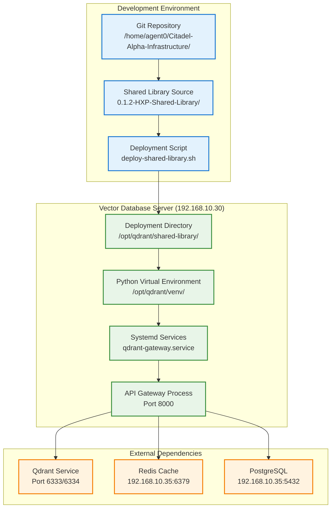

# HANA-X Vector Database Shared Library Deployment Strategy

**Project:** Vector Database Server (192.168.10.30)  
**Component:** HANA-X Vector Database Shared Library  
**Status:** Ready for Deployment  
**Date:** 2025-07-17  

---

## 🎯 Deployment Overview

The HANA-X Vector Database Shared Library is currently located in the git project directory but needs to be properly deployed to the Vector Database Server (192.168.10.30) for operational use.

### Current Status:
- **Source Location:** `/home/agent0/Citadel-Alpha-Infrastructure/0.1-Project-Execution/0.1.2-HXP-Shared-Library/`
- **Target Server:** Vector Database Server (192.168.10.30)
- **Target Location:** `/opt/qdrant/shared-library/`
- **Python Environment:** `/opt/qdrant/venv/`

---

## 🚀 Deployment Options

### Option 1: Local Deployment (Current Server)
**Use Case:** Testing and development on the current server
```bash
cd /home/agent0/Citadel-Alpha-Infrastructure/0.1-Project-Execution/0.1.2-HXP-Shared-Library
./deploy-shared-library.sh local
```

### Option 2: Remote Deployment (Vector Database Server)
**Use Case:** Production deployment to the actual Vector Database Server
```bash
cd /home/agent0/Citadel-Alpha-Infrastructure/0.1-Project-Execution/0.1.2-HXP-Shared-Library
./deploy-shared-library.sh remote
```

### Option 3: Package Deployment (Distribution)
**Use Case:** Create distribution packages for manual installation
```bash
cd /home/agent0/Citadel-Alpha-Infrastructure/0.1-Project-Execution/0.1.2-HXP-Shared-Library
./deploy-shared-library.sh package
```

---

## 📋 Deployment Process

### Phase 1: Pre-Deployment Validation
1. **Validate Source Structure**
   - Check all required files are present
   - Validate Python package structure
   - Create setup.py if missing

2. **Dependency Verification**
   - Verify requirements.txt completeness
   - Check Python 3.12+ compatibility
   - Validate external service connectivity

### Phase 2: Deployment Execution
1. **Environment Setup**
   ```bash
   # Create deployment directory
   sudo mkdir -p /opt/qdrant/shared-library
   
   # Create Python virtual environment
   sudo python3.12 -m venv /opt/qdrant/venv
   
   # Set proper ownership
   sudo chown -R qdrant:qdrant /opt/qdrant/
   ```

2. **Library Installation**
   ```bash
   # Install shared library in development mode
   sudo -u qdrant /opt/qdrant/venv/bin/pip install -e /opt/qdrant/shared-library
   
   # Or install from wheel package
   sudo -u qdrant /opt/qdrant/venv/bin/pip install hana_x_vector-1.0.0-py3-none-any.whl
   ```

### Phase 3: Integration Configuration
1. **System Service Integration**
   - Update systemd service files
   - Configure environment variables
   - Set up service dependencies

2. **Network Configuration**
   - Configure API endpoints
   - Set up CORS for WebUI access
   - Validate cross-server communication

### Phase 4: Validation & Testing
1. **Import Testing**
   - Test all module imports
   - Validate component functionality
   - Check configuration loading

2. **Service Testing**
   - Start Qdrant service
   - Start API Gateway with shared library
   - Test API endpoints

---

## 🔧 Deployment Architecture



---

## 📁 Deployment Directory Structure

### Target Structure on Vector Database Server:
```
/opt/qdrant/
├── shared-library/                    # Shared library deployment
│   ├── hana_x_vector/                 # Main library package
│   │   ├── gateway/                   # API Gateway components
│   │   ├── vector_ops/                # Vector operations
│   │   ├── qdrant/                    # Qdrant integration
│   │   ├── external_models/           # AI model integration
│   │   ├── monitoring/                # Monitoring and metrics
│   │   ├── utils/                     # Utilities and config
│   │   └── schemas/                   # API schemas
│   ├── requirements.txt               # Dependencies
│   ├── setup.py                       # Package configuration
│   └── README.md                      # Documentation
├── venv/                              # Python virtual environment
│   ├── bin/                           # Python executables
│   ├── lib/                           # Installed packages
│   └── include/                       # Header files
├── config/                            # Configuration files
│   ├── production.yaml                # Qdrant configuration
│   ├── gateway.yaml                   # API Gateway config
│   └── shared-library.env             # Environment variables
└── logs/                              # Log files
    ├── qdrant.log                     # Qdrant logs
    └── gateway.log                    # API Gateway logs
```

---

## 🔐 Security & Permissions

### User & Group Configuration:
```bash
# Service user for Qdrant and shared library
sudo useradd -r -s /bin/false qdrant

# Set ownership
sudo chown -R qdrant:qdrant /opt/qdrant/
sudo chmod -R 755 /opt/qdrant/shared-library/
sudo chmod -R 750 /opt/qdrant/venv/
```

### Environment Variables:
```bash
# /opt/qdrant/shared-library.env
PYTHONPATH=/opt/qdrant/shared-library
HANA_X_QDRANT_URL=http://localhost:6333
HANA_X_REDIS_URL=redis://192.168.10.35:6379
HANA_X_POSTGRES_URL=postgresql://citadel_admin@192.168.10.35:5432/citadel_ai
HANA_X_LOG_LEVEL=INFO
HANA_X_ENVIRONMENT=production
```

---

## 🔄 Service Integration

### Systemd Service Configuration:
```ini
# /etc/systemd/system/qdrant-gateway.service
[Unit]
Description=HANA-X Vector Database API Gateway
After=network.target qdrant.service
Requires=qdrant.service

[Service]
Type=simple
User=qdrant
Group=qdrant
WorkingDirectory=/opt/qdrant
Environment=PYTHONPATH=/opt/qdrant/shared-library
EnvironmentFile=/opt/qdrant/shared-library.env
ExecStart=/opt/qdrant/venv/bin/python -m hana_x_vector.gateway.api_gateway
Restart=always
RestartSec=10

[Install]
WantedBy=multi-user.target
```

### Service Management:
```bash
# Reload systemd configuration
sudo systemctl daemon-reload

# Enable and start services
sudo systemctl enable qdrant qdrant-gateway
sudo systemctl start qdrant qdrant-gateway

# Check service status
sudo systemctl status qdrant qdrant-gateway
```

---

## ✅ Validation Checklist

### Pre-Deployment Validation:
- [ ] Shared library source code complete
- [ ] All dependencies listed in requirements.txt
- [ ] Python 3.12+ compatibility verified
- [ ] Network connectivity to target server confirmed

### Post-Deployment Validation:
- [ ] Shared library installed successfully
- [ ] All modules import without errors
- [ ] Configuration manager loads correctly
- [ ] API Gateway starts with shared library
- [ ] All API endpoints respond correctly
- [ ] Cross-server communication functional
- [ ] Monitoring and logging operational

### Integration Testing:
- [ ] Qdrant service operational
- [ ] API Gateway using shared library
- [ ] REST API endpoints functional
- [ ] GraphQL API operational
- [ ] gRPC API responding
- [ ] External model integration working
- [ ] WebUI can communicate with API Gateway

---

## 🚨 Troubleshooting

### Common Issues:

#### Import Errors:
```bash
# Check Python path
sudo -u qdrant /opt/qdrant/venv/bin/python -c "import sys; print(sys.path)"

# Test specific imports
sudo -u qdrant /opt/qdrant/venv/bin/python -c "import hana_x_vector"
```

#### Service Startup Issues:
```bash
# Check service logs
sudo journalctl -u qdrant-gateway -f

# Check permissions
ls -la /opt/qdrant/
sudo -u qdrant ls -la /opt/qdrant/shared-library/
```

#### Network Connectivity:
```bash
# Test database connections
sudo -u qdrant /opt/qdrant/venv/bin/python -c "
from hana_x_vector.utils import ConfigManager
config = ConfigManager()
print(f'Qdrant: {config.get_qdrant_url()}')
print(f'Redis: {config.get_redis_url()}')
"
```

---

## 📊 Deployment Timeline

### Estimated Duration: 30-45 minutes

| Phase | Duration | Tasks |
|-------|----------|-------|
| **Pre-Deployment** | 10 min | Validation, setup.py creation, dependency check |
| **Deployment** | 15 min | Copy files, create environment, install library |
| **Configuration** | 10 min | Systemd services, environment variables |
| **Validation** | 10 min | Testing, service startup, endpoint verification |

---

## 🎯 Next Steps

### Immediate Actions:
1. **Choose Deployment Method:** Select local, remote, or package deployment
2. **Execute Deployment:** Run the deployment script with chosen method
3. **Validate Installation:** Verify all components are working correctly
4. **Start Services:** Enable and start Qdrant and API Gateway services

### Follow-up Tasks:
1. **WebUI Deployment:** Deploy WebUI on Metric Server (192.168.10.37)
2. **CORS Configuration:** Configure cross-origin requests
3. **Monitoring Setup:** Configure Prometheus metrics collection
4. **Load Testing:** Validate performance under load

---

## 📞 Support

### Deployment Support:
- **Script Location:** `/home/agent0/Citadel-Alpha-Infrastructure/0.1-Project-Execution/0.1.2-HXP-Shared-Library/deploy-shared-library.sh`
- **Log Files:** `/var/log/qdrant/`, `journalctl -u qdrant-gateway`
- **Configuration:** `/opt/qdrant/shared-library.env`

### Validation Commands:
```bash
# Test shared library import
sudo -u qdrant /opt/qdrant/venv/bin/python -c "import hana_x_vector; print('✅ Success')"

# Test API Gateway
curl http://localhost:8000/health

# Check service status
sudo systemctl status qdrant qdrant-gateway
```

---

**Deployment Strategy Status:** ✅ Ready for Execution  
**Next Action:** Execute deployment script with chosen method  
**Target:** Vector Database Server (192.168.10.30) operational with shared library
