# Project 2: Vector Database Server Architecture Document
## Part 1: R&D Environment with Unified API Gateway Design

**Document ID:** ARCH-P02-VDB-P1-UNIFIED  
**Version:** 1.0  
**Date:** 2025-07-15  
**Server:** hx-vector-database-server (192.168.10.30)  
**Environment:** R&D with Minimum Security  
**Related Documents:** 
- Project2_Vector_Database_Server_PRD_Updated.md
- Project2_Vector_Database_Server_Part1_Enhanced_Implementation.md

---

## 🎯 Executive Summary

This document defines the comprehensive architecture for the Citadel AI Operating System Vector Database Server, implementing a unified API Gateway design that consolidates REST, GraphQL, and gRPC interfaces while supporting both embedded AI model inference and external AI model integration patterns. The architecture addresses critical design decisions regarding embedding routing, metadata tracking, and bulk data operations across nine external AI models.

### **Key Architectural Decisions:**

1. **Unified API Gateway**: Single entry point for all vector operations across multiple protocols
2. **Hybrid Integration Pattern**: External AI models use both real-time routing and bulk write operations
3. **Embedded Model Priority**: Local models handle real-time embedding generation with metadata tracking
4. **Dual GPU Optimization**: Intelligent workload distribution across 12GB total VRAM
5. **Minimum Security R&D Focus**: Essential security without development blockers

---

## 🏗️ System Architecture Overview

### **High-Level Architecture Components**

```mermaid
graph TB
    subgraph "External AI Models (9 Models)"
        EXT1[Mixtral-8x7B<br/>192.168.10.29:11400]
        EXT2[Nous Hermes 2<br/>192.168.10.29:11401]
        EXT3[Yi-34B<br/>192.168.10.28:11404]
        EXT4[OpenChat 3.5<br/>192.168.10.29:11402]
        EXT5[Phi-3 Mini<br/>192.168.10.29:11403]
        EXT6[DeepCoder-14B<br/>192.168.10.28:11405]
        EXT7[IMP Model<br/>192.168.10.28:11406]
        EXT8[DeepSeek<br/>192.168.10.28:11407]
        EXT9[General Purpose<br/>192.168.10.31:8000]
    end

    subgraph "Vector Database Server (192.168.10.30)"
        subgraph "API Gateway Layer"
            GATEWAY[Unified API Gateway<br/>Port 8000]
            GATEWAY --> REST[REST API<br/>Port 6333]
            GATEWAY --> GQL[GraphQL API<br/>Port 8080]
            GATEWAY --> GRPC[gRPC API<br/>Port 8081]
        end
        
        subgraph "Embedded AI Models (Local)"
            GPU0[GPU 0 - 6GB VRAM]
            GPU1[GPU 1 - 6GB VRAM]
            GPU0 --> MINILM[all-MiniLM-L6-v2<br/>384D]
            GPU0 --> PHI3[phi-3-mini<br/>3072D]
            GPU1 --> E5[e5-small<br/>384D]
            GPU1 --> BGE[bge-base<br/>768D]
        end
        
        subgraph "Vector Storage Layer"
            QDRANT[Qdrant Vector DB<br/>Port 6333/6334]
            COLLECTIONS[13 Vector Collections<br/>9 External + 4 Embedded]
        end
        
        subgraph "Metadata & Caching"
            REDIS[Redis Cache<br/>192.168.10.35:6379]
            POSTGRES[PostgreSQL Metadata<br/>192.168.10.35:5432]
        end
    end

    subgraph "External Services"
        METRICS[Metrics Server<br/>192.168.10.37]
        ORCHESTRATOR[Orchestration Server<br/>192.168.10.31]
    end

    %% Data Flow Connections
    EXT1 -.->|Bulk Write| GATEWAY
    EXT2 -.->|Real-time + Bulk| GATEWAY
    EXT3 -.->|Bulk Write| GATEWAY
    EXT4 -.->|Real-time + Bulk| GATEWAY
    EXT5 -.->|Real-time Routing| GATEWAY
    EXT6 -.->|Bulk Write| GATEWAY
    EXT7 -.->|Bulk Write| GATEWAY
    EXT8 -.->|Bulk Write| GATEWAY
    EXT9 -.->|Real-time Routing| GATEWAY

    GATEWAY --> QDRANT
    QDRANT --> COLLECTIONS
    GATEWAY --> REDIS
    GATEWAY --> POSTGRES
    
    ORCHESTRATOR <--> GATEWAY
    METRICS <-- GATEWAY
```

---

## 🌐 Unified API Gateway Architecture

### **API Gateway Design Principles**

The unified API Gateway serves as the single entry point for all vector database operations, providing protocol abstraction, request routing, and centralized monitoring.

#### **Gateway Components:**

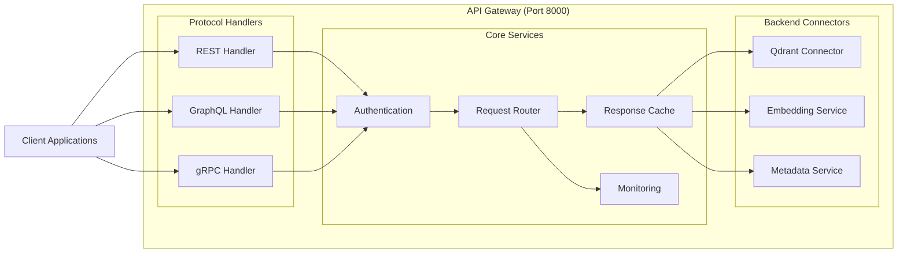

### **API Gateway Configuration**

```yaml
# /opt/citadel/config/api_gateway.yaml
api_gateway:
  host: "0.0.0.0"
  port: 8000
  
  protocols:
    rest:
      enabled: true
      path_prefix: "/api/v1"
      backend_port: 6333
    
    graphql:
      enabled: true
      path_prefix: "/graphql"
      backend_port: 8080
      playground: true  # R&D environment only
    
    grpc:
      enabled: true
      backend_port: 8081
      reflection: true  # R&D environment only
  
  authentication:
    type: "basic"  # Minimum security for R&D
    required: false  # Development mode
  
  routing:
    default_backend: "qdrant"
    load_balancing: "round_robin"
    timeout_ms: 30000
  
  caching:
    enabled: true
    backend: "redis"
    ttl_seconds: 300
    cache_embeddings: true
  
  monitoring:
    metrics_enabled: true
    logging_level: "INFO"
    export_port: 9090
```

---

## 🤖 External AI Model Integration Patterns

### **Integration Strategy Decision Matrix**

The architecture implements a **hybrid integration pattern** where external AI models use different integration approaches based on their use cases and performance characteristics:

| Model | Server | Integration Pattern | Embedding Route | Metadata Tracking | Use Case |
|-------|--------|-------------------|-----------------|-------------------|----------|
| **Mixtral-8x7B** | 192.168.10.29:11400 | **Bulk Write Only** | Direct to Collections | Batch Metadata | General reasoning, large document processing |
| **Nous Hermes 2** | 192.168.10.29:11401 | **Real-time + Bulk** | Via Gateway | Full Tracking | RAG operations, document Q&A |
| **Yi-34B** | 192.168.10.28:11404 | **Bulk Write Only** | Direct to Collections | Batch Metadata | Long document analysis |
| **OpenChat 3.5** | 192.168.10.29:11402 | **Real-time + Bulk** | Via Gateway | Full Tracking | Conversational AI, tool integration |
| **Phi-3 Mini** | 192.168.10.29:11403 | **Real-time Routing** | Via Gateway | Full Tracking | Fast micro-operations |
| **DeepCoder-14B** | 192.168.10.28:11405 | **Bulk Write Only** | Direct to Collections | Batch Metadata | Code analysis, debugging |
| **IMP Model** | 192.168.10.28:11406 | **Bulk Write Only** | Direct to Collections | Batch Metadata | Specialized processing |
| **DeepSeek** | 192.168.10.28:11407 | **Bulk Write Only** | Direct to Collections | Batch Metadata | Research and analysis |
| **General Purpose** | 192.168.10.31:8000 | **Real-time Routing** | Via Gateway | Full Tracking | Orchestration, general tasks |

### **Integration Pattern Details**

#### **Pattern 1: Real-time Routing (3 Models)**
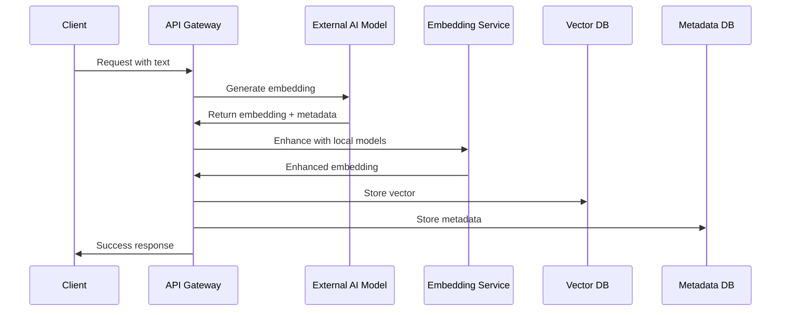

**Models:** Phi-3 Mini, OpenChat 3.5, General Purpose  
**Characteristics:**
- Real-time embedding generation through Gateway
- Full metadata tracking and enhancement
- Local embedding model augmentation
- Immediate availability for search operations
- Higher latency but complete traceability

#### **Pattern 2: Hybrid Real-time + Bulk (2 Models)**
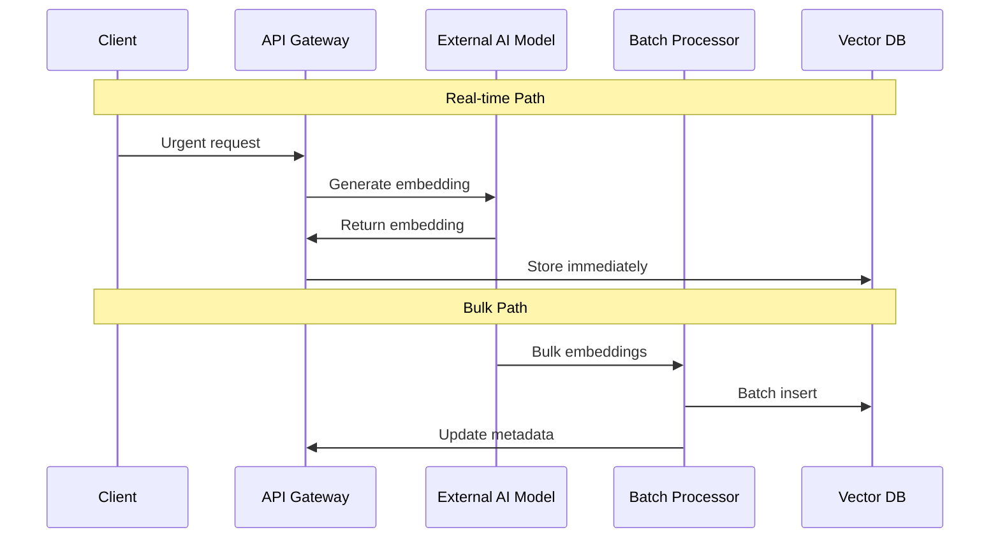

**Models:** Nous Hermes 2, OpenChat 3.5  
**Characteristics:**
- Dual-mode operation for different use cases
- Real-time for urgent/interactive requests
- Bulk processing for large document sets
- Optimized for both latency and throughput
- Flexible routing based on request type

#### **Pattern 3: Bulk Write Only (4 Models)**
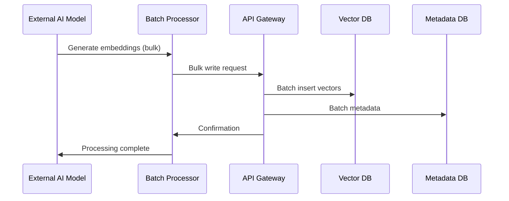

**Models:** Mixtral-8x7B, Yi-34B, DeepCoder-14B, IMP, DeepSeek  
**Characteristics:**
- Optimized for high-throughput batch processing
- Minimal real-time interaction overhead
- Efficient for large-scale document processing
- Reduced metadata tracking (batch-level only)
- Maximum performance for bulk operations

---

## 🏛️ Detailed Component Architecture

### **Vector Storage Layer Architecture**

```mermaid
graph TB
    subgraph "Vector Collections (13 Total)"
        subgraph "External Model Collections (9)"
            C1[mixtral_embeddings<br/>4096D, Cosine]
            C2[hermes_documents<br/>4096D, Cosine]
            C3[yi34_documents<br/>4096D, Cosine]
            C4[openchat_embeddings<br/>4096D, Cosine]
            C5[phi3_embeddings<br/>3072D, Cosine]
            C6[deepcoder_embeddings<br/>4096D, Cosine]
            C7[imp_embeddings<br/>4096D, Cosine]
            C8[deepseek_embeddings<br/>4096D, Cosine]
            C9[general_embeddings<br/>1536D, Cosine]
        end
        
        subgraph "Embedded Model Collections (4)"
            E1[minilm_general<br/>384D, Cosine]
            E2[phi3mini_embeddings<br/>3072D, Cosine]
            E3[e5small_embeddings<br/>384D, Cosine]
            E4[bgebase_embeddings<br/>768D, Cosine]
        end
    end

    subgraph "Storage Configuration"
        STORAGE[21.8TB Total Storage]
        NVME[3.6TB NVMe SSD<br/>Primary Performance]
        HDD[18.2TB HDD<br/>Bulk Storage]
    end

    subgraph "Performance Optimization"
        HNSW[HNSW Index<br/>m=16, ef_construct=200]
        SEGMENT[Segment Management<br/>100MB segments]
        CACHE[Memory Cache<br/>78GB RAM]
    end

    C1 --> STORAGE
    C2 --> STORAGE
    C3 --> STORAGE
    C4 --> STORAGE
    C5 --> STORAGE
    C6 --> STORAGE
    C7 --> STORAGE
    C8 --> STORAGE
    C9 --> STORAGE
    E1 --> STORAGE
    E2 --> STORAGE
    E3 --> STORAGE
    E4 --> STORAGE

    STORAGE --> NVME
    STORAGE --> HDD
    STORAGE --> HNSW
    STORAGE --> SEGMENT
    STORAGE --> CACHE
```

### **Embedded AI Models GPU Architecture**

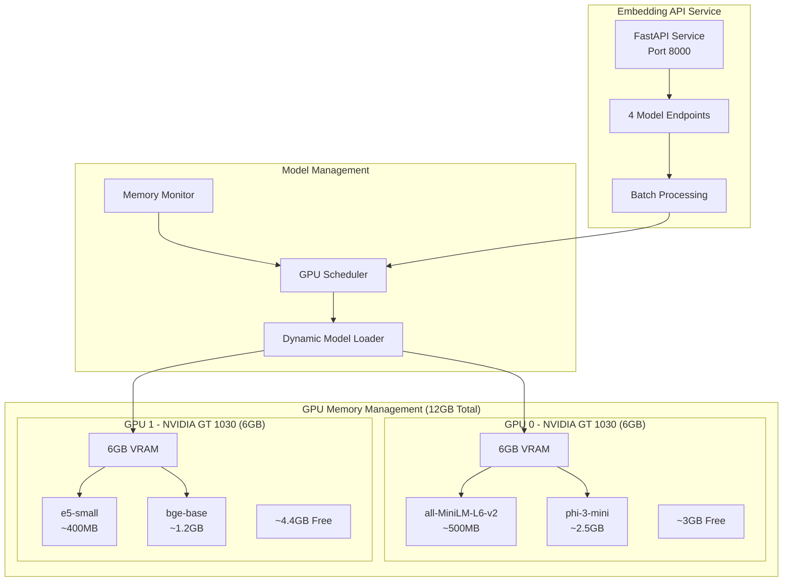

---

## 🔄 Data Flow Architecture

### **Complete System Data Flow**

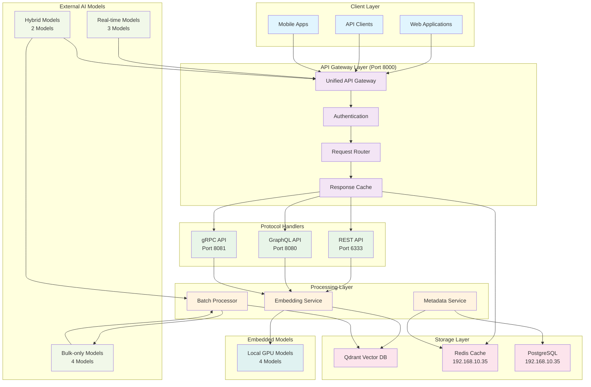

### **Embedding Generation Flow**

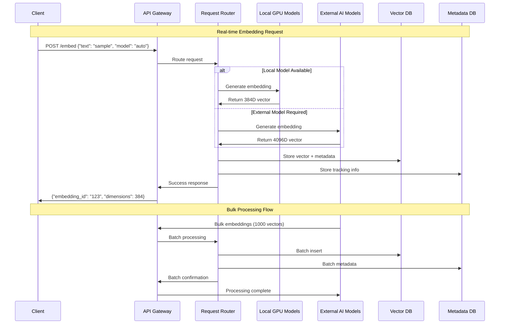

---

## 🛡️ Security Architecture (Minimum R&D Configuration)

### **R&D Security Framework**

The architecture implements **minimum viable security** to avoid development blockers while maintaining essential protections:

```mermaid
graph TB
    subgraph "Network Security (Minimal)"
        UFW[UFW Firewall<br/>Essential Ports Only]
        INTERNAL[Internal Network<br/>192.168.10.0/24]
    end

    subgraph "API Security (Basic)"
        BASIC_AUTH[Basic Authentication<br/>Optional for R&D]
        RATE_LIMIT[Rate Limiting<br/>Development Friendly]
        CORS[CORS Enabled<br/>Permissive for R&D]
    end

    subgraph "Data Security (Essential)"
        ENCRYPT_TRANSIT[TLS for External<br/>Plain HTTP Internal]
        ACCESS_LOG[Access Logging<br/>Basic Monitoring]
        BACKUP_ENCRYPT[Backup Encryption<br/>AES-256]
    end

    subgraph "Operational Security"
        SERVICE_USER[agent0 Service User<br/>Non-root Execution]
        FILE_PERMS[File Permissions<br/>Restricted Access]
        LOG_ROTATION[Log Rotation<br/>Disk Space Management]
    end

    UFW --> INTERNAL
    BASIC_AUTH --> RATE_LIMIT
    RATE_LIMIT --> CORS
    ENCRYPT_TRANSIT --> ACCESS_LOG
    ACCESS_LOG --> BACKUP_ENCRYPT
    SERVICE_USER --> FILE_PERMS
    FILE_PERMS --> LOG_ROTATION
```

### **Security Configuration**

```yaml
# /opt/citadel/config/security.yaml
security:
  environment: "r&d"
  level: "minimum"
  
  network:
    firewall: "ufw"
    allowed_ports: [22, 6333, 6334, 8000, 8080, 8081]
    internal_only: true
  
  authentication:
    enabled: false  # R&D environment
    type: "basic"
    require_https: false  # Internal network
  
  authorization:
    rbac_enabled: false  # Simplified for R&D
    default_permissions: "read_write"
  
  encryption:
    at_rest: false  # R&D environment
    in_transit: false  # Internal network
    backups: true  # Essential protection
  
  monitoring:
    access_logs: true
    security_events: false  # Minimal overhead
    audit_trail: false  # R&D environment
```

---

## 📊 Performance Architecture

### **Performance Optimization Strategy**

```mermaid
graph TB
    subgraph "CPU Optimization (Intel i9-9900K)"
        CORES[8 Cores, 16 Threads]
        AFFINITY[CPU Affinity<br/>Qdrant: Cores 0-3<br/>Embedding: Cores 4-7]
        SCALING[CPU Governor<br/>Performance Mode]
    end

    subgraph "Memory Optimization (78GB RAM)"
        QDRANT_MEM[Qdrant: 32GB]
        EMBED_MEM[Embedding Models: 16GB]
        CACHE_MEM[System Cache: 24GB]
        BUFFER_MEM[Buffer: 6GB]
    end

    subgraph "GPU Optimization (12GB VRAM)"
        GPU_SCHED[GPU Scheduler]
        MEM_POOL[Memory Pooling]
        BATCH_OPT[Batch Optimization]
    end

    subgraph "Storage Optimization (21.8TB)"
        NVME_HOT[NVMe: Hot Data<br/>Active Collections]
        HDD_COLD[HDD: Cold Data<br/>Archive Collections]
        IO_SCHED[I/O Scheduler<br/>Deadline for SSD]
    end

    subgraph "Network Optimization"
        TCP_TUNE[TCP Tuning<br/>High Throughput]
        CONN_POOL[Connection Pooling<br/>Persistent Connections]
        COMPRESS[Response Compression<br/>gzip Enabled]
    end

    CORES --> AFFINITY
    AFFINITY --> SCALING
    
    QDRANT_MEM --> EMBED_MEM
    EMBED_MEM --> CACHE_MEM
    CACHE_MEM --> BUFFER_MEM
    
    GPU_SCHED --> MEM_POOL
    MEM_POOL --> BATCH_OPT
    
    NVME_HOT --> HDD_COLD
    HDD_COLD --> IO_SCHED
    
    TCP_TUNE --> CONN_POOL
    CONN_POOL --> COMPRESS
```

### **Performance Targets**

| Metric | Target | Measurement Method |
|--------|--------|-------------------|
| **Vector Operations** | >10,000 ops/sec | Locust load testing |
| **Query Latency** | <10ms average | API response time monitoring |
| **Embedding Generation** | <100ms average | Local model inference timing |
| **GPU Utilization** | >80% efficiency | nvidia-smi monitoring |
| **Memory Utilization** | <90% peak usage | System memory monitoring |
| **Storage I/O** | >1GB/s throughput | iostat monitoring |
| **API Throughput** | >1000 req/sec | Gateway performance testing |
| **Concurrent Connections** | >500 connections | Connection pool monitoring |

---

## 🔧 Deployment Architecture

### **Service Deployment Topology**

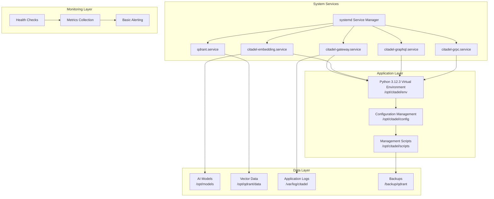

### **Service Dependencies**

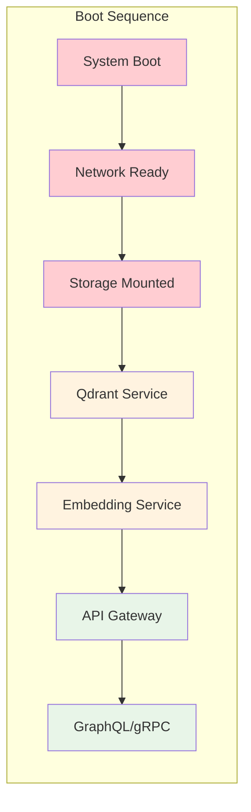

---

## 📈 Monitoring and Observability Architecture

### **Monitoring Stack Integration**

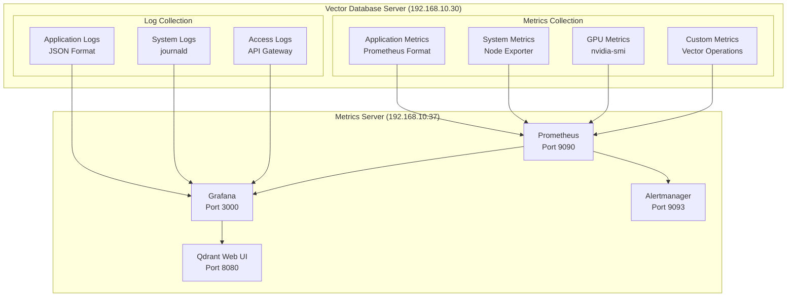

### **Key Monitoring Dashboards**

1. **Vector Database Performance**
   - Query latency percentiles
   - Operations per second
   - Collection sizes and growth
   - Index performance metrics

2. **GPU Utilization**
   - GPU memory usage per model
   - Inference throughput
   - Model switching frequency
   - Temperature and power consumption

3. **API Gateway Metrics**
   - Request rate by protocol (REST/GraphQL/gRPC)
   - Response time distribution
   - Error rates and status codes
   - Concurrent connection counts

4. **System Resources**
   - CPU utilization by core
   - Memory usage patterns
   - Storage I/O performance
   - Network throughput

---

## 🚀 Scalability and Future Architecture

### **Horizontal Scaling Preparation**

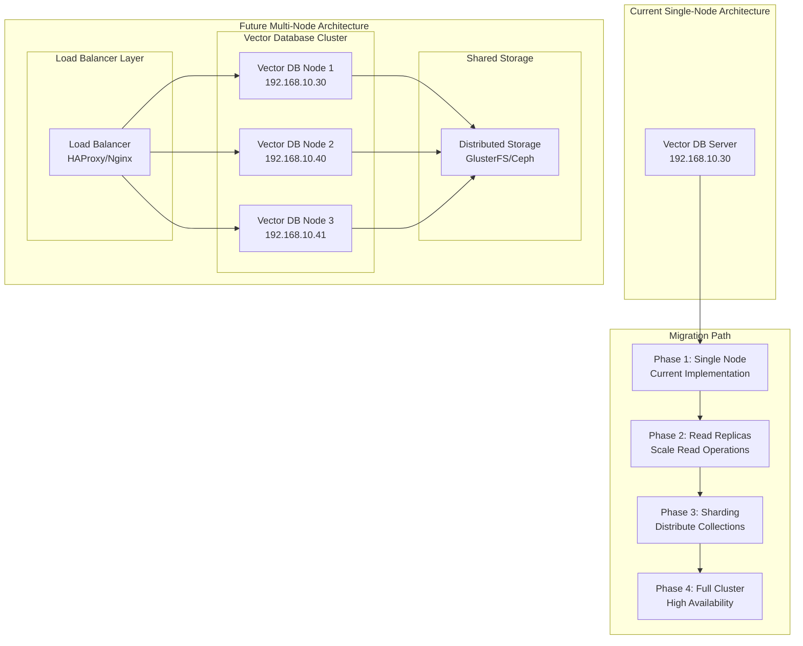

---

## 📋 Implementation Checklist

### **Architecture Validation Checklist**

- [ ] **API Gateway Design**
  - [ ] Unified entry point configured (Port 8000)
  - [ ] REST, GraphQL, gRPC protocols integrated
  - [ ] Request routing and load balancing implemented
  - [ ] Response caching configured

- [ ] **External Model Integration**
  - [ ] Real-time routing models identified (3 models)
  - [ ] Hybrid models configured (2 models)
  - [ ] Bulk-only models configured (4 models)
  - [ ] Metadata tracking patterns implemented

- [ ] **Embedded Model Architecture**
  - [ ] Dual GPU allocation optimized
  - [ ] Model loading and switching implemented
  - [ ] Performance monitoring configured
  - [ ] Memory management optimized

- [ ] **Vector Storage Design**
  - [ ] 13 collections created and configured
  - [ ] Storage optimization across 21.8TB
  - [ ] Performance tuning applied
  - [ ] Backup procedures implemented

- [ ] **Security Configuration**
  - [ ] Minimum security framework applied
  - [ ] R&D-friendly authentication configured
  - [ ] Network security (UFW) configured
  - [ ] Service user (agent0) configured

- [ ] **Monitoring Integration**
  - [ ] Metrics collection configured
  - [ ] Grafana dashboards prepared
  - [ ] Qdrant Web UI relocated to metrics server
  - [ ] Basic alerting configured

---

## 📚 Conclusion

This architecture document defines a comprehensive, production-ready vector database server that serves as the semantic processing foundation for the Citadel AI Operating System. The unified API Gateway design provides flexibility and scalability, while the hybrid external model integration patterns optimize for both performance and functionality.

### **Key Architectural Strengths:**

1. **Unified Interface**: Single API Gateway for all vector operations
2. **Flexible Integration**: Hybrid patterns for external AI models
3. **GPU Optimization**: Intelligent dual-GPU utilization
4. **Scalable Design**: Foundation for future horizontal scaling
5. **R&D Optimized**: Minimum security with maximum development velocity

### **Next Steps:**

1. **Implementation**: Execute detailed tasks from implementation document
2. **Testing**: Comprehensive validation using pytest and Locust frameworks
3. **Integration**: Connect with external AI models and orchestration server
4. **Optimization**: Performance tuning based on real-world usage patterns
5. **Scaling**: Prepare for multi-node deployment as system grows

The architecture provides a solid foundation for the Citadel AI Operating System's vector processing capabilities while maintaining the flexibility needed for rapid R&D iteration and future production deployment.

---

**Document Status:** Complete architectural specification  
**Implementation Ready:** Yes, with detailed task breakdown available  
**Review Required:** Architecture review and approval before implementation  
**Dependencies:** Project 1 (SQL Database) completion required

