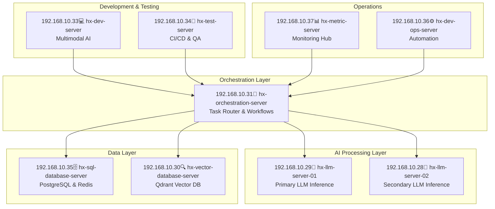
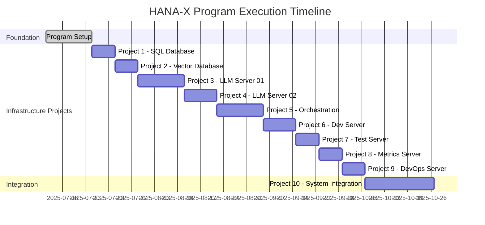
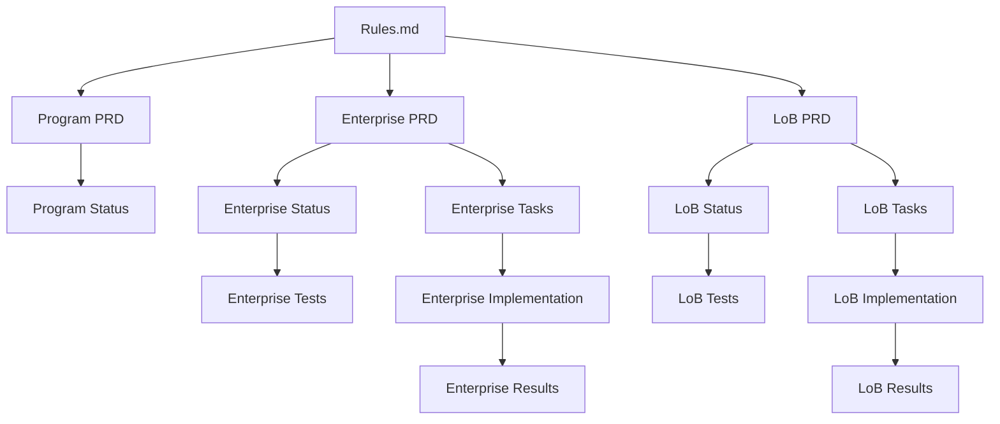

# 🚀 Citadel AI Infrastructure Program
## HANA-X Program: Enterprise AI Operating System Foundation

[](0.0-HANA-X-Program/0.0.1-HXP-Program-Plan/04-HXP-Status.md)
[](0.0-HANA-X-Program/0.0.1-HXP-Program-Plan/0.1-HXP-PRD.md)
[](0.0-HANA-X-Program/0.0.2-HXP-Architecture/network_architecture.md)
[](0.0-HANA-X-Program/0.0.3-HXP-Quality-Assurance/integration_testing_framework.md)

---

## 📋 Executive Summary

The **Citadel AI Infrastructure Program** delivers the foundational infrastructure for the enterprise-grade Citadel AI Operating System. This comprehensive program transforms organizations through unified AI infrastructure with specialized intelligence modules, enabling businesses to automate complex processes, make intelligent decisions, and scale operations with unprecedented efficiency.

### 🎯 Program Objectives
- **Establish Production-Ready Environment**: Deploy stable, secure hardware and network foundation
- **Guarantee Performance & Scalability**: Provide low-latency AI processing with future-proof architecture
- **Enable Comprehensive Observability**: Implement centralized monitoring across all infrastructure components
- **Deliver Integrated AI Platform**: Transform 9 independent servers into cohesive AI ecosystem

## 🌐 Infrastructure Landscape

### Server Architecture Overview

```mermaid
graph TB
    subgraph "AI Processing Layer"
        LLM1["192.168.10.29🧠 hx-llm-server-01<br/>Primary LLM Inference"]
        LLM2["192.168.10.28🧠 hx-llm-server-02<br/>Secondary LLM Inference"]
    end
    
    subgraph "Orchestration Layer"
        ORCH["192.168.10.31🎯 hx-orchestration-server<br/>Task Router & Workflows"]
    end
    
    subgraph "Data Layer"
        SQL["192.168.10.35🗄️ hx-sql-database-server<br/>PostgreSQL & Redis"]
        VDB["192.168.10.30🔍 hx-vector-database-server<br/>Qdrant Vector DB"]
    end
    
    subgraph "Development & Testing"
        DEV["192.168.10.33💻 hx-dev-server<br/>Multimodal AI"]
        TEST["192.168.10.34🧪 hx-test-server<br/>CI/CD & QA"]
    end
    
    subgraph "Operations"
        METRICS["192.168.10.37📊 hx-metric-server<br/>Monitoring Hub"]
        DEVOPS["192.168.10.36⚙️ hx-dev-ops-server<br/>Automation"]
    end
    
    ORCH --> LLM1
    ORCH --> LLM2
    ORCH --> SQL
    ORCH --> VDB
    DEV --> ORCH
    TEST --> ORCH
    METRICS --> ORCH
    DEVOPS --> ORCH
```

### 🧠 AI Intelligence Modules

| Module | Specialization | Server Assignment |
|--------|----------------|------------------|
| **Mixtral-8x7B** | Strategic Reasoning | hx-llm-server-01 |
| **DeepSeek-R1** | Generalist Reasoning | hx-llm-server-02 |
| **Nous Hermes 2** | Knowledge Processing | hx-llm-server-01 |
| **OpenChat 3.5** | Communication | hx-llm-server-02 |
| **Yi-34B** | Deep Analysis | hx-llm-server-01 |
| **DeepCoder-14B** | Technical Intelligence | hx-llm-server-02 |
| **Phi-3 Mini** | Rapid Processing | hx-llm-server-01 |
| **imp-v1-3b** | Ultra-Lightweight Agent | hx-llm-server-02 |
| **MiMo-VL-7B** | Multi-Modal Processing | hx-dev-server |

## 🏗️ Program Structure

### 📊 10-Project Execution Framework


```mermaid
gantt
    title HANA-X Program Execution Timeline
    dateFormat  YYYY-MM-DD
    section Foundation
    Program Setup     :done, foundation, 2025-07-01, 2025-07-15
    section Infrastructure Projects
    Project 1 - SQL Database     :proj1, 2025-07-15, 7d
    Project 2 - Vector Database  :proj2, after proj1, 7d
    Project 3 - LLM Server 01    :proj3, after proj2, 14d
    Project 4 - LLM Server 02    :proj4, after proj3, 10d
    Project 5 - Orchestration    :proj5, after proj4, 14d
    Project 6 - Dev Server       :proj6, after proj5, 10d
    Project 7 - Test Server      :proj7, after proj6, 7d
    Project 8 - Metrics Server   :proj8, after proj7, 7d
    Project 9 - DevOps Server    :proj9, after proj8, 7d
    section Integration
    Project 10 - System Integration :proj10, after proj9, 21d
```

### 📁 Repository Organization

```
Citadel-Alpha-Infrastructure/
├── 0.0-HANA-X-Program/             # 📊 Program-Level Governance
│   ├── 0.0.0-HXP-Governance/      # Governance Framework
│   ├── 0.0.1-HXP-Program-Plan/    # Program Planning Documents
│   │   ├── 0.1-HXP-PRD.md         # Product Requirements Document
│   │   ├── 09-HXP-KDD.md          # Key Decisions Document
│   │   └── 10-HXP-Backlog.md      # Program Backlog
│   ├── 0.0.2-HXP-Architecture/    # 🌐 Network Architecture
│   ├── 0.0.3-HXP-Quality-Assurance/ # 🧪 Integration Testing
│   └── 0.0.4-HXP-Projects/        # 🚀 Server Implementation Projects
│       ├── 0.0.4.1-HXP-SQL-Database-Server/     # Database Infrastructure
│       ├── 0.0.4.2-HXP-Vector-Database-Server/  # Vector Database
│       ├── 0.0.4.3-HXP-LoB-Server/              # 💼 Line of Business Server
│       ├── 0.0.4.4-HXP-Enterprise-Server/       # 🏢 Enterprise Server
│       ├── 0.0.4.5-HXP-Orchestration-Server/    # Task Orchestration
│       ├── 0.0.4.6-HXP-Dev-Server/              # Development Server
│       ├── 0.0.4.7-HXP-Test-Server/             # Testing Server
│       ├── 0.0.4.8-HXP-Metrics-Server/          # Monitoring Server
│       ├── 0.0.4.9-HXP-DevOps-Server/           # DevOps Automation
│       ├── 0.0.4.10-HXP-Integration/            # System Integration
│       └── 0.0.4.11-HXP-Shared-Library/         # 📚 Shared Code Library
├── X-Archive/                      # 📄 Archived Projects
└── Rules.md                        # 🤖 AI Operating Rules
```

## 🎆 Key Program Features

### 🎯 **Enterprise-Grade AI Infrastructure**
- **9 Specialized AI Models**: Strategic reasoning, technical intelligence, multimodal processing
- **High-Performance Architecture**: P95 latency < 800ms for LLM inference, < 100ms for vector queries
- **Scalable Design**: Load balancing, caching, and future-proof architecture
- **Comprehensive Observability**: Centralized monitoring with Prometheus, Grafana, and Loki

### 📊 **Program Management Excellence**
- **10-Project Execution Framework**: Structured approach from individual servers to integrated platform
- **Complete Governance**: 9 core governance documents with SMART+ST methodology
- **Risk Management**: Comprehensive testing, validation, and rollback procedures
- **Quality Assurance**: Integration testing framework with automated validation

### 🌐 **Network & Security Architecture**
- **Network Topology**: Detailed inter-server communication protocols and security zones
- **Service Discovery**: Automated load balancing and health monitoring
- **Security Framework**: Authentication, authorization, and encryption standards
- **Monitoring Integration**: Real-time metrics and alerting across all components

### 🛠️ **Operational Excellence**
- **Service Management**: Standardized `citadel-ai-os` service commands
- **Deployment Automation**: Infrastructure as Code with CI/CD pipelines
- **Shared Library**: Reusable components across all server projects
- **Documentation**: Visual diagrams, traceability matrices, and real-time status tracking

## 🚀 Getting Started

### 1. 📊 Review Program Foundation
Start with the core program documentation:
```bash
# Read the Program PRD
cat 0.0-HANA-X-Program/0.0.1-HXP-Program-Plan/0.1-HXP-PRD.md

# Review Key Decisions
cat 0.0-HANA-X-Program/0.0.1-HXP-Program-Plan/09-HXP-KDD.md

# Check Program Backlog
cat 0.0-HANA-X-Program/0.0.1-HXP-Program-Plan/10-HXP-Backlog.md
```

### 2. 🌐 Understand Network Architecture
Explore the infrastructure design:
```bash
# Network Architecture Diagram
cat 0.0-HANA-X-Program/0.0.2-HXP-Architecture/network_architecture.md
```

### 3. 🧪 Review Integration Testing
Understand the quality assurance framework:
```bash
# Integration Testing Framework
cat 0.0-HANA-X-Program/0.0.3-HXP-Quality-Assurance/integration_testing_framework.md
```

### 4. 🎯 Explore Governance Framework
Review the complete governance documentation:
```bash
cd 0.0-HANA-X-Program/0.0.0-HXP-Governance/
cat README.md
```

### 5. 📚 Check Shared Libraries
Review common utilities and modules:
```bash
cd 0.0-HANA-X-Program/0.0.4-HXP-Projects/0.0.4.11-HXP-Shared-Library/
cat hana-x-shared-library.md
```

## 🏗️ Program Execution Process

### 🎯 Current Phase: Foundation Complete
- ✅ **Program PRD**: Comprehensive requirements document
- ✅ **Network Architecture**: Detailed inter-server communication design
- ✅ **Integration Testing**: Complete testing framework for Project 10
- ✅ **Security Planning**: Security requirements added to backlog
- ✅ **Governance Framework**: Complete governance documentation
- ✅ **Resource Strategy**: Dynamic allocation approach documented

### 📊 Phase 1: Individual Server Setup (Projects 1-9)

#### Project Sequence:
1. **Project 1**: `hx-sql-database-server` - PostgreSQL & Redis setup
2. **Project 2**: `hx-vector-database-server` - Qdrant vector database
3. **Project 3**: `hx-llm-server-01` - Primary LLM inference engine
4. **Project 4**: `hx-llm-server-02` - Secondary LLM inference engine
5. **Project 5**: `hx-orchestration-server` - Task router & workflows
6. **Project 6**: `hx-dev-server` - Development & multimodal AI
7. **Project 7**: `hx-test-server` - CI/CD & QA testing
8. **Project 8**: `hx-metric-server` - Centralized monitoring
9. **Project 9**: `hx-dev-ops-server` - Operations management

#### Success Criteria per Project:
- ✅ Server provisioning and OS installation
- ✅ Service installation and configuration
- ✅ Security hardening and validation
- ✅ Monitoring integration
- ✅ Functional testing and validation

### 🔗 Phase 2: System Integration (Project 10)
- 🌐 **Network Integration**: Connect all servers into cohesive platform
- 🔄 **Service Orchestration**: Configure inter-server communication
- 🧪 **End-to-End Testing**: Comprehensive integration testing
- 📊 **Performance Validation**: Meet P95 latency benchmarks
- ✅ **Go-Live Preparation**: Production readiness validation

## 🎨 Program Principles

### 🎯 Core Execution Principles
1. **Different Models Per Server**: Each LLM server serves specialized models (no replication)
2. **Centralized Monitoring**: All metrics flow to hx-metric-server for unified observability
3. **Perfect Baseline**: hx-llm-server-01 setup establishes the gold standard
4. **Task-by-Task Execution**: Systematic approach with approval gates
5. **Dynamic Resource Allocation**: Monitor and adjust based on actual usage patterns
6. **Security-First Design**: Enterprise-grade security controls and compliance
7. **Comprehensive Testing**: All changes validated through automated testing
8. **Shared Library Approach**: Common code managed through hana-x-shared-library

### 📊 Quality Assurance Principles
- **SMART+ST Task Creation**: All tasks follow governance methodology
- **Complete Traceability**: Full dependency mapping and success criteria
- **Continuous Integration**: Automated testing and validation pipelines
- **Performance Benchmarking**: Meet or exceed P95 latency requirements
- **Documentation Excellence**: Visual diagrams, real-time status tracking

## Compliance

All activities must comply with:
- **AI Operating Rules** (v1.5)
- **SMART+ST task creation** guidelines
- **FASTT testing standards**
- **OOP coding standards**
- **Traceability requirements**

## Quick Reference

### 📊 Project Status & Tracking
| Document | Purpose | Status |
|----------|---------|--------|
|| [Program Status](0.0-HANA-X-Program/0.0.1-HXP-Program-Plan/04-HXP-Status.md) | Program-level oversight | ✅ Ready |
|| [Enterprise Status](0.0-HANA-X-Program/0.0.4-HXP-Projects/0.0.4.4-HXP-Enterprise-Server/project-plan/04-HXES-Status.md) | Enterprise server progress | 🔧 In Progress |
|| [LoB Status](0.0-HANA-X-Program/0.0.4-HXP-Projects/0.0.4.3-HXP-LoB-Server/project-plan/04-HXLoB-Status.md) | Development server progress | ⏳ Pending |

### 📋 Product Requirements
| Document | Purpose | Status |
|----------|---------|--------|
|| [Program PRD](0.0-HANA-X-Program/0.0.1-HXP-Program-Plan/0.1-HXP-PRD.md) | Program-level requirements | ✅ Ready |
|| [Enterprise PRD](0.0-HANA-X-Program/0.0.4-HXP-Projects/0.0.4.4-HXP-Enterprise-Server/project-plan/01-HXEX-PRD.md) | Enterprise server requirements | ✅ Ready |
|| [LoB PRD](0.0-HANA-X-Program/0.0.4-HXP-Projects/0.0.4.3-HXP-LoB-Server/project-plan/01-HXLoB-PRD.md) | Development server requirements | ✅ Ready |

### 📝 Task Management
| Document | Purpose | Status |
|----------|---------|--------|
|| [Enterprise Tasks](0.0-HANA-X-Program/0.0.4-HXP-Projects/0.0.4.4-HXP-Enterprise-Server/project-plan/02-HXES-Task-List.md) | Enterprise task breakdown | ✅ Ready |
|| [LoB Tasks](0.0-HANA-X-Program/0.0.4-HXP-Projects/0.0.4.3-HXP-LoB-Server/project-plan/02-HXLoB-Task-List.md) | Development task breakdown | ✅ Ready |

### 🎛️ Governance & Standards
| Document | Purpose | Status |
|----------|---------|--------|
| [AI Operating Rules](Rules.md) | AI assistant procedures | ✅ Ready |
|| [Governance Framework](0.0-HANA-X-Program/0.0.0-HXP-Governance/README.md) | Complete governance overview | ✅ Ready |
|| [Shared Library](0.0-HANA-X-Program/0.0.4-HXP-Projects/0.0.4.11-HXP-Shared-Library/hana-x-shared-library.md) | Code reuse documentation | 🔄 Expanding |

## 🔗 Document Traceability

All project documents are cross-referenced for complete traceability:


```mermaid
graph TD
    A[Rules.md] --> B[Program PRD]
    A --> C[Enterprise PRD]
    A --> D[LoB PRD]
    
    B --> E[Program Status]
    C --> F[Enterprise Status]
    C --> G[Enterprise Tasks]
    D --> H[LoB Status]
    D --> I[LoB Tasks]
    
    G --> J[Enterprise Implementation]
    I --> K[LoB Implementation]
    
    F --> L[Enterprise Tests]
    H --> M[LoB Tests]
    
    J --> N[Enterprise Results]
    K --> O[LoB Results]
```

### Cross-Reference Matrix

| From Document | Links To | Purpose |
|---------------|----------|----------|
| PRDs | Task Lists | Requirements traceability |
| Task Lists | Status Trackers | Progress monitoring |
| Task Lists | Implementation Plans | Execution details |
| Status Trackers | Test Suites | Quality validation |
| Implementation Plans | Results | Outcome documentation |
| All Documents | Rules.md | Compliance validation |

## Next Steps

The infrastructure is ready for systematic deployment:

1. **Begin hx-llm-server-01 setup** following governance framework
2. **Use task creation guidelines** for systematic execution  
3. **Maintain real-time tracking** with status and defect trackers
4. **Follow approval process** for each major milestone
5. **Verify traceability** using cross-reference links

---

*This infrastructure framework ensures systematic, traceable, and quality-driven deployment across the HANA-X server landscape.*
