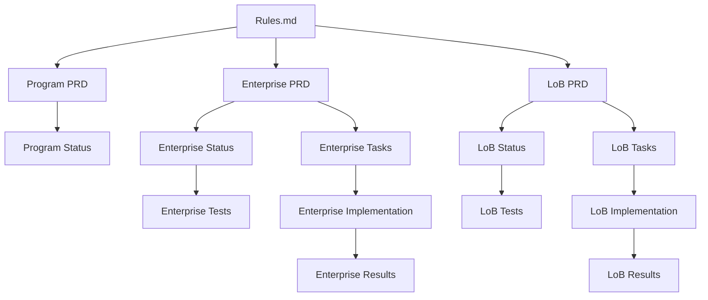

# HANA-X Citadel-Alpha-Infrastructure

## Overview

This repository contains the comprehensive infrastructure setup framework for the HANA-X AI ecosystem. It provides systematic, traceable, and quality-driven infrastructure deployment across the 9-server HANA-X landscape.

## Server Landscape

```
# --- HX Internal LAN Servers ---
192.168.10.29    hx-llm-server-01      # Primary LLM inference server
192.168.10.28    hx-llm-server-02      # Secondary LLM inference server  
192.168.10.30    hx-vector-database-server
192.168.10.31    hx-orchestration-server
192.168.10.33    hx-dev-server
192.168.10.34    hx-test-server
192.168.10.35    hx-sql-database-server
192.168.10.36    hx-dev-ops-server
192.168.10.37    hx-metric-server      # Centralized monitoring hub
```

## Project Structure

```
Citadel-Alpha-Infrastructure/
├── 0.0-HANA-X-Program/            # Program-level governance
│   ├── examples/                 # Governance examples
│   ├── references/               # Governance references
├── 0.1-HANA-X-Enterprise-Server/  # Enterprise server projects
│   ├── config/                   # Configuration files
│   ├── projects/                 # Server-specific projects
│   ├── scripts/                  # Deployment scripts
│   ├── src/                      # Source code
│   └── tests/                    # Testing modules
├── 0.2-HANA-X-LoB-Server/         # Line of Business server projects
│   ├── config/
│   ├── projects/
│   ├── scripts/
│   ├── src/
│   └── tests/
├── 0.11-HANA-X-Shared-Library/    # Shared code library
│   ├── src/                      # Shared modules
│   ├── tests/                    # Shared test cases
├── 0.12-X-Archive/                # Archived projects and files
└── 0.0-HANA-X-Program/            # Program-level orchestration
```

## Key Features

### 🎯 **Systematic Infrastructure Setup**
- Task-by-task execution with approval gates
- Perfect baseline approach starting with hx-llm-server-01
- Comprehensive testing and validation framework

### 📊 **Complete Governance Framework**
- 9 core governance documents reviewed and enhanced
- SMART+ST task creation methodology
- FASTT testing principles
- Complete traceability matrix with dependency mapping

### 🔧 **Infrastructure Architecture**
- **Different Models Per Server**: Each LLM server serves different models (no replication)
- **Centralized Monitoring**: All metrics flow to hx-metric-server
- **Minimal Security**: Security kept minimal during dev/test phase
- **Shared Library Approach**: Common code managed through hana-x-shared-library

### 📋 **Documentation Excellence**
- Visual workflow diagrams
- Enhanced traceability matrix
- Defect tracking with categorization
- Real-time status monitoring

## Getting Started

### 1. Review Governance Framework
Start by reviewing the comprehensive governance documentation:
```bash
cd 0.0-HANA-X-Program/12-HXP-Governance/
cat README.md
```

### 2. Understand Project Structure
Explore the server-specific projects:
```bash
# Enterprise server (hx-llm-server-01)
ls -la 0.1-HANA-X-Enterprise-Server/projects/

# Line of Business server (hx-llm-server-02)
ls -la 0.2-HANA-X-LoB-Server/projects/
```

### 3. Check Shared Libraries
Review common utilities and modules:
```bash
cd 0.11-HANA-X-Shared-Library/
cat hana-x-shared-library.md
```

## Infrastructure Setup Process

### Phase 1: Foundation (Current)
- ✅ Repository structure established
- ✅ Governance framework complete
- ✅ Documentation and traceability implemented
- ⏳ Ready for hx-llm-server-01 baseline setup

### Phase 2: Baseline Server Setup
- 🎯 hx-llm-server-01 configuration (upcoming)
- 🔧 vLLM installation and model deployment
- 🧪 Comprehensive testing and validation
- 📊 Monitoring integration with hx-metric-server

### Phase 3: Infrastructure Replication
- 📦 Replicate baseline to remaining servers
- 🔄 Server-specific configurations
- 🌐 Network and service integration
- ✅ Complete landscape validation

## Key Principles

1. **Systematic Approach**: Task-by-task execution with approval gates
2. **Perfect Baseline**: hx-llm-server-01 setup must be flawless
3. **Comprehensive Testing**: All infrastructure changes must be validated
4. **Centralized Monitoring**: Metrics flow to hx-metric-server
5. **Documentation Excellence**: All activities traced and documented
6. **Code Reuse**: Shared library for common functionality

## Compliance

All activities must comply with:
- **AI Operating Rules** (v1.5)
- **SMART+ST task creation** guidelines
- **FASTT testing standards**
- **OOP coding standards**
- **Traceability requirements**

## Quick Reference

### 📊 Project Status & Tracking
| Document | Purpose | Status |
|----------|---------|--------|
| [Program Status](0.0-HANA-X-Program/04-HXP-Status.md) | Program-level oversight | ✅ Ready |
| [Enterprise Status](0.1-HANA-X-Enterprise-Server/project-plan/04-HXES-Status.md) | Enterprise server progress | 🔧 In Progress |
| [LoB Status](0.2-HANA-X-LoB-Server/project-plan/04-HXLoB-Status.md) | Development server progress | ⏳ Pending |

### 📋 Product Requirements
| Document | Purpose | Status |
|----------|---------|--------|
| [Program PRD](0.0-HANA-X-Program/01-HXP-PRD.md) | Program-level requirements | ✅ Ready |
| [Enterprise PRD](0.1-HANA-X-Enterprise-Server/project-plan/01-HXEX-PRD.md) | Enterprise server requirements | ✅ Ready |
| [LoB PRD](0.2-HANA-X-LoB-Server/project-plan/01-HXLoB-PRD.md) | Development server requirements | ✅ Ready |

### 📝 Task Management
| Document | Purpose | Status |
|----------|---------|--------|
| [Enterprise Tasks](0.1-HANA-X-Enterprise-Server/project-plan/02-HXES-Task-List.md) | Enterprise task breakdown | ✅ Ready |
| [LoB Tasks](0.2-HANA-X-LoB-Server/project-plan/02-HXLoB-Task-List.md) | Development task breakdown | ✅ Ready |

### 🎛️ Governance & Standards
| Document | Purpose | Status |
|----------|---------|--------|
| [AI Operating Rules](Rules.md) | AI assistant procedures | ✅ Ready |
| [Governance Framework](0.0-HANA-X-Program/12-HXP-Governance/README.md) | Complete governance overview | ✅ Ready |
| [Shared Library](0.11-HANA-X-Shared-Library/hana-x-shared-library.md) | Code reuse documentation | 🔄 Expanding |

## 🔗 Document Traceability

All project documents are cross-referenced for complete traceability:


```mermaid
graph TD
    A[Rules.md] --> B[Program PRD]
    A --> C[Enterprise PRD]
    A --> D[LoB PRD]
    
    B --> E[Program Status]
    C --> F[Enterprise Status]
    C --> G[Enterprise Tasks]
    D --> H[LoB Status]
    D --> I[LoB Tasks]
    
    G --> J[Enterprise Implementation]
    I --> K[LoB Implementation]
    
    F --> L[Enterprise Tests]
    H --> M[LoB Tests]
    
    J --> N[Enterprise Results]
    K --> O[LoB Results]
```

### Cross-Reference Matrix

| From Document | Links To | Purpose |
|---------------|----------|----------|
| PRDs | Task Lists | Requirements traceability |
| Task Lists | Status Trackers | Progress monitoring |
| Task Lists | Implementation Plans | Execution details |
| Status Trackers | Test Suites | Quality validation |
| Implementation Plans | Results | Outcome documentation |
| All Documents | Rules.md | Compliance validation |

## Next Steps

The infrastructure is ready for systematic deployment:

1. **Begin hx-llm-server-01 setup** following governance framework
2. **Use task creation guidelines** for systematic execution  
3. **Maintain real-time tracking** with status and defect trackers
4. **Follow approval process** for each major milestone
5. **Verify traceability** using cross-reference links

---

*This infrastructure framework ensures systematic, traceable, and quality-driven deployment across the HANA-X server landscape.*
