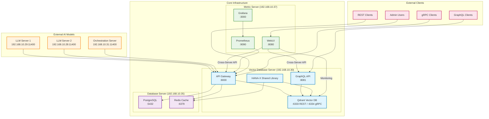
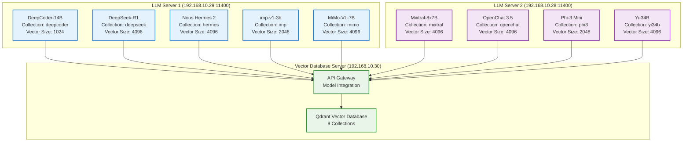
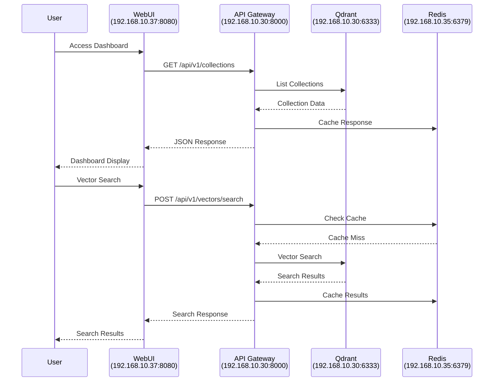
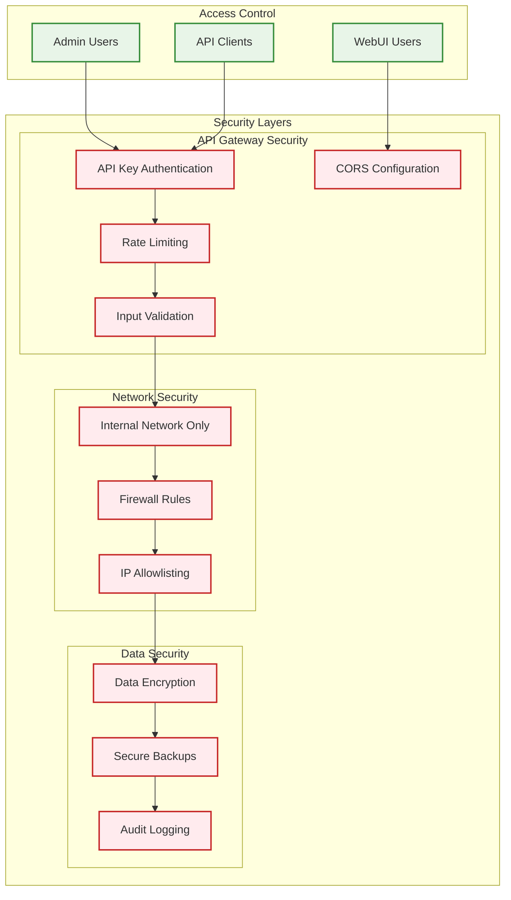
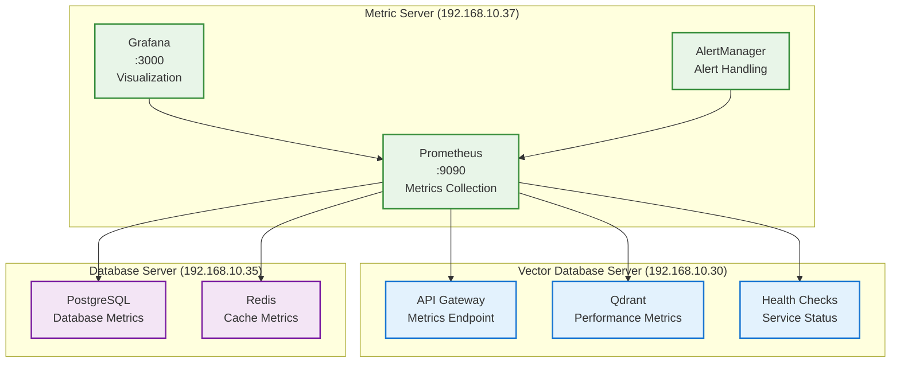

# Citadel Alpha Infrastructure
## AI Operating System - Vector Database Server Implementation

[](https://github.com/hanax-ai/Citadel-Alpha-Infrastructure)
[](https://github.com/hanax-ai/Citadel-Alpha-Infrastructure)
[](https://github.com/hanax-ai/Citadel-Alpha-Infrastructure)

**Project:** Vector Database Server (192.168.10.30)  
**Architecture:** Qdrant Vector Database Only - No Embedded Models  
**Performance Targets:** <10ms query latency, >10,000 operations/second, 100M+ vectors  
**Technical Stack:** Python 3.12+, FastAPI, Qdrant, Redis, Docker, Prometheus/Grafana  
**Deployment:** Distributed Architecture with WebUI on Metric Server  

---

## 🏗️ Project Overview

The Citadel Alpha Infrastructure project implements a high-performance Vector Database Server as part of the larger AI Operating System. This implementation focuses on Qdrant vector database operations with multi-protocol API access, external AI model integration, and distributed monitoring capabilities.

### Key Features

- **🚀 High-Performance Vector Operations:** <10ms query latency, >10K ops/sec
- **🔌 Multi-Protocol API Gateway:** REST, GraphQL, and gRPC support
- **🤖 External AI Model Integration:** 9 AI models across 2 LLM servers
- **📊 Distributed Monitoring:** WebUI on Metric Server with cross-server communication
- **🔄 Production-Ready Shared Library:** Comprehensive HANA-X Vector Database integration
- **🛡️ Enterprise Security:** API authentication, CORS, and access control

---

## 🏛️ Infrastructure Architecture

### System Overview



### Server Roles & Responsibilities

| Server | IP Address | Status | Primary Role | Services |
|--------|------------|--------|--------------|----------|
| **Vector Database Server** | 192.168.10.30 | 🔄 Development | Vector Operations | Qdrant, API Gateway, GraphQL |
| **Database Server** | 192.168.10.35 | ✅ Operational | Data Persistence | PostgreSQL, Redis |
| **Metric Server** | 192.168.10.37 | 🎯 WebUI Target | Monitoring & UI | WebUI, Prometheus, Grafana |

---

## 📁 Project Structure

```
Citadel-Alpha-Infrastructure/
├── 0.0-Project-Management/                    # Project governance and standards
│   ├── HXP-Vector-Database-Server-PRD.md     # Product Requirements Document
│   ├── HXP-Gov-Coding-Standards.md           # Coding standards and guidelines
│   ├── HXP-Vector-Database-Server-Architecture.md  # System architecture
│   └── HPX-Vector-Database-Server-Summary-Tasks.md # Task overview
│
├── 0.1-Project-Execution/                    # Implementation components
│   ├── 0.1.1-HXP-Detailed-Tasks/            # Individual task implementations
│   │   ├── 0.1.1.1.0-HXP-Task-001-Server-Hardware-Verification.md
│   │   ├── 0.1.1.1.1-HXP-Task-001-Qdrant-Installation-Configuration.md
│   │   ├── 0.1.1.1.1-HXP-Task-002-Unified-API-Gateway-Implementation.md
│   │   ├── 0.1.1.1.3-HXP-Task-005-User-Interface-Development.md
│   │   ├── cross-server-communication-test.sh  # Infrastructure validation
│   │   └── INFRASTRUCTURE-INTEGRATION-ASSESSMENT.md
│   │
│   └── 0.1.2-HXP-Shared-Library/            # HANA-X Vector Database Shared Library
│       ├── hana_x_vector/                    # Main library package
│       │   ├── gateway/                      # Multi-protocol API gateway
│       │   ├── vector_ops/                   # Vector operations
│       │   ├── qdrant/                       # Qdrant integration
│       │   ├── external_models/              # AI model integration
│       │   ├── monitoring/                   # Metrics and health monitoring
│       │   ├── utils/                        # Utilities and configuration
│       │   └── schemas/                      # API schemas (REST/GraphQL/gRPC)
│       ├── requirements.txt                  # Python dependencies
│       ├── README.md                         # Shared library documentation
│       └── VALIDATION_SUMMARY.md            # Library validation report
│
└── README.md                                 # This file
```

---

## 🚀 Quick Start

### Prerequisites

- **Operating System:** Ubuntu Server 24.04 LTS
- **Python:** 3.12+
- **Hardware:** 78GB RAM, 21.8TB storage
- **Network:** Access to servers 192.168.10.30, 192.168.10.35, 192.168.10.37

### Installation

1. **Clone the Repository**
   ```bash
   git clone https://github.com/hanax-ai/Citadel-Alpha-Infrastructure.git
   cd Citadel-Alpha-Infrastructure
   ```

2. **Install Shared Library**
   ```bash
   cd 0.1-Project-Execution/0.1.2-HXP-Shared-Library
   pip install -e .
   ```

3. **Verify Infrastructure**
   ```bash
   cd 0.1-Project-Execution/0.1.1-HXP-Detailed-Tasks
   ./cross-server-communication-test.sh
   ```

### Basic Usage

```python
from hana_x_vector import VectorOperationsManager, ConfigManager
from hana_x_vector.gateway import UnifiedAPIGateway

# Initialize configuration
config = ConfigManager()

# Create vector operations manager
vector_ops = VectorOperationsManager(config)

# Start API Gateway
gateway = UnifiedAPIGateway(
    config=config,
    enable_rest=True,
    enable_graphql=True,
    enable_grpc=True
)

gateway.start(host="0.0.0.0", port=8000)
```

---

## 🔧 Technical Implementation

### HANA-X Vector Database Shared Library

The project includes a comprehensive shared library providing:

#### Core Components

```mermaid
graph TB
    subgraph "HANA-X Vector Database Shared Library"
        subgraph "Gateway Layer"
            REST[REST API<br/>FastAPI]
            GRAPHQL[GraphQL API<br/>Strawberry]
            GRPC[gRPC API<br/>Protocol Buffers]
            MIDDLEWARE[Middleware<br/>Auth, Validation, Rate Limiting]
        end
        
        subgraph "Vector Operations Layer"
            CRUD[Vector CRUD<br/>Operations]
            SEARCH[Similarity Search<br/>Advanced Algorithms]
            BATCH[Batch Processing<br/>Parallel Operations]
            CACHE[Vector Caching<br/>Redis Integration]
        end
        
        subgraph "Qdrant Integration Layer"
            CLIENT[Qdrant Client<br/>HTTP & gRPC]
            COLLECTIONS[Collection Management<br/>Lifecycle Operations]
            INDEXING[Index Optimization<br/>Performance Tuning]
            CONFIG[Configuration<br/>Management]
        end
        
        subgraph "External Models Layer"
            MODELS[9 AI Models<br/>Integration Patterns]
            POOL[Connection Pooling<br/>Load Balancing]
            STREAM[Streaming Support<br/>Real-time Processing]
        end
        
        subgraph "Monitoring Layer"
            METRICS[Prometheus Metrics<br/>Performance Tracking]
            HEALTH[Health Monitoring<br/>Service Status]
            LOGGING[Structured Logging<br/>JSON Format]
        end
        
        subgraph "Utilities Layer"
            CONFIGMGR[Configuration Manager<br/>Environment Variables]
            EXCEPTIONS[Custom Exceptions<br/>Error Hierarchy]
            VALIDATORS[Data Validators<br/>Input Validation]
        end
        
        subgraph "Schemas Layer"
            GQLSCHEMA[GraphQL Schemas<br/>Type Definitions]
            RESTMODELS[REST Models<br/>Pydantic Schemas]
            GRPCSCHEMAS[gRPC Schemas<br/>Protocol Buffers]
        end
    end
    
    %% Layer Connections
    REST --> CRUD
    GRAPHQL --> SEARCH
    GRPC --> BATCH
    MIDDLEWARE --> CACHE
    
    CRUD --> CLIENT
    SEARCH --> COLLECTIONS
    BATCH --> INDEXING
    CACHE --> CONFIG
    
    CLIENT --> MODELS
    COLLECTIONS --> POOL
    INDEXING --> STREAM
    
    MODELS --> METRICS
    POOL --> HEALTH
    STREAM --> LOGGING
    
    METRICS --> CONFIGMGR
    HEALTH --> EXCEPTIONS
    LOGGING --> VALIDATORS
    
    CONFIGMGR --> GQLSCHEMA
    EXCEPTIONS --> RESTMODELS
    VALIDATORS --> GRPCSCHEMAS
    
    %% Styling
    classDef gateway fill:#e3f2fd,stroke:#1976d2,stroke-width:2px
    classDef vectorOps fill:#f3e5f5,stroke:#7b1fa2,stroke-width:2px
    classDef qdrant fill:#e8f5e8,stroke:#388e3c,stroke-width:2px
    classDef external fill:#fff3e0,stroke:#f57c00,stroke-width:2px
    classDef monitoring fill:#fce4ec,stroke:#c2185b,stroke-width:2px
    classDef utils fill:#f1f8e9,stroke:#689f38,stroke-width:2px
    classDef schemas fill:#e0f2f1,stroke:#00796b,stroke-width:2px
    
    class REST,GRAPHQL,GRPC,MIDDLEWARE gateway
    class CRUD,SEARCH,BATCH,CACHE vectorOps
    class CLIENT,COLLECTIONS,INDEXING,CONFIG qdrant
    class MODELS,POOL,STREAM external
    class METRICS,HEALTH,LOGGING monitoring
    class CONFIGMGR,EXCEPTIONS,VALIDATORS utils
    class GQLSCHEMA,RESTMODELS,GRPCSCHEMAS schemas
```



### API Endpoints

#### REST API (Port 8000)
```
GET    /api/v1/collections              # List collections
POST   /api/v1/vectors/search           # Vector similarity search
POST   /api/v1/vectors/insert           # Insert vectors
DELETE /api/v1/vectors/{id}             # Delete vector
GET    /api/v1/health                   # Health check
GET    /metrics                         # Prometheus metrics
```

#### GraphQL API (Port 8081)
```graphql
query {
  collections {
    name
    size
    vectorCount
  }
  
  searchVectors(
    collection: "mixtral"
    vector: [0.1, 0.2, 0.3]
    limit: 10
  ) {
    id
    score
    payload
  }
}
```

#### gRPC API (Port 6334)
```protobuf
service VectorService {
  rpc ListCollections(Empty) returns (CollectionList);
  rpc SearchVectors(SearchRequest) returns (SearchResponse);
  rpc InsertVectors(InsertRequest) returns (InsertResponse);
  rpc HealthCheck(Empty) returns (HealthResponse);
}
```

---

## 📊 Performance Specifications

### Target Performance Metrics

| Metric | Target | Current Status |
|--------|--------|----------------|
| **Query Latency** | <10ms average | 🔄 In Development |
| **Throughput** | >10,000 ops/sec | 🔄 In Development |
| **Vector Capacity** | 100M+ vectors | 🔄 In Development |
| **API Gateway Overhead** | <5ms | 🔄 In Development |
| **Cache Hit Rate** | >80% | 🔄 In Development |

### Hardware Specifications

- **CPU:** Multi-core processor (optimized for vector operations)
- **Memory:** 78GB RAM (vector caching and processing)
- **Storage:** 21.8TB NVMe (high-speed vector storage)
- **Network:** Gigabit Ethernet (low-latency communication)

---

## 🔌 External AI Model Integration

### Supported Models

The system integrates with 9 external AI models across 2 LLM servers:



### Integration Patterns

- **Real-time Integration:** Direct API calls for immediate responses
- **Batch Processing:** Bulk vector operations for efficiency
- **Streaming Support:** Real-time vector updates and processing
- **Connection Pooling:** Optimized connection management

---

## 🖥️ Distributed WebUI Architecture

### Cross-Server Deployment

The WebUI is deployed on the Metric Server (192.168.10.37) while communicating with the Vector Database Server (192.168.10.30):



### CORS Configuration

Cross-Origin Resource Sharing (CORS) is configured to allow WebUI access:

```yaml
cors:
  allowed_origins:
    - "http://192.168.10.37:8080"
  allowed_methods:
    - "GET"
    - "POST"
    - "PUT"
    - "DELETE"
    - "OPTIONS"
  allowed_headers:
    - "Content-Type"
    - "Authorization"
    - "X-Requested-With"
```

---

## 📋 Implementation Phases

### Phase 0: Foundation (Completed ✅)
- [x] Project structure and documentation
- [x] Coding standards and governance
- [x] Shared library implementation
- [x] Infrastructure assessment

### Phase 1: Core Infrastructure (In Progress 🔄)
- [ ] Qdrant installation and configuration
- [ ] API Gateway implementation
- [ ] External model integration
- [ ] Performance optimization

### Phase 2: Advanced Features (Planned 📋)
- [ ] Advanced caching strategies
- [ ] Load balancing and scaling
- [ ] Error handling and resilience

### Phase 3: Integration & Testing (Planned 📋)
- [ ] Integration testing and validation
- [ ] API documentation and testing
- [ ] Database schema and migration
- [ ] WebUI development and deployment

### Phase 4: Production Readiness (Planned 📋)
- [ ] Performance testing and validation
- [ ] System optimization and tuning
- [ ] Disaster recovery setup
- [ ] Load testing and stress testing

### Phase 5: Deployment & Monitoring (Planned 📋)
- [ ] Monitoring and alerting setup
- [ ] Documentation and knowledge transfer
- [ ] Final system validation

---

## 🔒 Security Architecture

### Authentication & Authorization



### Security Features

- **API Key Authentication:** Secure API access control
- **Rate Limiting:** Protection against abuse and DoS attacks
- **Input Validation:** Comprehensive request validation
- **CORS Configuration:** Secure cross-origin requests
- **Network Isolation:** Internal network communication only
- **Audit Logging:** Comprehensive security event logging

---

## 📈 Monitoring & Observability

### Monitoring Stack



### Key Metrics

- **Performance Metrics:** Query latency, throughput, error rates
- **System Metrics:** CPU, memory, disk usage, network I/O
- **Application Metrics:** API response times, cache hit rates
- **Business Metrics:** Vector operations, collection sizes, model usage

---

## 🚨 Troubleshooting

### Common Issues

#### Network Connectivity
```bash
# Test cross-server communication
./0.1-Project-Execution/0.1.1-HXP-Detailed-Tasks/cross-server-communication-test.sh
```

#### Service Health
```bash
# Check service status
systemctl status qdrant
curl http://192.168.10.30:6333/health
curl http://192.168.10.30:8000/health
```

#### Performance Issues
```bash
# Monitor system resources
htop
iostat 1 5
curl http://192.168.10.30:8000/metrics
```

### Debug Commands

```bash
# API Gateway diagnostics
curl -v http://192.168.10.30:8000/health
ps aux | grep -E "(fastapi|uvicorn|gunicorn)"

# Qdrant diagnostics
curl http://192.168.10.30:6333/collections
curl http://192.168.10.30:6333/telemetry

# Cross-server WebUI testing
curl http://192.168.10.37:8080/ui/
curl -H "Origin: http://192.168.10.37:8080" http://192.168.10.30:8000/api/v1/collections
```

---

## 🤝 Contributing

### Development Workflow

1. **Follow Coding Standards:** See `0.0-Project-Management/HXP-Gov-Coding-Standards.md`
2. **Use Task Templates:** Follow `0.1-Project-Execution/0.1.1-HXP-Detailed-Tasks/HPX-Detailed-Task-Template.md`
3. **Update Documentation:** Keep README and task files synchronized
4. **Test Integration:** Run cross-server communication tests

### Code Quality

- **Python Standards:** PEP 8 compliance with project-specific extensions
- **Type Hints:** Comprehensive type annotations
- **Documentation:** Docstrings for all public APIs
- **Testing:** Unit tests and integration tests
- **Security:** Security review for all changes

---

## 📚 Documentation

### Project Documentation

- **[Product Requirements Document](0.0-Project-Management/HXP-Vector-Database-Server-PRD.md)** - Project requirements and specifications
- **[System Architecture](0.0-Project-Management/HXP-Vector-Database-Server-Architecture.md)** - Detailed system architecture
- **[Coding Standards](0.0-Project-Management/HXP-Gov-Coding-Standards.md)** - Development guidelines and standards
- **[Task Overview](0.0-Project-Management/HPX-Vector-Database-Server-Summary-Tasks.md)** - Implementation task summary

### Implementation Documentation

- **[Shared Library Documentation](0.1-Project-Execution/0.1.2-HXP-Shared-Library/README.md)** - HANA-X Vector Database Shared Library
- **[Infrastructure Assessment](0.1-Project-Execution/0.1.1-HXP-Detailed-Tasks/INFRASTRUCTURE-INTEGRATION-ASSESSMENT.md)** - Infrastructure integration analysis
- **[Task Files](0.1-Project-Execution/0.1.1-HXP-Detailed-Tasks/)** - Individual implementation tasks

### API Documentation

- **REST API:** Available at `http://192.168.10.30:8000/docs` (Swagger UI)
- **GraphQL API:** Available at `http://192.168.10.30:8081/graphql` (GraphiQL)
- **gRPC API:** Protocol buffer definitions in shared library

---

## 📞 Support

### Technical Support

- **Project Lead:** X-AI Infrastructure Engineer
- **Architecture:** Vector Database Server Team
- **Development:** API Development Team
- **Operations:** Database Team

### Resources

- **Issue Tracking:** GitHub Issues
- **Documentation:** Project README files
- **Monitoring:** Grafana dashboards at `http://192.168.10.37:3000`
- **Logs:** Centralized logging via structured JSON format

---

## 📄 License

This project is proprietary software developed for the Citadel Alpha AI Operating System. All rights reserved.

**Copyright © 2025 HANA-X AI Systems**

---

## 🔄 Version History

### Version 1.0.0 (Current)
- ✅ Initial project structure and documentation
- ✅ HANA-X Vector Database Shared Library implementation
- ✅ Infrastructure integration assessment
- ✅ Distributed WebUI architecture design
- 🔄 Vector Database Server implementation (in progress)

### Planned Releases

- **Version 1.1.0:** Core infrastructure deployment
- **Version 1.2.0:** Advanced features and optimization
- **Version 1.3.0:** Production deployment and monitoring
- **Version 2.0.0:** Full AI Operating System integration

---

## 🚀 Getting Started

Ready to deploy the Vector Database Server? Start with:

1. **Review the [Infrastructure Assessment](0.1-Project-Execution/0.1.1-HXP-Detailed-Tasks/INFRASTRUCTURE-INTEGRATION-ASSESSMENT.md)**
2. **Execute Phase 0-1 tasks** from the detailed task list
3. **Deploy the shared library** following the installation guide
4. **Configure cross-server communication** for WebUI deployment
5. **Monitor deployment** using the provided monitoring stack

**For detailed implementation guidance, see the task files in `0.1-Project-Execution/0.1.1-HXP-Detailed-Tasks/`**

---

*This README is automatically updated as the project evolves. Last updated: 2025-07-17*
